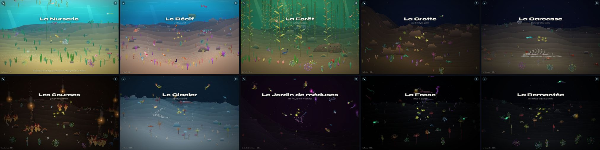
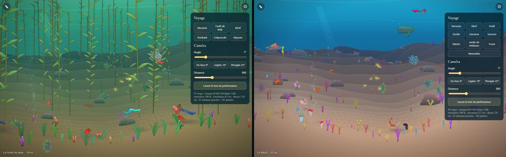
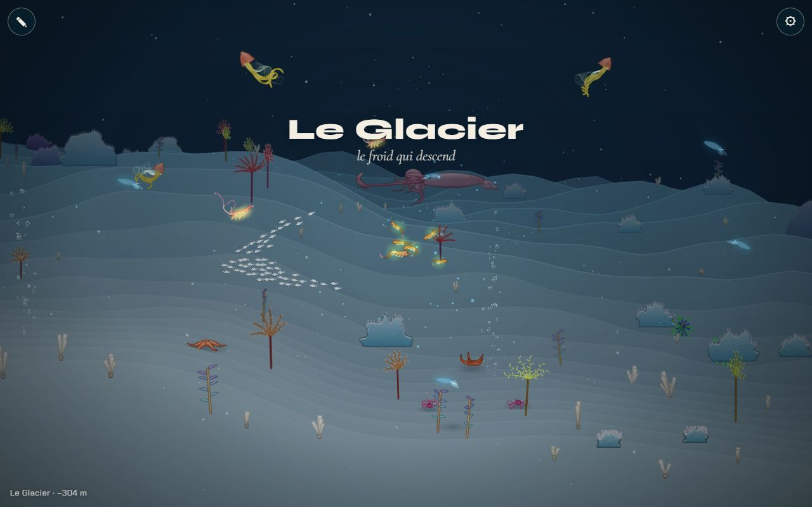
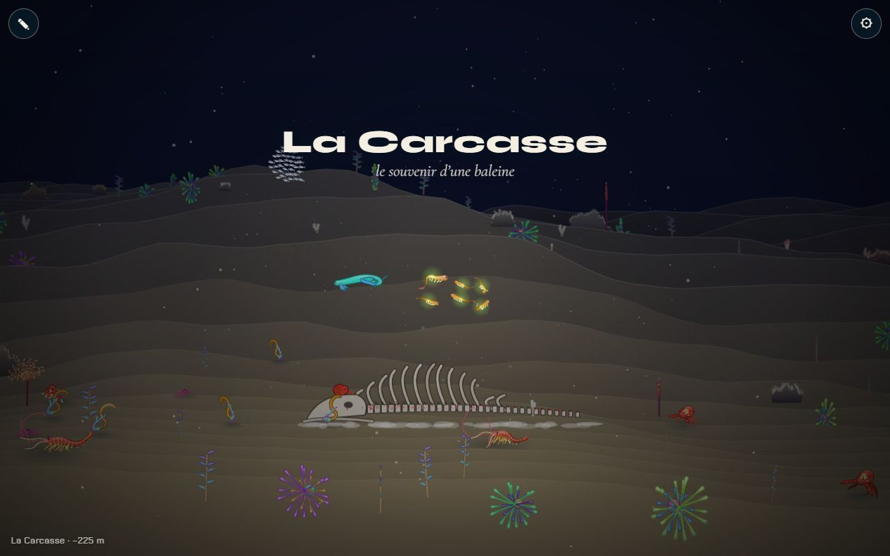

# Les 10 chapitres dans le monde

## Livré

La carte du Grand Monde suit la trame de [chapitres.md](../../../docs/chapitres.md) : **la Nurserie, le Récif, la Forêt, la Grotte, la Carcasse, les Sources, le Glacier, le Jardin de méduses, la Fosse et la Remontée** (le fond d'où elle part), dans cet ordre, le long de x (de −800 à 30 000 au lieu de 22 000). Chaque chapitre a son titre et sa ligne à l'entrée, son étendue, sa profondeur, sa palette (tableau de [direction-artistique.md](../../../docs/direction-artistique.md#une-palette-par-chapitre)), son relief, ses plantes, sa faune (les partenaires de chapitres.md d'abord, donc toujours présents), ses bancs et ses grands visiteurs.

- **`src/monde/biomes.ts`** : les 10 chapitres (`BIOMES`), un type `ChapterId` pour leurs identifiants (`nurserie`, `recif`, `foret`, `grotte`, `carcasse`, `sources`, `glacier`, `jardin`, `fosse`, `remontee`), `chapterIndex(id)`, `span(id)` ([x0, x1] d'un chapitre), `liftAt(x)` (la vie montée en pleine eau là où le fond est hors de vue), `arrival(i)` (le point d'arrivée du voyage et du banc de performance). Nouveaux champs d'un chapitre : `depth` (plage en mètres de chapitres.md), `ground` (relief : collines, bosses, rides ; remplace les tableaux `HILLS`/`BUMPS`/`DUNES` indexés par position), `pale` (les plantes perdent leur couleur), `lift`, `visitors`. Le profil du fond et la jauge de profondeur (`metres`) sont refaits.
- **Décors provisoires** tirés de l'existant, en attendant les chantiers de décor :
  - la **Grotte** : la falaise qui s'ouvre sous le kelp, un chaos de gros blocs ocre, des éponges et des crinoïdes, un petit banc lumineux, dans le bleu d'encre ;
  - la **Carcasse** : la baleine (déjà dessinée) couchée au milieu d'une plaine de sédiment ivoire, sous une eau bleu nuit ;
  - le **Glacier** : un fond de glace pâle, des blocs de glace bleue, des éponges blanches, des suintements froids qui bullent, des cristaux qui tombent (la neige marine en blanc), un calmar géant au loin ;
  - le **Jardin de méduses** : le fond tombe hors de vue au bord du Glacier (jusqu'à y = 3 300) et la vie reste en pleine eau (`lift` 800) : méduses, cténophores, siphonophores, un siphonophore géant ;
  - la **Fosse** : les Abysses d'avant, plus noires (`dark` 0,93), accents bleu électrique, dragon abyssal et calmar géant qui passent.
- **Placés par chapitre** (`world.ts`, `makeDecor`) : les fumeurs noirs dans les Sources, la baleine au milieu de la Carcasse, l'épave dans la Forêt, les suintements dans la Nurserie, le Récif, la Forêt et le Glacier ; les sargasses au-dessus de la Nurserie et du Récif. Les grands visiteurs (`main.ts`) viennent des données du chapitre au lieu d'une liste de x codés en dur ; la tortue passe au-dessus du Récif (son moment fort) et le requin-baleine, lent, derrière le kelp de la Forêt.
- **Chaque espèce du catalogue** vit quelque part (la physalie à la surface de la Nurserie, où elle flotte vraiment).
- **Le voyage** du panneau ⚙ propose les 10 chapitres ; l'indice de la page dit « voyage vers les dix chapitres ».
- **Tests** : `src/monde/biomes.test.ts` (9 tests) : l'ordre et les titres, `span`/`chapterIndex`/`arrival`, la descente et la jauge qui lit la plage de chaque chapitre, un fond sans marche, les partenaires dans la faune, les espèces et plantes qui existent, chaque espèce logée, les teintes sable/roche du même côté du cercle (sinon le fond passe par le vert).
- **Docs** : chapitres.md, nouvelle section « Dans le monde » (étendue, fond, décor du moment et visiteurs de chaque chapitre) ; direction-artistique.md, « Ce qui existe déjà » et « Il manque ».

**Vérifié** dans le Chrome Windows (WebGL2) : le pilote automatique traverse tout le monde, de la Nurserie à la Remontée ; les 10 titres s'affichent dans l'ordre, sans erreur dans la page. Le banc (`?bench=tour`, page compilée) tient 60 img/s dans les 10 chapitres :

| Chapitre | img/s | CPU moy. (ms) | p95 | animaux proches | plantes |
| --- | --- | --- | --- | --- | --- |
| La Nurserie | 60 | 8,3 | 10,8 | 23 | 134 |
| Le Récif | 60 | 5,6 | 7,1 | 21 | 144 |
| La Forêt | 60 | 8,9 | 13,4 | 25 | 131 |
| La Grotte | 60 | 6,0 | 8,2 | 18 | 67 |
| La Carcasse | 60 | 5,2 | 6,8 | 21 | 55 |
| Les Sources | 60 | 8,1 | 13,0 | 19 | 123 |
| Le Glacier | 60 | 6,2 | 9,3 | 22 | 58 |
| Le Jardin de méduses | 60 | 8,0 | 9,5 | 27 | 31 |
| La Fosse | 60 | 5,9 | 7,1 | 19 | 52 |
| La Remontée | 60 | 4,3 | 5,9 | 13 | 29 |

Le monde est prêt en moins d'une seconde (≈ 220 animaux au lieu de ≈ 160).

**Comment le voir** : `make up`, puis ⚙ → Voyage, ou `monde.gotoBiome(i)` (0 à 9) dans la console.

## Choix retenus

Aucune question posée à l'utilisateur (consigne : trancher avec l'option recommandée). Un retour « important » a été laissé sur le tableau de bord pour les chantiers voisins (les nouveaux identifiants et `span`).

| Question | Choix retenu | Pourquoi |
| --- | --- | --- |
| Étendue du monde et des chapitres | Monde de −800 à 30 000 ; 3 000 à 4 200 de large par chapitre, 2 200 pour la Carcasse (un seul lieu), 1 600 pour la Remontée | Chaque chapitre garde la place d'un ancien biome malgré les fondus de 1 400 ; le coût (démarrage, mémoire) reste faible |
| Profondeur et jauge | Le fond descend d'un chapitre à l'autre, doucement dans les chapitres éclairés ; la jauge (`metres`) est une interpolation qui donne la plage de chapitres.md **sur le fond** de chaque chapitre | Garde la lumière, les rayons et les caustiques du Récif et de la Forêt ; la jauge reste une vraie profondeur (elle ne change pas quand on nage à l'horizontale) |
| Le Jardin « sans fond » provisoire | Le fond plonge à 3 300 au bord du Glacier ; `lift` 800 garde la faune et les bancs en pleine eau | Tient avec le moteur tel qu'il est (collisions, placement, rangées du fond) ; le vrai Jardin est un chantier à part |
| Le 10ᵉ chapitre | Un court chapitre « La Remontée » au fond de la Fosse (sa ligne : « tout en haut, un puits de lumière ») | La backlog demande « le fond d'où part la Remontée » ; le titre est celui de la trame |
| Identifiants | Nouveaux ids, typés (`ChapterId`) | Un ancien id (`'abysses'`, `'kelp'`…) dans le code d'un voisin casse le typecheck à la fusion au lieu d'échouer en silence |
| Placement des décors | Relatif aux chapitres (`span`, `at(id, u)`) | Suit la carte si les étendues bougent |
| Relief par chapitre | Champ `ground` du chapitre | Des tableaux indexés par position se décalent dès qu'on ajoute un chapitre |
| Le « grand prédateur » de la Forêt | Le requin-baleine, grand et lent, au loin | Aucun prédateur dans le bestiaire ; zéro danger : la tension vient de la taille et de la lenteur |
| Plantes des chapitres froids ou profonds | Champ `pale` (Carcasse, Sources, Glacier, Jardin, Fosse, Remontée) au lieu de la liste des ids profonds | Les éponges du Glacier deviennent blanches ; la Grotte garde des éponges colorées |
| Couleurs du fond | Sable et roche du même côté du cercle (test) | Le fond fond du sable à la roche teinte par teinte : ivoire → bleu nuit passait par le vert |

## Options non retenues

- **Étendue** :
  - garder 22 800 de large et serrer 10 chapitres (≈ 2 300 chacun) : les fondus de 1 400 mangent presque tout, plus de cœur de chapitre ;
  - des chapitres de largeur égale : la Carcasse et le fond seraient vides ;
  - un monde de 40 000 : plus de marche et d'animaux au démarrage, rien de plus à voir aujourd'hui.
- **Profondeur et jauge** :
  - une descente raide (≈ 260 px de plus par chapitre, fond à ≈ 3 800) pour que la jauge lise la plage du chapitre même en pleine eau : Récif et Forêt plus sombres, rayons et caustiques presque invisibles ; coût moyen, à rouvrir avec la Remontée ou les transitions ;
  - une jauge qui dépend de x (0 à la surface, la profondeur du chapitre au fond) : lit toujours « la bonne » plage, mais change quand on nage à l'horizontale ;
  - l'ancienne jauge (20 px/m puis 1,05 m/px) : la Fosse aurait affiché 2 000 m au lieu de 500–650.
- **Jardin sans fond** :
  - aucun fond du tout (`floorAt` infini) : casse les collisions, le placement des animaux et les rangées du fond, c'est le travail du chantier du Jardin ;
  - un fond visible avec plus de méduses : peu fidèle à « plus de fond visible ».
- **10ᵉ chapitre** :
  - pas de biome, la Remontée comme un événement : contraire à la backlog ;
  - l'appeler « Le Fond » : le titre de la trame est « La Remontée » ;
  - un puits de lumière provisoire (des rayons qui descendent jusqu'au fond) : touche le dessin des rayons (`main.ts`, `scene-gl.ts`) ; laissé au chantier de la Remontée.
- **Identifiants** :
  - garder les anciens là où c'est possible (`kelp` pour la Forêt, `abysses` pour la Fosse) : fusions plus douces, mais des noms trompeurs pour toujours ;
  - des chaînes non typées : une faute d'id passe inaperçue.
- **Placement des décors** : en x codés en dur (comme avant) : à refaire à chaque changement de carte ; dans les données du chapitre (champ `decor`) : plus propre à terme, plus de changements dans `world.ts` pendant que trois chantiers de décor y travaillent.
- **Prédateur de la Forêt** : un calmar géant (déjà au Glacier et dans la Fosse) ; une nouvelle espèce (chantier du bestiaire) ; personne.
- **Physalie** : dans le Jardin (à la surface, jamais vue d'en bas à 400 m) ; la retirer du monde.
- **Épave** : au Récif, à l'entrée de la Grotte, ou supprimée ; dans le kelp, elle donne un lieu à la Forêt.

## Reste à faire / limites

- **La jauge en pleine eau** lit moins que la plage du chapitre : à l'arrivée du voyage, la Forêt affiche ≈ −30 m (90–200 m au fond), la Carcasse ≈ −225 m (250–280 m au fond). Voir « Options non retenues ».
- **Les rayons** ne descendent que jusqu'à y = 560 et ne se dessinent que si la caméra est au-dessus de 1 400 : les « rais de jour » de la Grotte et le puits de lumière de la Remontée ne se voient pas (chantiers Grotte et Remontée).
- **Décors provisoires** : pas de voûtes ni de galeries dans la Grotte (reliefs composés), pas de parois de glace ni de langue froide au Glacier, le fond du Jardin se voit encore au bord de sa chute, les méduses du Jardin sont toutes des créatures simulées (30 et un siphonophore géant), la Fosse n'est pas encore le noir total. Les crinoïdes du Glacier gardent leurs couleurs chaudes.
- Les partenaires sont dans la faune de leur chapitre, mais le marqueur « partenaire compatible » (sa lueur) reste à construire (étape 3).
- Pour l'intégrateur : `docs/roadmap.md` (« 6 biomes en 2.5D, de la Nurserie aux Abysses ») et `docs/agents.md` (« le chantier des 10 chapitres la refait ») sont à mettre à jour.

## Risques de fusion

- **`src/monde/biomes.ts`** : réécrit. Les 6 anciens biomes (`kelp`, `tombant`, `crepuscule`, `abysses`…) sont remplacés par les 10 chapitres ; `HILLS`/`BUMPS`/`DUNES` sont devenus le champ `ground` ; nouveaux `PROFILE` et `metres` ; nouveaux exports `ChapterId`, `chapterIndex`, `span`, `liftAt`, `arrival`. Un voisin qui a réglé un ancien biome (la Fosse sur `abysses`, le Jardin, les reliefs) doit reporter son réglage sur le chapitre correspondant ; un ancien id dans son code échoue au typecheck (`plantSpec2` prend un `ChapterId`).
- **`src/monde/world.ts`** : `plantSpec2(kind, R, biome: ChapterId)` (le « profond » vient de `pale`), `growPlant2` et `makePlants` sur `foret`, `makeDecor` placé par `span` (baleine à x = 14 700 au milieu de la Carcasse, cheminées dans les Sources de 15 800 à 19 000, épave à x ≈ 9 230). Les chantiers Carcasse, Grotte et Glacier touchent sans doute `makeDecor` et `bakeWhale` : garder les deux côtés et placer leurs décors par `span('…')`.
- **`src/monde/main.ts`** : branchements courts (import, `homeY` et `Shoal` avec `liftAt`, visiteurs tirés de `BIOMES`, `gotoBiome` par `arrival`, commentaire d'en-tête).
- **`src/monde/bench.ts`** : `arrival`, et `chapterIndex('recif' | 'foret')` au lieu des index 2 et 1.
- **`index.html`** : le texte de l'indice.
- **Docs** : `docs/chapitres.md` (nouvelle section avant « À écrire »), `docs/direction-artistique.md` (« Ce qui existe déjà », « Il manque »).
