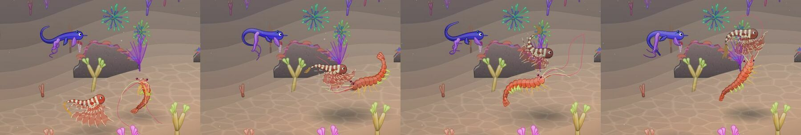
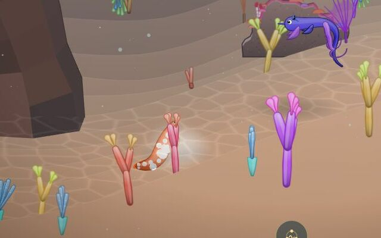
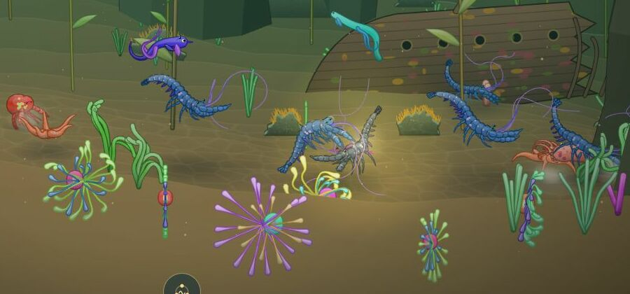
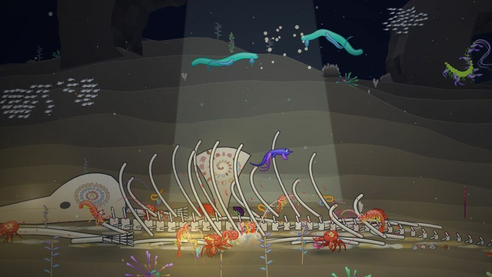
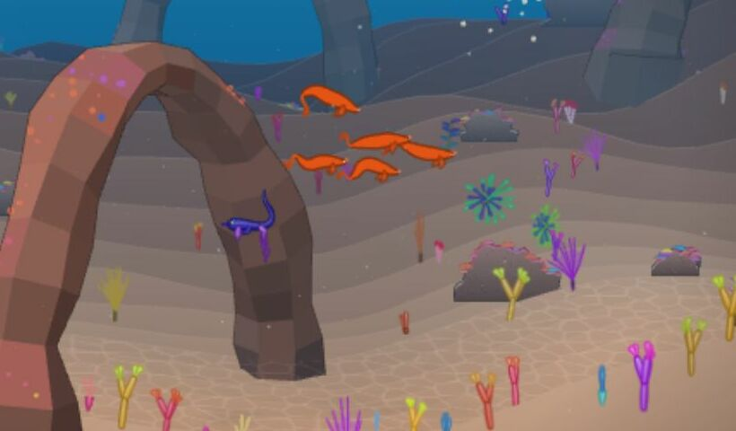
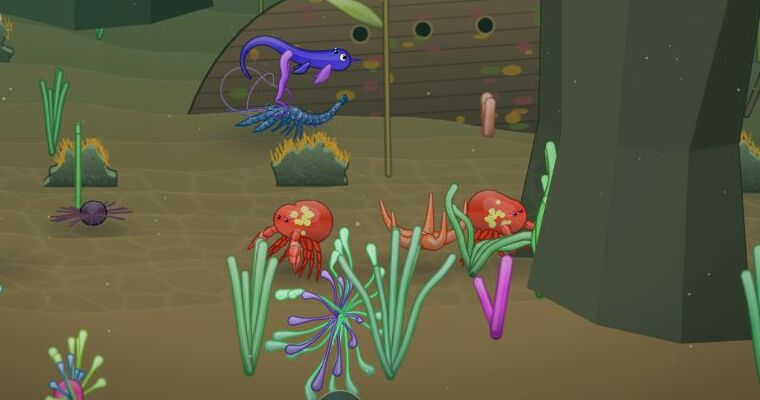
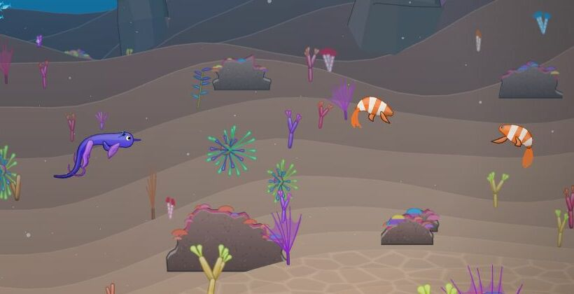

# Action des animaux dans la nature

## Livré

Les animaux ne font plus seulement que se déplacer : autour du nageur, de temps en temps, un animal libre commence une **scène** (un « geste »), seul, à deux ou en groupe, et son corps la joue. Environ la moitié des animaux proches font quelque chose à un moment donné ; les autres errent comme avant.

**Les douze scènes** (`src/monde/vie.ts`, `GESTES`) :

| Qui | Scène | Ce qu'on voit |
| --- | --- | --- |
| Seul | `fouille` | le museau dans le sable (tête en bas pour un nageur), un coup de museau, quelques pixels plus loin, et encore ; chaque coup soulève un nuage de limon |
| Seul | `repos` | presque immobile au-dessus du fond, tourné de trois quarts vers nous ; le corps bat plus lentement, les couleurs pâlissent |
| Seul | `curieux` | il vient regarder le nageur, s'arrête à quelques longueurs (un chasseur plus loin), se tourne vers lui et le suit un peu ; deux à la fois au plus, seulement si le nageur est calme |
| Seul | `gobe` | de petites ruées vers des grains de plancton qui apparaissent juste devant lui et disparaissent |
| À deux | `ronde` | ils tournent l'un autour de l'autre en profondeur, parés de couleurs plus vives |
| À deux | `poursuite` | l'un file ici et là, l'autre le suit de près sans le toucher, puis ils échangent les rôles |
| À deux | `cote` | côte à côte en profondeur, au même pas |
| À deux | `salut` | ils marchent l'un vers l'autre, restent nez à nez (un petit coup de museau), puis repartent |
| Deux espèces | `nettoyage` | un poisson assez grand s'immobilise au-dessus d'une crevette, pâlit et se tourne vers nous ; la crevette nage jusqu'à lui et picore sous sa tête et le long du ventre |
| Groupe (3 à 6) | `banc` | une petite troupe derrière son meneur, en chevron décalé en profondeur ; les méduses en rond autour de la leur |
| Groupe (3 à 6) | `file` | les marcheurs en file indienne sur le fond, chacun juste derrière l'autre (les langoustes le font) ; un peu de poussière sous le meneur |
| Tous | `festin` | toutes les 40 à 70 s, un nuage de nourriture tombe devant le nageur ; jusqu'à six animaux de toutes espèces viennent : les nageurs happent les flocons qui tombent, les marcheurs attendent qu'ils se posent |

**Accroché au moteur de créatures, sans le modifier** (`src/monde/vie-jeu.ts`, `apply`) : une scène donne à chaque animal un but de nage (`main.ts` le dirige avec), et aussi :

- un **cap** quand il bouge à peine (`yawGoal`) : se tourner vers nous, face à l'autre ;
- un **plan en profondeur** (`actor.z`) : tourner l'un autour de l'autre, aller côte à côte, la troupe en chevron ;
- le **tempo de son corps** : chaque acteur a son décalage sur l'horloge de la mer (`actor.lag`, `main.ts` le dirige à `t + lag`) qui avance plus lentement au repos et plus vite au jeu, sans saut ; les méduses battent plus lentement au repos ;
- ses **couleurs** : la palette repeinte plus vive (parure) ou plus pâle (repos, nettoyage), en trois temps, et qui revient de même après la scène ;
- un **marcheur qui nage** un moment (`cr.mode`) : la crevette du nettoyage ;
- la **posture** par la direction donnée (tête en bas pour fouiller).

Et au monde (`src/monde/vie-draw.ts`) : des **nuages de limon** clair là où un museau fouille et sous le meneur d'une file (ils naissent un peu devant l'animal, vers l'œil, pour ne pas être cachés par son corps) ; des **flocons** de nourriture qui coulent et se posent ; des **grains de plancton**. Les deux rendus (WebGL et canvas) les dessinent.

**Avec le nageur** : personne ne nage à travers lui, et les jeux sur place (ronde, salut, poursuite) se tiennent à l'écart. S'il **fonce** sur une scène (plus de 1,9 px par pas), ses animaux s'égaillent ; s'il approche doucement, il regarde de près. Quand il **chante**, toutes les scènes s'arrêtent et aucune ne commence pendant 10 s : la mer écoute, et ceux qui répondent viennent vers lui (`chant.onNote` → `vie.hush`). Pas de curieux ni de festin pendant une parade, un adieu ou la Remontée. Un partenaire que la parade emmène quitte sa scène.

**Comment le voir** : n'importe où, s'arrêter et regarder. Pour les tests et les captures (`?dev`) : `monde.vie.start('nettoyage', [poisson, crevette])` (ou `monde.spawn(...)` puis `start`), `monde.vie.feast(monde.actors)`, `monde.vie.acts`, `monde.vie.seen`, `monde.vie.on = false` pour comparer, la couche `vie` de `monde.skip`.

**Coût** : rien de mesurable au Récif dans le Chrome Windows (60 img/s avec ou sans, simulation 2,3–2,6 ms dans les deux cas, 9 à 10 scènes en cours, 19 animaux proches).

**Tests** : `src/monde/vie.test.ts` (19 tests) : qui peut faire quoi, le choix (même espèce, assez près, même plan ; le curieux seulement près d'un nageur calme), et chaque scène jouée sur un corps simplifié (la fouille descend et soulève un nuage par coup, la ronde tourne en profondeur et se pare, la file garde son ordre et ses écarts, le salut se fait face, le nettoyage, la troupe, la dispersion, l'écart au nageur, le festin de bout en bout, le plancton).

## Choix retenus

Aucune question de choix posée à l'utilisateur : tout est tranché ici (`auto`). Un retour envoyé (le test des Nouveautés qui échouait sur la base, voir plus bas).

| Question | Choix retenu | Pourquoi |
| --- | --- | --- |
| Où vivent les comportements | Trois modules neufs (`vie.ts` pur, `vie-jeu.ts`, `vie-draw.ts`) et une dizaine de branchements courts dans `main.ts` | Additif, testable sans navigateur, n'entre pas en conflit avec les voisins qui touchent le moteur |
| Comment « animer » au-delà du déplacement | Les leviers que le moteur expose déjà : cap, plan, posture par la direction, tempo (décalage d'horloge par acteur), palette repeinte, mode de nage | Aucune modification de `creature3.ts` (43 espèces, Atelier, chantier « animation plus organique » en parallèle) |
| Quelles scènes | Les douze ci-dessus, choisies parmi des comportements réels (fouille, station de nettoyage, file de langoustes, festin de neige marine, parade de couleurs) | Lisibles de loin, sans danger, couvrent seul / à deux / en groupe, et chaque famille (poisson, méduse, marcheur, poulpe) en a plusieurs |
| Fréquence | Chance de 0,16 par demi-seconde pour un animal libre, 10 scènes au plus, repos de 4 à 10 s entre deux ; festin toutes les 40 à 70 s | Le monde paraît habité sans s'agiter : environ la moitié des animaux proches en scène |
| Le nageur et les scènes | Il disperse en fonçant, regarde de près en douceur ; deux curieux au plus ; le chant fait taire tout | Donne une raison d'approcher doucement ; garde le chant lisible |
| Partenaires de chapitre | Ils jouent aussi des scènes ; la parade les reprend | Toutes les scènes restent près de leur maison (à 380 px au plus) : on les retrouve toujours |
| Nuages de limon | Clairs (le sable de son chapitre, beaucoup plus pâle), nés un peu devant l'animal | Le sable assombri disparaissait sur le sol dessiné, et le corps cachait le nuage |
| Qui en est exclu | Le nageur et ses sœurs, les ancêtres, la cousine, les lumières de la Fosse, les animaux de la surface | Ils ont déjà leur propre conduite |

## Options non retenues

- **Où vivent les comportements** : dans le moteur (`creature3.ts`, un état « comportement » par créature) : réutilisable par l'Atelier, mais touche les 43 espèces et le chantier voisin ; dans la boucle de `main.ts` : plus court au départ, mais le fichier partagé grossirait de centaines de lignes.
- **Leviers du moteur** : un **roulis** du corps (se frotter le flanc au sable, comme les poissons qui se grattent) : réel et joli, demande un axe de plus dans `creature3` ; des **pinces levées** ou une posture forcée pour les crabes (parade de menace) : demanderait de changer `spec.swim.posture` d'un animal, risqué car la spec part dans la fusion de la portée ; une **bouche qui s'ouvre** (parties `jaw`) : pas de levier aujourd'hui ; des **vagues de couleur** animées image par image (seiche, poulpe) : repeindre à chaque image coûte et remplit le cache de couleurs WebGL ; **se gonfler** (poisson-ballon) : il faudrait reconstruire la créature ; **synchroniser les battements** d'une troupe (accorder les phases par le tempo) : beau pour les méduses, mais les parties ont des fréquences différentes et l'effet est subtil.
- **Scènes** : **frai** en groupe (nuage d'œufs) : se confondrait avec la reproduction du joueur ; **chasse** ou poursuite d'une proie : contraire au zéro danger ; **se cacher** dans le kelp ou sous un surplomb : demande de connaître les abris (plantes, reliefs) depuis la scène, bon prochain pas (le moment fort de la Forêt) ; **mère et petits** : il n'y a pas de jeunes dans le bestiaire ; **éclairs de bioluminescence** en groupe dans le noir : recouvre les lumières qui répondent et le Jardin ; **jouer avec le nageur** (le suivre, nager dans son sillage) : se confondrait avec la parade.
- **Fréquence** : plus de scènes (un monde agité, qui fatigue l'œil) ; moins (on ne les remarque plus) ; un réglage par chapitre (le noir de la Fosse plus calme, le Récif plus vif) : utile plus tard.
- **Le nageur** : aucune interaction (les scènes ignorent le nageur : simple, mais on passe à travers) ; les animaux le fuient tous (moins de vie à regarder).
- **Partenaires** : les exclure des scènes (plus sûr pour la parade, mais ce sont souvent les animaux qu'on regarde le plus).
- **Nuages** : bulles ou étincelles quand un animal mange (moins juste qu'un nuage de sable) ; des nuages sombres (invisibles sur le sol clair du Récif).

## Reste à faire / limites

- **Le son** : un petit bruit de sable, de bulles ou de bouchée irait bien avec les scènes (chantier « Les bruitages »).
- **Se cacher** dans le kelp ou sous un surplomb, et les autres gestes qui demandent un levier de plus au moteur (roulis, pinces, bouche, vagues de couleur) : voir les options non retenues.
- **Le hasard des rencontres** : les animaux d'une même espèce vivent souvent loin les uns des autres (ils sont semés le long du chapitre) ; les scènes à deux et en groupe sont donc moins fréquentes que les scènes seules, surtout là où la faune est clairsemée. Semer certaines espèces en petits groupes rendrait les troupes et les files plus fréquentes.
- **Le Jardin** n'a pas de fond : la nourriture d'un festin y tombe sans se poser ; seuls les nageurs la mangent, et le festin finit à son terme (30 à 36 s).
- **La taille relative** vient du bestiaire : la crevette du nettoyage a de longues antennes et paraît aussi grande que la rascasse.
- **Mesuré** sur le GPU de bureau seulement (60 img/s) ; sur téléphone, à mesurer avec le chantier « La performance sur téléphone ». Le rendu canvas (`?gl=0`) dessine bien les nuages et les flocons.
- **Trouvé en passant, préexistant** (aussi avec `monde.vie.on = false`) : un avertissement WebGL « bindTexture: attempt to use a deleted object » en boucle au Récif. Et au départ, `make check` échouait sur la base `backlog` (`src/monde/nouveautes/plugin.test.ts`, budget des images de la v0.2.0) ; signalé par le tableau de bord, c'est réglé sur `backlog` depuis : vert après la fusion.

## Risques de fusion

- **`src/monde/main.ts`** (branchements courts) : l'import de `initVie` ; un champ `lag?` dans `Actor` ; `steer()` dirige à `t + (a.lag ?? 0)` au lieu de `t` ; `vie.step(...)` après `lumieres.step(...)` dans `update()` ; dans la boucle des acteurs, deux lignes `vie.goal(a)` juste avant l'errance par défaut ; `swimFactor3(c, t + (a.lag ?? 0))` dans l'errance ; `vie.items(...)` après `traces.items(...)` dans `render()` ; la création de `vie` et `chant.onNote(() => vie.hush())` après le chant ; `vie` dans `api`. À garder des deux côtés si un voisin touche les mêmes lignes (la boucle des acteurs et `steer` sont souvent touchées).
- **`docs/direction-artistique.md`** : une puce dans « Ce qui existe déjà » et une section « La vie des animaux » avant « Une palette par chapitre ».
- **Chantiers voisins** (déjà fusionnés dans `backlog`, et repris ici par la fusion) : « Déplacement de la crevette » apprend aux marcheurs à nager vers le haut ; la crevette reste un marcheur sur pattes, donc le nettoyeur, et le passage en mode nage pendant le nettoyage lui garde sa place sous le poisson (en marche, un marcheur qui ne monte plus redescend). La Remontée ajoute des acteurs `ancestor`, que la vie des animaux laisse à leur formation ; pendant la Remontée, ni curieux ni festin. Conflits résolus : les imports, `ponte.items` à côté de `vie.items`, la Remontée et les ondes avant la vie des animaux, `api` ; et la section « La flore des chapitres » avant « La vie des animaux » dans la doc.
