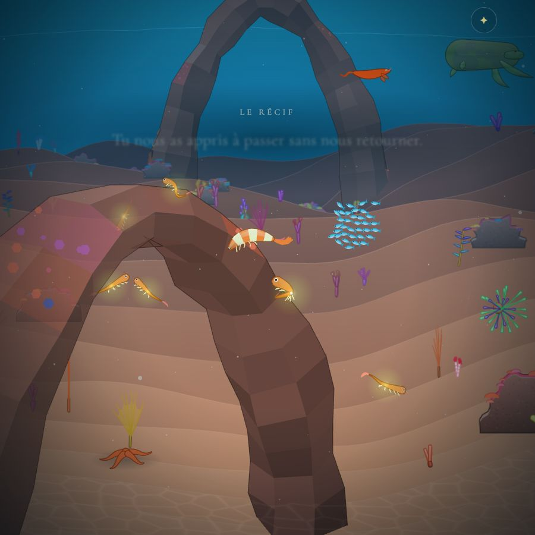
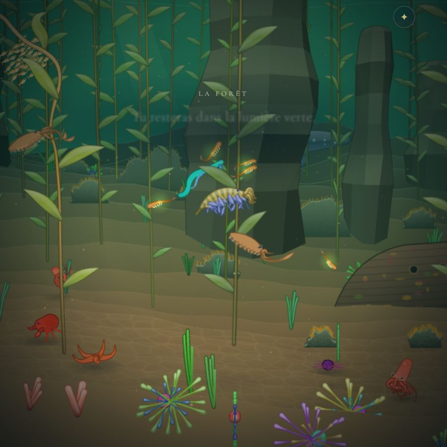
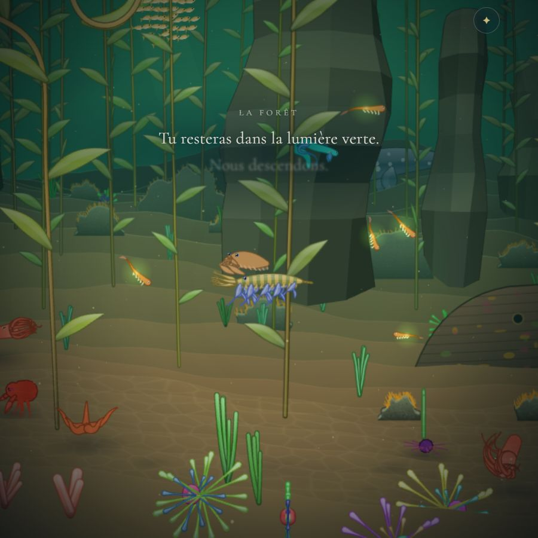
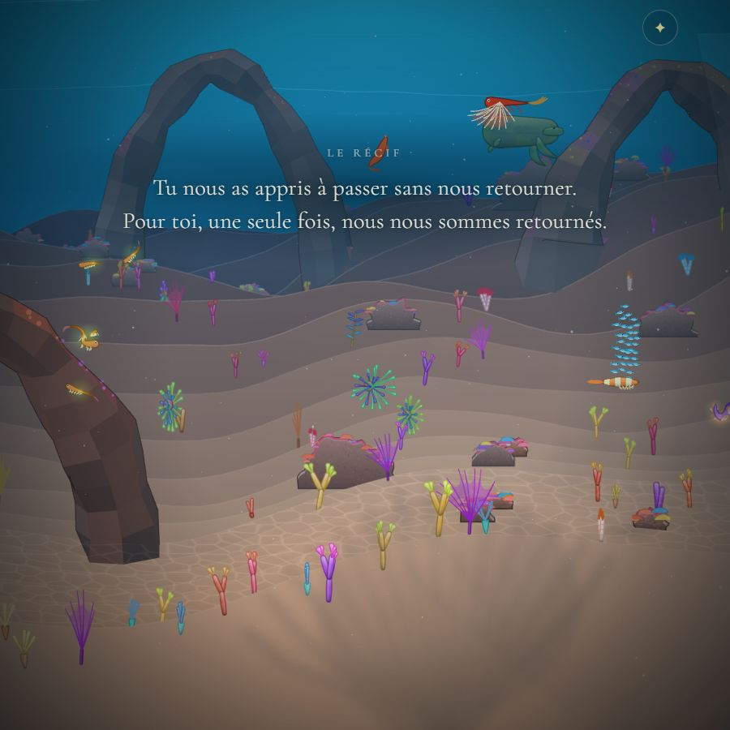

# L'adieu au parent

## Livré

Une scène d'une dizaine de secondes, jouée sans rien avoir à faire, au moment où l'enfant choisi prend la suite du parent :

1. **Ensemble** (0 à 3 s) : l'enfant naît à côté du parent et fait une fois le tour de lui ; le parent le suit de la tête. La caméra se rapproche des deux (cadrage calculé sur la taille du parent : même la larve de la Nurserie remplit la vue), les bords de la mer s'assombrissent, les boutons et la jauge s'effacent.
2. **Les mots** (à 1,2 s) : le texte d'adieu du chapitre, avec l'affichage des textes narratifs existant. Une ouverture de chapitre qui arriverait pendant ce temps attend qu'il s'efface (`narration.ts`).
3. **Le départ** (à partir de 3 s) : l'enfant part vers la suite de la descente, de plus en plus vite ; le parent l'accompagne un peu, s'arrête vers 5,6 s et le regarde partir. La caméra s'élargit pour garder les deux, puis suit l'enfant et revient au zoom du joueur.
4. **La main rendue** quand l'enfant est à environ 700 px, ou au bout de 11 s (s'il est retenu par une borne).
5. **Le parent qui reste** : il dérive doucement là où on l'a quitté ; quand on revient, il se tourne vers nous et vient un peu à notre rencontre (sans jamais nous toucher). Les larves-sœurs de la première génération restent avec lui.

La naissance est enregistrée dans la partie (`partie.born`) ; une nouvelle partie, qui n'avait pas encore sauvé sa larve, l'y range quand même comme parent.

**Les textes** : un adieu pour chaque chapitre de la descente, dans `docs/chapitres.md` (ceux des chapitres 2, 3 et 5 à 9 sont nouveaux, marqués « proposition » ; la Remontée n'en a pas). Par exemple, pour le Récif : « Tu nous as appris à passer sans nous retourner. Pour toi, une seule fois, nous nous sommes retournés. »

Fichiers : `src/monde/adieu.ts` (la scène, pure : positions en entrée, vitesses voulues et cadrage en sortie ; `stayGoal` pour le parent resté), `adieu-jeu.ts` (branchement : qui mène le nageur, le parent, la caméra, le texte), `adieu.css`, `adieu.test.ts` (10 tests), `farewell` dans `main.ts`.

**Pour le voir** : `?dev`, puis dans la console `monde.farewell()` (un enfant d'essai : le parent fusionné avec la première espèce du chapitre, `fuse`, 40 % du partenaire), ou `monde.farewell(spec)` avec un enfant donné.

## Choix retenus

Aucune question posée à l'utilisateur ; un retour (feedback) signale à la portée le point d'entrée `monde.farewell`.

| Question | Choix retenu | Pourquoi |
| --- | --- | --- |
| Qui déclenche la scène | `farewell(enfant)` dans `main.ts`, exposé en `monde.farewell` ; la portée l'appellera | La portée est un chantier voisin ; un seul point d'entrée, simple à brancher |
| Qui fait la naissance | La scène (`partie.born`, et le parent devient un acteur) | Un seul endroit où le parent quitte le nageur ; la portée ne doit pas appeler `partie.born` elle-même |
| Contrôle pendant la scène | Scène menée, la main rendue à ~700 px ou 11 s | Un moment à regarder, court ; le joueur ne peut pas le casser par un geste involontaire |
| Où va l'enfant | Vers la suite de la descente (+x, un peu plus bas) | Le sens de l'histoire ; l'enfant franchit ensuite l'obstacle |
| Le parent après | Reste dans le monde pour la session, dérive, se tourne vers nous quand on revient | « Le parent qui reste », et amorce de « Les ancêtres restent dans le monde » (étape 4) |
| Mise en scène | Rapprochement de la caméra cadré sur la taille, bords assombris, boutons effacés | Sans nouvel écran ni chiffre ; tient dans la scène existante |
| Les textes des chapitres 2 à 9 | Écrits, marqués « proposition » | Sans eux la scène serait muette presque partout |
| Larves-sœurs | Restent avec le parent | C'est sa génération ; elles brouillaient la lecture de l'enfant |

## Options non retenues

- **Déclenchement** : écouter un événement (`CustomEvent('naissance')`) — découplé mais plus indirect, rien d'autre ne l'écoute ; la portée qui fait tout elle-même — dupliquerait la mise en scène.
- **Contrôle** : laisser la main tout de suite (l'enfant part au doigt) — plus libre mais on peut rester collé au parent et l'image du départ se perd ; bouton « Continuer » — ajoute une interface, contraire à « le texte est la seule interface » ; reprise au premier toucher après 5 s — compromis possible si 11 s paraît long sur téléphone.
- **Parent** : le faire disparaître dans le lointain (fondu) — plus simple mais contraire au « parent qui reste » ; le garder aussi après rechargement — c'est le chantier « Les ancêtres restent dans le monde » (la lignée sauvée a déjà le chapitre, pas encore la position).
- **Mise en scène** : bandes noires de cinéma — signal fort mais cliché et coûteux en hauteur sur téléphone ; ralenti du temps — joli mais fausse la nage des autres animaux ; lueur ou bulles du parent au départ — à essayer ensuite, demande du dessin dans le rendu ; enfant plus petit que le parent — le moteur fixe l'échelle à la création, il faudrait une croissance.
- **Son** : une note ou un souffle au moment de l'adieu — pas de son dans le jeu aujourd'hui.

## Reste à faire / limites

- Rien ne déclenche la scène en jouant tant que la portée n'est pas fusionnée : elle doit appeler `farewell(enfant)` à la fin du choix.
- Le parent ne reste que pour la session (perdu au rechargement) : étape 4, « Les ancêtres restent dans le monde ».
- Les adieux des chapitres 2 à 9 sont à relire ; celui de la Grotte l'était déjà.
- L'enfant naît à côté du parent ; si la portée montre des œufs, le faire naître à la place de l'œuf choisi (paramètre de position à ajouter).
- Pas vérifié sur un vrai téléphone (captures sur le Chrome Windows, fenêtre 900 × 900).

## Risques de fusion

- `src/monde/main.ts` : branchements courts — `'parent'` dans le type `Actor.kind`, `adieu.lead` en tête de `update()`, une branche `'parent'` dans la boucle des acteurs, la caméra de `frame()` (distance et cible via `adieu.camera`), la fonction `farewell` (15 lignes) après `showChapter`, et `farewell, adieu` dans `api`.
- `src/monde/narration.ts` : 3 lignes (une ouverture attend la fin d'un adieu).
- `docs/chapitres.md` : les adieux ajoutés sous chaque ouverture, et deux phrases de « Les textes » / « À écrire ».
- `docs/mecaniques.md` : section « L'adieu » et une ligne de « Durée et sauvegarde ».
- Avec la portée (`portee-4-enfants`) : elle ne doit pas appeler `partie.born` elle-même.
