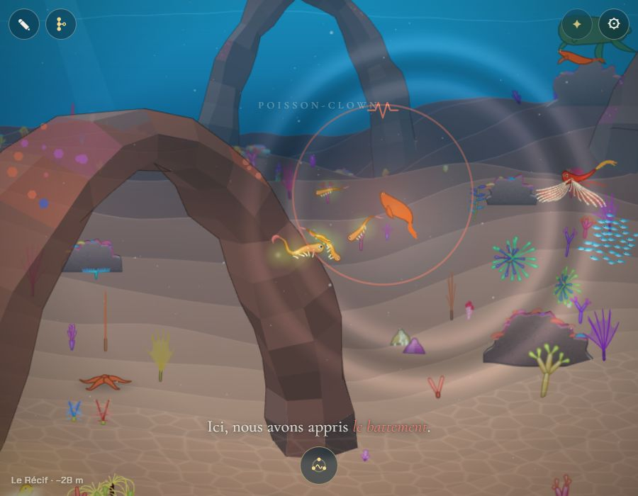
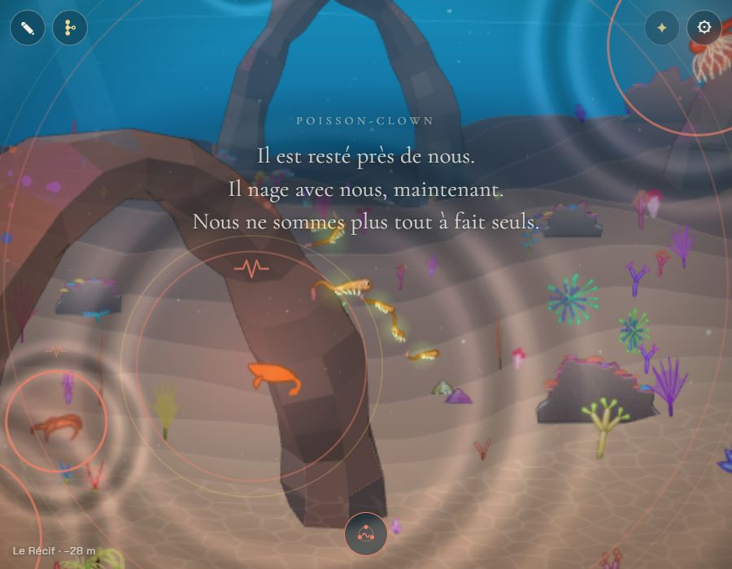
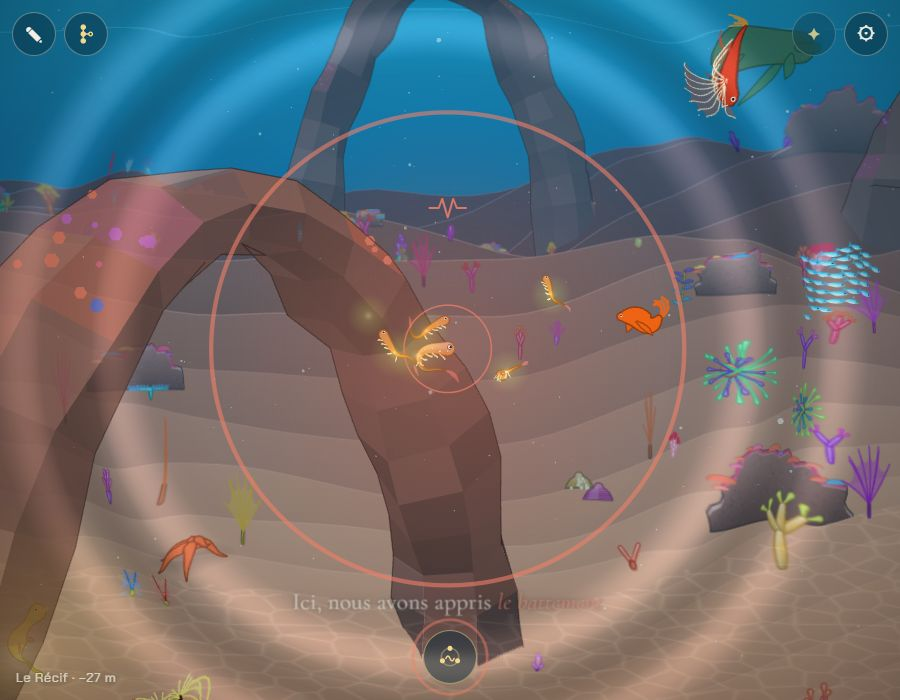
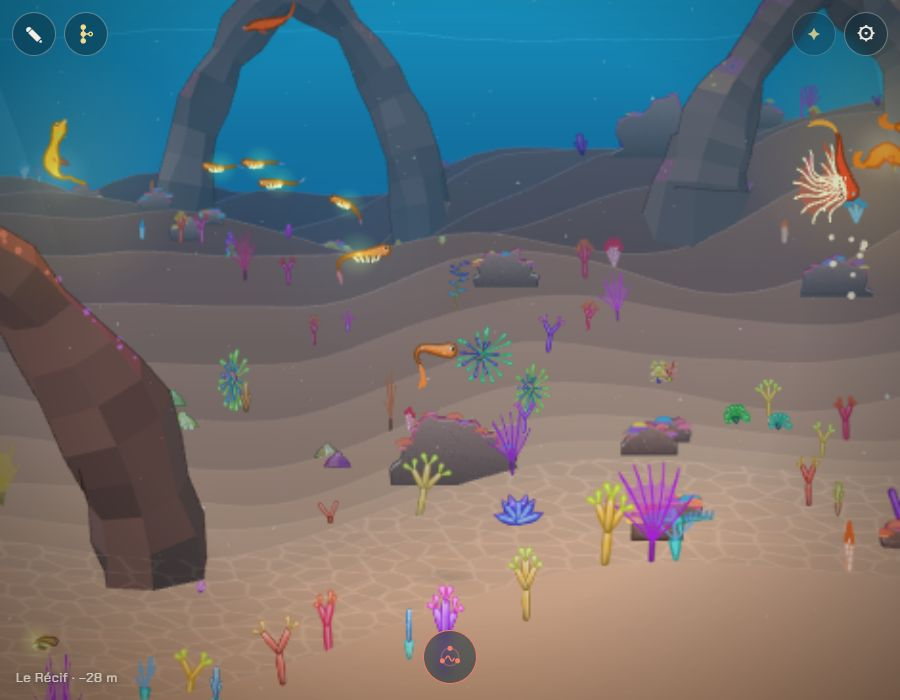
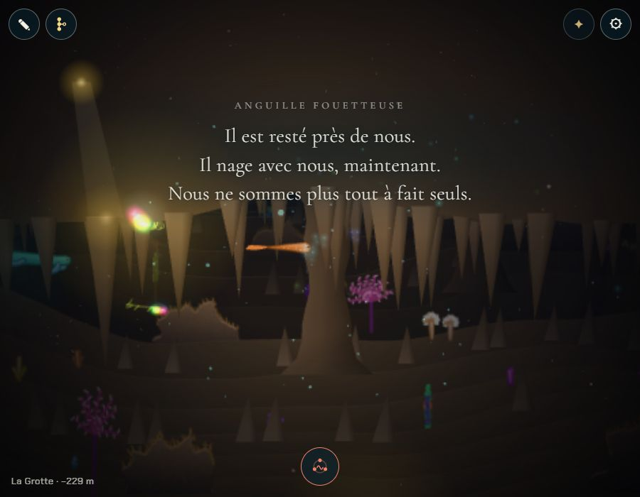

# Les amis qui suivent

## Livré

Un petit animal avec qui l'on a passé un moment devient l'**ami de la génération** ; après une naissance, les **deux parents** nagent aussi avec l'enfant (choix de l'utilisateur). La conception est dans `docs/mecaniques.md`, section « Les amis qui suivent » (avec les deux textes de la lignée, *propositions*).

- **Le lien** (`bondStep`, `src/monde/amis.ts`) se tisse sans rien à l'écran avec chaque petit nageur proche : un poisson de pleine eau, assez vif, pas plus long que 150 px, pas un partenaire. Rester calme près d'un animal venu nous regarder (la scène `curieux` de la vie des animaux) le remplit en une dizaine de secondes. Un festin partagé ou une autre scène regardée de près le remplissent plus lentement, et un animal qui répond au chant y gagne d'un coup. Foncer sur lui le défait.
- **L'ami** s'illumine trois fois de sa couleur, chante la note de son chapitre, et la lignée le dit sous le nom de son espèce. Il nage à côté de nous quand on nage et tourne autour de nous quand on s'arrête. Il reprend chaque note de notre chant une octave plus haut (`chant.echo`). Toutes les une à une minute et demie, il nous mène vers une trace de la lignée pas encore vue, sinon vers un coin où la nourriture tombe (`vie.feast(actors, spot)`).
- **Les parents** : une fois l'adieu fini, le parent qu'on était et le partenaire de la parade (s'il nage comme un poisson) nous suivent de la même façon jusqu'à la sortie du chapitre. Le parent reste alors là où on le quitte : sa place est mise à jour dans la sauvegarde (`placeAncestor`). Le partenaire retourne à sa vie.
- **Après la génération** : l'ami reste où il est, sauvé avec sa place (`friends` dans `lignee.partie`). Il revient au rechargement. La première fois qu'on repasse dans une visite, il nous reconnaît : éclats, sa note, les mots « Retrouvailles », et il nage avec nous 14 s.
- **Fichiers** : `src/monde/amis.ts` (règles pures, testées dans `amis.test.ts`, 21 tests), `src/monde/amis-jeu.ts` (le jeu), et les branchements courts listés plus bas.
- **Pour le voir** : au Récif, `a = monde.spawn('poissonClown', 'swim', 150, -30); monde.vie.start('curieux', [a])`, puis ne pas bouger une dizaine de secondes. Ensuite `monde.amis.list`, `monde.amis.bonds`, `monde.amis.show()`, `monde.farewell()`, `monde.partie.friends`.

Vérifié dans le Chrome Windows : le lien se remplit (1 par seconde près d'un curieux) et l'ami se fait. Il suit à environ 150 px pendant qu'on nage à pleine allure. Le chant est repris. Il nous a menés vers un coin de nourriture. À l'adieu, il reste sur place et les parents suivent, puis restent au changement de chapitre (avec la place de l'ancêtre sauvée). Au rechargement, il reprend sa place et nous reconnaît, avec ses mots.

## Choix retenus

| Question | Choix retenu | Pourquoi |
| --- | --- | --- |
| Comment devient-on ami ? (posée) | **Le lien qui se tisse**, choix de l'utilisateur, avec son commentaire « et aussi les parents après une naissance » | S'appuie sur ce qui existe déjà (les curieux, le festin, le chant), sans geste ni interface en plus |
| Les parents après une naissance (posée en validation) | Ils suivent l'enfant jusqu'à la sortie de leur chapitre, puis le parent reste là (sauvé) et le partenaire retourne à sa vie. **Validé par l'utilisateur**, qui ajoute : « après, qu'il soit plus petit : voir une autre feature du backlog (manger) » | Lecture la plus directe du commentaire, sans casser la règle des ancêtres (« il reste là où on l'a quitté ») |
| Combien d'amis ? | Un par génération, le premier reste | « Un compagnon de la génération » ; lisible ; le portrait pourra montrer plusieurs générations d'amis |
| Combien de temps suit-il ? | Toute la génération, de chapitre en chapitre, et après un rechargement | « peut-être d'un chapitre à l'autre » ; le plus simple à comprendre |
| Qui peut devenir ami ? | Les petits nageurs de pleine eau, au corps de poisson (pas cloche, jet ni marcheur), assez vifs (vitesse ≥ 0,6), ≤ 150 px, pas les partenaires | Ils peuvent nous suivre sans à-coups ; un partenaire reste à la parade |
| Où le garder ? | `friends` dans `lignee.partie` : id du bestiaire, génération, puis chapitre et place | Compact. « Recommencer » l'efface avec le reste. Même règle de place que les ancêtres (`homesOf`) |
| Que montre-t-il ? | Une trace de la lignée pas encore vue (à moins de 1 600 px), sinon un coin où la nourriture tombe | Les trésors de la lignée n'existent pas encore. `pickShow` pourra les prendre quand ils viendront |
| Comment le reconnaître ? | Une faible lueur de sa couleur près de nous, plus forte quand il nous mène ; jamais l'or des partenaires (`cousinHue`) | Discret, et visible dans le noir |
| Les mots | « Un ami » quand il se fait, « Retrouvailles » quand il nous reconnaît, lus dans `mecaniques.md`. Ils attendent jusqu'à 20 s que l'écran soit libre | Comme les autres textes, écrits dans la doc |

## Options non retenues

- **Comment devient-on ami ?**
  - Seulement par le chant (deux réponses) : simple, mais le chant est déjà très chargé.
  - Seulement après un petit jeu : rien de visible tant que le chantier voisin n'est pas fusionné. Il pourra appeler `monde.amis.befriend(acteur)`.
  - Un geste explicite (toucher longuement) : clair, mais c'est un geste et une interface de plus.
- **Les parents** :
  - Un temps fixe (par exemple 2 min) au lieu du chapitre : moins lisible.
  - Seulement notre ancien corps, sans le partenaire : plus simple, mais l'utilisateur a dit « les parents ».
  - Les parents qui suivent toute la génération : ça contredit « il reste là où on l'a quitté ».
- **Combien d'amis** : plusieurs à la fois (une petite troupe) serait plus vivant, mais coûte plus en lisibilité et en simulation. Un nouvel ami qui remplace l'ancien rend la relation moins forte.
- **Combien de temps** : un temps limité (« un moment ») ; seulement dans le chapitre où il s'est fait. Les deux sont moins généreux.
- **Qui** : aussi les méduses et les jets, en les pilotant comme le nageur (`pilot`) : ça touche le moteur partagé. Aussi les marcheurs sur le fond : ils ne peuvent pas suivre en pleine eau.
- **La sauvegarde** : garder tout le corps (JSON de l'espèce), plus lourd et inutile pour le bestiaire ; une clé à part (`lignee.amis`), que « Recommencer » oublierait.
- **Ce qu'il montre** : un partenaire du chapitre (ça doublonnerait les indices) ; seulement de la nourriture.
- **Sa marque** : un petit symbole au-dessus de lui (c'est de l'interface), ou pas de marque du tout (on le perd parmi les autres).

## Reste à faire / limites

- **Grandir en mangeant** (commentaire de l'utilisateur) : l'enfant qui naît plus petit et grandit est un autre chantier du backlog (« Grandir jusqu'à la maturité »).
- **Les petits jeux des animaux** (chantier voisin) : à la fin d'un jeu, appeler `monde.amis.befriend(acteur)`, ou ajouter au lien comme le fait le chant.
- **Le portrait de la génération** pourra lire `monde.amis.list` pour cadrer les amis proches. Le shoot automatique y trouvera « retrouvailles avec un ami ».
- **Les trésors de la lignée** : `pickShow` prend des cibles `{ x, y, seen }` ; ajouter les trésors pas encore trouvés à côté des traces.
- **L'arbre de la lignée** ne montre pas encore l'ami de chaque génération (`partie.friends` a la génération).
- **Ce qu'on ne voit pas** : l'ami ne joue plus les scènes de la vie des animaux, et ne mange pas au festin vers lequel il nous mène (il tourne autour).
- **Dans la Balade libre**, l'ami se fait et suit de la même façon, mais une naissance n'y change pas de génération : il ne reste donc pas derrière.

## Risques de fusion

- `src/monde/main.ts` : le genre d'acteur `ami`, une branche dans la boucle des animaux (8 lignes), `amis.step`, `amis.lights`, le bloc `initAmis` après la vie des animaux, `amis.born` dans `farewell` (le parent laissé est gardé dans `left`), `amis` dans `api`. Que des ajouts courts.
- `src/monde/partie.ts` / `partie-jeu.ts` : le champ `friends` (lu par `parsePartie`), `befriend`, `friendStays`, `placeAncestor`, `generation`. Que des ajouts.
- `src/monde/chant-jeu.ts` : `echo(cr, chapter)`, et l'acteur `ami` exclu des réponses ordinaires.
- `src/monde/vie-jeu.ts` : `feast(actors, spot?)`, un endroit en option pour le festin.
- `docs/mecaniques.md` : une nouvelle section avant « Contrôles et interface », et une ligne de « L'adieu » changée (le parent nous suit maintenant jusqu'à la fin du chapitre).
