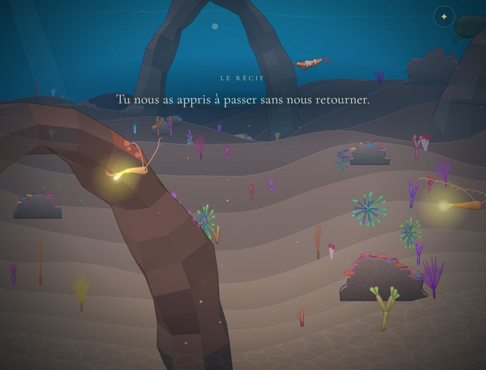
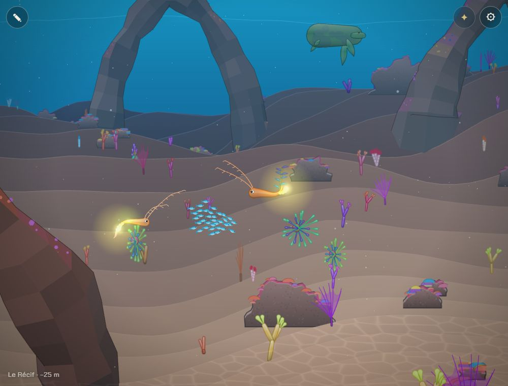
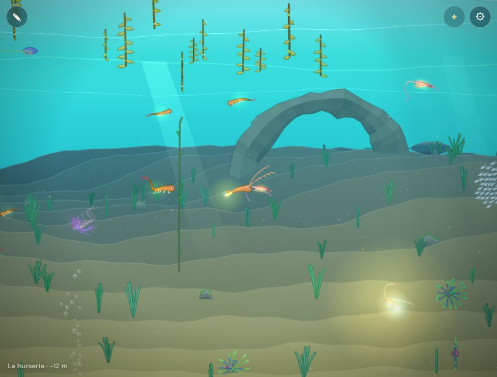

# Les ancêtres restent dans le monde

## Livré

Chaque parent quitté reste là où on l'a quitté, **d'une visite à l'autre** (avant, il disparaissait au rechargement), et y nage quand on revient en arrière.

- **La place dans la sauvegarde** : la scène de l'adieu range le parent dans la lignée avec sa place, `at` (`partie.born(enfant, chapitre, at)`, `birth` dans `src/monde/partie.ts`). x est compté depuis le début de son chapitre, pour que la place survive à un déplacement des chapitres sur la carte ; y est la profondeur. Le champ est optionnel : les sauvegardes d'avant se lisent toujours.
- **Le retour dans le monde** : à l'ouverture de la page, chaque ancêtre de la sauvegarde redevient un parent laissé derrière (acteur `parent`, taille du nageur), à sa place (`homesOf`, `src/monde/ancetres.ts`, pur ; la carte du jeu dans `ancetres-jeu.ts`). La place est gardée dans l'étendue de son chapitre et dans l'eau libre (sous le plafond de la Grotte, au-dessus du fond). Il y nage comme le parent qu'on vient de quitter (`stayGoal`, `adieu.ts`, enregistré par `adieu.stay`) : il dérive autour de sa place, se tourne vers nous quand on revient et vient à notre rencontre.
- **Les larves-sœurs** restent avec la première génération, aussi après un rechargement (avant, elles suivaient l'enfant).
- **Les anciennes sauvegardes** (v0.4.0, ancêtres sans place) : chaque ancêtre est posé dans son chapitre, là où l'on rencontre les partenaires, à mi-eau, et plusieurs dans un même chapitre sont écartés. Un ancêtre dont le chapitre n'existe plus, ou dont la créature ne se lit plus, reste dans la lignée mais pas dans le monde.
- **Rencontre sans bousculade** (correction) : le parent resté venait jusque sur nous quand on s'arrêtait près de lui (`face` avançait toujours) ; il s'arrête maintenant à 90 px (`ROOM`, `adieu.ts`), toujours tourné vers nous.
- **Revenir en arrière ne fait plus reculer la partie** (correction, validée par l'utilisateur) : la sauvegarde gardait le dernier chapitre montré, même en remontant. Après une visite à la Nurserie, un rechargement nous y remettait, les obstacles déjà franchis ne l'étaient plus, et un enfant sans le trait restait bloqué avant le Récif. `reachChapter` ne compte plus qu'un chapitre plus profond (`partie-jeu.ts` lui donne l'ordre des chapitres).

Tests : `src/monde/ancetres.test.ts` (10 : la place retrouvée, la carte qui bouge, les bornes, les anciennes sauvegardes, les chapitres disparus, la sauvegarde aller-retour, le chapitre qui ne recule pas, et sur la carte du jeu : chaque chapitre rend son parent à sa place), `adieu.test.ts` (le parent s'arrête à distance).

**Pour le voir** : `?dev&nouvelle`, `monde.teleport(1300, 250)` puis `monde.farewell()` (la larve reste à la Nurserie) ; `monde.gotoBiome(1)` puis `monde.farewell()` (un parent au Récif) ; recharger la page (sans `?nouvelle`) : on reprend au Récif, le parent est là. Nager en arrière jusqu'à la Nurserie : la larve et ses sœurs y sont. Dans la console : `monde.ancestors()` (les acteurs `parent`), `monde.partie.lineage` (avec `at`).

## Choix retenus

Deux questions posées à l'utilisateur, toutes deux tranchées par lui ; un retour (feedback) signale les risques de fusion avec l'arbre de la lignée et le test des Nouveautés en échec.

| Question | Choix retenu | Pourquoi |
| --- | --- | --- |
| Comment la sauvegarde garde la place (question, **choix de l'utilisateur**) | Un champ `at` dans chaque ancêtre : x depuis le début de son chapitre, y la profondeur | Survit à un déplacement des chapitres (le chantier des 10 chapitres), optionnel donc rétrocompatible |
| Le chapitre sauvé quand on revient en arrière (validation, **approuvée par l'utilisateur**) | Le plus avancé : `reachChapter` n'avance que vers le fond | Revenir voir un ancêtre ne doit rien coûter ; évite un blocage avant un obstacle déjà franchi |
| Les ancêtres des anciennes sauvegardes | Posés dans leur chapitre, sur l'étendue des partenaires, à mi-eau, écartés entre eux | La promesse « chaque parent reste » tient aussi pour les parties déjà commencées ; c'est là que l'adieu a lieu le plus souvent |
| Quand les recréer | Tous à l'ouverture de la page, simulés seulement quand on est près (comme la faune) | Un par génération ; aucun coût de plus que les autres animaux, pas de cas à part |
| Le comportement au retour | Celui du parent qu'on vient de quitter (`stayGoal`), avec de la place gardée | Une seule façon d'être un parent resté, en session comme après rechargement |
| La distance gardée | 90 px du centre de l'un au centre de l'autre, le parent tourné vers nous | Il vient à nous sans nous recouvrir ; le moteur garde le cap à l'arrêt |
| Les larves-sœurs après rechargement | Avec la première génération | Comme dans la scène de l'adieu : c'est sa génération |
| Où mettre le code | `ancetres.ts` (pur, testé), `ancetres-jeu.ts` (la carte), un bloc de 8 lignes dans `main.ts` | Consigne : nouveaux modules, branchements courts dans `main.ts` |
| Un ancêtre dont le chapitre a disparu | Absent du monde, gardé dans la lignée | Rien de sûr où le poser ; la lignée, elle, ne perd rien |

## Options non retenues

- **Format de la place** : coordonnées absolues du monde — le plus simple, mais un ancêtre changerait de chapitre ou finirait dans la roche si la carte bouge ; fraction du chapitre et hauteur au-dessus du fond — suit un chapitre qui s'allonge, mais plus obscur, et le parent bouge si le relief change ; rien de sauvé (au milieu de son chapitre) — aucun format, mais pas « là où on l'a quitté » ; une clé à part (`lignee.ancetres`) — ne touche pas `partie.ts`, mais deux sauvegardes à tenir d'accord (Recommencer, nouvelle partie).
- **Chapitre sauvé** : le laisser suivre le nageur — la reprise suit où l'on est, mais on peut se bloquer avant un obstacle déjà franchi ; sauver aussi les obstacles franchis — garde la position exacte, mais un format de plus pour un gain faible ; sauver la position exacte du nageur — plus fidèle, mais reprendre au milieu d'un courant ou d'une galerie est déroutant.
- **Anciennes sauvegardes** : ne pas les montrer — plus sûr, mais les parents d'une partie en cours disparaîtraient pour de bon ; au point d'arrivée du chapitre (`arrival`) — simple, mais tous au même endroit, et juste sur le nageur qui reprend là.
- **Création** : à la demande, en approchant de leur chapitre — économise quelques acteurs, mais une gestion de plus sans gain mesurable.
- **Retrouvailles** : un texte (« Tu es revenu… ») la première fois qu'on revoit un ancêtre — touchant, mais demande un texte par chapitre et touche la narration, que les voisins modifient ; une lueur ou des bulles quand il nous reconnaît — demande du dessin dans le rendu ; nager un moment à nos côtés, puis retourner à sa place — plus vivant, à essayer ; un nom au-dessus de lui — contraire à « pas d'interface », et l'arbre de la lignée s'en charge.
- **Distance** : reculer quand on s'approche — le moteur tourne la tête vers où l'on va, il nous tournerait le dos ; une distance selon la taille — plus juste pour les grands corps, mais `stayGoal` ne connaît pas les tailles aujourd'hui.
- **Larves-sœurs** : les faire suivre l'enfant — contraire à la scène de l'adieu ; ne plus les créer après la première naissance — plus simple, mais la Nurserie perdrait sa famille.
- **Ancêtre sans chapitre** : le poser dans le chapitre le plus proche — il faudrait deviner lequel ; le poser à la Nurserie — faux et visible.

## Reste à faire / limites

- Une naissance dans un chapitre moins profond que celui atteint (revenir chercher un partenaire au Récif depuis la Forêt) ramène encore la reprise à ce chapitre (`birth` fixe `chapter`) ; ce n'est pas un blocage (les partenaires du chapitre apportent ses traits), mais la reprise recule. À régler si ce cas devient courant.
- Le voyage du panneau ⚙ (`?dev`) vers un chapitre antérieur ne change plus le chapitre sauvé : pour repartir de zéro, `?nouvelle`.
- Pas de retrouvailles au-delà du comportement (voir « Options non retenues ») ; à la Remontée (étape 5), `ancestorsIn(partie.lineage)` ou `monde.ancestors()` donnent tous les ancêtres pour la formation.
- Le test `src/monde/nouveautes/plugin.test.ts:71` échoue **sans rapport avec ce chantier** : il échoue aussi sur la base (`783f9a2`, release 0.4.0), le budget des images embarquées ne laissant plus d'image à la v0.2.0.
- Pas vérifié sur un vrai téléphone (captures sur le Chrome Windows, fenêtre 1000 × 760).

## Risques de fusion

- `src/monde/partie.ts` : le type `Place` et le champ `at?` d'`Ancestor` ; un 4e paramètre `at` à `birth` ; un paramètre `order` à `reachChapter`. **L'arbre de la lignée** (partenaire, nom) touchera probablement les mêmes lignes : garder les deux (par exemple `birth(p, child, chapter, at, partner)`).
- `src/monde/partie-jeu.ts` : `born(sp, chapter, at)`, et `reach` qui passe l'ordre des chapitres.
- `src/monde/main.ts` : deux imports, l'appel `partie.born(…, placeOf(x, y, BIOMES[bi].x0))` dans `farewell`, un bloc de 8 lignes juste après `farewell` (les ancêtres de la sauvegarde), et `ancestors` à la fin d'`api` (virgule ajoutée après `partners`).
- `src/monde/adieu.ts` : `face` prend une vitesse, `ROOM`, la ligne de `stayGoal` ; `adieu-jeu.ts` : la méthode `stay`.
- `docs/mecaniques.md` : une ligne de « L'adieu », la section « Les ancêtres » (4 points), la ligne de la sauvegarde dans « Durée et sauvegarde ».
