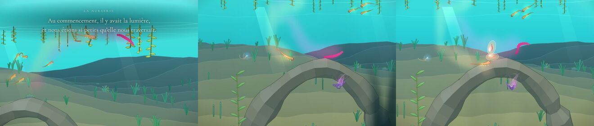
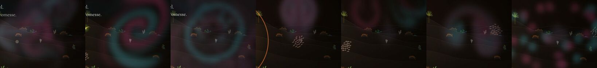
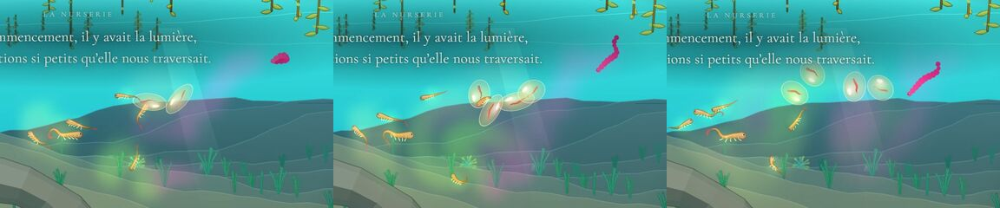
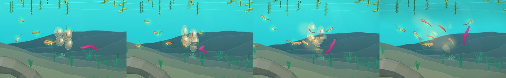
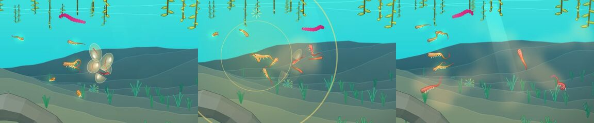
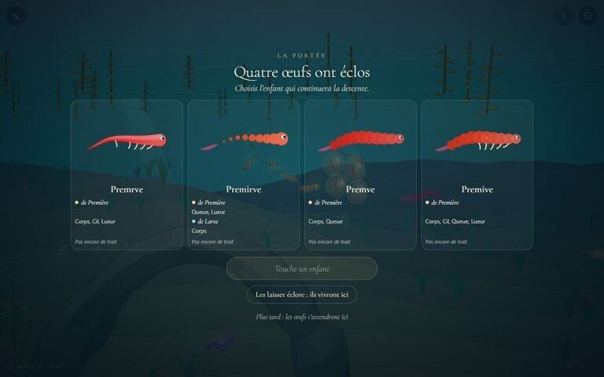

# Animation plus organique : l'eau de la parade, la ponte et l'éclosion

Le chantier : « les animations d'accouplement sont un peu trop simples, je veux des trucs plus organiques ; aller voir des algorithmes ultra simplifiés de mécanique des fluides, ou un truc qui ramène à la nature, la physique de la matière ». Puis l'ordre suivant : « finir par une ponte de quatre œufs (le choix possible du joueur) et, après le choix ou non-choix, les 4 créatures générées sortent des œufs, l'une d'elles possiblement prise par le joueur ».

Avant : les lumières de la parade étaient des points qui suivaient des trajectoires écrites (lignes, anneaux, spirales : `lueur.ts`), sans rapport avec l'eau ; les œufs étaient une image fixe en petit tas qui se balançait sur une sinusoïde, et le choix d'un enfant les faisait disparaître d'un coup, l'enfant apparaissant à côté du parent à sa taille adulte.

## Livré

### L'eau de la parade (`fluide.ts`, `remous.ts`, `parade-eau.ts`)

- **Un vrai fluide, le plus simple qui soit** : les « stable fluids » de Jos Stam (2003), sur une nappe de 640 × 400 px autour du grand huit de la danse (grille 80 × 50, cases de 8 px). La vitesse de l'eau est portée par elle-même (semi-lagrangien, jamais instable) et gardée sans divergence (Gauss-Seidel sur-relaxé, 10 balayages, pression gardée d'un pas à l'autre) : ce qu'on pousse tourne autour au lieu de s'empiler, une poussée fait deux tourbillons, un jet un champignon. Deux encres y nagent, la lumière du partenaire et la nôtre, portées « à la MacCormack » (fines volutes, bornées : pas de lumière née de rien). Des **sources** (eau qui jaillit d'un point, reprise uniformément sur la nappe) permettent les anneaux ; une **poussée verticale** liée à l'encre fait couler ou monter la lumière (fontaine).
- **Les corps remuent l'eau** (`eau.dancer`) : le tronc et le bout des membres de chaque danseur entraînent l'eau (jamais plus vite qu'eux) et l'allument là où ils la bousculent, de la couleur du partenaire, de la nôtre à mesure qu'on danse en rythme. **Les battements** (`remous.ts`, `beat`) : un poisson lâche une bouffée au bout de chaque coup de queue, du côté balayé et un peu en arrière (son sillage se roule en tourbillons alternés) ; une cloche ou un manteau pousse un jet derrière lui à chaque battement ; un marcheur soulève le fond.
- **La figure finale devient un mouvement d'eau** (`waterFigure`, une par figure de `lueur.ts`) : corolle (jets le long des bras depuis une source), spirale (un tourbillon qui enroule deux bras de lumière), anneaux (l'eau jaillit du centre par battements et se fripe), fontaine (un jet qui monte et retombe, sa lumière coule), pluie (des gouttes qui se roulent en champignons), hélice (un jet montant qui se balance), lucioles (des étincelles avec chacune son remous). Riche selon la qualité de la parade (plus de lumière, un peu plus de place, jamais plus de force), avec son écho. Les lueurs de `lueur.ts` sont maintenant portées par ce courant (`Motes.step(dt, water)`).
- **Ce qu'on voit** : dans le noir, une lumière ajoutée (0,34 d'opacité au plus, jamais de tache blanche) ; en eau claire, où une lumière ajoutée tourne au blanc, un nuage de couleur posé sur l'eau, comme un frai. Les pixels (2 par case, flou 3 × 3) ne sont refaits que quand l'eau a bougé.
- **Coût** : 0,6 à 0,9 ms par pas de fluide sur un ordinateur ; l'eau avance un pas de jeu sur deux et s'endort dès que rien n'y bouge ni n'y brille. Mesuré en jeu : 60 fps (WebGL) et 56 fps (canvas, `?gl=0`) pendant une parade, dans la Nurserie, sur l'ordinateur de dev. Pas mesuré sur téléphone.

L'eau pendant la danse (3 s, 12 s), puis la figure qui la ferme (une hélice), dans la Nurserie :

Les sept figures dans le noir des Sources (corolle, spirale, anneaux, fontaine, pluie, hélice, lucioles), rose pour le partenaire, bleu pour nous :

Avant, pour comparer : la figure « après » du chantier de la lueur, des points sur des trajectoires ([lueur-accouplement/img/apres.jpg](../lueur-accouplement/img/apres.jpg)).

### La ponte et l'éclosion (`oeufs.ts`, `oeufs-draw.ts`, `ponte-jeu.ts`, `engine3/grow.ts`)

- **Les œufs sont des choses de l'eau** (`oeufs.ts`, pur) : pondus un à un (toutes les 0,3 s) depuis le milieu de la figure de lumière, chacun une petite boule souple qui s'étire quand elle bouge et se rarrondit au repos. Le courant de la danse les emporte un peu ; leur gelée les tient ensemble (répulsion au contact, attraction douce un peu plus loin) et les ramène autour de l'endroit de la ponte ; ils se balancent chacun à sa façon, tremblent quand on reste près d'eux.
- **On voit l'enfant dedans** (`oeufs-draw.ts`) : chaque œuf est cuit une fois (un par image) avec le corps de son enfant, dessiné petit et lové, comme sur les traces de la lignée ; les quatre enfants de la ponte sont connus dès qu'elle est faite (`brood`, même graine que l'écran : mêmes enfants, 2 à 3 ms). L'œuf est dessiné tourné dans le sens de son mouvement et étiré avec lui, en WebGL comme en canvas.
- **L'éclosion** : une fois la portée décidée, les œufs éclosent là où ils sont, l'un après l'autre (l'enfant choisi en premier, 0,1 s, puis 0,5, 0,75, 1 s) : l'œuf s'étire et tremble 0,55 s, se fend en deux, les moitiés de coquille s'écartent et s'effacent (1,3 s), et l'enfant en sort à 30 % de sa taille, puis grandit en 7 s (vite d'abord). `engine3/grow.ts` (`rescale`) agrandit une créature vivante autour de sa racine sans à-coup, en touchant longueurs, rayons et positions de chaque partie, sans rien changer au moteur ; testé sur cinq familles. Les nouveau-nés remuent et allument un peu l'eau en sortant.
- **Les trois sorties de la portée** (choix de l'utilisateur, voir plus bas) : « Continuer avec X » (son œuf éclot le premier, il est joué dès sa sortie : la scène de l'adieu commence à l'œuf, l'enfant grandit pendant qu'il tourne autour du parent ; les trois autres éclosent ensuite et vivent là, près du parent) ; « Les laisser éclore : ils vivront ici » (les quatre sortent, on reste le parent ; les indices s'éveillent si aucun ne franchissait) ; « Plus tard » (inchangé). Une ponte qui attend quand une nouvelle parade pond éclot au lieu de disparaître.
- **Le voir** : danser puis rester près des œufs ; ou `monde.openPortee('meduse', 0.8)` puis `monde.portee.choose(1)` / `monde.portee.hatchAll()`. En test : `monde.ponte.clutch` (`eggs`, `kids`), `monde.ponte.hatch(i)`, `monde.ponte.hatching`, `monde.ponte.newborns`, `monde.parade.water` (`fluid`, `place`, `figure`, `gust`, `flow`), `monde.skip.add('ink')`.

Les œufs pondus un à un dans l'eau colorée de la danse, l'enfant lové dedans :

L'éclosion après le choix du deuxième enfant : son œuf s'étire, se fend, il en sort tout petit, puis les autres :

« Les laisser éclore » : les quatre sortent et grandissent, on reste le parent (le grand cercle jaune de la deuxième vue est la note du chant qui s'apprend à ce moment-là, sans rapport). La ponte qui éclot parce qu'une nouvelle parade a pondu a été vérifiée en jeu (quatre nouveau-nés, la nouvelle ponte attend) sans capture propre :

L'écran de la portée et ses trois sorties ; les œufs attendent derrière :

### Fichiers

- Nouveaux : `src/monde/fluide.ts` (+ 9 tests), `remous.ts` (+ 6 tests), `parade-eau.ts`, `oeufs.ts` (+ 6 tests), `oeufs-draw.ts`, `src/engine3/grow.ts` (+ 3 tests).
- Modifiés : `parade-jeu.ts` (l'eau placée au début, remuée par les danseurs, la figure à la fin, `water` et `ink` dans l'API), `lueur.ts` (`Motes.step(dt, water)`), `ponte-jeu.ts` (réécrit), `ponte.ts` (`eggAt` retiré, remplacé par `oeufs.ts`), `portee-ecran.ts` et `portee.css` (troisième bouton, `hatchAll`, `onHatch`), `main.ts` (branchements, voir « Risques de fusion »), `docs/mecaniques.md` (nouvelle section « L'eau de la parade » ; « La ponte », « La portée », « L'adieu » mises à jour).

## Choix retenus

Une question posée sur le tableau de bord, **répondue par l'utilisateur** ; le reste est `auto` (option recommandée).

| Question | Choix retenu | Pourquoi |
| --- | --- | --- |
| Que deviennent les œufs quand on ne choisit aucun enfant ? (**utilisateur**) | Trois sorties : « Continuer avec X », « Les laisser éclore » (les 4 sortent et vivent là, on reste le parent), « Plus tard » ; une ponte remplacée éclot au lieu de disparaître | Choix de l'utilisateur (option 1, la recommandée) |
| Quel algorithme de fluide ? | Stable fluids (Stam) sur une petite grille eulérienne, avec MacCormack pour les encres | Le plus simple et le plus stable ; une grille de 4 000 cases tient en moins d'une milliseconde, et l'encre portée par le fluide fait d'elle-même les volutes qu'on attend de la nature |
| Où simuler ? | Une nappe fixe de 640 × 400 autour du grand huit, placée à chaque parade | La danse ne sort jamais du grand huit (480 au plus) ; une nappe qui suit la caméra coûterait une ré-échantillonnage à chaque pas |
| Comment les corps touchent l'eau ? | Le tronc et le bout des membres entraînent l'eau (jamais plus vite qu'eux) ; des bouffées aux battements (queue, cloche, marche) | Entraîner seul donne des traînées ternes ; les bouffées alternées font les tourbillons d'un vrai sillage de poisson |
| Que devient la figure finale ? | Un mouvement d'eau par figure, avec sources et poussée verticale | Les figures de `lueur.ts` gardent leur sens (corolle, spirale…) mais naissent de l'eau |
| Comment la montrer ? | Lumière ajoutée dans le noir, nuage de couleur en eau claire, jamais au-delà de 0,34 | Garder la règle du chantier de la lueur (jamais éblouissant) ; l'additif disparaît en eau claire |
| Garder le confinement de vorticité ? | Non | Il empêchait l'eau de s'endormir et inventait de l'énergie ; sans lui, les tourbillons vivent assez longtemps à 8 px par case |
| Les œufs : image fixe ou physique ? | Des boules souples simulées (gelée, courant, étirement) | C'est ce que l'ordre demande : des choses de l'eau, pas un dessin |
| Ordre d'éclosion | L'enfant choisi d'abord, puis les autres à 0,25 s d'écart | Le regard va d'abord à celui qu'on a choisi |
| Comment faire grandir un nouveau-né ? | `rescale` sur la créature vivante (longueurs, rayons, positions), 30 % → 100 % en 7 s | Aucun changement au moteur ni aux 43 espèces ; une créature qui ne grandit pas est strictement la même |
| Les autres enfants ? | Des animaux du monde (« swim », « floor » pour un marcheur), chez eux à l'endroit de la ponte | Ils restent près du parent, qui y reste aussi (l'adieu) ; rien de nouveau dans la sauvegarde |

## Options non retenues

- **Algorithme de fluide** :
  - Particules SPH : plus « matière », mais 1 000 particules et leurs voisinages coûtent plus qu'une grille, et le rendu en points se confond avec les lueurs existantes.
  - Bruit de curl (curl noise) sans simulation : très bon marché, de belles volutes, mais l'eau n'aurait pas répondu aux corps ni aux figures (rien ne « ramène à la physique »).
  - Lattice-Boltzmann : plus fidèle, deux à trois fois plus cher, pour rien à l'œil.
  - Fluide sur le GPU (textures ping-pong WebGL) : le plus rapide, mais un chemin canvas séparé à écrire et aucune lecture possible pour porter les lueurs et les œufs.
- **Nappe** : une grille qui suit la caméra (ré-échantillonnage à chaque déplacement) ; une grille sur tout le monde (trop grande) ; une grille par créature (plus de bornes à gérer).
- **Grille** : cases de 11 px (64 × 40, testé d'abord : 0,85 ms mais des volutes grossières) ; cases de 6 px (trop cher pour un téléphone, à mon estimation).
- **Encres** : portage simple (semi-lagrangien seul, testé : plus flou, 20 % moins cher) ; portage BFECC (plus cher que MacCormack pour le même gain).
- **Confinement de vorticité** (Fedkiw, Stam, Jensen) : essayé, puis rendu neutre en énergie (renormalisation), puis retiré : à 8 px par case il n'apportait plus rien de visible.
- **Rendu** : des particules advectées par le fluide à la place des encres (plus de points, moins de volutes) ; un shader de post-traitement (chemin WebGL seulement).
- **Œufs** : garder l'image fixe et lui ajouter un flottement (pas organique) ; des œufs mous déformés par le fluide (une maille par œuf : coût et complexité pour un détail de 24 px) ; un dessin de la gelée qui les relie (à faire, voir plus bas).
- **Éclosion** : les quatre en même temps (moins lisible) ; l'enfant choisi seul, les autres disparaissent (contre l'ordre) ; faire naître les enfants à leur taille (c'est ce que l'ordre voulait éviter).
- **Grandir** : recréer la créature à chaque pas à une échelle plus grande (saccadé, et sa nage repartirait de zéro) ; une échelle au niveau du rendu seulement (le moteur et les collisions garderaient la grande taille).
- **Non-choix** (question posée) : « Plus tard » devenu « Les laisser éclore » (on ne pourrait plus revenir choisir) ; des œufs qui éclosent d'eux-mêmes quand on s'éloigne (pas d'éclosion immédiate sans choix) ; éclosion seulement après un choix (ne répond pas au non-choix).

## Reste à faire / limites

- Pas mesuré sur un vrai téléphone : le fluide ajoute 0,6 à 0,9 ms un pas sur deux pendant une parade (et rien en dehors), plus la mise à jour d'une image de 160 × 100 px quand l'eau bouge. Si un téléphone peine, baisser `NX`, `NY` (grille 64 × 40, `CELL` 10) ou mettre `sharp = false`.
- Seuls le tronc et le bout des membres de premier niveau remuent l'eau (16 points par corps au plus) : les longs fouets ne la touchent pas.
- La nappe ne bouge pas : une lueur ou un œuf emporté hors d'elle n'est plus porté (les œufs reviennent à leur place par leur gelée).
- La gelée des œufs n'est pas dessinée (seulement simulée) ; les coquilles s'effacent au lieu de tomber au fond.
- Un nouveau-né d'espèce marcheuse (crabe) naît à mi-eau là où était l'œuf et descend vers le fond par sa marche.
- Les œufs ne sont toujours pas sauvegardés ; une seule ponte attend à la fois (les autres éclosent).
- Le nuage de couleur en eau claire est un premier réglage (`dye`, `kCloud`), à affiner en jouant.

## Risques de fusion

- **`src/monde/main.ts`** (branchements courts, mais à plusieurs endroits) : `createPortee` prend un troisième rappel (`onHatch`) et le premier appelle `ponte.hatch(index)` au lieu de `farewell` ; `keysOf` et `kidsOf` à côté de `broodOf` (`brood` importé de `content/portee`) ; `initPonte` reçoit `kids`, `water`, `stir`, `born`, `add` ; `ponte.items({ view, gx, ctx, dpr, lights }, …)` ; `farewell(child, mate, from?, size?)` rend la créature de l'enfant (null pendant un adieu) ; `parade.ink(…)` appelé dans les deux chemins de rendu (canvas et `renderGLTop`), juste avant les lumières du monde. Un chantier qui touche la portée, l'adieu ou la ponte entre en conflit sur ces lignes.
- `src/monde/parade-jeu.ts` : l'eau (`initEau`) placée dans `start`, remuée dans `step`, la figure dans `finish` ; `water` et `ink` dans l'objet rendu.
- `src/monde/lueur.ts` : `Motes.step(dt, water?)` (un paramètre de plus, compatible).
- `src/monde/ponte-jeu.ts` : réécrit (mêmes `lay`, `open`, `later`, `calling`, `step` ; `hatched()` remplacé par `hatch(i)` ; `items` prend `gx`, `ctx`, `dpr` au lieu de `draw`).
- `src/monde/ponte.ts` et `ponte.test.ts` : `eggAt` et son test retirés (remplacés par `oeufs.ts`).
- `src/monde/portee-ecran.ts`, `portee.css` : un bouton de plus, `hatchAll`, `onHatch`.
- `docs/mecaniques.md` : la parade (une ligne), la lueur (une ligne), nouvelle section « L'eau de la parade », « La ponte » réécrite, « La portée » et « L'adieu » (une ligne chacune).
