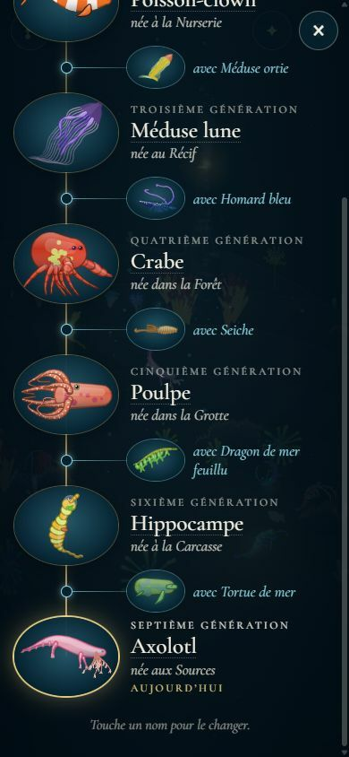
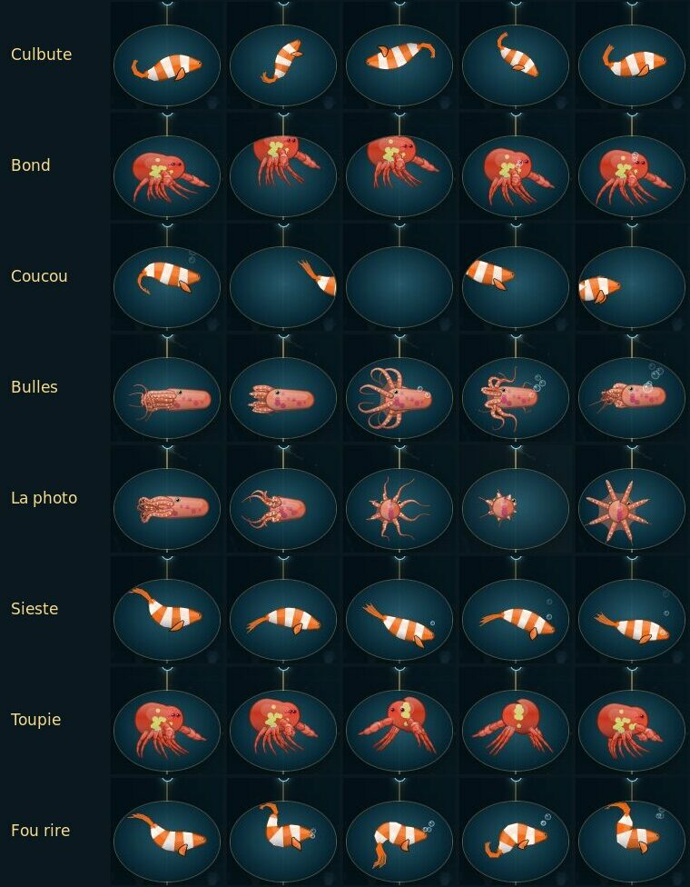
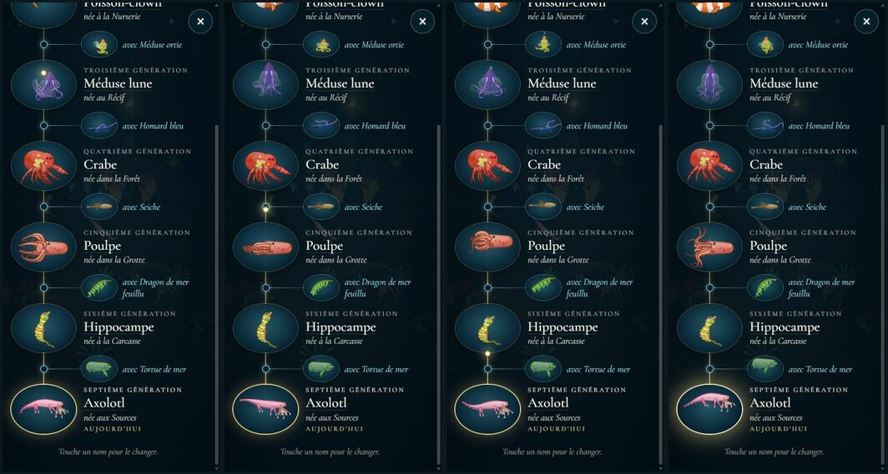
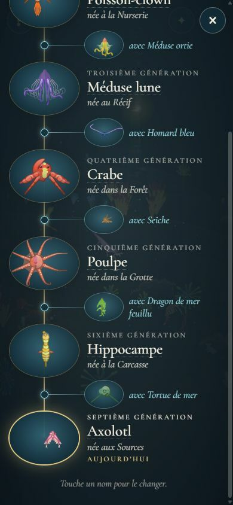

# L'arbre des créatures : les portraits vivants

## Livré

Les portraits de l'arbre de la lignée ne sont plus des images figées : chaque génération et chaque partenaire nage sur place dans son médaillon, avec le moteur du jeu (`Creature3`, `draw3`), et fait de temps en temps un tour doux et un peu drôle, que les animaux ne font jamais dans la mer (`vie.ts`).

- **Les tours** (`src/monde/arbre-tours.ts`, pur, 13 tests dans `arbre-tours.test.ts`) : chaque tour est une pose sur son propre temps (0 à 1), qui part du repos et y revient. Une pose dit à quelle allure l'animal nage sur place, vers où il se tourne, où il est dans le médaillon (décalage, rotation, écrasement et étirement façon dessin animé) et à quel tempo bat son corps. Les tours peuvent aussi lâcher des bulles par la bouche.
  - **Culbute** : un looping lent, le nez en l'air d'abord ; le dessin rapetisse juste assez pour rester dans le médaillon (`rollFit`).
  - **Bond** : se tasse, s'étire en sautant, s'écrase en retombant, une bulle.
  - **Coucou** : sort d'un côté, revient par l'autre, s'arrête au bord, tourné vers nous, puis rentre.
  - **Bulles** : tourné vers nous, il souffle cinq bulles, la dernière plus grosse.
  - **Photo** : face à nous, un petit sursaut, et il repart.
  - **Sieste** : s'assoupit, tête penchée, respire lentement en lâchant de petites bulles, se réveille en sursaut.
  - **Toupie** : une pirouette sur place (une méduse se dandine).
  - **Fou rire** : quand on touche un portrait.
  - **Vague** : le petit bond quand passe la lumière du fil.

  

- **Les portraits** (`src/monde/arbre-vivant.ts`) :
  - Chacun fait un tour toutes les 5 à 12 s, deux à la fois au plus parmi ceux qu'on voit ; jamais deux fois le même de suite. Les méduses ne font pas la photo.
  - Le portrait suit le milieu des nœuds de l'animal (sa silhouette bouge avec chaque tentacule ; le milieu de ses nœuds, non). Il tourne autour de sa tête : une pirouette ou une photo sans ce suivi le faisait glisser hors du cadre.
  - Les marcheurs marchent sur place : leurs pattes se croient au sol (`gap = 0`), et leur tête est tenue à sa hauteur, comme le fait le fond. Avec `stand()`, leur queue touchait le fond, qui les relançait en l'air : un homard ou un axolotl finissait debout.
- **À l'ouverture**, une lumière descend le fil d'or, de la première larve à la génération jouée, et chaque médaillon fait un bond quand elle passe (un partenaire quand elle passe son nœud). En bas, l'anneau d'« aujourd'hui » brille un moment.

  

- **La photo de famille** : 14 à 20 s après l'ouverture, puis toutes les 40 à 70 s, tous ceux qu'on voit se tournent vers nous en même temps (les méduses sautillent), avec un éclair très doux.

  

- **Toucher un portrait** le fait rire : il se tortille vite, tremble, saute un peu, lâche trois bulles.
- **Le branchement** (`arbre-ecran.ts`) : `portrait()` confie le canvas aux portraits vivants au lieu d'y dessiner un `snapshot3`. `build`, `open`, `close` et `rename` les arrêtent et les relancent. Avec « réduire les animations » du système, rien ne change : portraits figés, sans la lumière du fil.
- **Coût** (Chrome Windows, Intel Iris Xe, 390 × 844, 11 générations et 10 partenaires) :

  | Cas | Images/s | Temps des portraits |
  | --- | --- | --- |
  | Portraits figés (avant) | 57 | — |
  | Portraits vivants, premier essai (canvas sur la carte graphique) | 22 à 35 | 3 ms |
  | Portraits vivants, canvas dessinés par le processeur | 57 | 3 ms pour 12 portraits |
  | Processeur ralenti ×4 (l'émulation d'un téléphone moyen ; le jeu y tourne à 12–18 images/s) | 28 à 33 | 11 à 13 ms, dont 6 de dessin |

  - **Sur la carte graphique**, une douzaine de petits canvas redessinés à chaque image faisaient tomber l'arbre à 30 images/s. Le temps de JavaScript, lui, ne bougeait pas.
  - **Dessinés par le processeur** (`willReadFrequently`), ils ne coûtent plus rien de visible.
  - **Un budget de 6 ms par image** : tous les portraits visibles bougent à chaque image, mais seuls ceux qui tiennent dans le budget sont redessinés, à tour de rôle. Sur ordinateur, tous ; sur un appareil lent, quelques-uns.
  - **Seuls les médaillons à l'écran** (et 80 px autour) sont simulés. Une créature est faite la première fois que son médaillon se montre (1 à 10 ms), puis gardée d'une ouverture à l'autre.
- **Une correction dans le moteur** (`src/engine/render.ts`, `minWidth`) : la largeur minimale d'un trait lisait l'échelle du canvas dans `m.a`. Dans un dessin tourné d'un quart de tour, `m.a` vaut 0 : les filaments devenaient des traits de 110 px, et une méduse en pleine culbute une grosse tache violette. L'échelle est maintenant `hypot(m.a, m.b)`, identique sans rotation : rien ne change dans le jeu ni dans l'Atelier, qui ne tournent jamais le canvas d'un animal.
- **Pour les tests** :
  - `monde.arbre.vivants.play(i, 'culbute')` (i : le rang du médaillon, partenaires compris, dans l'ordre de l'arbre) ;
  - `monde.arbre.vivants.stats` (`live`, `made`, `played`, `ms`).
- **La doc** : `docs/mecaniques.md`, « L'arbre de la lignée », « Les portraits vivants ».
- **Vérifié dans le Chrome Windows** : 7 générations et 6 partenaires (poisson, méduse, crabe, poulpe, hippocampe, axolotl ; crevette, homard, seiche, dragon de mer, tortue), puis 11 générations.
  - Chaque tour, image par image, sur six espèces.
  - La lumière du fil, la photo venue d'elle-même (à 16,6 s), un vrai clic qui fait rire.
  - « Réduire les animations » (portraits figés).

## Choix retenus

Aucune question posée sur le tableau de bord : tous les choix sont `auto`.

| Question | Choix retenu | Pourquoi |
| --- | --- | --- |
| Comment animer un portrait ? | Le moteur du jeu, simulé en direct dans chaque médaillon | Le corps ondule, traîne et se retourne en vrai volume. C'est le même animal que dans la mer, sans rien précalculer. Ça coûte 0,1 à 0,3 ms par portrait. |
| Quelles animations ? | Des tours de médaillon (culbute, bond, coucou, bulles, photo, sieste, toupie), le fou rire au toucher, la lumière du fil et la photo de famille | Le chantier demande « pas très communes par rapport au jeu, plus rigolotes, assez douces ». Aucun ne reprend les gestes de `vie.ts`, et tous restent lents et petits. |
| Quand ? | Chacun toutes les 5 à 12 s, deux à la fois au plus ; la lumière à l'ouverture ; la photo de famille de temps en temps | Il y a toujours quelque chose à voir, sans agitation ; l'arbre reste calme. |
| La culbute et l'écrasement | Une transformation du dessin (rotation, échelle), le corps continuant de nager | Ça marche pour toutes les nages. Le moteur ne sait pas faire un tour complet (méduse droite, tangage borné). |
| Les marcheurs | Pattes « au sol », tête tenue à sa hauteur, marche sur place | Stable pour toutes les espèces ; `stand()` faisait rebondir les longues queues. |
| Le rendu | Canvas dessinés par le processeur, budget de 6 ms par image | Sur la carte graphique, l'arbre passait de 57 à 30 images/s. |
| Les partenaires | Animés aussi, avec les mêmes tours | Ils font partie de la famille, et ça coûte peu. |
| Réduire les animations | Portraits figés, comme avant | Le choix du joueur ; le générique fait de même. |
| La ligne d'épaisseur du moteur | Corrigée dans `render.ts` | Une ligne, sans effet sans rotation ; c'est le bon calcul. |

## Options non retenues

- **Comment animer**
  - Faire bouger en CSS les portraits figés (sauts, rotations du médaillon) : presque gratuit, mais le corps ne bouge pas, et ce sont des images qui sautillent, pas des animaux.
  - Des planches d'images précalculées : du temps à l'ouverture, beaucoup de mémoire, et des boucles qui se répètent.
  - Un seul canvas WebGL superposé à l'arbre (`paint-gl`) : le moins cher à l'image, mais compliqué à caler avec le défilement et la découpe en ellipse.
- **Quelles animations**
  - Reprendre les gestes de la mer (fouiller, se reposer, venir voir) : cohérent, mais « commun », justement.
  - Des animations tirées de l'histoire de chaque génération (la note apprise chantée en anneau, le chapitre de naissance) : plus de sens, plus de travail.
  - Des jeux entre voisins (le parent qui regarde son enfant en dessous, les partenaires qui se saluent) : charmant, mais il faut coordonner deux médaillons. Une bonne suite.
  - Des clins d'œil, des yeux qui suivent le doigt : le moteur n'a pas de paupières.
- **Quand**
  - Tous en permanence : trop agité, pas « doux ».
  - Seulement au toucher : on ne le découvre pas.
  - Un seul à la fois : trop calme pour un long arbre.
- **La culbute**
  - Piloter le cap du moteur, le nez sur un cercle : plus organique, mais la méduse et les marcheurs ne savent pas tourner en entier.
  - Une rotation dans un projecteur 3D : l'ordre des parties suit le z du monde, il serait faux.
- **Les marcheurs** : un vrai fond avec `stand()` ; instable pour les longues queues (homard, axolotl).
- **Le rendu**
  - Garder les canvas sur la carte graphique : 30 images/s.
  - Un seul canvas pour tous.
  - Baisser la résolution : moins net, et le coût par canvas reste.
- **Les partenaires figés** : moins vivant, à peine moins cher.
- **Réduire les animations** : garder la nage sans les tours (le corps bouge quand même : contraire au réglage), ou ne rien changer (contraire au réglage).
- **La ligne d'épaisseur** : faire tourner le dessin dans un projecteur (`Projector`) plutôt que dans le canvas, pour ne pas toucher `render.ts` ; plus de code pour le même résultat.

## Reste à faire / limites

- **Pas encore vu sur un vrai téléphone** : seulement sous l'émulation d'un processeur ralenti ×4, où l'arbre reste plus fluide que le jeu. Sur un appareil lent, chaque portrait bouge moins finement (il est redessiné une image sur deux à quatre).
- **Faire une créature** coûte 1 à 10 ms (40 ms ralenti ×4) : un petit à-coup quand beaucoup de médaillons apparaissent d'un coup (défilement rapide d'un très long arbre).
- **Pas de son** : un « plop » de bulle et un petit rire iraient bien, avec le chantier des bruitages.
- **Le générique et l'image souvenir** gardent des portraits figés. Le générique pourrait faire jouer un tour à chaque génération quand elle passe au milieu de l'écran.
- **Le fou rire** ne se déclenche qu'au doigt ou à la souris, pas au clavier : les portraits ne sont pas des boutons.
- **Les très longs animaux** (anguille, siphonophore) rapetissent beaucoup pendant la culbute, pour rester dans le médaillon.
- **La lumière du fil** ne passe qu'à l'ouverture, pas après un renommage.

## Risques de fusion

- **`src/monde/arbre-ecran.ts`**, une douzaine de lignes :
  - l'import ;
  - `vivants` dans l'interface `Arbre` ;
  - le début de `portrait()` ;
  - `vivants.stop()` et `start()` dans `build`, `open`, `close` et `rename`.
- **`src/monde/arbre.css`** : de nouvelles règles (`.ar-spark`, `.ar-flash`, curseur des portraits) et la ligne de « réduire les animations » complétée.
- **`src/engine/render.ts`** : une ligne (`minWidth`), partagée par le jeu et l'Atelier, sans effet hors rotation.
- **`docs/mecaniques.md`** : des puces ajoutées dans « L'arbre de la lignée ».
- **Nouveaux fichiers** : `arbre-tours.ts`, `arbre-tours.test.ts`, `arbre-vivant.ts`.
- **`main.ts`** n'est pas touché.
