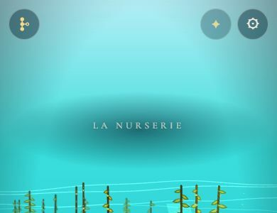
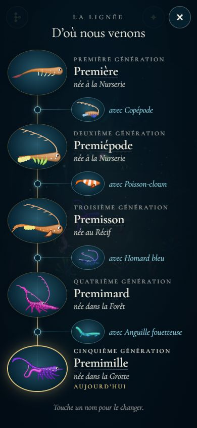
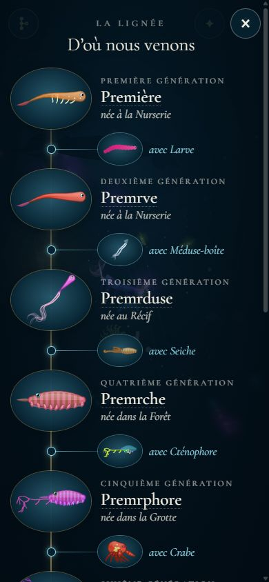
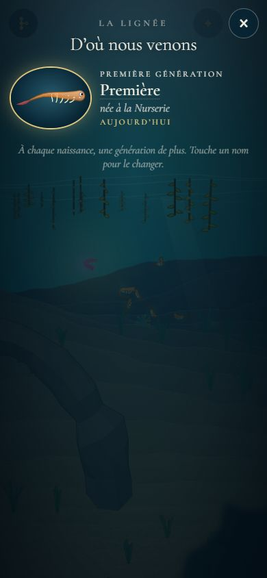
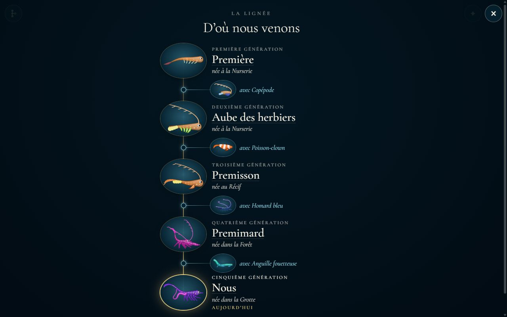
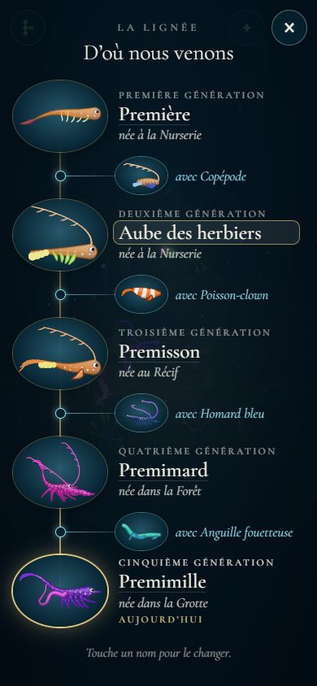

# L'arbre de la lignée

## Livré

Un écran accessible à tout moment qui montre toutes les générations : portrait (`snapshot3`), nom qu'on peut changer, lieu de naissance, et partenaire de chaque naissance.

- **Le bouton** : rond, en haut à gauche, avec une petite icône de lignée (à droite de ✎ quand l'Atelier est débloqué). Il s'efface pendant l'adieu et la portée, comme ⚙ et ✎.

  

- **L'écran** (`src/monde/arbre-ecran.ts`, `arbre.css`) : les générations descendent comme la lignée, le long d'un fil d'or.
  - En haut, la première larve ; en bas, la génération jouée, cerclée d'or et marquée « aujourd'hui ».
  - Pour chacune : son portrait dans un médaillon, « Troisième génération » (en toutes lettres, pas de chiffres), son nom et « née au Récif » (« à la », « au », « aux », « dans la » selon le chapitre).
  - Entre un parent et son enfant, une branche bleu pâle mène au partenaire : son petit portrait et « avec Poisson-clown ». Ce sont les couleurs de la portée (or : la lignée ; bleu : le partenaire).
  - L'écran s'ouvre centré sur la génération jouée et défile vers le haut pour remonter le temps. Le jeu est en pause pendant ce temps et les textes du chapitre attendent. On ferme par ×, Échap ou en touchant à côté.

  
  
  
  

- **Nommer** : on touche un nom, qui devient un champ ; on écrit (24 lettres au plus), puis Entrée (ou toucher ailleurs) garde le nom, et Échap l'annule. Le nom est celui de la créature (le `name` de sa définition), sauvé tout de suite. Pour la génération jouée, la créature en jeu est renommée elle aussi : ses enfants auront un nom qui commence comme le sien (`childNames`).

  

- **La sauvegarde** (`partie.ts`, `partie-jeu.ts`) :
  - chaque ancêtre garde maintenant le partenaire de sa naissance, `partner: { id, name }`, l'id du bestiaire servant au portrait ;
  - `renameAncestor` et `partie.rename(i, nom)` renomment un ancêtre ;
  - le lieu de naissance n'est pas stocké : c'est le chapitre où la génération d'avant a donné naissance (la Nurserie pour la première) ;
  - les anciennes sauvegardes se lisent toujours, sans partenaire.
- **Le partenaire à la naissance** : la portée passe le partenaire à son choix (`onChoose(enfant, tous, partenaire)`), et `farewell(enfant, partenaire)` le range avec le parent (`mateFor`, qui retrouve l'espèce par son nom). Le partenaire d'essai de `monde.farewell()` est gardé lui aussi.
- **La logique pure** (`src/monde/arbre.ts`, testée dans `arbre.test.ts`, plus 2 tests dans `partie.test.ts`) : `generations`, `generationLabel`, `bornWords`, `cleanName`, `mateFor` et `mateOf`.
- **Les portraits** : environ 10 ms chacun sur ordinateur. Ils sont dessinés après l'ouverture, les plus récents d'abord, par tranches de 12 ms par image. Ils sont gardés en mémoire pour la session : une réouverture les recopie (8 ms pour 19 portraits).
- **Pour les tests** : `monde.arbre.open()`, `close()`, `rename(rang, nom)`, `isOpen`. La doc de conception est à jour (`docs/mecaniques.md`, « L'arbre de la lignée » et « Durée et sauvegarde »).
- **Vérifié dans le Chrome Windows** (390 × 844 et 1280 × 800), par le vrai chemin de la portée puis de l'adieu :
  - 4 puis 9 naissances ;
  - un renommage au clavier, puis via l'API ;
  - Échap ;
  - un rechargement de la page, après lequel noms et partenaires sont revenus.

## Choix retenus

Aucune question posée à l'utilisateur : tous les choix ci-dessous sont `auto`. Un seul retour a été envoyé, sur le test des Nouveautés (voir les limites).

| Question | Choix retenu | Pourquoi |
| --- | --- | --- |
| Où vit le nom d'une génération ? | Le nom de la créature (`spec.name`) | Un seul nom, déjà montré par la portée (« Continuer avec … ») et l'Atelier ; il suit la créature dans la lignée sans champ de plus ; les enfants héritent du début du nom qu'on a choisi. |
| Le lieu de naissance | Déduit de la lignée | Chaque ancêtre garde déjà le chapitre où il a donné naissance, qui est celui où l'enfant est né : rien à ajouter à la sauvegarde. |
| Que garder du partenaire ? | `{ id, name }` | Léger (pas de définition entière), assez pour son nom et son portrait (`SPECIES[id]()`) ; les partenaires sont des espèces du bestiaire. |
| La forme de l'arbre | Une colonne qui descend, les partenaires en branches | Suit la descente du jeu, se lit sur téléphone en largeur étroite, tient avec 10 générations en défilant. |
| Où ouvrir l'arbre ? | Bouton rond en haut à gauche | Coin libre pendant l'histoire (✎ y est caché), même style que ⚙ et ✦, « à tout moment ». |
| Le jeu pendant l'arbre | En pause | Comme l'Atelier : pas de parade qui commence ni de texte qui passe dessous, et les portraits se dessinent sans la scène. |
| À l'ouverture | Centré sur la génération jouée | Celle qu'on nomme le plus souvent ; on remonte le temps en faisant défiler. |
| Nommer | Champ dans l'écran, là où est le nom | Direct au doigt ; `prompt()` est bloqué dans certains cadres (lien Artifact). |
| Les mots | « Troisième génération », « née au Récif » | Pas de chiffres (mécaniques) ; « née » s'accorde avec « génération », sans deviner le genre de la créature. |
| Les portraits | Dessinés à l'ouverture, gardés en mémoire | 10 ms chacun : pas besoin de les stocker (IndexedDB), et ils suivent le moteur. |

## Options non retenues

- **Le nom de la génération**
  - Un nom de génération à part, en plus de celui de la créature : l'espèce garde son nom, mais deux noms pour la même créature, où choisir lequel montrer, et un champ de plus dans la sauvegarde.
  - Nommer seulement la génération jouée : plus simple, mais le chantier demande « chaque génération ».
- **Le lieu de naissance**
  - Un champ `born` stocké à chaque naissance : robuste si un jour une naissance n'a pas lieu dans le chapitre de la sauvegarde, mais c'est une donnée en double.
- **Le partenaire**
  - Sa définition entière (JSON) : fidèle à l'individu exact, mais 2 à 5 Ko par naissance pour un animal qui est de toute façon une espèce du bestiaire.
  - Le nom seul : plus léger, mais le portrait dépendrait d'une recherche par nom au moment de l'affichage.
- **La forme**
  - Un arbre horizontal (générations de gauche à droite) : plus proche d'un arbre généalogique classique, mais il défile de côté sur téléphone.
  - Les plus récents en haut : on voit d'abord le présent, mais on perd l'image de la descente.
  - Une grille de cartes : compacte, mais le lien parent–partenaire–enfant ne se voit plus.
- **Le bouton**
  - Dans le panneau ⚙ : aucun bouton de plus, mais pas « à tout moment » pour un joueur, et le panneau est surtout pour les tests.
  - En bas de l'écran : ce sera la place du bouton du chant (étape 5).
  - Toucher sa créature : invisible, rien ne l'apprend au joueur.
- **Le jeu pendant l'arbre**
  - La mer continue derrière : plus vivant, mais la parade ou un texte peuvent partir dessous, et une portée ouverte pendant ce temps couvrirait l'arbre.
- **Nommer**
  - `prompt()` : une ligne de code, mais laid et bloqué dans le lien Artifact.
  - Une fenêtre à part : plus de place, un geste de plus.
- **Les mots**
  - Des numéros (« Génération 3 ») : plus court, mais c'est contraire à « pas de chiffres ».
  - « naît à » : neutre, mais étrange au présent pour les ancêtres.
- **Les portraits**
  - Les garder en images (IndexedDB) : ouverture instantanée même après un rechargement, mais plus de code et un stockage de plus, pour 10 ms par portrait.

## Reste à faire / limites

- **L'image souvenir** (générique, étape 5) : dessiner cet arbre dans un canvas pour le télécharger. `generations`, `generationLabel` et `bornWords` resservent tels quels, et les portraits aussi.
- Les naissances sauvées avant ce chantier n'ont pas de partenaire : leur branche manque, le fil continue.
- Le portrait du partenaire est celui de son espèce, pas de l'individu exact. C'est la même chose aujourd'hui, puisque les animaux du monde sont les espèces du bestiaire.
- Le nom ne se voit pas dans la mer (les parents laissés derrière n'ont pas d'étiquette), seulement dans l'arbre, la portée et l'Atelier.
- **Pas testé sur un vrai téléphone** : seulement Chrome à la taille d'un téléphone, à la souris et au clavier. Le champ du nom autorise la sélection (`user-select: text`) pour iOS.
- **Déjà là avant ce chantier, sans lien avec l'arbre** :
  - `make check` a un échec depuis la release 0.4.0 : `src/monde/nouveautes/plugin.test.ts` attend les images des 8 entrées de la 0.2, que le budget de 400 Ko n'embarque plus après la 0.3 et la 0.4. C'est le même échec sur `backlog`. Un retour a été envoyé sur le tableau de bord avec deux sorties : tester la version la plus récente, ou monter le budget.
  - Des avertissements WebGL `bindTexture: attempt to use a deleted object` arrivent dans la console du Chrome Windows même quand on ne touche à rien.

## Risques de fusion

- **`src/monde/main.ts`** : des branchements courts.
  - 2 imports ;
  - la portée passe son partenaire (`createPortee((sp, _, mate) => farewell(sp, mate))`) ;
  - une ligne `initArbre(…)` après `applyAtelierAccess` ;
  - `farewell(child?, mate?)`, avec `mate ??=` pour l'enfant d'essai et `partie.born(sp, BIOMES[bi].id, mate && mateFor(mate))` ;
  - `arbre` dans `api` ;
  - `arbre.isOpen` dans `narrator.quiet`.

  **Risque principal** : `ancetres-restent-monde` touchera sans doute `farewell` et `partie.born` (les parents gardés dans le monde). Il faut garder les deux côtés : le 3ᵉ argument de `born` est le partenaire.
- **`src/monde/partie.ts`** : ajouts seulement.
  - `Mate` et `Ancestor.partner?` ;
  - un argument optionnel `partner` à `birth` ;
  - `renameAncestor`.

  Si un voisin ajoute d'autres champs à `Ancestor` (une position), les deux s'ajoutent.
- **`src/monde/partie-jeu.ts`** : `born(sp, chapter, partner?)` et une méthode `rename`.
- **`src/monde/portee-ecran.ts`** : `onChoose` reçoit le partenaire en 3ᵉ argument (le type et 3 lignes).
- **`docs/mecaniques.md`** : la section « L'arbre de la lignée » s'allonge, et deux phrases de « Durée et sauvegarde » (la lignée avec son partenaire) changent.
- **Nouveaux fichiers**, sans conflit possible : `src/monde/arbre.ts`, `arbre.test.ts`, `arbre-ecran.ts`, `arbre.css`.
