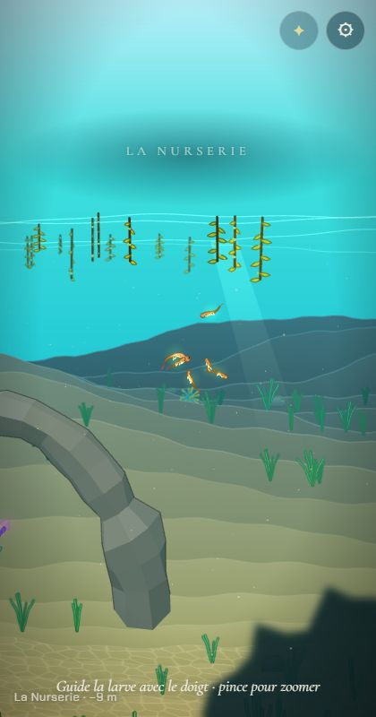
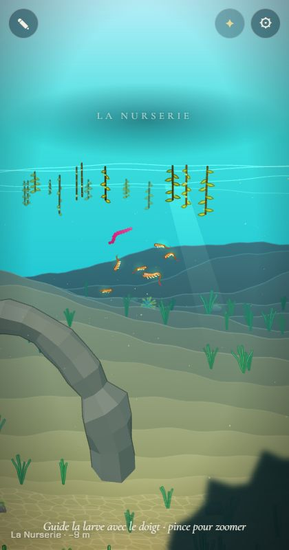

# L'Atelier hors de l'histoire

## Livré

- Le bouton ✎ de l'Atelier est caché pendant l'histoire (`hidden` dès le HTML, donc sans clignotement au chargement).
- Il revient quand la « Balade libre » est débloquée : clé `lignee.balade` = `1` dans le `localStorage`. `unlockBalade()` (`src/monde/atelier-access.ts`) est le point d'appel pour la fin de l'histoire ; dans la console : `monde.unlockBalade()` (montre le bouton tout de suite et pour les visites suivantes).
- Pour le développement : `?atelier` dans l'adresse montre toujours le bouton (ex. http://localhost:5180/?atelier), tout comme `?dev`, l'interrupteur des outils de test venu de `monde-fini-debut` (il montre aussi le voyage du panneau ⚙).
- Tests : `src/monde/atelier-access.test.ts` (histoire, `?atelier`, déblocage, stockage bloqué, bouton).
- Doc : `docs/mecaniques.md` (paragraphe de l'Atelier).
- Vérifié dans le Chrome Windows (420×800) : `display` du bouton `none` sans paramètre, `grid` avec `?atelier` et après `monde.unlockBalade()`.

Pendant l'histoire (pas de ✎) :

Avec `?atelier` ou `?dev` (capture avec `?dev`) :

## Choix retenus

Aucune question posée sur le tableau de bord (choix non structurants, tranchés seul).

| Question | Choix retenu | Pourquoi |
| --- | --- | --- |
| Comment cacher le bouton | Attribut `hidden` dans `index.html`, levé par le module (+ `#atBtn[hidden] { display: none }`, le CSS imposait `display: grid`) | Pas de flash du bouton au chargement ; le bouton, son style et son écouteur restent en place pour la Balade |
| Paramètre de développement | `?atelier` (présence seule, toute valeur), et aussi `?dev` | Court, dans l'esprit de `?bench` et `?lod=0` ; `?dev` (arrivé avec `monde-fini-debut`) ouvre tous les outils de test d'un coup |
| Mémoire du déblocage | Clé à part `lignee.balade` = `1` | Indépendante de la future sauvegarde de partie ; la Balade libre reste ouverte même après une nouvelle partie |
| Comment débloquer aujourd'hui | `unlockBalade()` exporté + `monde.unlockBalade()` dans l'API de test | La fin de l'histoire n'existe pas encore ; le chantier « La Balade libre » n'aura qu'un appel à faire |

## Options non retenues

- **Cacher le bouton** : le retirer du HTML et le créer en JS seulement dans la Balade (plus propre à terme, mais déplace du code de `main.ts` et gêne les voisins) ; le cacher en CSS par une classe sur `body` (un état de plus à suivre) ; le laisser visible mais inactif (contredit la décision).
- **Paramètre** : `?dev` seul, sans `?atelier` (un seul interrupteur, mais casse les liens `?atelier` déjà donnés) ; `?atelier=1` strict (plus verbeux, aucun gain) ; raccourci clavier caché (inaccessible sur téléphone, invisible pour les autres agents) ; bouton dans le panneau ⚙ (le panneau lui-même doit devenir un outil de test caché, voir `monde-fini-debut`).
- **Mémoire** : un champ dans la sauvegarde de partie de `sauvegarde-automatique` (un seul objet, mais une fusion de format avec un chantier parallèle, et « nouvelle partie » effacerait le déblocage) ; ne rien mémoriser et débloquer à chaque fin (la Balade serait perdue au rechargement).
- **Ouvrir aussi l'Atelier directement** avec `?atelier=open` : pratique pour les captures de l'Atelier, pas demandé ; une ligne à ajouter si besoin.

## Reste à faire / limites

- Le chantier « La Balade libre » (ou la fin de l'histoire) doit appeler `unlockBalade()` puis `applyAtelierAccess(document.getElementById('atBtn'))`, ou recharger la page.
- Une créature inventée dans l'Atelier avant cette version reste la créature jouée (reprise de `lignee.player` dans la partie sauvée `lignee.partie`) ; « Recommencer » (panneau ⚙) repart de l'ancêtre. « Recommencer » efface la partie mais pas `lignee.balade` : la Balade libre, une fois gagnée, reste ouverte.
- L'indice de départ (`#hint`) ne parlait déjà pas de l'Atelier ; rien à changer.

## Risques de fusion

- `src/monde/main.ts` : un import, 2 lignes autour du clic de `atBtn` (`const atBtn`, `applyAtelierAccess(atBtn)`), une entrée `unlockBalade` à la fin de l'objet `api`.
- `index.html` : attribut `hidden` sur `#atBtn`.
- `src/monde/style.css` : une règle `#atBtn[hidden]`.
- `docs/mecaniques.md` : le paragraphe de l'Atelier.

## Fusion avec `backlog` (après les chantiers voisins)

- `git merge backlog` sans conflit. Relus : `main.ts` (le clic de ✎ appelle maintenant `becomes`, qui sauve via `partie.becomes`, « la créature changée dans l'Atelier », sans toucher à la lignée), `partie.ts` (`clearPartie` n'efface pas `lignee.balade`), `limites.ts` (`?dev`).
- Ajout : `?dev` montre aussi l'Atelier (`atelierAvailable`, test et `docs/mecaniques.md`).
