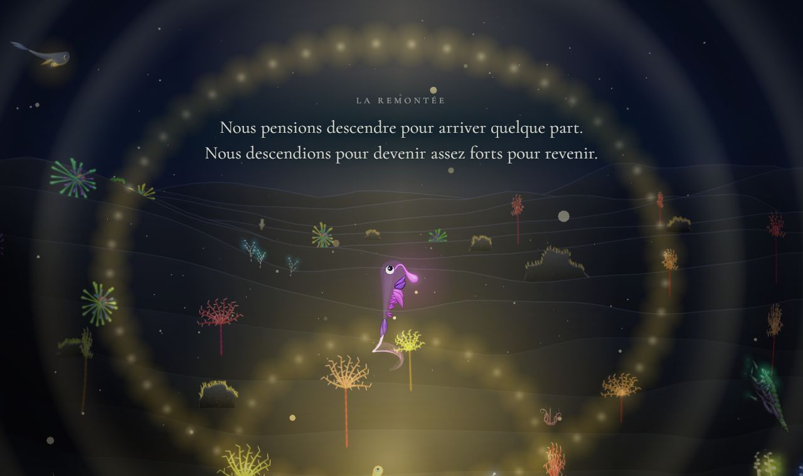
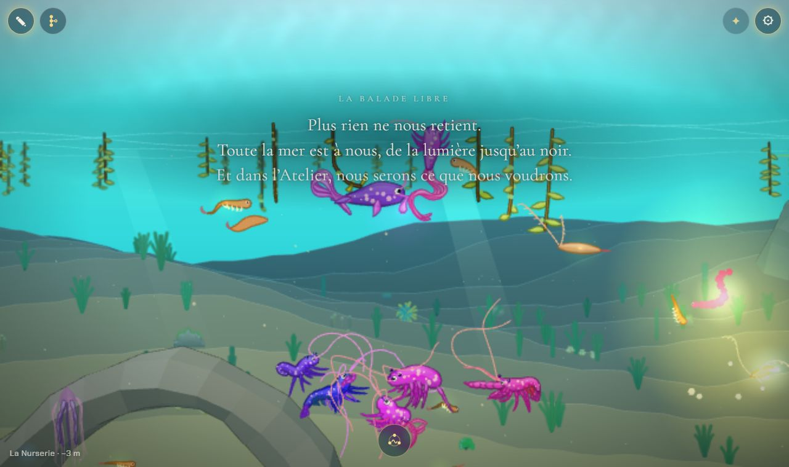
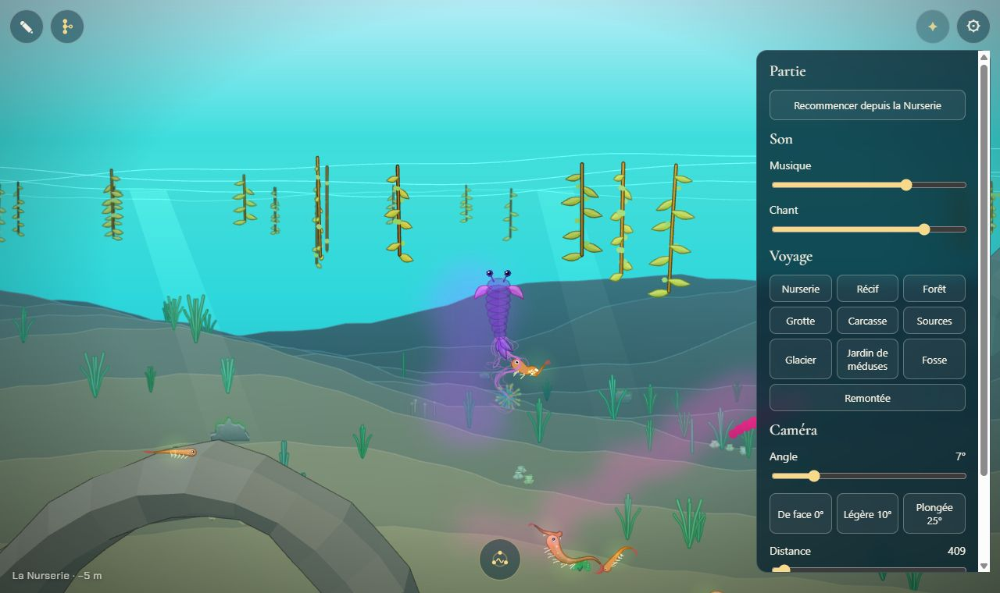
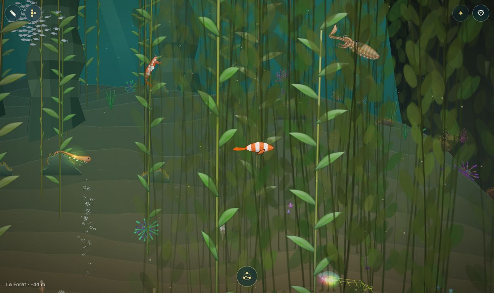
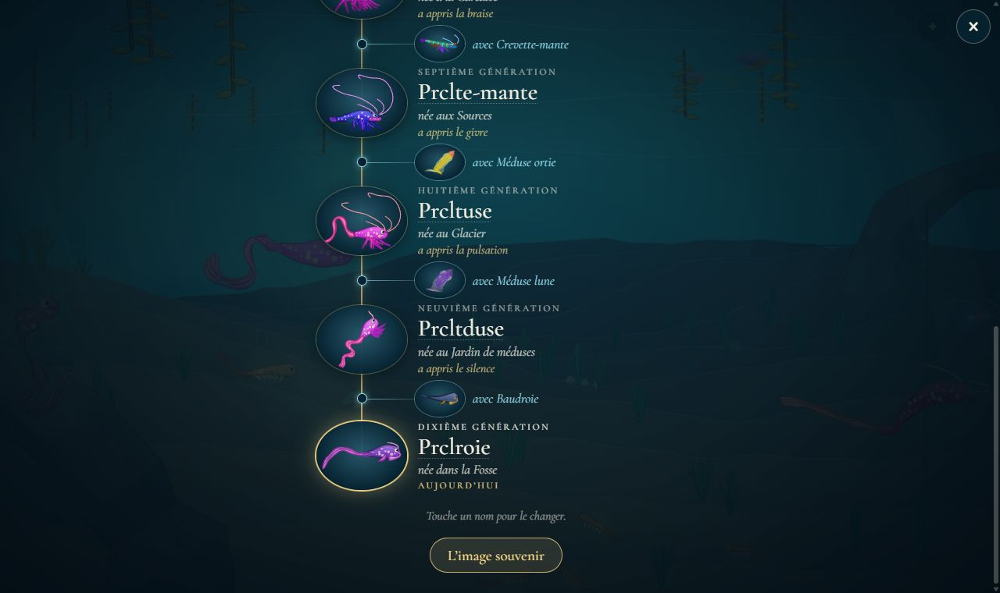

# La Balade libre

## Livré

Une fois l'histoire finie, la partie entre dans la **Balade libre**, pour de bon : la même mer, ouverte partout, sans histoire, avec l'Atelier. Avant ce chantier, la fin ne changeait presque rien : seul le bouton ✎ revenait. Au rechargement, la page renvoyait au puits de lumière et **la Remontée recommençait**, avec tous ses textes (la sauvegarde gardait la Remontée comme chapitre). Et une créature faite dans l'Atelier restait arrêtée par les obstacles.

**L'ouverture** : à la fin de la Remontée, la Balade s'ouvre. Une fois le générique et l'image souvenir fermés, la lignée le dit une seule fois, sous le nom « La Balade libre ». Le texte est dans `docs/chapitres.md`, à la fin de la Remontée (« La Balade libre (proposition) : »), lu comme les autres textes. Les boutons ✎ et ⚙ luisent doucement un moment.

**Le monde entier ouvert** : tous les obstacles sont franchis, quel que soit le corps. On les sent encore un peu, comme avec le bon trait, et le noir de la Grotte et de la Fosse ne se referme plus. Le **voyage** du panneau ⚙ (les dix chapitres), réservé jusqu'ici à `?dev`, s'ouvre aux joueurs ; voyager referme le panneau.

**Sans histoire** : la lignée se tait (`narrator.silent`).
- Plus d'ouverture de chapitre : seul le nom passe.
- Plus de mots devant les obstacles, ni d'indices, ni de fil de lumière (tout est ouvert).
- Plus de mots d'adieu, de traces, de rencontre avec le cousin, ni des lumières de la Fosse.
- La Remontée ne revient plus (`remontee.over()`). Le puits et sa lumière restent ; y entrer ne fait rien.

**Ce qui reste** :
- la parade, la ponte et la portée, sans traits en or ni ligne sur l'obstacle ;
- le chant, avec toutes les notes de la lignée ;
- les ancêtres à leur place, les traces, la vie des animaux.

La larve née à la surface nous suit, même après un rechargement.

**La lignée de l'histoire ne change plus** : la Balade a sa propre créature dans la sauvegarde.
- Ce que donne l'Atelier, ou l'enfant choisi dans une portée, est joué sans entrer dans la lignée. L'adieu se fait sans mots ; le parent reste là le temps de la visite.
- L'arbre et l'image souvenir restent ceux de l'histoire, avec la créature finale en dernière génération. La renommer dans l'arbre renomme bien celle de l'histoire, pas celle de la Balade.

**La sauvegarde** (`balade` dans `lignee.partie`, `{ chapter, creature }`) :
- La page reprend au milieu du chapitre où l'on nageait, en avant comme en arrière. La première fois, c'est sous la surface de la Nurserie, là où la lignée est sortie.
- Le chapitre de l'histoire ne bouge plus : c'est lui qui donne les notes apprises.
- **Une partie finie avant ce chantier** est reprise dans la Balade au lieu de rejouer la Remontée. Le navigateur n'en gardait que `lignee.balade = 1`, et la partie s'arrêtait à la Remontée.
- « Recommencer depuis la Nurserie » commence une nouvelle histoire, sans Atelier jusqu'à sa propre fin.

**Fichiers clés** :
- `src/monde/balade.ts` : les règles, pures, testées dans `balade.test.ts`.
- `src/monde/balade-jeu.ts` et `balade.css` : le jeu.
- `src/monde/partie.ts` (le champ `balade`, relu par `parsePartie`) et `partie-jeu.ts` (`becomes`, `born` et `reach` passent par la Balade ; `last`, `open`, `free`, `resume`).
- `narration.ts` (`silent`, et `say(…, loud)`), `textes.ts` (le texte « La Balade libre »), `remontee-jeu.ts` (`over()`), `atelier-access.ts` (le bouton suit la Balade, plus le drapeau du navigateur).
- Les docs : `docs/mecaniques.md` (nouvelle section « La Balade libre », l'Atelier, la sauvegarde) et `docs/chapitres.md` (la fin de la Remontée, sa sauvegarde, les bornes du monde, les textes).

**Comment le voir** : finir la Remontée (`monde.remontee.start()` au fond, puis `monde.remontee.jump(1500)` pendant la remontée). Ou, dans la console, `monde.unlockBalade()` ouvre la Balade tout de suite. Pour les tests : `monde.balade.on`, `monde.partie.saved.balade`.

## Choix retenus

Aucune question posée sur le tableau de bord : la consigne demandait de trancher chaque question avec l'option recommandée.

| Question | Choix retenu | Pourquoi |
| --- | --- | --- |
| Comment entre-t-on dans la Balade ? | Tout seul à la fin de la Remontée, pour de bon dans cette partie | Pas d'écran ni de menu en plus ; c'est la suite naturelle de la dernière image, et c'est ce que disaient les docs |
| Où la garder ? | Dans la sauvegarde de la partie (`balade`), le drapeau `lignee.balade` ne servant plus qu'à reprendre les parties finies avant | « Recommencer » efface la partie et donc la Balade : une nouvelle histoire est sans Atelier, comme le veut la vision |
| Que veut dire « sans histoire » ? | La lignée se tait entièrement (ouvertures, obstacles, indices, adieux, traces, cousin, Fosse) ; seuls les noms des chapitres passent | Une règle simple à dire et à tenir ; les noms servent de repère |
| « Le monde entier ouvert » | Tous les obstacles ouverts quel que soit le corps, et le voyage du panneau ⚙ ouvert aux joueurs | Une créature de l'Atelier n'a pas forcément le trait ; traverser le monde à la nage prend plus de trois minutes |
| La créature de l'Atelier et les enfants de la Balade | Une créature propre à la Balade ; la lignée et la créature finale restent celles de l'histoire | L'arbre et l'image souvenir sont le souvenir de la partie : un essai dans l'Atelier ne doit pas l'effacer |
| Les parades et les portées pendant la Balade | Gardées, sans traits en or ; l'enfant choisi est joué, l'adieu se fait sans mots, rien n'entre dans la lignée | Mélanger sa créature avec les espèces de la mer est le meilleur jouet de la Balade |
| Où reprend la page ? | Au milieu du chapitre où l'on nageait, sous la Nurserie la première fois | Comme l'histoire (au début du chapitre sauvé), mais en avant comme en arrière |
| Le puits de lumière | Il reste, sans relancer la scène | Le plus beau lieu du fond ; rejouer la Remontée n'aurait pas de sens hors de l'histoire |
| Le signe que la Balade est ouverte | Un texte dans la voix du « nous », une fois, après le générique, et ✎ et ⚙ qui luisent | Sans lui, on ne sait pas que la mer est ouverte ni où voyager |
| La larve de la dernière image | Elle nous suit aussi après un rechargement | La continuité avec la fin (« la nouvelle larve nous suit ») |

## Options non retenues

- **Entrer dans la Balade**
  - Un choix à l'ouverture de la page (« Balade libre » ou « Nouvelle histoire ») : plus clair pour qui veut rejouer, mais un écran de menu de plus dans un jeu qui n'en a pas.
  - Un bouton dans le panneau ⚙ : discret et peu coûteux, mais on peut ne jamais le trouver.
- **Garder la Balade**
  - Garder le seul drapeau du navigateur, sans l'effacer : aucun changement de format, mais l'Atelier resterait dans une nouvelle histoire, contre la vision.
  - Effacer le drapeau en recommençant : simple, mais une partie finie puis recommencée avant ce chantier se serait retrouvée en Balade au milieu de l'histoire.
- **« Sans histoire »**
  - Garder les mots de mémoire (traces, cousin) et taire seulement ceux qui font avancer (ouvertures, obstacles, indices, adieux) : un retour sur la lignée qui a du charme, mais une règle moins nette. Une ligne à changer dans `balade-jeu.ts` / `main.ts` si on le préfère.
  - Tout garder sauf les ouvertures : coût nul, mais la Balade ressemblerait à l'histoire.
- **Ouvrir le monde**
  - Une vraie carte du monde à toucher (les dix chapitres en couleurs, à côté de ✎) : plus belle et plus facile à trouver que le panneau ⚙, une centaine de lignes et de la place à l'écran. C'est la suite naturelle (voir Reste à faire).
  - Pas de voyage, tout à la nage : aucun code, mais trois à quatre minutes d'un bout à l'autre.
  - Un courant qui porte plus vite dans la Balade : agréable, mais il touche le moteur de nage.
  - Ne même plus sentir les obstacles : plus « ouvert », mais ils font partie de la mer.
- **La créature et la lignée**
  - L'Atelier remplace la créature finale de l'histoire, comme avant : rien à faire, mais l'arbre et l'image souvenir perdraient la vraie créature finale au premier essai.
  - Les enfants de la Balade entrent dans la lignée : l'arbre continuerait de grandir après la fin, mais la lignée de l'histoire ne serait plus close, et l'image souvenir changerait.
  - Montrer la créature jouée dans l'arbre, comme une génération « hors lignée » : juste, mais l'arbre est en cours de reprise par l'agent `arbre-creature`.
- **Les parades** : les couper dans la Balade (plus simple, mais on perd le meilleur jouet) ; ou faire de tout animal un partenaire possible (un vrai mode bac à sable, qui touche la parade et les partenaires).
- **La reprise** : toujours sous la Nurserie (simple, mais on perd l'endroit où l'on était) ; ou la position exacte (il faudrait sauver la position régulièrement).
- **Le puits** : relancer la Remontée à volonté (un spectacle à revoir, mais sans ancêtres qui viennent de loin ni sens hors de l'histoire) ; l'éteindre (on perd un beau lieu).
- **Le signe d'ouverture** : rien (les joueurs ne sauraient pas) ; une bulle d'aide sur ✎ (une interface de plus, hors du ton du jeu).
- **La larve** : ne la garder que dans la visite de la fin (plus simple, mais on la perd au rechargement).

## Reste à faire / limites

- Le texte de la Balade est une **proposition**, comme les autres textes du jeu ; à relire dans `docs/chapitres.md`.
- Le sous-titre de la portée dit encore « Choisis l'enfant qui continuera la descente », même dans la Balade (`portee-ecran.ts`, laissé tel quel pour ne pas toucher l'écran de la portée).
- Dans l'arbre, la créature finale de l'histoire reste marquée « aujourd'hui », même quand on joue une autre créature dans la Balade.
- Le voyage reste dans le panneau ⚙ : une carte à toucher serait plus facile à trouver.
- Pendant la Balade, les ancêtres sont dans leurs chapitres, comme pendant l'histoire. Ceux de la dernière image restent sous la surface le temps de la visite seulement.
- Le chemin de reprise d'une partie finie avant ce chantier se fonde sur `lignee.balade = 1` et le chapitre « remontee » de la sauvegarde. Une partie finie puis recommencée avant ce chantier reste une histoire : l'Atelier, visible chez ce joueur jusqu'ici, s'y cache de nouveau.

## Risques de fusion

- `src/monde/main.ts` : des branchements courts.
  - `initBalade(partie)` après la partie, et `balade.attach(…)` juste avant la reprise.
  - `keysOf`, et l'accès à l'Atelier.
  - `arbre` et `generique` reçoivent `balade.lignee` et `balade.live`.
  - `arbre.more`, l'API (`balade`, `unlockBalade`), le clic du voyage, et `partie.resume`.
- `src/monde/narration.ts` : `silent` dans l'interface et dans `tell`/`say` (un paramètre `loud`).
- `src/monde/partie.ts` et `partie-jeu.ts` : le champ `balade` et les appels qui passent par lui.
- `src/monde/remontee-jeu.ts` : une méthode `over()`.
- `src/monde/textes.ts` : le genre de texte `balade`.
- `src/monde/atelier-access.ts` : la signature de `applyAtelierAccess(bouton, libre, adresse)` change, test mis à jour.
- `docs/mecaniques.md`, `docs/chapitres.md` : une nouvelle section et des retouches de phrases.
- L'agent `arbre-creature` travaille sur l'arbre. Je n'ai pas touché `arbre-ecran.ts` : `main.ts` lui passe un `partie` adapté (`balade.lignee`), dont `becomes` renomme la créature finale de l'histoire pendant la Balade. Si sa fusion change ce que l'arbre attend de `partie`, il faudra garder cet adaptateur.
