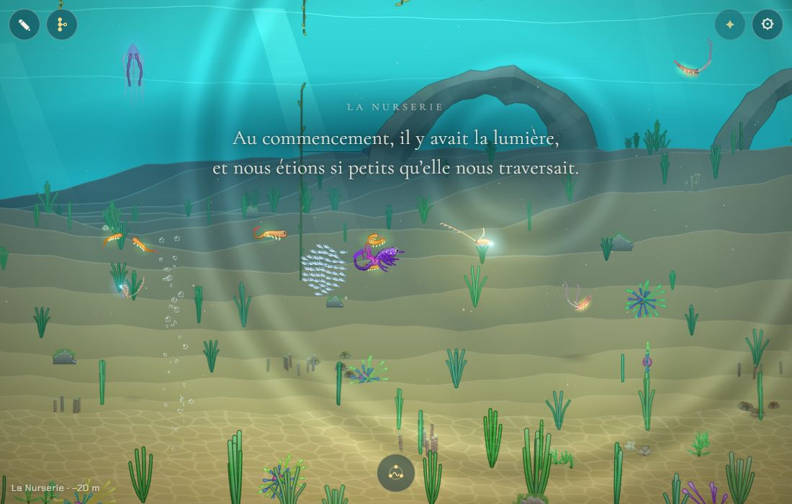
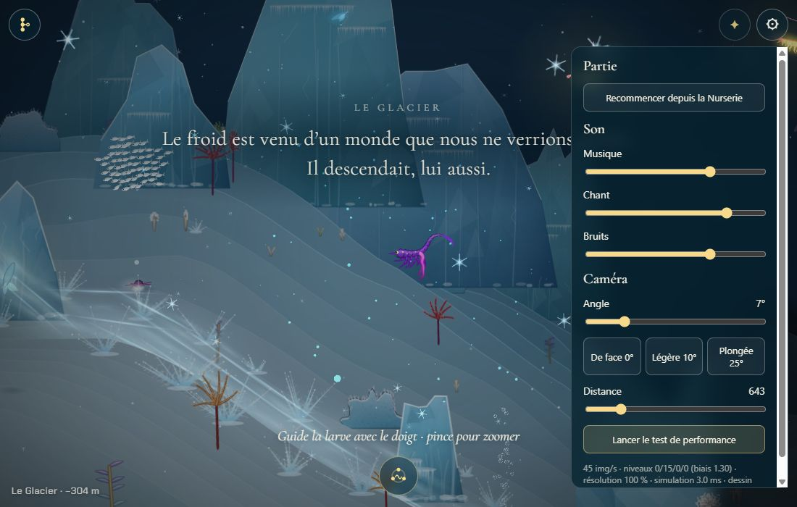
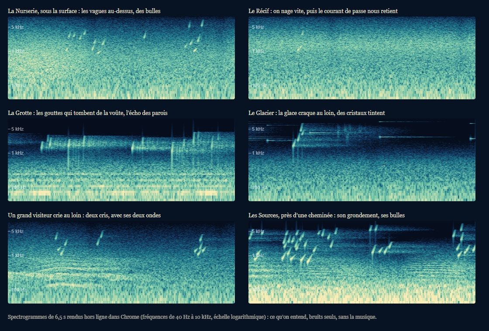

# Les bruitages

## Livré

Les bruits de la mer, faits dans le code (bruit filtré et oscillateurs, Web Audio API, sans fichier audio ni dépendance), dans un troisième bus à côté de la musique et du chant.

- **`src/monde/bruits.ts`** (pur, testé par `bruits.test.ts`, 24 tests) : ce que sonne chaque chapitre (`BEDS`, mêlés aux frontières comme la lumière, `bedAt`), les fonds (vagues selon la profondeur, souffle de l'eau selon la vitesse, courant d'un obstacle qui pousse, grondement des cheminées, voûte de la Grotte), d'où vient un bruit (`heard` : côté, distance, assourdissement), et la forme de chaque bruit : bulles (hauteur de Minnaert selon la taille, qui monte en partant), gouttes de la Grotte, craquements de la glace (claquements qui se pressent, grincement, coup sourd), cristaux (sur la pentatonique du chant), cris de baleine (gémissement, montée, plainte, grondement ; plus grave pour un plus grand animal), boucles de bruit blanc, rose et brun sans clic.
- **`src/monde/bruits-son.ts`** : le moteur. Deux boucles de bruit nourrissent les fonds ; une horloge de 0,1 s les règle et programme les bruits çà et là ; ceux qu'une page retenue a manqués sont laissés. Sous la voûte de la Grotte seulement : quatre bandes étroites (les notes graves des galeries) et trois échos croisés des parois, par où passe tout ce qu'on entend, notre nage comprise. `renderBruits` les rend hors ligne (rapport, mesures).
- **`src/monde/son.ts`** : le bus des bruits (`fx`, son volume, sa part de réverbération réglée lieu par lieu) et une entrée `far` qui ne va qu'à la réverbération (les bruits lointains : baleines, glace). Le volume « Bruits » (`lignee.son`, 0,7 par défaut).
- **`src/monde/ondes-jeu.ts`** : `onCall`, quand un grand visiteur crie (ses deux ondes partent) ; le bouton de test « Un cri au loin » (`?dev`) crie aussi.
- **`main.ts`** : un bloc de 9 lignes (`initBruits`, `ondes.onCall`) et `monde.bruits` dans l'API de test (`beds`, `played`, `voices`, `play(kind)`, `cry(...)`).
- **Réglages** : « Bruits » sous Musique et Chant ; coupés, leurs fonds sont libérés (rien n'est calculé).
- **Doc** : `docs/direction-artistique.md`, « Le son » (les bruits, un tableau par chapitre, les niveaux, le coût).

Pour l'entendre : `make up`, toucher l'écran, puis voyager (⚙ avec `?dev`) : la Nurserie près de la surface (vagues, bulles des suintements), le Récif en nageant vite vers la passe, la Grotte (gouttes, résonance), les Sources près d'une cheminée, le Glacier (craquements toutes les 25 s environ, cristaux).

**Mesures** (Chrome Windows, rendu hors ligne, 44,1 kHz) :

| | Moyenne (RMS) | Crête |
| --- | --- | --- |
| Musique, Nurserie / Fosse | −25,6 / −31,1 dB | −12,6 / −20,5 dB |
| Fond des bruits, Nurserie, Récif, Grotte, Sources | −34 à −35,5 dB | −18 à −22 dB |
| Fond, Glacier / Fosse | −39,3 / −42,2 dB | −26 / −30 dB |
| Une salve de bulles, une goutte, un craquement, des cristaux | | −30, −27,6, −27,9, −32 dB |
| Une baleine au loin / le cri d'un visiteur | | −24,5 / −19,2 dB |
| Souffle de l'eau, nage ordinaire / rapide / courant de la passe | −41 / −38 / −38 dB | |
| Vagues sous la surface (y = 20) | −37 dB | −17 dB |

Coût : les bruits ajoutent 15 % (la Fosse) à 30 % (la Nurserie) au coût de la musique ; musique et bruits ensemble se calculent 17 fois plus vite que le temps réel sur un ordinateur. Un filtre dont la fréquence glisse (`setTargetAtTime`) coûtait 3 à 5 fois un filtre immobile, pour toujours : les filtres des bruits sautent d'une valeur à l'autre ; les échos de la Grotte et ses bandes ne sont branchés que sous la voûte.

## Choix retenus

Aucune question posée sur le tableau de bord : tous les choix sont `auto` (option recommandée).

| Question | Choix retenu | Pourquoi |
| --- | --- | --- |
| Le volume des bruits | un troisième réglage, « Bruits » | chacun peut garder la musique sans les bruits, ou l'inverse ; coupés, ils ne coûtent rien |
| De quoi sont faits les bruits | bruit filtré et oscillateurs, dans le code | `decisions.md` (pas de fichier audio, pas de bibliothèque) ; léger |
| Les « cris lointains de baleine » | les grands visiteurs qu'on voit crier crient avec leurs ondes, et des baleines qu'on ne voit pas chantent de loin en loin | les ondes muettes attendaient leur son ; aucune baleine vivante n'est un visiteur, les baleines invisibles donnent les « cris de baleine » du chantier |
| La voix des visiteurs | une voix de baleine pour tous, plus grave pour un plus grand | simple, cohérent ; « un cri » dans la doc |
| La résonance de la Grotte | bandes étroites (notes des galeries) et trois échos croisés, sous la voûte seulement | distincte de la réverbération commune, peu coûteuse ; « ta propre nage se met à résonner » (chapitres.md) |
| Le courant | le souffle de l'eau selon la vitesse mesurée au déplacement, et les obstacles qui poussent | entend aussi la Remontée qui emporte la lignée (elle déplace le corps sans vitesse propre) |
| Les cristaux du Glacier | sur la pentatonique du chant, tout en haut | ne détonnent jamais sur la musique |
| Sous le chant | les bruits ne reculent pas ; pendant l'adieu, ils baissent de moitié | le chant passe déjà au-dessus ; l'adieu laisse les mots |
| Le visible | rien de nouveau à l'écran | le chantier est sonore ; les bulles et les ondes qu'on entend se voient déjà |

## Options non retenues

- **Volume** : suivre le réglage Musique (aucun réglage de plus, mais on ne peut pas couper l'un sans l'autre) ; un seul volume général (plus simple, perd le réglage fin déjà là).
- **Synthèse** : des sons enregistrés (plus réalistes, mais interdits par les décisions et lourds dans la page unique) ; un `AudioWorklet` (contrôle total, mais plus de code, et un fil de calcul de plus sur téléphone).
- **Baleines** : seulement les visiteurs qu'on voit (fidèle à l'image, mais rare : 30 à 75 s, et rien dans les chapitres sans visiteur) ; seulement des baleines invisibles (laisse les ondes muettes).
- **Voix des visiteurs** : une voix par espèce (la raie, la tortue, le calmar…) : plus riche, beaucoup de réglages ; à faire si on veut les reconnaître à l'oreille.
- **Grotte** : une seconde réverbération par convolution, longue (la plus belle, mais elle doublerait le plus gros coût du son) ; seulement monter la part de réverbération commune (gratuit, mais pas de « résonance » propre).
- **Courant** : la vitesse propre du corps (rate la Remontée) ; un bruit par coup de nage, selon la locomotion (jets, cloche) : plus vivant, mais lie le son au moteur des créatures.
- **Cristaux** : à des hauteurs au hasard (plus « glace », risque de détonner) ; aucun cristal (le chantier ne demande que les craquements).
- **Sous le chant** : faire reculer les bruits sous chaque note (plus de place pour le chant, mais la mer « respire » au rythme du chant).
- **Visible** : des gouttes qu'on voit tomber dans la Grotte, une fissure qui luit sur la glace au moment du craquement (bien, mais un autre chantier, et du dessin).

## Reste à faire / limites

- **Écouté par mesure, pas à l'oreille** : niveaux mesurés hors ligne et équilibrés avec la musique ; à écouter sur un vrai téléphone. Son haut-parleur rend mal le grave : le fond de l'eau et les cris (100 à 600 Hz) y seront plus discrets qu'au casque.
- **Coût sur téléphone** non mesuré (seulement sur ordinateur, hors ligne) ; le chantier « La performance sur téléphone » peut le reprendre (couper les bruits libère leurs fonds).
- Le moment fort du Glacier (l'aiguille de glace qui fige tout) n'est pas dans le jeu : quand il y sera, un craquement proche lui irait bien (`monde.bruits.play('cracks')`).
- Pas de bruit propre à la vie des animaux (le sable qui bouffe quand ils fouillent, un coup de museau) ni aux coups de nage : à ajouter dans `bruits.ts` si on le veut.
- Une ressource absente (404) est passée une fois dans la console en voyageant d'un chapitre à l'autre, et pas aux essais suivants ; les bruits ne chargent aucun fichier.

## Risques de fusion

- `src/monde/main.ts` : 2 imports, un bloc de 9 lignes après `initOndes` (« the noises of the sea »), `bruits` dans `api` (à côté de `musique`).
- `src/monde/son.ts` : `Volumes` gagne `bruits` ; `Graph` gagne `fx`, `far`, `fxSend`, `fxVol`, `farVol` ; `setVolume` règle une liste de gains. Un autre chantier qui touche le son (la performance sur téléphone) peut s'y croiser.
- `src/monde/ondes-jeu.ts` : `callers`, `onCall`, une ligne dans le bouton « Un cri au loin ».
- `index.html` : un réglage sous « Chant » ; `src/monde/son-reglages.ts` : une ligne ; `src/monde/son.test.ts` : deux attentes.
- `docs/direction-artistique.md` : section « Le son » (bruits, niveaux, réglages, coût) et la phrase des cris au loin.
