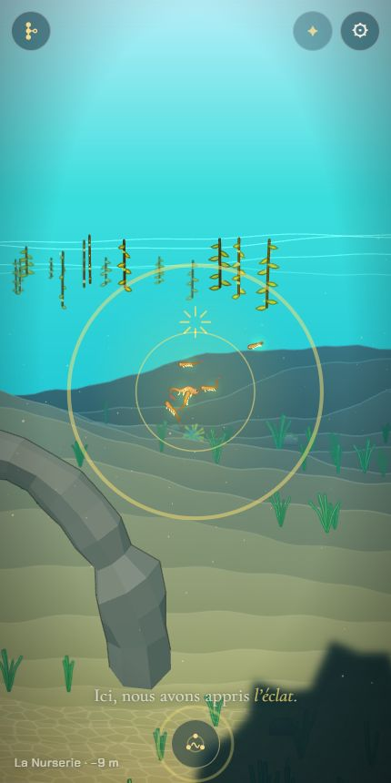
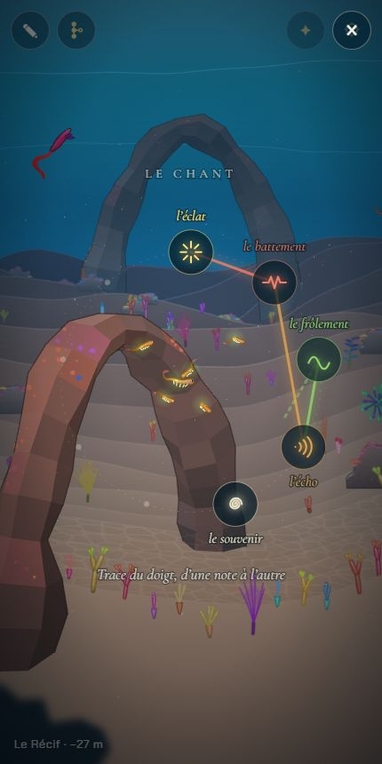
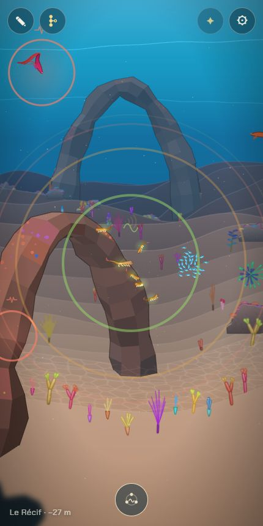
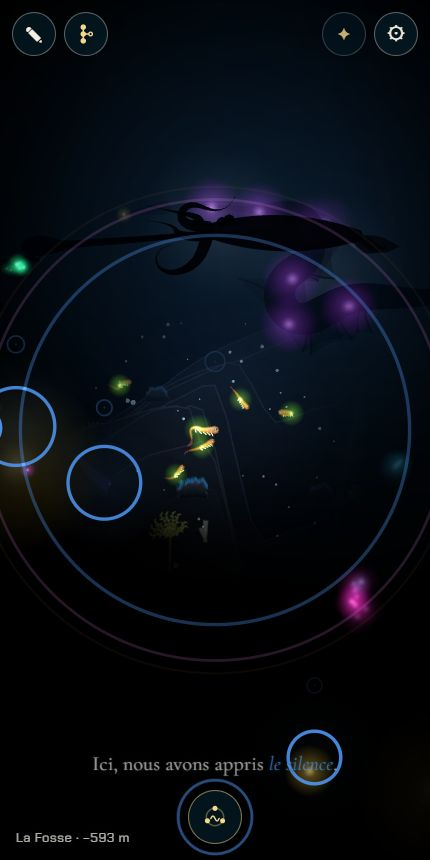
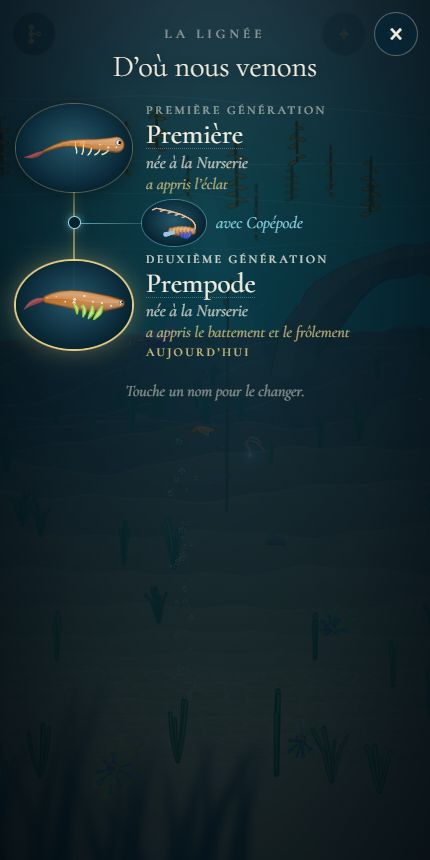

# Le chant : une note par chapitre

## Livré

- **Neuf notes**, une par chapitre de la descente (`src/monde/chant.ts`, pur et testé) : nom lu dans `docs/chapitres.md` (la ligne « Note : « … » » de chaque chapitre), couleur de la palette du chapitre, forme (un tracé SVG : éclat, battement, vague, ondes, spirale, flamme, cristal, ombrelle, cercle vide), hauteur sur la gamme pentatonique de ré, du la5 (l'éclat) au ré4 (le silence) : tout chant sonne juste, et le chant complet descend comme la lignée.
- **Apprendre** : la note d'un chapitre s'apprend la première fois qu'on y entre, par la génération qu'on joue, une fois son ouverture dite et la mer tranquille 1,4 s (ni texte, ni adieu, ni panneau). Elle fleurit autour du nageur, sonne, le bouton s'allume de sa couleur et la lignée dit « Ici, nous avons appris l'éclat. » (`chant-jeu.ts`, `chant-cercle.ts`).
  
- **La sauvegarde** : champ optionnel `notes: { chapter, gen }[]` de la partie (`partie.ts`, `learnNote`, `partie-jeu.ts`, `learn`). Une partie sauvée avant le chant connaît les notes des chapitres d'avant le sien (`learnedNotes`).
- **Le bouton et le cercle** (`chant-cercle.ts`, `chant.css`) : un bouton rond en bas au milieu, dès la première note, caché pendant l'adieu, la portée et l'arbre. Il ouvre un cercle autour du nageur : les notes apprises avec leur nom, les autres en simples points. On trace du doigt d'une note à l'autre ; chaque note sonne au passage, chaque trait prend la couleur de la note où il va ; un doigt rapide ne saute pas de note (`spotsAlong`). Doigt levé : on chante. Un seul toucher sur une note la chante ; toucher à côté ferme. Clavier : 1 à 9, Entrée, Retour arrière, Échap. La parade ne commence pas et les textes attendent pendant qu'il est ouvert.
  
- **Les animaux qui répondent** (`answersTo`) : à moins de 760 px, un animal répond à la note de son chapitre, un animal qui brille (`glowOf` > 8 : lanterne, lueurs) répond à tout chant. Les huit plus proches, chacun une fois, quand la note les a atteints : cercle et halo de sa couleur, sa forme au-dessus de lui, son écho une octave plus haut, placé à gauche ou à droite ; puis il s'approche à 150 px du nageur et retourne à sa vie. Les sœurs de la première larve ne répondent pas (elles nagent avec nous, leurs halos cumulés faisaient une tache) ; les ancêtres laissés dans le monde répondent à la note de leur chapitre.
  
  
- **La voix** (`chant-son.ts`) : Web Audio seule, sans fichier ni bibliothèque. Un timbre par note (partiels, trémolo, vibrato, souffle de bruit filtré, écho, modulation de fréquence, filtre), une réverbération faite dans le code, un compresseur. Le contexte audio s'éveille au premier toucher ou à la première touche. Vérifié par un rendu hors ligne dans Chrome (`sound` avec un `OfflineAudioContext`) : les neuf notes sonnent, crête 0,13 à 0,26, de 2 à 4 s.
- **L'arbre de la lignée** dit ce que chaque génération a appris (« a appris le battement et le frôlement »), par une dépendance optionnelle `notes(rang)` d'`arbre-ecran.ts`.
  
- **Pour l'intégration et les tests** : `monde.chant` : `learned`, `learn(chapitre)`, `sing([...])`, `open()`, `close()`, `isOpen`, `answers`, et `onNote((chapitre, rang) => …)`, appelé à chaque note chantée dans le monde : c'est le branchement prévu avec « Les lumières qui répondent dans la Fosse » (`chant.onNote((c) => lumieres.hear(c))`, convenu avec cet agent).
- **Correctif en passant** (`narration.ts`) : au chargement d'une page lente, la première image et le minuteur de 400 ms de `main.ts` annonçaient tous deux le chapitre, et le second remplaçait l'ouverture de la Nurserie par son seul nom au bout d'une demi-seconde. Une ouverture en cours n'est plus coupée par le nom de son propre chapitre.
- Doc : `mecaniques.md` (« Le chant », dans le jeu), `direction-artistique.md` (les timbres), `chapitres.md` (les noms des notes sont lus là), `decisions.md` (question 3 : le jeu suit la proposition, qui reste à valider).
- Tests : `chant.test.ts` (notes lues dans le document, ordre et hauteurs, notes apprises et reprise d'une vieille partie, notes par génération, cercle, tracé, qui répond) et `partie.test.ts` (les notes gardées avec la partie).

## Choix retenus

Aucune question posée à l'utilisateur (consigne : trancher avec l'option recommandée) ; tout est `auto`.

| Question | Choix retenu | Pourquoi |
| --- | --- | --- |
| Nombre de notes (question 3) | 9, une par chapitre de descente | La proposition des décisions ; la Remontée joue le chant complet. |
| Quand une note s'apprend | À la première entrée dans le chapitre, après son ouverture, par la génération jouée | Le chant complet est toujours complet à la Fosse (la Nurserie et la Carcasse, souvent sans naissance, auraient manqué) ; un moment calme, jamais par-dessus un texte. |
| Où la garder | Dans la partie (`notes`, avec le rang de la génération) | Survit à la page, s'efface avec « Recommencer », et l'arbre peut dire qui a appris quoi. |
| Le geste | Un seul trait du doigt d'une note à l'autre, chanté au lever ; un toucher chante une note | Le « cercle de notes à tracer du doigt » du plan, lisible sur téléphone, sans échec possible. |
| Qui répond | Les animaux du chapitre à sa note, ceux qui brillent à tout chant ; les 8 plus proches | Chaque chapitre a une réponse à sa note ; la lumière répond à la lumière (et la Fosse répond). |
| Le passage ouvert | Celui de la Fosse seulement, laissé au chantier « Les lumières qui répondent » (branché sur `onNote`) | C'est le seul obstacle dont le chant est une clé ; l'agent voisin fait ce moment et l'ouvre, convenu avec lui. Ouvrir d'autres obstacles contournerait l'hérédité. |
| Le son | Web Audio, un timbre par note, gamme pentatonique descendante | Pas de dépendance (consigne) ; tout chant sonne juste. |
| Le dessin des lumières | Une toile 2D à part, au-dessus de la mer et de son noir, cachée quand rien ne brille | Rien à changer dans le rendu WebGL ; visible dans le noir de la Fosse ; ne coûte rien au repos. |

## Options non retenues

- **Nombre de notes** : 8 comme le plan v1 (retirer deux chapitres du chant, incohérent avec 9 chapitres de descente) ; 10 avec la Remontée (elle n'apprend rien, elle chante tout) ; une par génération (un nombre variable selon les naissances, le chant complet n'aurait plus de sens).
- **Quand une note s'apprend** : à la naissance, déduite de la lignée (ce que proposait d'abord l'agent des lumières ; manque la Nurserie et la Carcasse sans naissance) ; en rejoignant un animal « chanteur » du chapitre (plus de jeu, mais une note ratée rendrait le chant incomplet, et il faut placer ces animaux) ; après un temps passé dans le chapitre (arbitraire, invisible) ; pendant la parade (lie deux mécaniques, pas de note aux chapitres sans parade).
- **Où la garder** : une clé à part du stockage (`lignee.chant` : ne s'efface pas avec « Recommencer ») ; rien du tout, déduite du chapitre atteint (plus de génération qui l'a apprise, et un voyage de test donnerait tout).
- **Le geste** : des boutons de notes à toucher un par un puis « Chanter » (plus simple, moins « tracé du doigt ») ; un motif à reproduire pour chaque note (un apprentissage, mais un échec possible) ; le cercle en panneau plein écran qui arrête la mer (on ne verrait pas les réponses).
- **Qui répond** : seulement les partenaires (aide à les trouver, mais peu d'animaux) ; tous les animaux proches à tout chant (plus de sens à la note du chapitre) ; seulement ceux qui brillent (rien ne répondrait près de la surface).
- **Le passage** : le chant comme troisième clé de chaque obstacle, ou de la Grotte (« une lueur pour voir le passage ») : joli mais l'hérédité deviendrait inutile ; des passages secondaires gardés par des animaux dans chaque chapitre (de la mise en scène et des collisions à faire chapitre par chapitre, un chantier à lui seul) ; les animaux qui répondent qui escortent à travers l'obstacle (même défaut que la troisième clé).
- **Le son** : Tone.js (dépendance interdite, et du poids) ; des fichiers audio (la page est un seul fichier) ; une seule sinusoïde par note (plus léger mais les notes se confondent).
- **Le dessin** : dans le rendu WebGL de la scène (plus intégré, mais touche `main.ts` et `scene-gl.ts` bien plus) ; en DOM/SVG par-dessus la mer (projection à refaire à chaque image par élément).

## Reste à faire / limites

- **Le passage de la Fosse** et son moment fort : chantier « Les lumières qui répondent », à brancher par `chant.onNote((c) => lumieres.hear(c))` et `chant.learned` à la fusion. Le chant complet de la Remontée peut appeler `monde.chant.sing(monde.chant.learned)`.
- **Appeler les ancêtres** (plan v1) : les ancêtres laissés dans le monde répondent déjà à la note de leur chapitre, mais ne viennent pas (leur nage est celle d'`adieu`/`ancetres`) ; les faire venir au chant est à décider.
- **Le son** : pas de réglage de volume ni de bouton muet (étape 6, « réglages ») ; le timbre des notes est un premier jet que « La musique générée » pourra reprendre. Pas écouté sur téléphone : vérifié par rendu hors ligne et par les journaux.
- Un voyage de test (`?dev`, `gotoBiome`) donne les notes des chapitres d'avant l'arrivée (règle de reprise d'une vieille partie).
- Les noms des notes de la Grotte et du Glacier restent des propositions dans `chapitres.md`.
- Le test `nouveautes/plugin.test.ts` (« embeds the published versions only… ») échoue déjà sur `backlog` (budget d'images des versions publiées, voir le rapport de `titre-chantier`) ; sans lien avec ce chantier.

## Risques de fusion

- `src/monde/main.ts` (+17 / −4) : deux imports, `notes:` dans l'appel d'`initArbre`, `chant.isOpen` dans le `quiet` de la parade et dans `narrator.quiet`, un bloc `initChant` après le bloc de la cousine (`initRivale`), `chant.step(…)` à la fin d'`update` (après `traces.step`), `chant.draw()` après `render()` dans `frame`, `chant` dans l'`api`. L'agent des lumières ajoutera une ligne `chant.onNote(…)`.
- `src/monde/partie.ts` / `partie-jeu.ts` : type `LearnedNote`, champ optionnel `notes`, gardé par `parsePartie`, fonction `learnNote`, méthode `learn`.
- `src/monde/arbre-ecran.ts` : une dépendance optionnelle `notes(rang)` et une ligne sous « née au … » (le style `.ar-notes` est dans `chant.css`).
- `src/monde/narration.ts` : une variable `opening` et deux lignes (l'ouverture en cours n'est pas coupée).
- Docs : `mecaniques.md`, `direction-artistique.md`, `chapitres.md`, `decisions.md` (lignes ajoutées).
