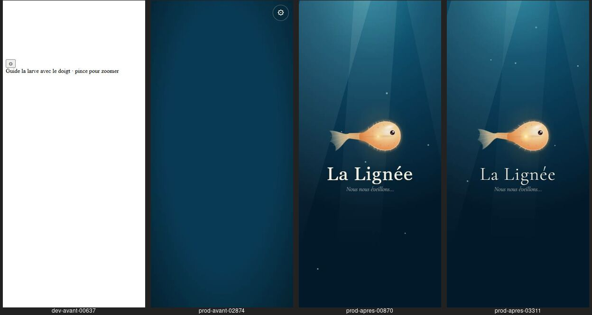
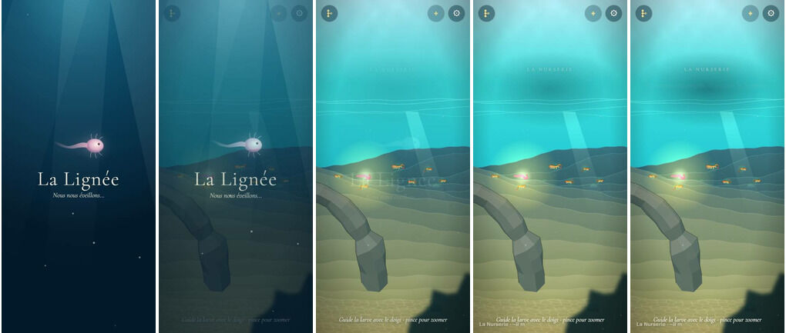

# Chargement

## Livré

Un écran de chargement qui s'affiche avec les premiers kilo-octets de la page, s'anime pendant le chargement et s'efface en fondu quand le monde a dessiné ses premières images.

- `index.html` : l'écran `#chargement` (HTML et CSS en ligne, aucun script) en tête du `<body>`, avec son style dans le `<head>`. Il montre la mer bleu profond, trois rayons, six grains de neige marine qui remontent, la larve (SVG), « La Lignée » et « Nous nous éveillons… ». Les animations n'utilisent que `transform` et `opacity`, que le navigateur anime même quand le script du jeu occupe le processeur. Avec `prefers-reduced-motion`, l'écran reste immobile.
- `index.html` : la feuille Google Fonts ne bloque plus le premier affichage (`media="print" onload`). Avant, sans réseau, elle retenait la page jusqu'à l'échec de la requête.
- `src/monde/chargement.ts` : `leverRideau()`, appelé à la fin de `main.ts` juste après le premier `requestAnimationFrame(frame)`. Il attend 3 images, puis lance le fondu (0,9 s, avec un léger zoom) et retire l'élément.
- `src/monde/chargement-page.ts` : le plugin de build `chargementPlugin()`, branché dans `vite.config.ts` après `viteSingleFile()`. Vite et le plugin singlefile mettaient dans le `<head>` le script du jeu (590 Ko) et le JSON des Nouveautés (550 Ko) : le `<body>` ne commençait qu'à 1,19 Mo. `scriptsLast()` les déplace, dans le même ordre, à la fin du `<body>`, et le `<body>` commence maintenant à 44 Ko. Rien ne change à l'exécution : le script du jeu est un module, lancé une fois la page lue où qu'il soit placé.
- Tests : `src/monde/chargement-page.test.ts` vérifie le déplacement, le cas d'un `</head>` dans le code, une page sans script, l'écran avant tout script dans `index.html` et l'absence de feuille de style bloquante.
- Doc : `docs/direction-artistique.md`, section « L'écran de chargement ».

**Mesures** : Chrome Windows avec GPU, fenêtre de 390 × 844, réseau simulé à 4 Mbit/s et 100 ms, processeur 4 fois plus lent, screencast CDP.

| | Premier affichage | Ce qu'on voit jusqu'au jeu | Jeu prêt |
|---|---|---|---|
| Page publiée, avant | 2,9 s | page blanche, puis un bleu vide avec ⚙ | ~9,3 s |
| Page publiée, après | 0,7 s | l'écran animé | ~9,4 s |
| Serveur de dev, avant | 0,4 s | page blanche avec ⚙ et la phrase d'aide en HTML brut | ~16 s |
| Serveur de dev, après | 0,8 s | l'écran animé | ~16 à 19 s (bruit de mesure : le screencast capture 20 fois plus d'images) |

Pour le voir : `make up`, puis ouvrir le client. Ou, dans les DevTools, réseau « Fast 4G » et CPU ×4, puis recharger.

## Choix retenus

| Question | Choix retenu | Pourquoi |
|---|---|---|
| Où dessiner l'écran | En HTML/CSS dans `index.html`, sans script | C'est le seul moyen d'afficher quelque chose avant que le script de 590 Ko soit arrivé et compilé (`auto`) |
| Comment le faire arriver vite dans la page publiée | Déplacer les scripts du `<head>` à la fin du `<body>` au build (plugin `generateBundle` après singlefile) | Le gain est de 2,2 s au premier affichage, sans rien changer au jeu (`auto`) |
| Quand le retirer | Après 3 images du monde, puis un fondu de 0,9 s | On découvre une mer déjà en mouvement, et les premières images, les plus lentes, restent cachées (`auto`) |
| Ce qu'il montre | La larve, le titre et une phrase dans la voix du « nous », des rayons et de la neige marine | C'est cohérent avec l'ouverture de la Nurserie, et léger : un SVG et quelques `div` (`auto`) |
| Les polices | Non bloquantes (`media="print" onload`) | Sans réseau, la page restait blanche. Le prix : le titre passe de Georgia à Cormorant après ~1 s, le temps que la police arrive (`auto`) |

Aucune question n'a été posée à l'utilisateur.

## Options non retenues

- **Où dessiner l'écran**
  - En canvas, depuis un petit script séparé : plus libre, mais il faut encore un script à charger, et il ne s'anime plus quand le processeur est occupé.
  - Dans `main.ts`, au début : il ne s'afficherait qu'après le téléchargement et la compilation de tout le module, donc trop tard.
- **Faire arriver l'écran plus vite**
  - Découper le jeu en morceaux chargés à la demande : c'est contraire au fichier HTML unique (singlefile) et c'est un gros chantier.
  - Charger le JSON des Nouveautés à part ou plus tard : c'est 550 Ko de moins à télécharger avant le jeu, mais cela touche `whatsNewPlugin.mjs` et le format de publication (voir « Reste à faire »).
  - Placer l'écran dans le `<head>` en profitant de la tolérance du parseur HTML : cela marche, mais c'est fragile et illisible.
- **Quand le retirer**
  - Dès la fin de l'initialisation : on verrait les premières images, saccadées.
  - Après une durée minimale (1 ou 2 s) : c'est plus « posé », mais cela retarde le jeu sur les machines rapides.
  - Sur un toucher (« Touche pour plonger ») : cela donnerait un moment d'accueil et débloquerait l'audio, mais c'est un geste de plus avant de jouer.
- **Ce qu'il montre**
  - Une barre ou un pourcentage de progression : on ne connaît pas l'avancement réel d'un module unique, ce serait une fausse barre.
  - Seulement le titre : moins vivant.
- **Les polices**
  - Les garder bloquantes : le titre serait tout de suite en Cormorant, mais on retrouve la page blanche sans réseau ou sur un réseau lent.
  - Les embarquer dans la page : environ 100 Ko de plus, et la licence et le poids sont à décider.
  - Écrire l'écran en Georgia seulement : pas de saut de police, mais moins élégant.

## Reste à faire / limites

- **La durée totale** n'a pas changé : environ 9 s sur un téléphone moyen pour la page publiée, mais on regarde maintenant un écran vivant. Les pistes pour la réduire :
  - le JSON des Nouveautés et ses images embarquées (550 Ko, presque la moitié de la page) pourrait être chargé après le jeu ou avoir un budget plus petit (`EMBED.budget` de `whatsNewPlugin.mjs`) ;
  - le temps d'initialisation de `main.ts` (sprites cuits, plantes, Atelier) n'a pas été mesuré en détail.
- Après la fusion de `backlog` (les vrais sons, en mp3 dans le script), la page publiée pèse 1,6 Mo (920 Ko compressée) : l'écran s'affiche toujours à 49 Ko du début, mais le jeu mettra plus longtemps à arriver.
- **Le serveur de dev** (celui qu'ouvre le tableau de bord sur un téléphone) reste lent, environ 16 s, parce qu'il charge des centaines de modules un par un. L'écran le cache, mais ne l'accélère pas.
- **Si le script du jeu échoue** (erreur au démarrage), l'écran reste affiché indéfiniment, au lieu de l'ancienne page cassée. On pourrait ajouter un message « recharger » après un long délai.
- **Le saut de police** du titre (Georgia puis Cormorant) se voit sur un réseau lent.

## Risques de fusion

- `index.html` : un bloc `<style>` ajouté juste avant `</head>`, le bloc `#chargement` juste après `<body>`, et la ligne des polices Google modifiée. Un autre chantier qui touche la ligne des polices, ou qui ajoute un élément en tout début de `<body>`, entrera en conflit simple.
- `src/monde/main.ts` : un import après `gpuBound` et une ligne `leverRideau();` après le dernier `requestAnimationFrame(frame);`.
- `vite.config.ts` : un import, un commentaire et `chargementPlugin()` en fin de liste `plugins`. Il doit rester après `viteSingleFile()`.
