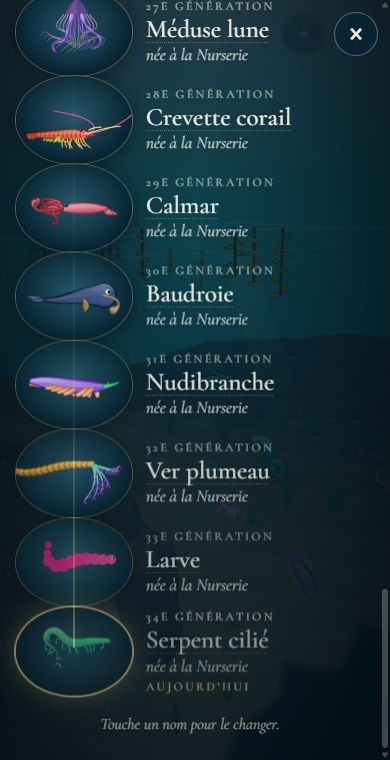
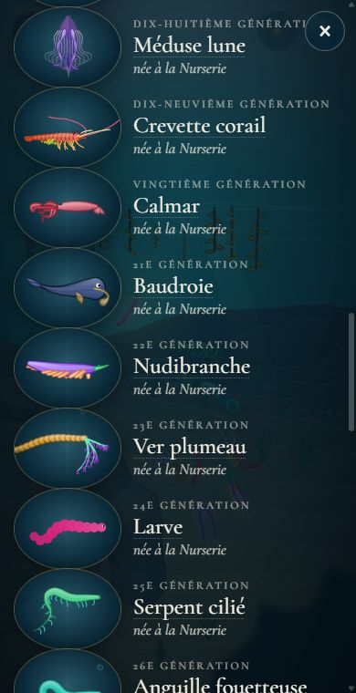

# La croix de l'arbre des espèces hors de vue

## Livré

La croix « × » de l'arbre de la lignée (`src/monde/arbre-ecran.ts`) se touche à toutes les hauteurs de défilement, sur téléphone comme sur ordinateur.

- **La cause** : la croix était déjà en `position: fixed`, donc toujours affichée dans le coin. Mais sur un écran étroit, la liste des générations prend toute la largeur et passe sous elle. Les lignes (`#arbre li`, en `position: relative` pour leur apparition en fondu) viennent après la croix dans la page, et avec le même `z-index: auto`, elles se dessinent par-dessus et prennent le toucher. La croix se voyait à travers le texte, mais toucher la croix, c'était toucher le nom. Sur ordinateur, la liste centrée (460 px) n'arrive pas jusqu'au coin : c'est pour ça que le bug ne se voyait que sur téléphone.
- **La correction** (`src/monde/arbre.css`) : `z-index: 2` sur `.ar-close`, au-dessus des lignes et de l'étincelle du fil (`z-index: 1`). Ajouté aussi : `backdrop-filter: blur(6px)` (comme les autres boutons ronds), pour que la croix se lise sur les noms qui passent dessous, la marge `safe-area-inset-right` (téléphone tenu en paysage, encoche) et pas de surbrillance au toucher.
- **Doc** : `docs/mecaniques.md`, à la ligne de l'arbre, précise que la croix reste au-dessus des générations qui défilent.
- **Vérifié** dans le Chrome Windows (playwright sur CDP), avec une lignée de plus de 25 générations, en 390×760, 320×568 et 1280×800 : en haut, au quart, au milieu, aux trois quarts et en bas de la liste, `elementFromPoint` au centre de la croix rend bien `.ar-close`, et un clic ferme l'arbre. Échap ferme toujours, un clic à côté de la liste aussi. Avant la correction, en 390 px de large et en bas de la liste, l'élément touché était le texte d'une génération (`li.ar-gen > div`).

## Choix retenus

| Question | Choix retenu | Pourquoi |
|---|---|---|
| Comment garder la croix touchable | Mettre la croix au-dessus des lignes (`z-index`) | La cause exacte, une ligne de CSS, rien ne bouge dans le code ni pour les chantiers voisins qui touchent `arbre-ecran.ts` |
| Où placer la croix | Rester en haut à droite | En face du bouton de l'arbre (en haut à gauche) et à la même place que les autres panneaux ; Échap et le toucher à côté complètent |
| Lisibilité au-dessus des noms | Flou derrière la croix (`backdrop-filter`) | Même style que les boutons ronds du jeu ; sans flou, les lettres des noms passaient à travers le fond semi-transparent |

Aucune question posée par le tableau de bord (correctif sans choix structurant).

## Options non retenues

- **Comment garder la croix touchable**
  - Séparer le panneau en un cadre fixe et une liste qui défile à l'intérieur, la croix hors de la liste : robuste face à de futurs éléments positionnés, mais touche `build()`, `open()`, `rename()` (les `root.scrollTop`) et l'observateur des portraits vivants (`arbre-vivant.ts`), en même temps que `revenir-espece` modifie ce fichier ; coût de fusion pour un gain nul aujourd'hui.
  - Mettre la croix après la liste dans le DOM : marche aussi, mais tient à un ordre fragile (le `more` du souvenir et les étincelles sont ajoutés après) ; moins clair qu'un `z-index`.
  - Retirer `position: relative` des lignes : casse l'étincelle et les traits des partenaires (`::before`), qui s'y accrochent.
  - Une barre d'en-tête collante (`position: sticky`) avec le titre et la croix : plus visible, mais mange de la hauteur sur un petit téléphone et change l'allure de l'arbre.
- **Où placer la croix**
  - En bas de l'écran, sous le pouce : plus facile d'une main, mais ne ressemble à aucun autre panneau du jeu, et recouvre la dernière génération (la nôtre, sur laquelle l'arbre s'ouvre).
  - Ajouter une seconde croix ou un bouton « Fermer » au pied de l'arbre : redondant maintenant que la croix du haut marche partout.
- **Lisibilité**
  - Fond de la croix plus opaque, sans flou : marche partout, mais plus lourd sur la mer.
  - Rien : on lisait les lettres des noms à travers la croix.

## Reste à faire / limites

- Pas de test automatique : la règle est purement visuelle (ordre d'empilement), que jsdom ne calcule pas. La vérification se fait dans le vrai Chrome (voir plus haut).
- Pas essayé sur un vrai téléphone iOS ; `position: fixed` dans un conteneur qui défile y est correct depuis longtemps, et `-webkit-backdrop-filter` n'est pas nécessaire sur les Safari récents.
- Les autres panneaux qui défilent (générique, nouveautés) n'ont pas été passés en revue ; le générique (`generique.css`) fait défiler une boîte intérieure, sans ce problème.

## Risques de fusion

- `src/monde/arbre.css` : la règle `#arbre .ar-close` seulement (trois propriétés, un commentaire). Si `revenir-espece` ajoute des boutons ou des éléments positionnés dans l'arbre, la croix reste au-dessus d'eux tant qu'ils restent sous `z-index: 2`.
- `docs/mecaniques.md` : une demi-phrase à la ligne 172 (l'arbre de la lignée).
