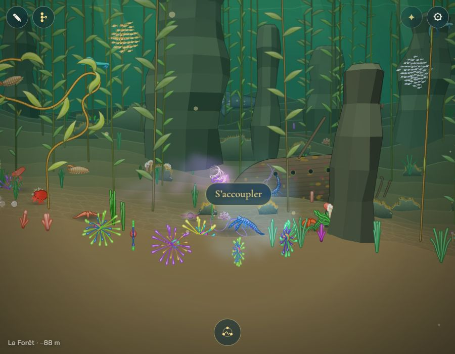
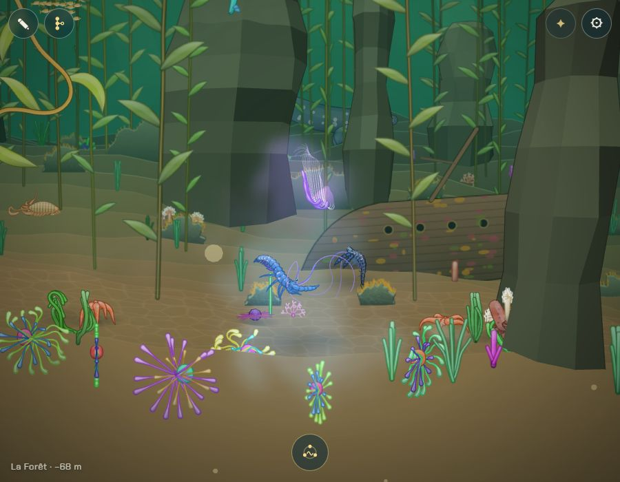
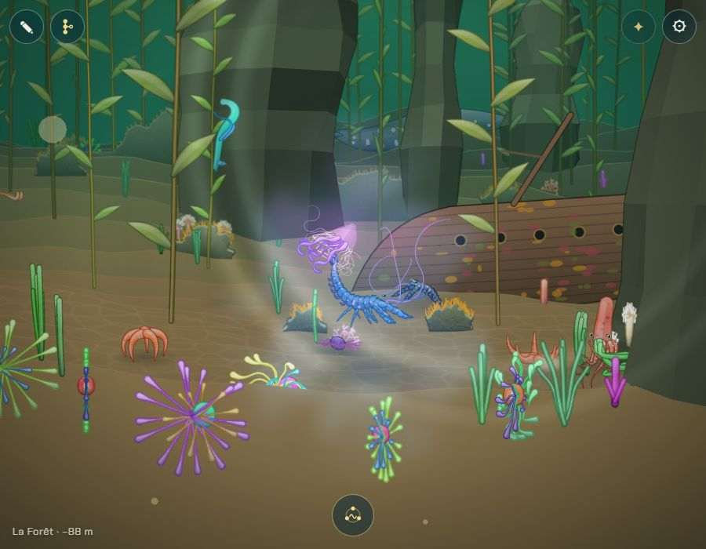
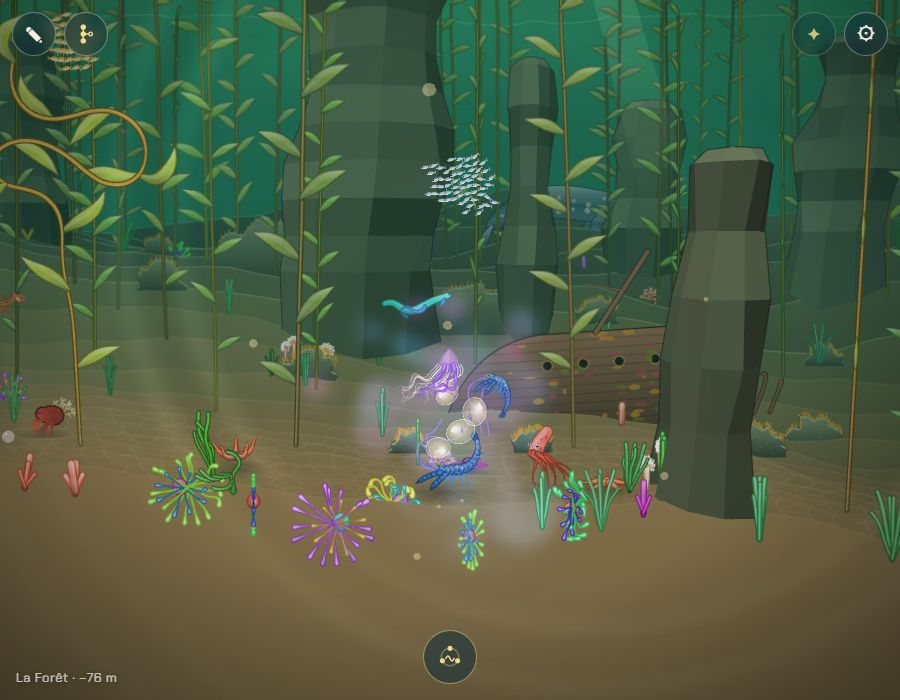
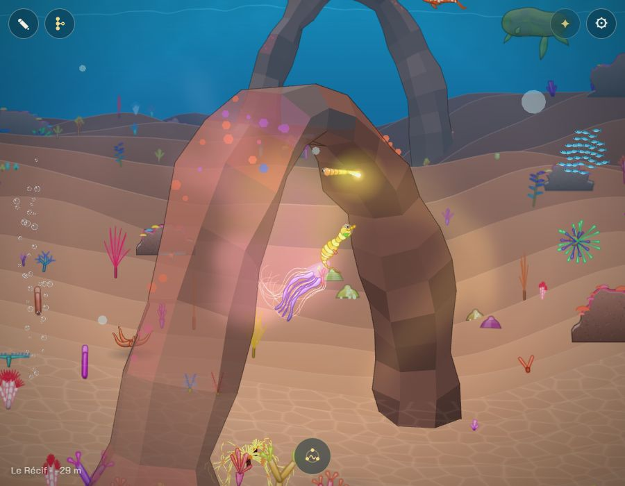

# Déclencher l'accouplement, puis une danse à deux

## Livré

- **La parade n'a plus de fin fixe** (`src/monde/parade.ts`) : le partenaire danse son grand huit tant qu'on ne s'est ni accouplé ni éloigné. La qualité est mesurée pendant cette approche : moyenne simple au début, puis glissante sur 12 s (`QUALITY_SPAN`), pour qu'un début raté se rattrape. `ready(p)` : au moins 4 s, et 3,2 s « parfaites » de danse cumulées, ou 10 s quoi qu'on fasse. Le partenaire appelle une fois (des lueurs) quand on est prêts.
- **Le bouton « S'accoupler »** (`src/monde/accoupler.ts`, `accoupler.css`) : prêts et à moins de 230 du partenaire, il apparaît au-dessus de lui et le suit à l'écran ; toucher / cliquer, ou Entrée / Espace. Caché pendant un texte, la portée, l'arbre, le chant, l'adieu. Une fois touché, la qualité est figée.
- **La danse à deux** (`src/monde/danse.ts`, pur) : environ 8 à 10 s, qu'on regarde (le nageur est mené, comme pendant l'adieu). Une ouverture (tour l'un autour de l'autre ; nageur + marcheur : le nageur passe en arc au-dessus du marcheur), deux figures tirées au hasard parmi s'enrouler, la spirale montante, se frôler, le balancement, le tour (selon les deux styles : `swim`, `walk`, `drift`), puis face à face, de plus en plus près. Un marcheur reste au fond et fait de plus petits pas ; pas de spirale avec lui ; une cloche dérive plus lentement. Les deux sillages brillent et l'eau de la parade s'allume sous les deux tout du long. La caméra se rapproche des deux, puis revient (`parade.camera`). Puis la figure de lumière et la ponte, comme avant (`onEnd`).
- **Tests** : `parade.test.ts` (plus de fin à 20 s, prêt vite en dansant bien et au plus tard à 10 s, qualité figée au déclenchement, début raté rattrapé), `danse.test.ts` (durée, ouverture et fin, variété d'une fois à l'autre, marcheur au fond, pas de saut, deux corps qui suivent leurs places avec du retard, fin face à face).
- **Docs** : « La parade » et « La ponte » de `docs/mecaniques.md`, la ligne « Reproduction » de `docs/decisions.md`.
- **Pour le voir** : `?dev`, `monde.gotoBiome(2)`, rejoindre un homard (ou `monde.parade.start(monde.partners()[0], monde.player.cr)`), le suivre quelques secondes, puis le bouton ; ou `monde.parade.mate(true)` tout de suite. `monde.parade.state.dance.figures` donne les figures tirées.

## Choix retenus

Aucune question posée sur le tableau de bord : tout est tranché `auto`, avec l'option recommandée.

| Question | Choix retenu | Pourquoi |
|---|---|---|
| Quand le bouton apparaît | Après un moment à suivre le partenaire : 4 s au moins, plus tôt si l'on danse bien (3,2 s parfaites cumulées), 10 s au plus ; seulement à moins de 230 de lui | Bien danser est récompensé par un bouton plus tôt, sans jamais bloquer ; le bouton reste lié au partenaire |
| La qualité de la parade | Mesurée pendant l'approche, avant le déclenchement (moyenne glissante sur 12 s), figée au déclenchement | Les règles de la portée (`carriers`) restent les mêmes ; un début raté se rattrape |
| Partir avant de déclencher | Oui, comme avant (520 pendant 2,5 s) ; plus après le déclenchement | Zéro pression ; la danse à deux est courte et se regarde |
| Sans déclenchement | Le partenaire danse sans fin | Rien n'est imposé, pas d'échec |
| Le geste | Bouton au-dessus du partenaire (toucher, clic), Entrée / Espace au clavier | Simple, visible, le même sur téléphone et ordinateur |
| La danse à deux | Chorégraphie pure tirée au hasard selon les styles des deux, ~9 s, caméra rapprochée | Varie d'une fois à l'autre et selon les espèces, testable |

## Options non retenues

- **Quand le bouton apparaît** : dès que le partenaire nous remarque (simple, mais la parade ne sert plus à rien et la qualité serait mesurée sur 0 s) ; après un temps fixe (8 s : plus lisible mais n'encourage pas à bien danser) ; seulement après les 20 s d'avant (le déclenchement deviendrait une simple confirmation) ; quand la qualité dépasse un seuil (pourrait ne jamais venir pour qui joue mal : contraire au « sans échec »).
- **La qualité** : moyenne sur toute la parade (un début raté pèse pour toujours) ; une qualité qui mûrit avec le temps (attendre donnerait de meilleurs enfants sans rien faire) ; mesurer aussi pendant la danse à deux (on n'y fait rien) ; supprimer la qualité (gros changement de la portée, `carriers`).
- **Partir** : interdire de partir une fois le partenaire suivi (contraire à « on peut toujours s'en aller ») ; pouvoir interrompre la danse à deux (casse le moment, et la ponte devient incertaine).
- **Sans déclenchement** : le partenaire se lasse au bout d'une minute et s'en va (une pression qu'on évite ; coût faible si voulu).
- **Le geste** : toucher le partenaire lui-même (se confond avec le doigt qui guide vers lui) ; un geste à deux doigts ou un tracé (moins découvrable, et le pincement zoome déjà) ; un bouton fixe en bas de l'écran comme le chant (moins lié au partenaire, et la place est prise par le chant).
- **La danse à deux** : une animation fixe par famille (moins de variété, plus de travail par espèce) ; laisser le joueur la piloter en rythme (contraire à « qu'on regarde sans rien faire ») ; sans caméra rapprochée (les danseurs sont petits à l'écran).

## Reste à faire / limites

- La danse à deux suit le plan de nage (x, y) : les deux ne se tournent pas autour en profondeur (z), ce qui aurait été plus beau mais touche le plan du joueur et les collisions.
- Les obstacles du décor ne sont pas évités pendant la danse : elle reste dans un rayon de 70 à 150 autour de l'endroit de la rencontre, et `keep` garde chacun dans l'eau (ou au fond pour un marcheur) ; un rocher proche peut cacher les danseurs (capture du Récif, derrière l'arche).
- Pas de son propre au déclenchement ni à la danse : la musique du moment « parade » continue. À brancher sur la musique qui change (`musiques-qui-changent`) si l'on veut un moment à part.
- Pas essayé sur un vrai téléphone (captures en 900 × 700 sur le Chrome Windows) ; le bouton se cale dans l'écran (70 px des bords).

## Risques de fusion

- `src/monde/main.ts` : trois branchements d'une ligne — `?? parade.lead()` dans le guidage du nageur, `parade.camera(...)` dans la chaîne des caméras, `parade.ui(view, P)` après `chant.draw()`.
- `src/monde/parade-jeu.ts`, `parade.ts`, `parade.test.ts` : réécrits en partie (la parade n'a plus de fin à 20 s ; `PARADE_TIME` n'existe plus, `quality` lit une moyenne glissante).
- `docs/mecaniques.md` (« La parade », « La ponte ») et `docs/decisions.md` (ligne « Reproduction »).
- Nouveaux : `src/monde/danse.ts`, `danse.test.ts`, `accoupler.ts`, `accoupler.css`.
