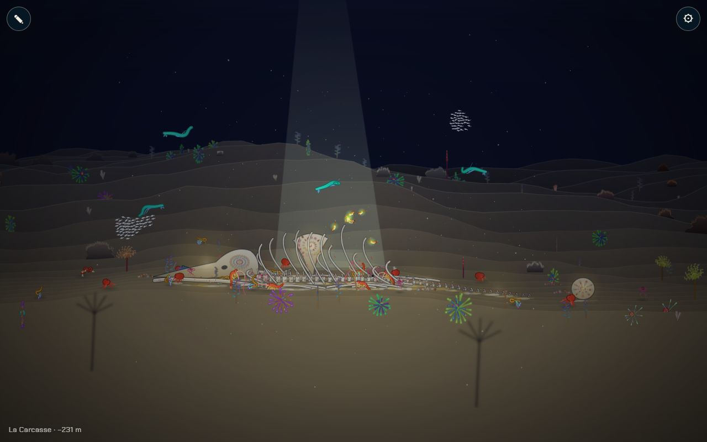
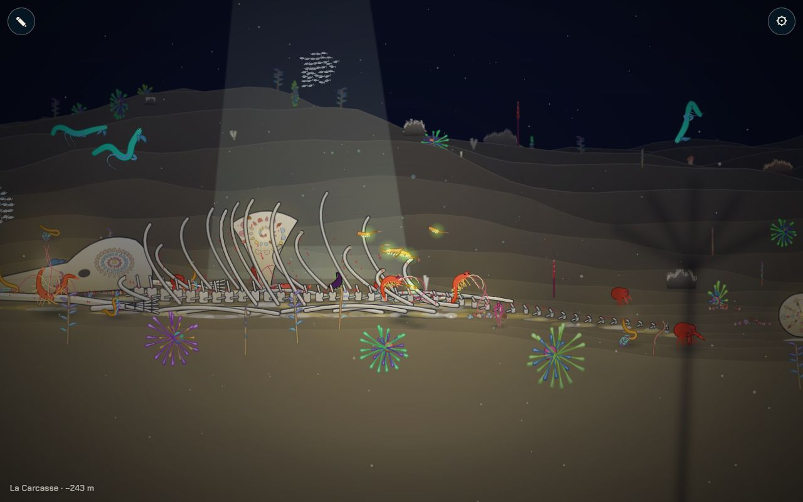
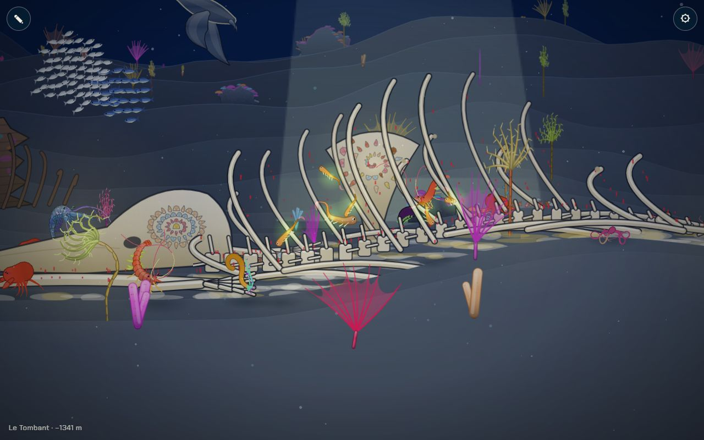

# Le décor de la Carcasse

## Livré

- **Le squelette** (`src/monde/carcasse.ts`) : une baleine couchée sur le fond, tête à gauche, sur 1 180 px. On y trouve le crâne (long rostre, voûte, orbite), deux mâchoires, la colonne en quatre tronçons et treize paires de côtes, debout, brisées ou tombées sur le sable. S'y ajoutent deux nageoires, les tapis blancs et jaunes de bactéries et le duvet rouge des vers mangeurs d'os. Chaque os est une pièce à sa profondeur (côtes proches à z = 42, colonne à 90, côtes lointaines à 145), triée avec les animaux : on nage devant et entre les os. Les longs os (colonne, mâchoires) suivent le relief du fond sous eux, sans marche entre les tronçons.
- **La lumière sur les os** : un rai de lumière pâle (image à basse résolution) tombe sur les côtes et fait une flaque sur le sable. Le crâne, l'omoplate, la vertèbre et la colonne ont un halo ivoire (dans `lights`) qui les garde lisibles quand le noir se referme. Chaque os a un liseré clair sur le dessus.
- **Les fresques naturelles**, des coquilles posées en motif :
  - une **spirale** sur une omoplate debout derrière les côtes ;
  - des **anneaux** sur le crâne ;
  - des **rayons** sur une vertèbre de la queue roulée à l'écart.

  Elles sont exportées dans `CARCASSE.fresques` (`id`, `motif`, `x`, `z`, `up` = hauteur du centre au-dessus du fond) pour l'étape 4. On les lit en jeu par `window.monde.carcasse`. Sept tas de coquilles sont semés autour.
- **Les habitants** : crabes, vers plumeaux, ophiures, vers plats, crevettes, un homard et deux anguilles (`carcasseDwellers`), plus un banc de 60 poissons argentés qui tourne au-dessus (`carcasseSchool`). Pas de gros rocher sous le squelette (`underCarcasse`).
- **Tests** : `src/monde/carcasse.test.ts`. Ils vérifient la disposition déterministe, les pièces, le plan de nage dégagé, les trois fresques sur un os, les habitants et la lumière.
- **Doc** : `docs/chapitres.md`, chapitre 5 (« Dans le monde », « Les fresques naturelles »).
- **Pour le voir** : `monde.teleport(monde.carcasse.x, monde.floorAt(monde.carcasse.x, 0) - 150)`.

## Choix retenus

Aucune question posée sur le tableau de bord : tous les choix sont tranchés par l'agent (option recommandée).

| Question | Choix retenu | Pourquoi |
| --- | --- | --- |
| Où poser la carcasse, tant que la carte n'a pas de chapitre Carcasse | Au milieu du biome d'id `carcasse` s'il existe (`biomeMid`), sinon x = 14100, sur la plaine du Tombant | Se branche seul sur la carte du chantier `10-chapitres-monde`, sans toucher `biomes.ts`. Le Tombant a la palette « bleu nuit » demandée pour la Carcasse. |
| Comment dessiner le squelette | Une trentaine de pièces cuites en images, chacune à sa profondeur, dans le système `Decor` existant (`kind: 'bone'`) | On nage entre les os. Le coût est celui des autres décors : images cuites, budget de cuisson par image. |
| Où poser les fresques | Sur les os plats debout (omoplate, crâne, vertèbre dressée) | À 7° de caméra, un motif posé à plat sur le sable serait invisible. |
| Motifs | Spirale, anneaux, rayons, en coquilles | Trois motifs lisibles et distincts, faciles à rappeler à l'étape 4. |
| La lumière sur les os | Un rai pâle (image) et des halos ivoire après le noir | N'utilise que ce qui existe (images, `lights`), sur canvas comme sur WebGL. |
| Les habitants | Espèces du bestiaire placées autour (`addActor`) et un banc | Pas de nouvelle espèce. Les partenaires du chapitre, plumeau et crabe, y sont. |
| La baleine provisoire (`whale`) posée par `10-chapitres-monde` au milieu de la Carcasse | Retirée de `makeDecor` à la fusion ; `bakeWhale` reste disponible | Elle se superposait au vrai squelette, qu'elle annonçait. |

## Options non retenues

- **Emplacement** :
  - Ajouter moi-même un biome « La Carcasse » dans `biomes.ts` : complet, mais en conflit direct avec `10-chapitres-monde`, qui refait la carte.
  - Remplacer la baleine des Abysses (x = 20450) : déjà au fond, mais trop noir (dark 0,86) pour « la lumière sur les os ».
  - Le Crépuscule : palette proche, mais trop sombre.
- **Dessin** :
  - Une seule grande image (comme `bakeWhale`) : plus simple, mais les animaux passeraient tous devant ou tous derrière.
  - Des os simulés en 3D (`Creature3` figés) : vrai volume, mais coûteux et hors du style des décors.
  - Aplatir le fond sous la baleine (dans `floorAt`) : os parfaitement posés, mais touche `biomes.ts`, que deux chantiers refont.
- **Fresques** :
  - Motifs gravés dans l'os : plus discrets, moins lisibles de loin.
  - Coquilles en cercle sur le sable : plus naturel, mais invisible sous cet angle.
  - Motifs tirés de la lignée du joueur : c'est l'étape 4.
- **Lumière** :
  - Ajouter un rai au passage `raysGL` : partagé avec les autres biomes, et plus coûteux à régler.
  - Des os bioluminescents : faux (les os ne brillent pas) ; le halo reste léger.
- **Habitants** :
  - De nouvelles espèces (ver osedax, myxine) : plus juste, mais touche `species.ts` ; à faire avec le bestiaire.

## Reste à faire / limites

- Depuis la fusion avec `backlog`, la baleine se pose seule au milieu du chapitre `carcasse` (x = 14 700). Le repli x = 14 100 de `carcasseX()` ne sert plus que si le chapitre disparaît.
- La « lignée rivale » et les indices sur la fin sont des chantiers à part (étapes suivantes). Les fresques ne réagissent pas encore au joueur.
- Les plantes du biome poussent entre les os. C'est voulu (oasis), mais on pourrait les éclaircir.
- Performance : 30 à 60 img/s mesurées sur le Chrome Windows, qu'utilisaient en même temps les autres agents : ces chiffres ne sont pas une mesure propre. Le rai de lumière est cuit à 0,4 de résolution au plus.

## Risques de fusion

- `src/monde/world.ts` : champs optionnels `part` et `k` et `kind: 'bone'` dans `Decor`, `tint` exporté, une ligne dans `makeRocks`, `makeDecor` et `bakeDecor`.
- `src/monde/main.ts` : un import et quatre branchements (habitants, banc, halos dans la boucle des décors, `carcasse` dans l'API).
- `docs/chapitres.md` : deux puces au chapitre 5.
- `carcasse.ts` lit `BIOMES`, `biomeMid` et `floorAt` de `biomes.ts` : si le chantier des 10 chapitres les renomme, les adapter.

## Fusion avec `backlog`

Le chantier `10-chapitres-monde` et le premier plan sombre sont arrivés sur `backlog` avant ma branche. Conflits réglés :

- `src/monde/world.ts` :
  - imports combinés : `chapterIndex`, `span`, `ChapterId` et `carcasse.ts` ;
  - `makeDecor` : je garde les positions par chapitre (`at(...)`) de `backlog`, j'ajoute `CARCASSE.pieces` et je retire la baleine provisoire `whale` du chapitre Carcasse.
- `src/monde/main.ts` : imports combinés (`foreground.ts` et `carcasse.ts`) ; l'API de test garde `front`, `frontCount` et `carcasse`.
- `docs/chapitres.md` (sans conflit) : la ligne 5 du tableau « Dans le monde » ne dit plus *provisoire*, elle décrit le vrai décor.
- `src/monde/foreground.test.ts` (sans conflit, mais cassé par la fusion des deux autres chantiers) : il cherchait les anciens biomes `kelp` et `abysses`. Ils sont remplacés par `foret` et `fosse`, les nouveaux identifiants.

Dans le chapitre Carcasse (sombre, ivoire), le rai de lumière et les halos gardent les os lisibles, et le premier plan sombre passe devant (captures `wide.jpg` et `mid.jpg`, refaites après la fusion).
