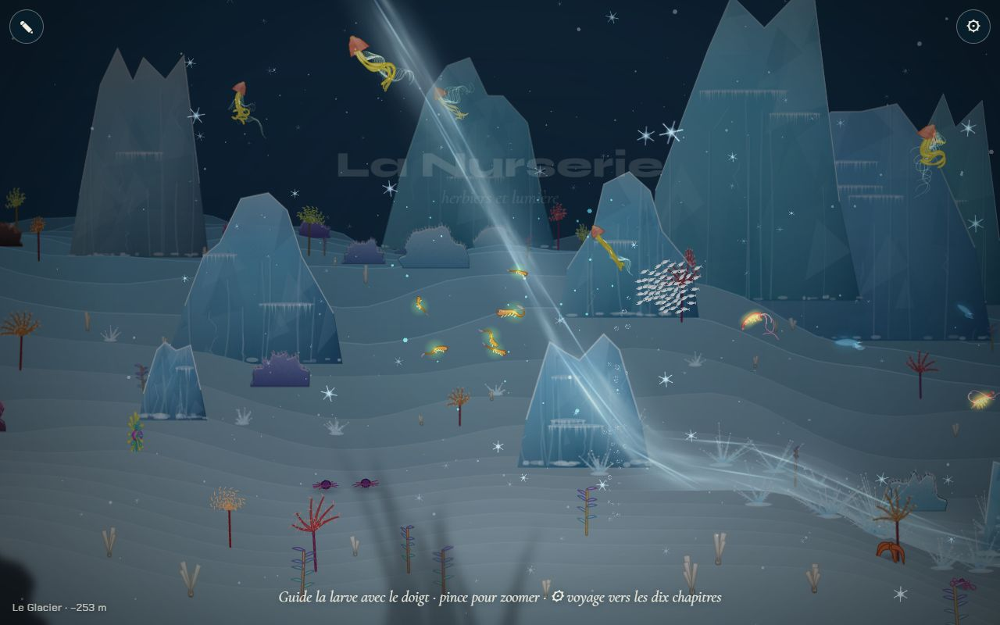
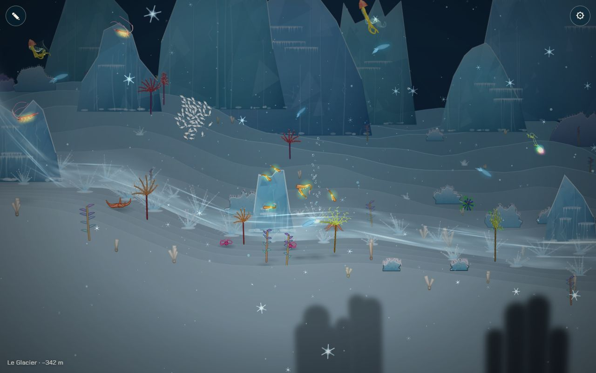

# Le décor du Glacier

## Livré

- **Le module `src/monde/glacier.ts`**, qui dessine quatre éléments :
  - **La langue d'eau froide** (`makeTongue`, `glacierItems`). C'est un chemin de 96 points : elle tombe de ~900 px au-dessus du fond sur le premier tiers, puis elle coule sur le fond en suivant la pente, de z = 320 à z ≈ 110 (derrière le plan de nage).
    - 420 volutes y défilent à 70 px/s : des traînées laiteuses, un voile large une fois sur trois, un filet brillant en mode additif une fois sur cinq.
    - Le courant apparaît et s'efface en fondu aux deux bouts, et le brouillard l'atténue au loin.
    - Il est découpé en 8 tronçons triés par profondeur avec le reste de la scène (une plante ou un bloc de glace peut passer devant ou derrière).
  - **Les parois de glace** (décor `ice`). Ce sont des falaises en arrière-plan (z 520 à 1520, 300 à 760 px de haut) et une rangée plus basse à mi-distance (z 220 à 420). Elles sont cuites une fois en image, comme l'épave ou les fumeurs.
    - Silhouette en pic, ou en bloc à sommet plat (40 %).
    - Dégradé bleu glacier, facettes, flanc éclairé à gauche.
    - Cannelures verticales, lueur froide intérieure, fissures, arête blanche.
    - Corniches avec stalactites, givre au pied.
  - **Les aiguilles de givre** (décor `frost`). Ce sont des touffes de 7 à 16 aiguilles effilées, avec des barbules à 60° comme des fougères de givre et un point brillant à la pointe.
    - Elles poussent sur les deux rives du courant, plus grandes là où il touche le fond, et en touffes éparses dans tout le Glacier.
    - Aucune n'est placée devant le plan de nage (z ≥ 40).
  - **Les cristaux en suspension** (`drawCrystals`). 140 étoiles à six branches, en mode additif, autour de la caméra.
    - Elles scintillent chacune à son rythme, dérivent avec le courant et coulent lentement.
    - Elles sont dessinées par-dessus la pénombre, comme le plancton, avec une intensité égale à la présence du Glacier à l'endroit de la caméra.
- **Le rendu** : WebGL2 et canvas 2D (`?gl=0`) donnent la même image. Le temps de rendu mesuré est inchangé (~5 ms dans les deux cas, sur une machine chargée par les autres agents).
- **Le placement** : le décor se place dans l'étendue du chapitre `glacier` de la carte (`span('glacier')`, x 19000 à 22000). Il s'ajoute au décor provisoire du chapitre, venu du chantier des 10 chapitres, et garde sa lumière.
  - Pour le voir : `monde.gotoBiome(6)`, ou `monde.teleport(19750, 1450)` pour la chute et `monde.teleport(20600, 1700)` pour le fond.
- **Tests** : `src/monde/glacier.test.ts` vérifie que la langue tombe puis longe le fond sans le traverser, et que le placement des parois et du givre est déterministe et reste hors du premier plan.
- **Doc** : une ligne « Fait » sous le décor du Glacier dans `docs/chapitres.md`.

La langue froide plonge le long de la pente, entre les parois de glace :

Au fond, le courant coule entre les touffes de givre ; les cristaux scintillent :

## Choix retenus

Aucune question n'a été posée à l'utilisateur : tout a été tranché seul (option recommandée). Un retour `info` a été laissé sur le tableau de bord pour signaler le lien avec le chantier des 10 chapitres.

| Question | Choix retenu | Pourquoi |
| --- | --- | --- |
| Où brancher le décor ? | Sur le chapitre `glacier` de la carte (`span`, `chapterIndex`) | Aucun conflit avec le chantier 10-chapitres-monde, qui a refait `biomes.ts` ; depuis la fusion, le décor apparaît dans le vrai Glacier. |
| Parois et aiguilles : quelle technique ? | Nouveaux genres de `Decor` (`ice`, `frost`), cuits en image par `bakeDecor` | Même chemin que l'épave et les fumeurs : tri, brouillard, recuisson selon la distance, quasi gratuit à chaque image, trois lignes dans `world.ts`. |
| Langue d'eau froide : quelle technique ? | Des volutes analytiques (position = f(t), sans état) le long d'un chemin, 8 tronçons triés | Mouvement continu sans simulation, rendu identique en canvas et en WebGL, coût borné (420 images par image). |
| Cristaux | Des étoiles additives autour de la caméra, par-dessus la pénombre | Ils brillent même dans le sombre, et le code reprend le modèle du plancton. |
| La lumière du Glacier | Celle de l'entrée de la carte (chantier des 10 chapitres) | Elle est déjà bleu glacier et blanc nacré ; ma proposition `GLACIER_MOOD` et l'aperçu `?glacier=` ont été retirés à la fusion. |
| Forme de la langue | Chute raide sur le premier tiers, puis écoulement sur le fond | C'est ce que fait une eau froide et salée, plus dense (« qui plonge »). Cela rappelle aussi les « doigts de glace » (brinicles). |

## Options non retenues

- **Branchement**
  - Ajouter moi-même un biome provisoire `glacier` dans `biomes.ts` : visible tout de suite en jeu, mais conflit certain avec 10-chapitres-monde.
  - Décor posé à des x fixes : simple, mais faux dès que la carte change.
- **Parois**
  - Parois dessinées chaque image en chemins : plus souples (reflets animés), mais bien plus chères sur téléphone.
  - Reliefs 3D (voûtes, surplombs) : c'est le chantier `reliefs-composes-arches` ; à combiner plus tard.
  - Parois en premier plan : c'est le chantier `premier-plan-sombre`.
- **Langue**
  - Particules simulées (`Puffs`) : plus de liberté, mais un état à tenir et un pas par image.
  - Bande continue (un polygone dégradé) : moins cher, mais figée et plate.
  - Distorsion de l'eau (un shader) : très beau, mais il faudrait toucher `gfx.ts`, sans équivalent en canvas.
- **Cristaux**
  - Réutiliser le plancton du biome (couleur et nombre) : gratuit, mais sans scintillement ni forme de cristal.
  - Cristaux fixes dans le monde : plus réalistes à la parallaxe, mais invisibles quand on bouge vite.
- **Lumière** : garder `GLACIER_MOOD` (sable plus sombre, sans caustiques) à la place de celle de la carte ; retiré, pour n'avoir qu'une source.

## Reste à faire / limites

- Le fond du Glacier est presque plat dans la nouvelle carte : la langue plonge d'environ 900 px sur son premier tiers, puis suit `floorAt`. Une pente plus marquée rendrait la plongée plus lisible.
- **Le moment fort** : l'aiguille de glace qui descend le courant et fige tout, puis le chemin qu'elle ouvre. Ce n'est pas fait ; il dépend de la mécanique de l'obstacle (l'eau qui fige et ralentit).
- **L'obstacle** : le courant ne ralentit ni ne fige encore rien ; il est purement visuel.
- **Le son** (craquements, tintements) : chantier « son ».
- Les stalactites des corniches se ressemblent d'une paroi à l'autre ; des variantes (surplombs, arches de glace) iraient avec les reliefs composés.

## Risques de fusion

- `src/monde/main.ts` : +6 lignes.
  - Un import.
  - Un objet `glacier` (la scène passée au module).
  - Deux lignes dans `render()` pour pousser les tronçons du courant, avant les rayons.
  - Un appel `drawCrystals` après chacun des deux `drawMotes` (canvas et WebGL).
- `src/monde/world.ts` : +5/−2 lignes.
  - L'import.
  - `Decor.kind` gagne `'ice' | 'frost'`.
  - `makeDecor` ajoute `glacierDecor()`.
  - `bakeDecor` renvoie `bakeIce(…)` au lieu de `null`.
- `docs/chapitres.md` : une ligne ajoutée sous le décor du Glacier.
- Aucun changement dans `biomes.ts` : `glacier.ts` lit `span`, `chapterIndex`, `presence` et `floorAt`.

## Fusion avec `backlog` (10 chapitres, premier plan sombre)

- `main.ts` : conflit sur les imports, les deux gardés (`glacier` et `foreground`).
- `world.ts` : conflit sur l'import de `biomes` et sur `makeDecor`. J'ai gardé les imports des deux côtés et les décors placés par chapitre (`at(id, u)`), et ajouté `glacierDecor()` à la suite.
- `glacier.ts` : branché sur `span('glacier')`. `GLACIER_MOOD` et l'aperçu `?glacier=` sont retirés, car la carte a maintenant son Glacier.
- `foreground.test.ts` (venu de `backlog`) : deux tests visaient les anciens biomes `kelp` et `abysses`. Ils visent maintenant `foret` et `fosse`, sans rien changer à ce qu'ils vérifient.

## Deuxième fusion avec `backlog` (la Grotte, la Carcasse)

- `main.ts` : deux conflits.
  - Imports : les deux gardés (`glacier` avec `grotte` et `grotte-draw`).
  - Dans `render()` : les tronçons du courant froid sont poussés comme avant. Les rayons prennent la version de `backlog`, atténuée sous la voûte (`m.rays * open`), et `pushCave` suit.
- `world.ts` : trois conflits.
  - Imports : les deux gardés (`glacier` et `carcasse`).
  - `Decor` : le type reprend la forme de `backlog` (`part?`, `k?`) et son `kind` réunit `'bone'`, `'ice'` et `'frost'`.
  - `bakeDecor` : les os de la Carcasse d'abord (`bakeBone`), puis `bakeIce` pour le reste.
- L'image du Glacier est inchangée après la fusion (vérifiée en jeu) ; les captures restent valables.
