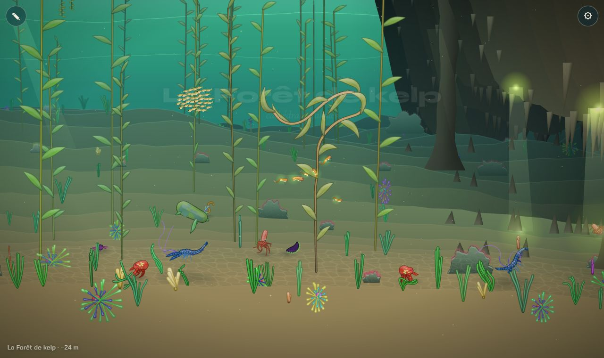
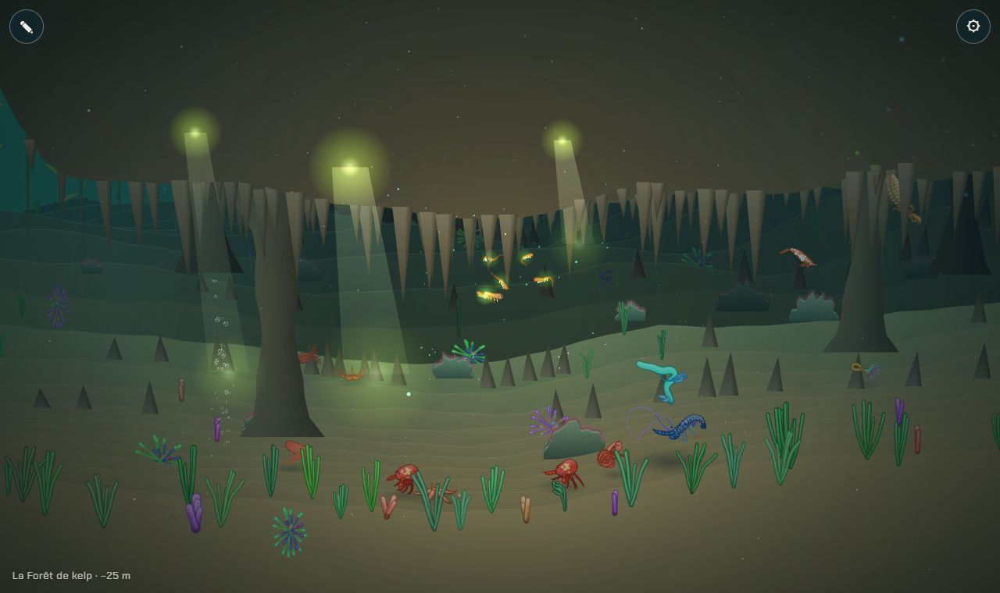
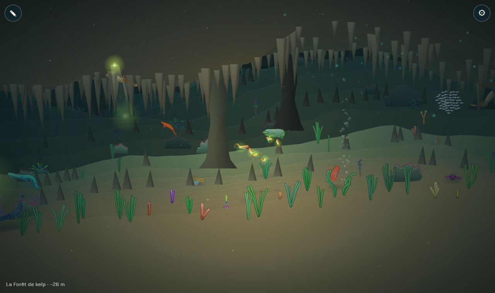
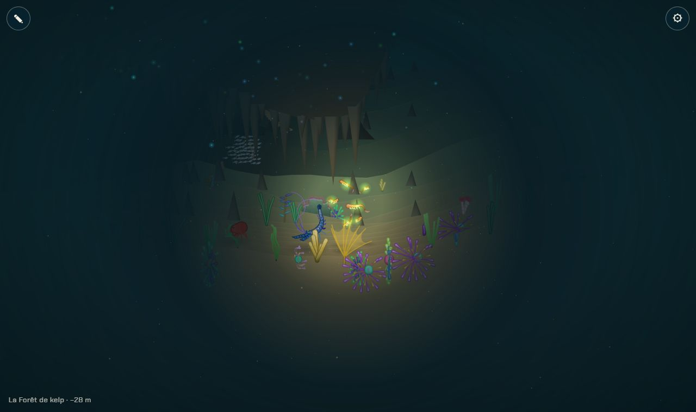

# Le décor de la Grotte

## Livré

- **`src/monde/grotte.ts`** (géométrie pure, testée dans `grotte.test.ts`) : l'étendue de la grotte (`caveSpan`), la voûte (`ceilAt(x, z)` : haute au-dessus du plan de nage, elle descend jusqu'au sol au fond, z = 1600, et s'ouvre en arche aux deux entrées), la couverture (`caveCover`), l'obscurité (`caveDark` : salles tamisées, puis le noir à partir des deux tiers, qui dure jusqu'après la sortie), les piliers (jamais dans le plan de nage), les puits (seulement au-dessus des salles éclairées) et les lueurs du noir.
- **`src/monde/grotte-draw.ts`** (dessin, WebGL et Canvas 2D) : la voûte en rangées comme le sol, avec les stalactites ; les stalagmites ; les piliers (trois bandes, lumière, face, ombre) ; les rais de jour (additifs, avec le trou lumineux dans la voûte et une flaque au sol) ; un voile sombre sur le fond de la grotte ; le noir resserré autour du nageur ; les lueurs de la roche (bleues et vertes, qui respirent, dessinées après le noir).
- **Branchements dans `main.ts`** (quelques lignes) : les éléments de la grotte vont dans la liste triée par profondeur ; pas de rais de surface ni de caustiques sous la voûte ; l'obscurité de la grotte entre dans `dk` (lueurs des animaux plus fortes, plancton qui scintille) ; les créatures ne traversent pas la voûte (`collide`) ; les bancs de poissons font demi-tour à l'entrée (`caveRepel`) et restent sous la voûte ; le kelp et les sargasses ne poussent pas sous la voûte (`caveKeeps`).
- **Où la voir** : tant que la carte n'a pas de chapitre `grotte`, la grotte occupe la fin de la Forêt de kelp, x de 4300 à 7500 (`monde.teleport(5300, 500)`). Dès que la carte des 10 chapitres a un biome `id: 'grotte'` (ou `name: 'La Grotte'`), elle en suit l'étendue, sans autre changement.
- Mesures (Chrome Windows, 1280 × 760) : 60 img/s en WebGL dans les salles et dans le noir ; 28 img/s en Canvas 2D (`?gl=0`) dans les salles, contre 50 dehors.
- Doc : section de la Grotte dans `docs/chapitres.md`.

## Choix retenus

Aucune question posée à l'utilisateur ; tout est tranché seul (option recommandée).

| Question | Choix retenu | Pourquoi |
| --- | --- | --- |
| Où placer la grotte avant la nouvelle carte | Le biome `grotte` s'il existe, sinon la fin de la Forêt de kelp | Additif, sans toucher `biomes.ts` (refait par `10-chapitres-monde`) ; la Grotte vient après la Forêt dans la trame |
| Comment dessiner la voûte | Des rangées de roche comme le sol, du bord de la voûte au haut de l'écran, triées avec le reste | Même peintre que le sol, même coût, marche en WebGL et en Canvas ; la perspective donne la voûte vue d'en dessous |
| Stalactites, piliers : images cuites ou géométrie | Géométrie (triangles, bandes) | Pas de cuisson ni de mémoire d'images, pas de brouillard à recuire ; quelques centaines de triangles |
| Comment faire le noir | Un noir propre à la grotte, plus serré que celui des abysses, et `dk` relevé | Le noir des abysses est une vignette large : il ne donne pas « le noir complet » ; les lueurs passent par-dessus |
| Le fond de la grotte | Un voile d'encre sur ce qui est derrière z = 520, et le brouillard de la roche vers l'encre | Sans lui, le sol lointain (dessiné par `main.ts`) prend la couleur de l'eau libre et la grotte paraît ouverte |
| La voûte bloque-t-elle la nage | Oui, doucement (`collide`, comme le sol) | Une voûte qu'on traverse ne se lit pas comme une voûte ; zéro danger : on glisse dessous |
| Le banc qui fait demi-tour (moment fort) | Une poussée vers l'entrée la plus proche pour les bancs | Une ligne, et le chapitre le demande |
| Les plantes hautes sous la voûte | Retirées (kelp, sargasses) | Elles perçaient la voûte |

## Options non retenues

- **Place avant la carte** : ajouter moi-même un biome `grotte` à `biomes.ts` (conflit certain avec `10-chapitres-monde`) ; ne rien montrer tant que la carte manque (rien à voir ni à capturer) ; un paramètre d'URL `?grotte` (caché, peu utile).
- **Voûte** : un grand sprite de falaise cuit (détaillé mais figé, lourd en mémoire, perspective fausse quand on se déplace) ; un masque (clip) sur toute la scène (cher en Canvas, compliqué en WebGL).
- **Stalactites et piliers en images cuites** comme les rochers : plus de détail (strates, coulures), mais recuisson au changement de distance et mémoire.
- **Noir** : n'utiliser que `dk` de `main.ts` (trop clair, voir le texte) ; un noir plein écran (on ne voit plus le nageur) ; la vraie lanterne du joueur (chantier `fosse-noir-total`).
- **Fond** : modifier `drawRow` de `main.ts` pour assombrir le sol sous la voûte (plus juste, mais touche le code partagé et le chantier des reliefs).
- **Voûte** : purement décorative (on passerait à travers).
- **Plantes** : les raccourcir sous la voûte (touche `world.ts`, partagé) plutôt que les retirer.

## Reste à faire / limites

- La **galerie étroite** (l'obstacle : corps fin ou lanterne) n'est qu'un resserrement de la voûte (au plus bas 70 % de la hauteur des salles) : la règle d'obstacle est un autre chantier.
- La faune et les couleurs propres à la Grotte (ocre et bleu d'encre) viendront du biome `grotte` de la nouvelle carte ; dans le kelp, la roche est tirée vers l'ocre, mais le sol garde le sable du kelp.
- Si les **reliefs composés** ajoutent leurs propres grottes ou surplombs, harmoniser : `ceilAt` pourrait devenir l'un d'eux, ou s'appuyer sur leur module.
- La **résonance** (son) de la Grotte est un chantier du son.
- Les poissons des bancs dont le foyer est dans la grotte sont repoussés vers les entrées : voulu (on entre seul), mais le biome `grotte` ne devra pas compter sur des bancs.
- Le noir continue 520 px après la sortie (vers le chapitre suivant, plus profond) ; dans le repli sur le kelp, cela assombrit le début du Récif.
- Canvas 2D : 28 img/s dans la grotte (dégradés de la voûte) ; le WebGL, par défaut, reste à 60.

## Risques de fusion

- `src/monde/main.ts` : deux imports, un `.filter(caveKeeps)` sur les plantes, deux lignes dans `Shoal.update`, deux lignes dans `collide`, `open` pour les caustiques et les rais, un appel `pushCave(...)` avant le tri, `dk` enveloppé dans un `Math.max(…, caveDark(cam.x))`. Conflits possibles avec `premier-plan-sombre`, `fosse-noir-total` (le calcul de `dk`), `reliefs-composes-arches` (`collide`, le sol).
- `docs/chapitres.md` : un paragraphe « Dans le jeu » dans la section de la Grotte.
- Nouveaux fichiers : `src/monde/grotte.ts`, `grotte-draw.ts`, `grotte.test.ts`.
