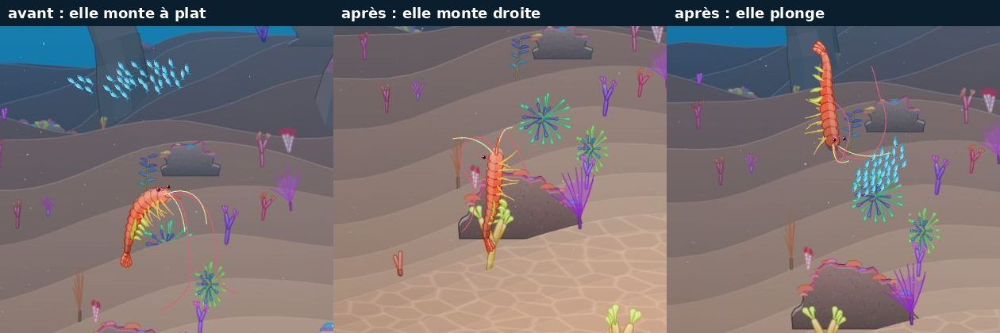
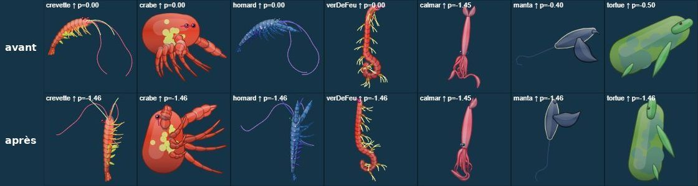

# Déplacement des crevettes et des autres

Chantier : « les crevettes ont un déplacement rigolo au sol, un peu rapide mais bien cool ; par contre dès qu'elles nagent elles restent horizontales. On doit pouvoir nager vertical, il n'y a pas de raison, et pour toutes les espèces. »

## Livré

**Toutes les espèces nagent à la verticale**, vers le haut comme vers le bas (`src/engine3/creature3.ts`).

- **Les marcheurs** (crevette, krill, crevette-mante, crabe, homard, nudibranche, vers, ver plat, étoile, ophiure, oursin, axolotl, tardigrade, et les marcheurs générés), quand on les fait monter :
  - ils quittent le fond, même plat. Avant, `stand()` les recollait au sol (15 % de l'écart par pas sous 40 px) et les retenait vers 17 px : ils ne nageaient que là où le sol se dérobait. Le recollage est suspendu tant qu'on leur dit de monter ;
  - ils pointent la tête vers où ils vont, jusqu'à la verticale (`crawlPitch`), et leurs pattes rament au rythme de leur vitesse totale (en montant tout droit, elles s'arrêtaient).
  - Lâchés, ils retombent doucement (0,5 px par pas, comme avant), à plat, et se posent sur leurs pattes.
  - Poussés vers le bas en pleine eau, ils plongent tête la première à la vitesse demandée et se remettent à plat sur les 120 derniers pixels (`crawlRise`).
  - Au sol, rien ne change : même posture, même allure, même vitesse.
- **La glisse** (poissons, vers nageurs, larve…) s'incline jusqu'à 1,5 rad (86°) au lieu de 1,2 (69°). Un poisson qu'on fait monter tout droit ne dérive presque plus de côté : 7 % de sa vitesse au lieu de 36 %.
- **La raie manta, la tortue et le requin-baleine** n'ont plus leur bride (`pitchMax` 0,4 et 0,5). Le champ disparaît de `SwimDef`.
- **Inchangés** : les jets (déjà 1,45 rad), les cloches (toujours droites) et l'hippocampe (tête en haut).
- **Le bas du corps** (`Creature3.down`) : la dérivée du cap par rapport au tangage, posée par `aim()`. Il remplace le bas du monde comme référence :
  - du ventre de chaque maillon, donc de l'attache des membres (`belly()`) ;
  - du plan où le corps se plie (`cross(prev, down)`) ;
  - des axes d'épaisseur du dessin (`bellyOf`, `src/engine3/render3.ts`).

  À plat, `down` vaut le bas du monde : un corps à l'horizontale ne change pas, et les portraits non plus. Incliné, le corps tourne d'un bloc. Avant, à partir d'environ 79°, le ventre basculait d'un quart de tour en une image : le calmar qui monte passait d'un coup de profil à face. La coquille du nautile et la queue de l'hippocampe gardent leur forme quand ils s'inclinent, au lieu de pendre vers le bas du monde.
- **Les couronnes** (étoile, oursin, anémone) restent à plat. Sur un corps pointé à la verticale, elles gardent le cap du corps au lieu de sauter sur l'axe x.
- **Tests** (`src/engine3/creature3.test.ts`) :
  - toute espèce sans cloche qu'on fait monter pointe vers le haut ; vers le bas aussi, sauf les jets en parachute et l'hippocampe ;
  - un nageur à plat garde le bas du monde ;
  - les nageoires ne sautent pas en passant à la verticale (calmar, poisson-clown, crevette) ;
  - un marcheur décolle du sol plat puis se repose à plat ;
  - un marcheur au sol marche à plat ;
  - `crawlRise` et `crawlPitch`.

  L'ancien moteur échoue à ces tests : saut de 2,55 pour 0,79 permis sur le calmar, crevette restée à plat, poisson à 0,93.
- **Doc** : `docs/direction-artistique.md` (« Ce qui existe déjà »).
- **Pour le voir** : jouer une crevette (Atelier, ou `monde.becomes(SPECIES.crevette())`), glisser vers le haut depuis le fond, lâcher, puis glisser vers le bas en pleine eau.

## Choix retenus

Aucune question posée par le tableau de bord : la consigne laissait trancher chaque question avec l'option recommandée (`auto`).

| Question | Choix retenu | Pourquoi |
|---|---|---|
| Quelles espèces nagent à la verticale ? | Toutes, sauf les méduses (cloche toujours droite) et l'hippocampe (déjà debout) ; les jets gardent leur 1,45 rad. | « pour toutes les espèces » ; les cloches et l'hippocampe le sont déjà à leur façon. |
| Jusqu'où s'incliner ? | 1,5 rad (86°), `PITCH_MAX`, pour la glisse et les marcheurs. | Presque vertical, sans dérive visible ; rester sous π/2 évite tout cas dégénéré du cap. |
| Comment éviter la bascule près de la verticale ? | Un bas du corps (`down`) qui suit le tangage, à la place du bas du monde. | Continu à tous les angles, identique à plat, quelques produits par maillon. |
| Un marcheur décolle-t-il d'un sol plat ? | Oui : le recollage au sol est suspendu tant qu'on lui dit de monter ; il ne traverse jamais le sol. | Sans ça, impossible de nager depuis le fond. |
| Que fait un marcheur lâché en pleine eau ? | Il retombe doucement, à plat, comme avant. | Un marcheur vit au fond ; il se pose sur ses pattes. |
| Et poussé vers le bas ? | Il plonge tête la première, à la vitesse demandée, et se remet à plat avant le fond. | « Nager vertical » vaut aussi vers le bas ; l'atterrissage reste propre. |
| Les pattes, en nageant ? | Elles rament au rythme de la vitesse totale, montée comprise. | En montant tout droit, elles s'arrêtaient. |
| La manta, la tortue, le requin-baleine ? | Plus de bride, champ `pitchMax` supprimé. | « Il n'y a pas de raison » ; ces animaux plongent et remontent vraiment à pic, et les portraits restent bons. |
| « Un peu rapide » au sol ? | La marche ne change pas. | L'utilisateur la trouve « bien cool » ; la vitesse du nageur est la même pour toutes les espèces. |
| Le poulpe (jets et marche) ? | Il garde sa posture en décollant, puis nage par jets. | Sinon il basculerait (bras en haut, puis manteau en haut) au passage de la marche aux jets. |
| Les couronnes (étoile, oursin, anémone) ? | À plat ; près de la verticale, elles gardent le cap du corps. | Une étoile qui monte reste une étoile vue de dessus ; plus de saut de rotation. |

## Options non retenues

- **Quelles espèces**
  - Seulement les marcheurs : moins de risque, mais ne répond pas à « pour toutes les espèces ».
  - Redresser aussi les méduses : elles le sont déjà, la cloche n'a pas de profil.
- **Jusqu'où**
  - Garder 1,2 rad : sûr, mais un poisson qui monte « tout droit » dérive de 36 % sur le côté.
  - Exactement π/2 : rien de mieux à l'œil, et le cap devient dégénéré.
- **La bascule près de la verticale**
  - Brider l'inclinaison à 1,2 rad, sous le seuil : simple, mais jamais vertical.
  - Un repère transporté le long de la chaîne, chaque maillon héritant du ventre du précédent : la meilleure continuité, et les spirales retrouvées (voir plus bas), mais il change le dessin des corps enroulés. Plus de travail et plus de risque.
- **Le décollage**
  - Ne recoller qu'au-dessus d'une certaine vitesse de montée : plus compliqué, sans gain visible.
  - Baisser le seuil des 40 px : change la marche sur les pentes.
- **Le marcheur lâché**
  - Le faire flotter sur place, comme un nageur : contredit « un marcheur vit au fond ».
  - Le laisser retomber tête la première : il atterrirait sur la tête.
- **Poussé vers le bas**
  - Garder la chute à 0,5 px par pas : on ne peut pas nager vers le bas.
  - Plonger sans se remettre à plat : il se poserait sur la tête.
- **La manta, la tortue, le requin-baleine**
  - Une bride plus douce (1 rad) : garde un air « majestueux », mais ils ne montent toujours pas tout droit.
  - Le corps bridé, le mouvement libre (comme l'hippocampe) : monte sans s'incliner, ce que le chantier reproche justement.
- **« Un peu rapide »**
  - Ralentir l'allure des pattes (plafond 1,8 → 1,4) : moins frénétique, peut-être moins drôle.
  - Ralentir la marche elle-même : pénalise les lignées de marcheurs.
- **Les couronnes**
  - Les incliner avec le corps : une étoile qui monte se verrait par la tranche.

## Reste à faire / limites

- **Les spirales** : la coquille du nautile (`curl` 7) et la queue de l'hippocampe (`curl` 6,5) ne s'enroulent pas. L'axe de flexion se recalcule à chaque maillon à partir de `down`, et il s'inverse quand un maillon le dépasse. C'était déjà le cas avec le bas du monde. Un repère transporté le long de la chaîne rendrait les spirales du moteur 2D, mais il change le dessin de ces deux espèces : à décider.
- **Les plantes plient le corps** : au sol, l'eau des plantes voisines (`flow.ts`) plie déjà le corps des marcheurs. Une crevette qui se pose dans les coraux peut donc garder un moment la queue retroussée. C'est antérieur au chantier.
- **La marche « un peu rapide »** n'a pas changé (voir les options).
- **Les autres marcheurs** : un marcheur du monde (crabes du fond) ne nage jamais. Seuls le nageur et les animaux qui le suivent (sœurs, parade, rivale, réponses) le font quand ils doivent monter.
- **Une idée** : la vraie fuite de la crevette, en arrière d'un coup de queue, pour un mode de nage « recul ».
- **`make check`** : vert après la fusion de `backlog` (571 tests). Le test des Nouveautés (`plugin.test.ts`), qui échouait sur la base de départ (budget d'images de `whatsNewPlugin.mjs`), passe depuis cette fusion.

## Risques de fusion

- `src/engine3/creature3.ts` :
  - `belly()` prend `down` en plus ;
  - `aim()` pose `down`, et `steerGlide` passe par `aim()` ;
  - `steerCrawl` est réécrit ; `stand()` garde `gap` et `rising` ;
  - nouveaux exports : `PITCH_MAX`, `AFLOAT`, `crawlRise`, `crawlPitch` ;
  - le ventre des couronnes près de la verticale.

  Fusionné avec le `rimMount` de `tentacule-filements` (les méduses) : son `belly()` reçoit aussi `down`. Les cloches gardent le bas du monde, donc leurs filaments ne changent pas (vérifié en image après la fusion).
- `src/engine3/render3.ts` : `bellyOf` prend `down` (deux appels).
- `src/engine/types.ts` : `pitchMax` supprimé de `SwimDef`.
- `src/content/species.ts` : trois lignes (`pitchMax` retiré de la manta, du requin-baleine et de la tortue).
- `src/engine3/creature3.test.ts` : des tests ajoutés à la fin.
- `docs/direction-artistique.md` : une puce.
