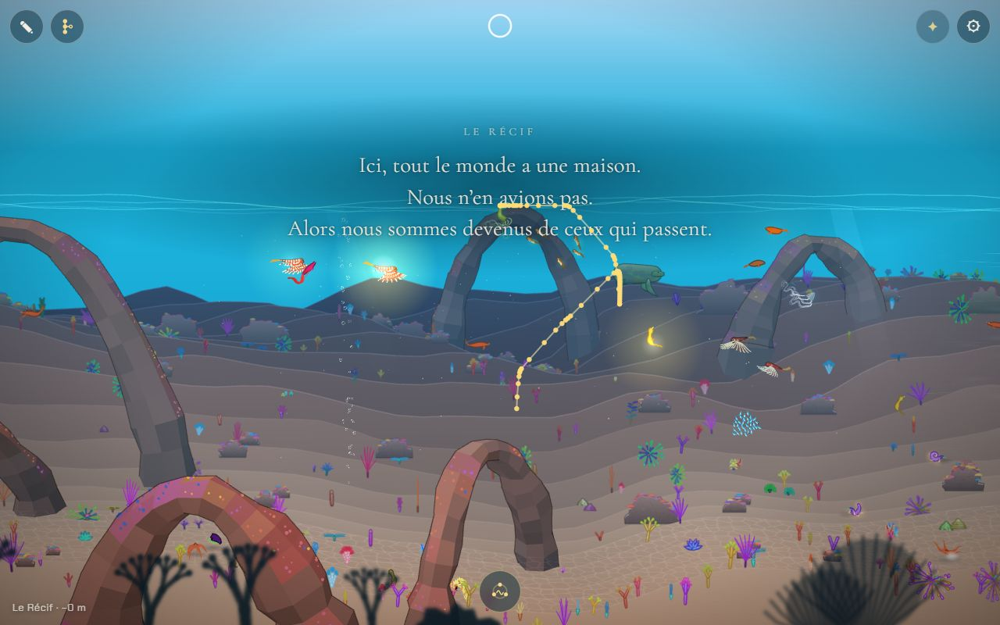
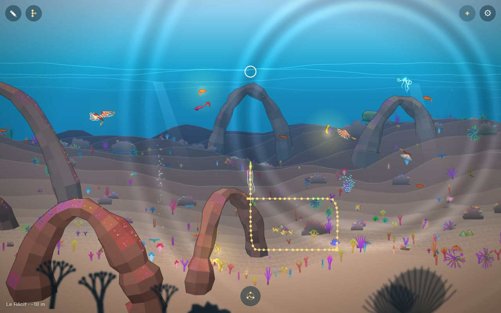
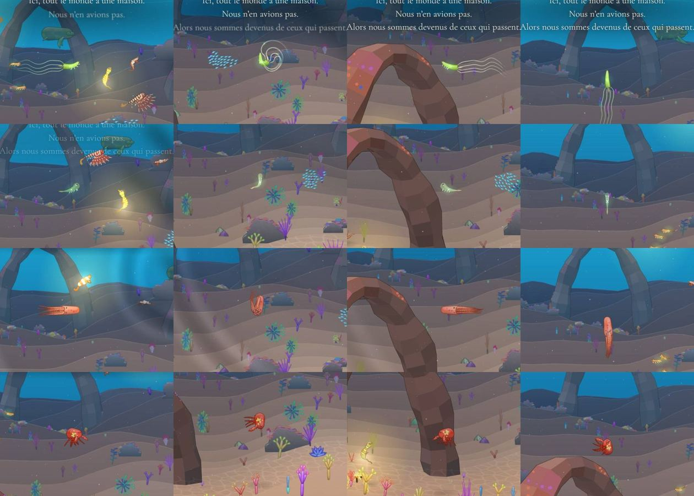

# Déplacement relou

## Livré

- **La cause** : un enfant de méduse tient souvent d'elle sa nage en cloche (`fuse()` prend la façon de nager de l'un ou de l'autre parent, `src/content/generate.ts`), parfois sur un autre corps (un têtard qui nage en cloche). La cloche (`steerBell`, `src/engine3/creature3.ts`) n'avance que selon son axe, penché de 43° au plus. Elle ne pousse qu'à chaque battement (de 0,1 à 3,7 fois l'allure) et ne sait que couler pour descendre. Lâchée, elle remonte vers la surface. Pointée vers la droite, elle part en diagonale vers le haut. Les jets (poulpe, nautile) filent aussi par à-coups, et un marcheur piloté à l'horizontale en pleine eau retombe puis remonte par saccades. Le joueur va toujours à 2,6 px par pas, et le jeu lissait déjà les saccades et les pulsations des poissons pour lui (`swimFactor3` ne sert qu'aux animaux de la mer). Les cloches et les jets avaient été oubliés.
- **Piloter** (`src/engine3/pilot.ts`, nouveau, pur, testé) : un drapeau `pilot` sur `Creature3`, posé sur le nageur du joueur seulement, d'une ligne dans `steer()` de `main.ts`. Trois branches courtes dans `creature3.ts` :
  - **cloche** : elle va là où on le lui dit (`dvx`, `dvy`), dans toutes les directions. Chaque battement n'est plus qu'un petit élan (`surge`, de 0,8 à 1,6 fois l'allure, 1 en moyenne sur un battement, `SURGE = 0.2`). Lâchée, elle reste sur place et bat doucement (`hover`, nul en moyenne). Elle penche et bat comme avant.
  - **jet** : il va vers le doigt quel que soit le sens de son manteau, avec le même élan, un peu moins vite pendant un demi-tour (`turnPace`, 0,7 à 1). Le manteau tourne, file devant les bras et tombe bras en avant comme avant.
  - **marcheur** : en pleine eau, piloté, il garde la profondeur qu'on lui donne (`crawlRise(dvy, gap, steered)`). Au sol, ou lâché, rien ne change : il retombe doucement sur ses pattes.
  - **glisse** (poissons, saccades, pulsations) : rien ne change, le test le vérifie.
- **Les animaux de la mer** ne sont pas pilotés : leurs branches restent exactement celles d'avant (`pilot` vaut `false`).
- **Mesures** (sonde sur les 43 espèces et 60 enfants de portées avec chaque méduse ; le doigt à 300 px dans chaque direction) :

  | Nage | Pour atteindre le doigt | Écart à la route | Irrégularité de l'allure | Pilotée à l'horizontale 3 s |
  | --- | --- | --- | --- | --- |
  | cloche, avant | 7,6 à 8 s, 2 à 5 cibles manquées sur 8 | 31 à 40° | 1,1 à 1,4 | monte de 300 à 390 px |
  | cloche, pilotée | 2,1 s, aucune manquée | 7 à 8° | 0,21 à 0,29 | 0 px |
  | jet, avant (poulpe, nautile) | 2,7 à 3,1 s | 21 à 24° | 1,0 à 1,2 | |
  | jet, piloté | 2,2 à 2,3 s | 7° | 0,28 | |
  | marcheur en pleine eau, avant / piloté | 2,2 s | 11° / 8° | 0,2 | descend de 84 px / 0 px |
  | poisson (inchangé) | 2,3 s | 19° | 0,14 | 0 px |

  En jeu (Chrome Windows, le pointeur à 230 px du nageur, le long d'un carré, un enfant de la larve et de la méduse-boîte qui nage en cloche) : avant, 49° d'écart, 84 px/s, irrégularité 1,05 ; après, 5°, 131 px/s, 0,40.
- **Tests** : `src/engine3/pilot.test.ts`. L'allure d'un élan, le surplace et le demi-tour. Le marcheur piloté en pleine eau. Chaque espèce et chaque enfant de méduse va vers le doigt en moins de 3 s, à moins de 25° de sa route. Une cloche ou un jet piloté nage à niveau, à une allure plus égale qu'un libre. Une cloche lâchée reste sur place. Le poisson est inchangé.
- **Doc** : « Piloter », sous « Contrôles et interface » dans `docs/mecaniques.md`.
- **Pour le voir** : `?dev`, puis dans la console :
  ```js
  const C = await import('/src/content/index.ts'), P = await import('/src/content/portee.ts');
  monde.gotoBiome(1);
  monde.becomes(P.brood(C.firstAncestor(), C.SPECIES.meduseBoite(), { seed: 11 }).find((k) => k.spec.swim.mode === 'bell').spec);
  ```
  Puis nager à la souris ou du doigt. On peut aussi jouer directement `SPECIES.meduse()`, `poulpe()` ou `crabe()`.

Avant : on mène un enfant de méduse (nage en cloche) le long d'un carré, le pointeur (le cercle blanc) toujours à 230 px de lui. Il monte jusqu'à la surface, n'arrive pas à descendre, et ses points (un tous les 0,12 s) se serrent puis s'écartent à chaque battement.


Après : le même enfant, les mêmes gestes. Il dessine le carré, à une allure presque égale.


Les corps gardent leur nage, pilotés vers la droite, le bas, la gauche et le haut. Ligne 1, l'enfant-méduse, la cloche droite et ses filaments derrière lui. Ligne 2, un enfant au corps de têtard qui nage en cloche. Ligne 3, le poulpe, qui descend bras en avant. Ligne 4, le crabe en pleine eau, qui rame à niveau.


## Choix retenus

| Question | Choix retenu | Pourquoi |
| --- | --- | --- |
| Où aider le joueur | Dans le moteur, un drapeau `pilot` posé sur le nageur, avec des règles pures dans `pilot.ts` | Le corps garde sa nage (inclinaison, battement, demi-tours) et seule sa route change ; trois branches courtes, une ligne dans `main.ts` |
| Ce qui reste du battement dans la route | Un petit élan, de 0,8 à 1,6 fois l'allure (`SURGE = 0.2`) | On sent encore la méduse battre, sans à-coup (irrégularité ≈ 0,25, contre 0,14 pour un poisson et 1,2 avant) |
| La cloche qui descend | Elle descend à l'allure du doigt, la cloche toujours droite | Le chantier demande un pilotage simple ; la direction artistique garde la cloche droite |
| La cloche lâchée | Elle bat sur place, sans dériver | Avant, elle montait vers la surface dès qu'on levait le doigt |
| Le jet qui se retourne | Un peu moins vite (×0,7 au plus fort du demi-tour) | Le demi-tour reste lisible, mais le jet ne s'arrête plus (×0,2 avant) |
| Le marcheur en pleine eau | Piloté, il garde sa profondeur ; lâché, il retombe comme avant | Plus de saccades haut-bas ; « lâchés, ils retombent doucement » reste vrai |
| Les poissons | Inchangés | Ils se pilotaient déjà bien (2,3 s, 19°) et servent de référence ; le chantier dit de ne pas casser les nages |
| Les scènes qui mènent le nageur (danse, adieu, Remontée) | Pilotées elles aussi | Le drapeau suit le nageur ; une méduse suit mieux la danse et l'adieu |

Aucune question posée par le tableau de bord : la consigne laissait chaque choix à l'option recommandée.

## Options non retenues

- **Où aider le joueur** :
  - Faire glisser comme un poisson toute créature pilotée. Le plus simple, mais la méduse se coucherait à l'horizontale et le poulpe perdrait ses jets : cela casse les nages.
  - Corriger la position après le moteur, dans `main.ts`. Pas de changement du moteur, mais on se bat contre lui (deux mouvements à la fois, un cap qui ne suit plus) et on alourdit `main.ts`, le fichier le plus partagé.
  - Changer `fuse()` pour que la nage en cloche n'aille qu'à un corps en cloche. Les enfants seraient plus cohérents, mais une méduse pure resterait difficile à piloter, et c'est une règle d'hérédité durable (les portées changent) ; c'est un autre chantier.
  - Adoucir les battements et les jets de tout le monde. Les animaux de la mer perdraient leur caractère, et le joueur n'y gagnerait qu'à moitié (la cloche ne descend toujours pas).
- **Ce qui reste du battement** :
  - Rien (allure parfaitement égale) : le plus docile, mais la méduse glisse sans vie.
  - Un élan plus fort (`SURGE` à 0,3 et plus) : plus vivant, mais les à-coups reviennent sur une méduse lente (siphonophore, 0,3 battement/s).
- **La cloche qui descend** :
  - Plus lentement que le doigt, comme une méduse qui se laisse couler : plus vrai, mais c'est l'un des reproches (« ne suit pas »).
  - Retourner la cloche pour plonger : contraire à la direction artistique (« seules les méduses gardent leur cloche droite »).
- **La cloche lâchée** : la laisser monter doucement comme les méduses de la mer. Vivant, mais on dérive dès qu'on lâche.
- **Le jet qui se retourne** : à pleine allure (le demi-tour devient une glissade sur le côté) ; ou comme avant, presque à l'arrêt (×0,2, l'à-coup des demi-tours reste).
- **Le marcheur en pleine eau** : le garder comme avant (il retombe dès qu'on ne monte plus, cohérent avec « un marcheur suit le fond », mais on zigzague) ; ou le faire flotter même lâché (il ne retomberait plus sur ses pattes).
- **Les poissons** : les rendre plus vifs (la route mêlée de la direction du doigt) pour réduire l'écart de 19°. Ils glisseraient de côté, et rien ne le demandait.

## Reste à faire / limites

- L'allure du joueur est la même pour toutes les espèces (2,6 px par pas, comme avant) : la vitesse propre d'une espèce (`swim.speed`) ne joue toujours que pour les animaux de la mer.
- Les enfants qui nagent en cloche sur un autre corps (un têtard, un poisson) gardent cette posture, la tête vers le haut, qui peut surprendre. Rendre la nage d'un enfant cohérente avec son corps relèverait de la fusion (`fuse()`) : à proposer comme chantier si la posture déplaît.
- Pas vérifié sur un vrai téléphone : le pilotage au doigt passe par le même chemin que la souris (`input.follow`), et le calcul ajouté est de quelques multiplications par pas.

## Risques de fusion

- `src/engine3/creature3.ts` : un import, un champ `pilot`, une branche `if (this.pilot)` à la fin de `steerBell` et de `steerJet`, et un troisième paramètre (facultatif) à `crawlRise`. Le comportement sans `pilot` est identique, ligne pour ligne.
- `src/monde/main.ts` : deux lignes au début de `steer()` (`a.cr.pilot = a === player`).
- `docs/mecaniques.md` : une sous-section « Piloter » sous « Contrôles et interface », et un renvoi sur la ligne « Un doigt ».
- Nouveaux fichiers : `src/engine3/pilot.ts`, `src/engine3/pilot.test.ts`.
