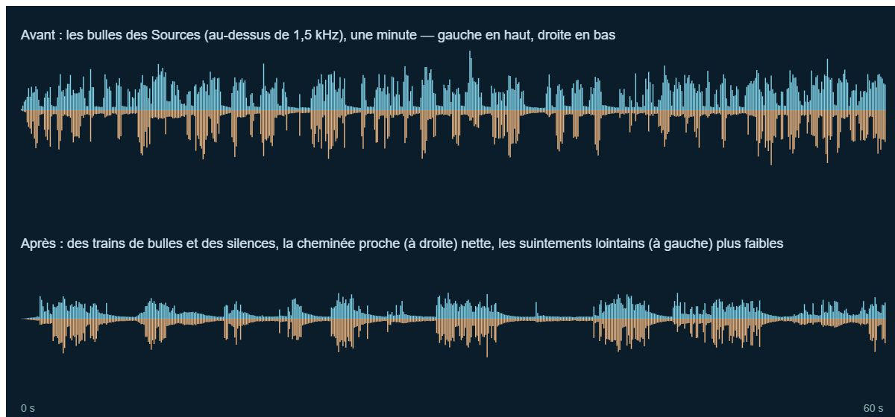
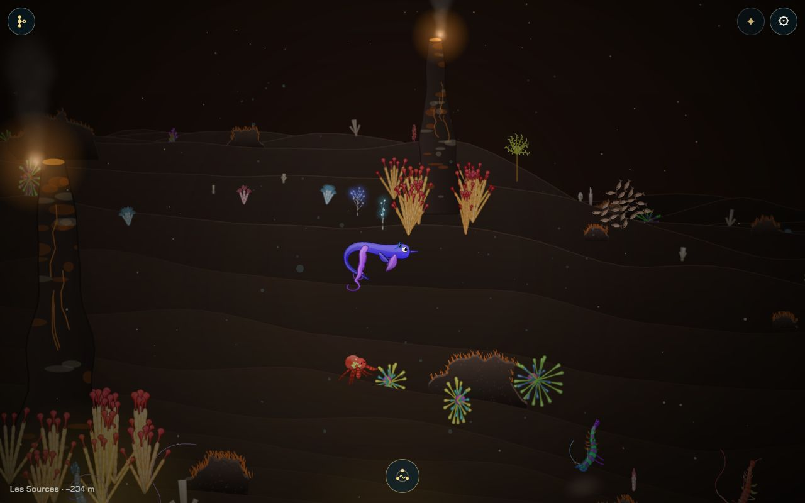
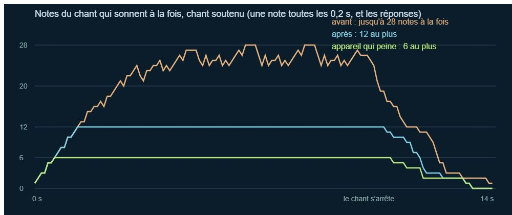

# La distance des sons (et les coupures du son sur téléphone)

## Livré

**La distance des sons** (commit `ac3bbe5`)

- **`src/monde/ecoute.ts`** (nouveau, pur et testé) : `hear(dx, dy, dz, portée, pan?)` donne ce qu'on entend d'une chose qui sonne : force (`g = portée / (portée + d)`), côté (la place à l'écran si on la connaît, sinon dx avec la perspective), passe-bas (12 kHz près, 1,7 kHz vers 1500 px) et part de réverbération seule (`wet`, qui grandit avec la distance). Trois portées : petite (bulles, cristaux, 260 px), moyenne (gouttes, baleines, réponses au chant, 500 px), grande (glace qui craque, 1100 px). `heard()` de `bruits.ts` délègue à `hear` (même signature, deux paramètres optionnels en plus).
- **Bruits** (`bruits-son.ts`) : chaque bruit passe par `way()` avec ce `Heard` : passe-bas seulement s'il coupe, panoramique stéréo seulement hors du milieu, envoi vers la réverbération commune (`G.far`) selon la distance. Le côté vient de la projection de la vue (`pan` des dépendances, branché dans `main.ts`). Le grondement des cheminées vient du côté de la plus proche (un `StereoPanner` sur le fond, qui saute de valeur).
- **Les bulles en trains** (`bruits.ts` : `train`, `trainsOf`, `springTrains`, `bubblingAt`) : un suintement souffle 0,3 à 4 s puis se tait 2,5 à 12 s ; une cheminée 1 à 5 s, puis 2,5 à 9,5 s ; çà et là, un train court d'un même endroit. Chaque suintement ou cheminée a son calendrier, tiré de sa graine, sur l'horloge de la page : **les bulles qu'on voit** (`main.ts`, émission des `Puffs`) suivent les mêmes trains, une seule de temps en temps entre deux. On n'entend plus que les sources à moins de 1000 px (au lieu de 1300), à petite portée. Mesure (Sources, une minute, bulles au-dessus de 1,5 kHz) : présentes 34 % du temps au lieu de 66 %, 5 dB plus bas. Dans le jeu, au milieu des Sources : 4 salves/s au lieu de ~8.
- **Les animaux qui répondent au chant** (`chant-jeu.ts`, `chant-son.ts`) : `hear` depuis le chanteur, côté de l'écran ; la note lointaine passe par un passe-bas et envoie sa part dans la réverbération par un nouvel envoi du chant, `voiceFar` (`son.ts`, suit le volume « Chant »). Mesure : une réponse à 100 px −35,5 dB, à 400 px −43 dB, à 760 px −48 dB (passe-bas à 4,3 kHz).

**Les coupures du son sur téléphone** (commit `76039d3`)

- **Mesure** (Chrome Windows, rendu hors ligne, 48 kHz) : un chant soutenu (une note toutes les 0,2 s, une réponse toutes les 0,3 s) faisait sonner **jusqu'à 28 notes à la fois** et ne se calculait plus que **8 fois plus vite que le temps réel** sur ordinateur, 7 avec la musique (contre 26 à 36 pour une ambiance seule). Un téléphone étant 5 à 10 fois plus lent, c'est la coupure. Une note coûte environ 0,4 % d'un cœur d'ordinateur tant qu'elle vit ; la réverbération seule 0,8 %.
- **Plafond et vol** (`src/monde/voix.ts`, nouveau, pur et testé ; `chant-son.ts` : `singer`) : 12 notes au plus ; pour une nouvelle, celle qui s'entend le moins à cet instant (crête × décroissance) s'efface en ~12 ms (`cancelAndHoldAtTime` puis `setTargetAtTime`), ses sources s'arrêtent 80 ms après et ses nœuds sont libérés comme à la fin d'une note. Une note qui monte encore est gardée. Chant soutenu : 11,8× le temps réel au lieu de 8 ; l'écart avec le chant sans plafond reste 26 dB sous le chant.
- **Moins de nœuds par note, même son** : une note s'arrête 40 dB sous sa crête (au lieu de 48) ; les partiels sinusoïdaux multiples l'un de l'autre sonnent par un seul oscillateur à onde périodique (`harmonicsOf`, onde non normalisée) ; pas de gain pour un partiel de force 1. Écart avec l'ancien son, timbre par timbre : −40 dB (la fin de note). Coût : autour de −15 % (−27 % le Jardin), mesure bruitée par la charge de la machine (7 agents).
- **Quand l'appareil peine** (`son.ts`, `Strain`) : Chrome expose `AudioContext.playbackStats.underrunEvents` (vérifié dans Chrome 154) ; dès un décrochage, et pendant 90 s après le dernier, le chant se limite à 6 notes sans ses partiels de moins de 0,1, les bruits à 14 voix au lieu de 28. Ailleurs (Safari, Firefox), seul le plafond joue.
- **Sur téléphone** (pointeur grossier), le contexte audio est créé avec `latencyHint: 'balanced'` : un tampon un peu plus grand, contre les petites coupures de temps en temps.
- **Pour mesurer sur un vrai téléphone** (débogage à distance) : `monde.chant.voice.ringing` (notes vivantes), `monde.musique.son.underruns` (décrochages et leur durée), `monde.musique.son.strained`, `monde.bruits.voices`.

Docs : `docs/direction-artistique.md`, « Le son » (la distance des sons, les trains de bulles, le coût du chant soutenu, l'appareil qui peine).

## Choix retenus

Aucune question posée au tableau de bord : tous les choix sont `auto` (option recommandée).

| Question | Choix retenu | Pourquoi |
| --- | --- | --- |
| Comment spatialiser | Gain + passe-bas (s'il coupe) + `StereoPanner` (hors du milieu) + envoi vers la réverbération commune | Les nœuds les moins chers ; le chantier interdit un panoramique 3D par bruit |
| D'où vient le côté | La projection de la vue (place à l'écran), dx en repli hors ligne | Ce que demande le chantier : « selon sa place à l'écran » |
| La loi de distance | `portée / (portée + d)`, une portée par sorte de son | Simple, la même pour tous ; les petits sons (bulles) portent moins |
| Plus réverbéré au loin | Une part envoyée à la réverbération seule, qui grandit comme `1/√g − 1` | Pas de réverbération de plus : la commune, déjà payée |
| Les trains de bulles | Un calendrier par source tiré de sa graine, sur l'horloge de la page, partagé par le son et l'image | Ce qu'on voit et ce qu'on entend restent d'accord, même son coupé |
| Ordre chantier / sous-tâche | Le chantier d'abord, puis les coupures (consigne de l'orchestrateur) | Le backlog demandait l'inverse ; le budget a été tenu dès le chantier (nœuds bon marché) |
| Quelle note voler | La plus faible à l'instant | Ce que l'oreille perd le moins ; souvent la plus ancienne ou une réponse lointaine |
| Plafond | 12 notes, 6 si l'appareil peine | 12 : écart −26 dB avec le chant libre ; 6 : calcul ×2 plus léger |
| Savoir que l'appareil peine | `playbackStats.underrunEvents` de Chrome | Mesure directe des coupures, sans deviner par le modèle d'appareil |
| Latence sur téléphone | `latencyHint: 'balanced'` sur pointeur grossier | Moins de coupures pour quelques ms de plus entre le doigt et la note |

## Options non retenues

- **Spatialiser** : `PannerNode` HRTF (vrai 3D, mais très cher par bruit, interdit par le chantier) ; `PannerNode` « equalpower » (moins cher, mais des nœuds en plus et une loi de distance moins maîtrisée) ; un seul bus par côté (gauche, milieu, droite) avec un filtre par bus (le moins cher, mais des positions par paliers et un filtre commun).
- **Le côté** : dx seul en px du monde (indépendant du zoom, mais faux quand la caméra n'est pas centrée sur le nageur) ; angle depuis le nageur (plus « physique », moins lisible que l'écran).
- **La distance** : loi en 1/d² (plus réaliste, trop brutale à l'écran) ; une seule portée pour tous (plus simple, mais les bulles resteraient trop présentes).
- **La réverbération au loin** : une seconde réverbération plus longue pour les sons lointains (meilleure profondeur, coût doublé) ; rien de plus que l'envoi du bus (moins cher, mais pas de profondeur).
- **Les trains** : tirés au hasard par le moteur du son seulement (plus simple, mais les bulles vues ne suivraient pas) ; un bruit de Perlin sur le débit (plus doux, sans vrais silences).
- **Quelle note voler** : la plus ancienne (simple, mais coupe parfois une note encore forte) ; d'abord les réponses des animaux (coupe des réponses fraîches et audibles) ; ne rien voler et refuser les nouvelles notes (le doigt ne serait plus entendu).
- **Plafond** : 8 (plus léger, écart audible) ; 16 (plus fidèle, la moitié du gain seulement) ; un plafond selon `navigator.hardwareConcurrency` (devine sans mesurer).
- **Savoir que l'appareil peine** : comparer `currentTime` à `performance.now()` (marche partout, peu fiable) ; le modèle ou le pointeur de l'appareil (allège même les téléphones rapides).
- **Alléger quand l'appareil peine** : raccourcir la réverbération (de 2,4 à 1,6 s : ~1/3 de son coût, mais un changement de tampon s'entend une fois et la queue change) ; couper la musique d'un chapitre voisin plus tôt ; réduire la fréquence d'échantillonnage du contexte (gros gain, mais il faudrait recréer le contexte, et tout s'entend plus sourd).
- **Latence** : `'playback'` (encore moins de coupures, mais ~100 ms de retard sur le chant) ; rien changer.

## Reste à faire / limites

- **Pas de vrai téléphone ici** : les mesures sont faites hors ligne dans le Chrome d'un ordinateur, sous la charge de 7 agents (temps bruités). À vérifier sur un téléphone Android (débogage à distance, compteurs ci-dessus) et sur iPhone (Safari n'a pas `playbackStats` : seul le plafond y joue).
- `musique-son.ts` n'est pas modifié : la musique seule coûte peu (26 à 36× le temps réel) et ses filtres sautent déjà de valeur ; le chant soutenu était la cause.
- Le mode allégé ne revient pas en arrière pendant une note ; il dure 90 s après la dernière coupure.
- Les bulles « çà et là » (sans source visible) restent tirées au hasard, en trains courts.
- Écouté par mesure, pas à l'oreille : le niveau des réponses lointaines (−12,5 dB entre 100 et 760 px, contre −7 avant) et le rythme des trains sont à juger en jouant.
- Pour `vrais-sons-ambiance` : jouer un enregistrement « à travers la distance des sons » = passer par `way()` de `bruits-son.ts` avec `at(dx, dy, dz, portée)`.

## Risques de fusion

- `src/monde/main.ts` : un import (`panOnScreen`), `bubblingAt`/`springTrains` ajoutés à l'import de `./bruits`, un `Proj` (`heardAt`) et une ligne `pan:` dans `initBruits`, deux lignes dans l'émission des bulles des cheminées et suintements.
- `src/monde/bruits-son.ts` : le plus touché (`way`, `at`, trains, panoramique du grondement, plafond selon `strained`) ; à fusionner avec soin si `vrais-sons-ambiance` ou `musiques-qui-changent` y touchent.
- `src/monde/bruits.ts` : `heard` délègue à `ecoute.ts` (même signature, plus large) ; `train`, `trainsOf`, `springTrains`, `bubblingAt` ajoutés.
- `src/monde/chant-son.ts` : `sound` rend maintenant la note (`Rung`) au lieu de rien, `singer` ajouté, options `far` et `light` ; `Voice.ringing`.
- `src/monde/son.ts` : `voiceFar` dans le `Graph`, `latencyHint`, `strained` et `underruns` dans `Son`.
- `src/monde/chant-jeu.ts` : la ligne de la note d'une réponse.
- `docs/direction-artistique.md` : section « Le son » (bulles, grondement, la distance des sons, le coût).
