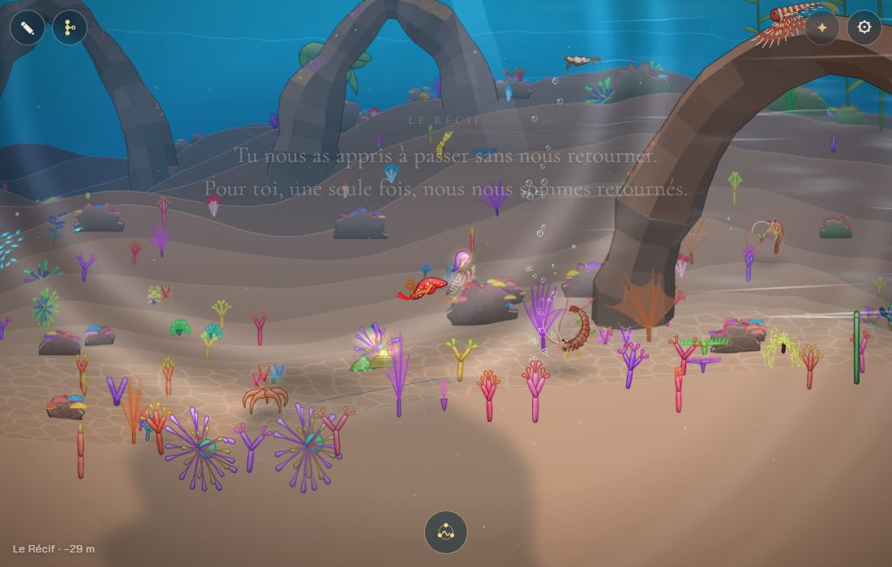
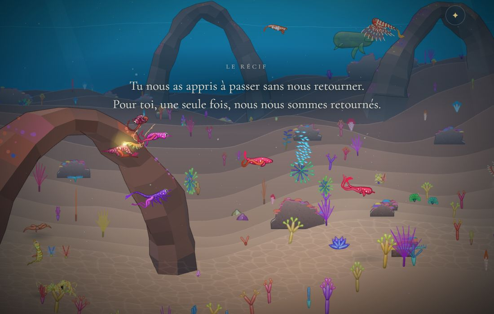
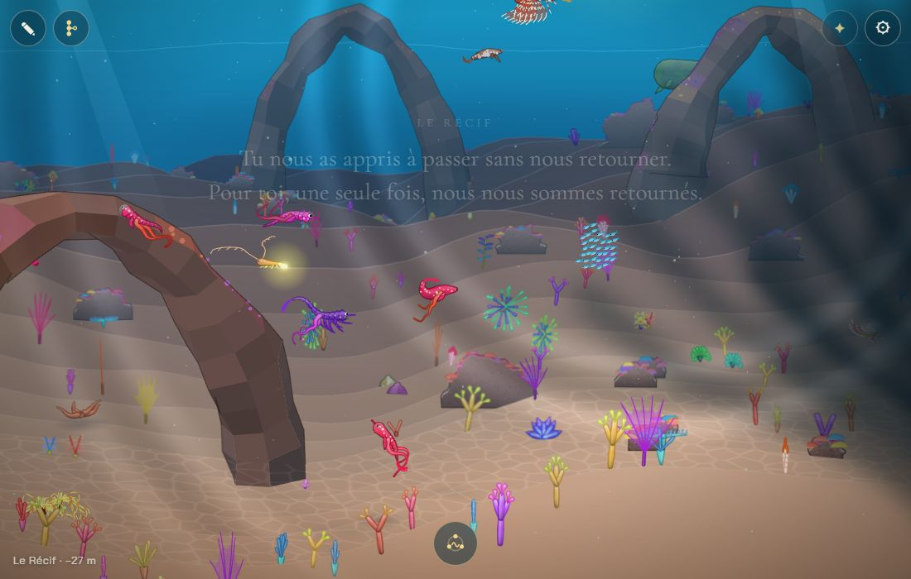

# L'enfant reste près de ses frères

## Livré

- **La sortie de l'adieu, raccourcie et lente** (`src/monde/adieu.ts`) : après le tour du parent (inchangé, 3 s, les mots à 1,2 s), l'enfant vise un point à 300 px devant le parent (30 px plus bas), à 0,6 puis 1 px par pas (36 à 60 px/s, contre 2,4 px par pas avant et 1 000 px visés). On reprend la main dès qu'il est à 170 px du parent (`APART`, 720 avant), au plus tard à 9 s (`T.end`, 11 avant). En jeu, la scène dure 7 à 9 s, et l'enfant finit à ~200 px de son œuf.
- **Le parent regarde** : il se penche un peu vers l'enfant (0,4 px par pas, jusqu'à `T.stop` = 4,2 s), puis s'arrête et le suit de la tête. Après la scène, il continue de nous regarder sans venir vers nous tant qu'on est à moins de 520 px (`GONE`, `watchGoal` ; branché dans `adieu-jeu.ts`). Avant, `stayGoal` l'aurait fait venir à notre rencontre dès la fin de la scène, puisqu'on n'est plus qu'à 200 px. Au-delà de 520 px, il retrouve `stayGoal` (il dérive, et vient à notre rencontre quand on revient).
- **La caméra** se rapproche des deux comme avant, puis rend la vue peu à peu autour de l'enfant (`close` passe de 1 à ~0,3 entre 80 et 170 px), le parent toujours dans le cadre.
- **Les frères et sœurs** : rien n'a changé pour eux. Ils sortent de leurs œufs juste après l'enfant choisi et vivent là où ils sont nés (des `swim` de `main.ts`, `ponte-jeu.ts`) ; ils restent maintenant à l'écran parce que l'enfant reste près d'eux.
- Tests : `src/monde/adieu.test.ts`, réécrits sur la nouvelle règle (une sortie courte et lente, une fin rapide, le parent qui reste et regarde, `watchGoal`).
- Doc : « L'adieu » dans `docs/mecaniques.md`.
- Pour le voir : `?dev`, puis `monde.gotoBiome(1)`, `monde.openPortee('poissonClown', 0.9)`, puis `monde.portee.choose(0)`.

Avant : à la fin de la scène, l'enfant est seul, à 1 000 px de son parent et de ses frères.

Après, pendant les mots : l'enfant (rouge) s'écarte de la larve lumineuse, le parent, et ses frères sont tout autour.

Après, la main rendue : l'enfant au centre, le parent qui le regarde à gauche, les frères et sœurs autour.

## Choix retenus

| Question | Choix retenu | Pourquoi |
| --- | --- | --- |
| Jusqu'où l'enfant s'écarte | 170 px du parent (vise 300 px, s'arrête dès 170) | Les frères (à ±100 px des œufs) restent dans le cadre de la caméra resserrée |
| Quand on reprend la main | Dès 170 px, au plus tard à 9 s (7 à 9 s en tout) | « Tout de suite » après le tour et les mots, sans couper l'émotion |
| Le tour du parent | Gardé tel quel | C'est le cœur de l'adieu ; le chantier ne vise que la sortie |
| Le parent après la scène | Il nous regarde sans nous suivre jusqu'à 520 px | Sinon `stayGoal` le faisait venir à nous juste après l'adieu, ce qui l'annulait |
| Les frères et sœurs | Rien de nouveau : ils vivent où ils sont nés | Le chantier dit « restent là et vivent leur vie », c'est déjà ce qu'ils font |
| Le texte et l'assombrissement | Le texte finit de s'effacer après la main rendue ; les bords de la mer et les boutons reviennent avec la main | Garder les mots sans retenir le joueur ; les boutons cachés plus longtemps gêneraient |

## Options non retenues

- **Distance** : 250 à 300 px (on voit mieux la séparation, mais les frères sortent du cadre resserré) ; 100 px (presque collés, la sortie ne se voit plus).
- **Fin de la scène** : à la fin des mots (texte lié à la scène ; plus long, contraire à « tout de suite ») ; tout de suite après le tour, sans sortie (plus de séparation visible du tout).
- **Le tour du parent** : le raccourcir (2 s) pour rendre la main plus tôt (perd le moment le plus touchant) ; le supprimer.
- **Le parent après la scène** : le laisser venir à notre rencontre comme avant (`stayGoal`, il colle à l'enfant juste après l'adieu) ; un délai fixe (6 à 8 s) de regard puis `stayGoal` (simple, mais il nous rejoint si on reste près de lui, ce qui casse l'adieu).
- **Les frères et sœurs** : les faire se regrouper autour de l'enfant pendant la scène (plus de code dans `main.ts`, fichier très partagé, pour un gain faible) ; les faire suivre l'enfant comme les larves-sœurs de la première génération (contraire au chantier : ils restent là).
- **Garder l'assombrissement et les boutons cachés tant que les mots sont là** (plus d'émotion, mais la main rendue avec l'interface encore cachée prête à confusion).

## Reste à faire / limites

- La durée réelle dépend du tour du parent dans le moteur (l'enfant n'y suit pas exactement le cercle) : en jeu, 7 à 9 s ; si l'enfant n'atteint pas 170 px (un rocher), la scène finit à 9 s comme avant à 11 s.
- Les frères ne réagissent pas au départ de l'enfant ; on pourrait les faire se tourner vers lui un moment.

## Risques de fusion

- `src/monde/adieu.ts` : la phase de départ, les constantes `T`, `APART`, `AWAY`, ajout de `GONE` et `watchGoal`.
- `src/monde/adieu-jeu.ts` : un parent « qui regarde » (`watching`) dans `end()` et `parentGoal`. Le voisin `declencher-accouplement` (la danse à deux avant les œufs) pourrait toucher le même fichier : changements courts, à garder des deux côtés.
- `docs/mecaniques.md`, section « L'adieu » seulement.
- `main.ts` : non touché.
