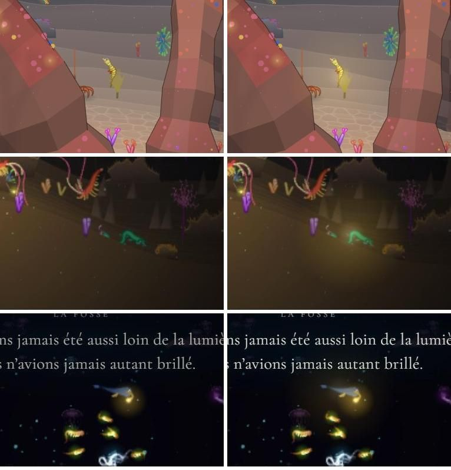
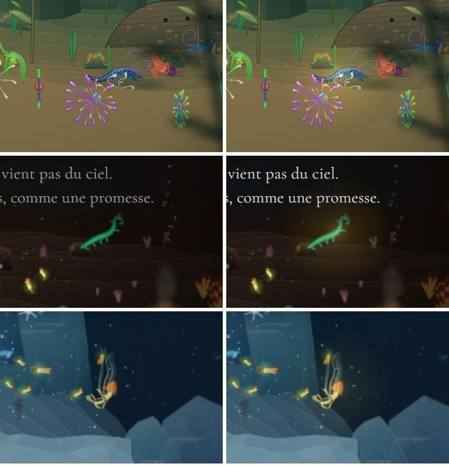
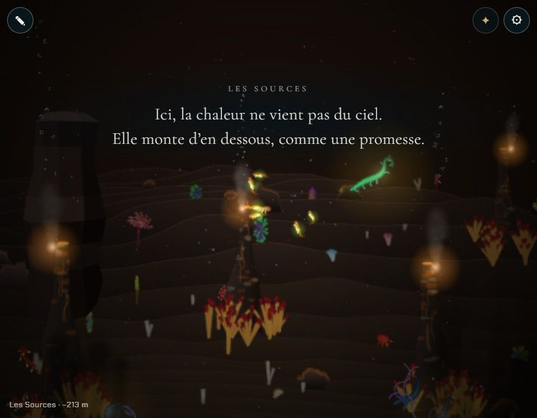

# Les espèces compatibles et leur lueur

## Livré

- **Les partenaires de chaque chapitre** (`src/monde/partenaires.ts`, `PARTNERS`) : ceux de [chapitres.md](../../../docs/chapitres.md), plus la **méduse-boîte** au Récif (pulsation, le second trait que retient obstacles-cles) et le **serpent cilié** aux Sources (cils : le ver de feu n'a que des soies, rôle `sting`).
- **Toujours à portée** : un animal d'une espèce partenaire est marqué (`actor.partner` = index du chapitre) s'il vit dans le plan de nage (|z| < 60) et entre le début de son chapitre et la retenue de son obstacle (`meetRange`). La faune en place déjà ; `partnerSpawns` complète pour qu'il y en ait au moins 2 de chaque espèce par chapitre, répartis sur sa longueur (environ 25 animaux de plus sur toute la carte).
- **La lueur** : un halo doré (teinte 45) sur le milieu du corps, poussé dans les `lights` du monde (donc après le noir, en canvas comme en WebGL). Il naît à 650 px du nageur, est plein à 160 px, respire lentement (`partnerGlow`), un peu plus fort en eau claire (`env.water`).
- **On ne se bloque jamais** : `uncovered(chapter, keys, traitsOf)` dit quels traits d'un obstacle aucun partenaire n'apporte ; le test vérifie que c'est vide pour les 7 obstacles (le chant de la Fosse est ignoré, ce n'est pas un trait du corps).
- **API de test** : `monde.partners()` ; `monde.skip.add('partner')` éteint la lueur (captures avant / après).
- Tests : `src/monde/partenaires.test.ts` (9). Docs : [mecaniques.md](../../../docs/mecaniques.md#les-espèces-compatibles), partenaires du Récif et des Sources dans [chapitres.md](../../../docs/chapitres.md).

Avant / après (lueur éteinte à gauche, allumée à droite) : hippocampe au Récif, serpent cilié dans la Grotte, baudroie dans la Fosse.

Homard dans la Forêt, serpent cilié aux Sources, méduse ortie au Glacier.

## Choix retenus

Aucune question posée à l'utilisateur ; tout est tranché (`auto`). Noms des traits et table des clés alignés par message avec traits-corps et obstacles-cles.

| Question | Choix retenu | Pourquoi |
| --- | --- | --- |
| Où marquer les partenaires | Nouveau module `partenaires.ts` (`PARTNERS` par chapitre) | Additif ; `biomes.ts` intact |
| Qui est partenaire | Toute bête d'une espèce partenaire, dans le plan de nage et à portée dans son chapitre | Une lueur promet qu'on peut la rejoindre |
| Combien | Au moins 2 de chaque espèce par chapitre, en complément de la faune | Toujours de quoi choisir, sans trop charger |
| Couverture des traits | Chaque trait du corps de chaque obstacle apporté par au moins un partenaire | Garde le choix entre deux voies |
| Pulsation au Récif | Méduse-boîte | Vit vraiment dans les récifs ; pulse et a des filaments |
| Cils aux Sources | Serpent cilié (déjà dans la faune des Sources) | Aucun partenaire prévu n'a de cils |
| Forme de la lueur | Halo doré qui respire, de 650 à 160 px | Doux, lisible, distinct des lueurs bleues et vertes du fond |

## Options non retenues

- **Où marquer** : un champ `partners` dans `Biome` (proche des données, mais touche `biomes.ts`, que d'autres refont) ; un drapeau sur l'espèce (`Spec`) (une espèce est partenaire dans un chapitre, pas dans l'autre).
- **Qui est partenaire** : toutes les bêtes de l'espèce, même en arrière-plan (plus simple, mais la lueur promettrait des bêtes qu'on ne peut pas rejoindre) ; une seule bête désignée par chapitre (plus rare et précieux, mais facile à manquer).
- **Combien** : seulement ce que place la faune (rien à ajouter, mais une espèce peut n'avoir qu'une bête, parfois derrière l'obstacle) ; 3 ou plus (plus facile à trouver, plus d'animaux à animer).
- **Couverture** : un seul trait par obstacle suffit (moins de partenaires, mais un seul chemin).
- **Pulsation au Récif** : méduse lune (déjà à la Nurserie, moins typique d'un récif) ; chrysaora (eaux froides, gardée pour le Glacier) ; laisser le Récif sans pulsation (obstacles-cles l'a retenue : on se bloquerait sur ce trait).
- **Cils aux Sources** : donner le rôle `cilia` aux soies du ver de feu (change le bestiaire, lu partout) ; copépode (planctonique, hors de propos dans un couloir brûlant).
- **Forme de la lueur** : contour lumineux de la silhouette (plus précis, mais un rendu de plus par bête et par frame) ; particules qui montent (joli, plus coûteux, peut se confondre avec la neige et le plancton) ; teinte par chapitre (varié, mais moins reconnaissable) ; lueur visible de partout (on la verrait sans chercher, plus de découverte).

## Reste à faire / limites

- **À la fusion** : remplacer dans `partenaires.test.ts` la copie de la table des traits (`TRAITS`) par `traitsOf(SPECIES[id]())` de `src/content/traits.ts` (traits-corps), et la copie des clés (`KEYS`) par `KEYS` de `src/monde/obstacles.ts` (obstacles-cles). Les deux copies viennent de leurs messages ; si un seuil bouge, le test le dira une fois branché.
- Rien n'éteint encore la lueur d'un partenaire déjà choisi : la parade s'en chargera (`actor.partner`).
- La lueur est la même pour tous ; elle ne dit pas quel trait chaque partenaire apporte (l'écran de la portée le montrera).
- Hors du plan de nage, les bêtes des espèces partenaires ne brillent pas.

## Risques de fusion

- `src/monde/main.ts` : un import, un champ `partner` dans `Actor`, le marquage dans le bloc de création des animaux (ligne `addActor` de la faune et de la Carcasse devenue deux lignes), une fonction `pushPartnerLight` après `glacier`, une ligne dans la boucle des acteurs de `render`, `partners` dans `api`. Conflits probables avec les voisins qui touchent la création des animaux ou `api` (parade, adieu au parent) : garder les deux côtés.
- `docs/mecaniques.md` (section « Les espèces compatibles ») et `docs/chapitres.md` (partenaires du Récif et des Sources).
