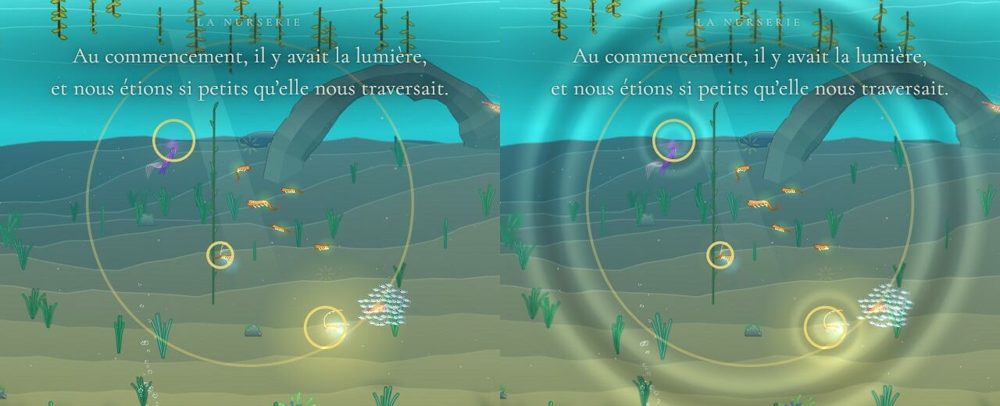
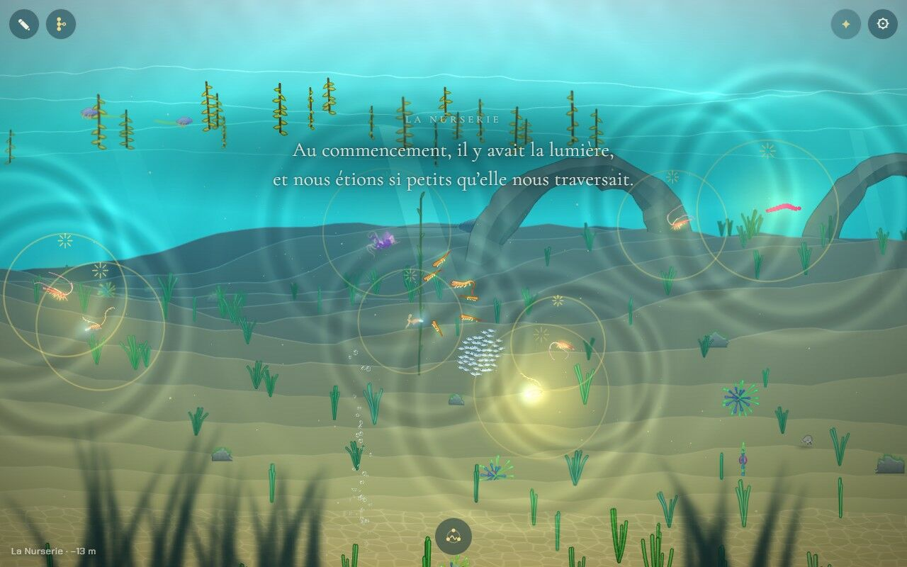
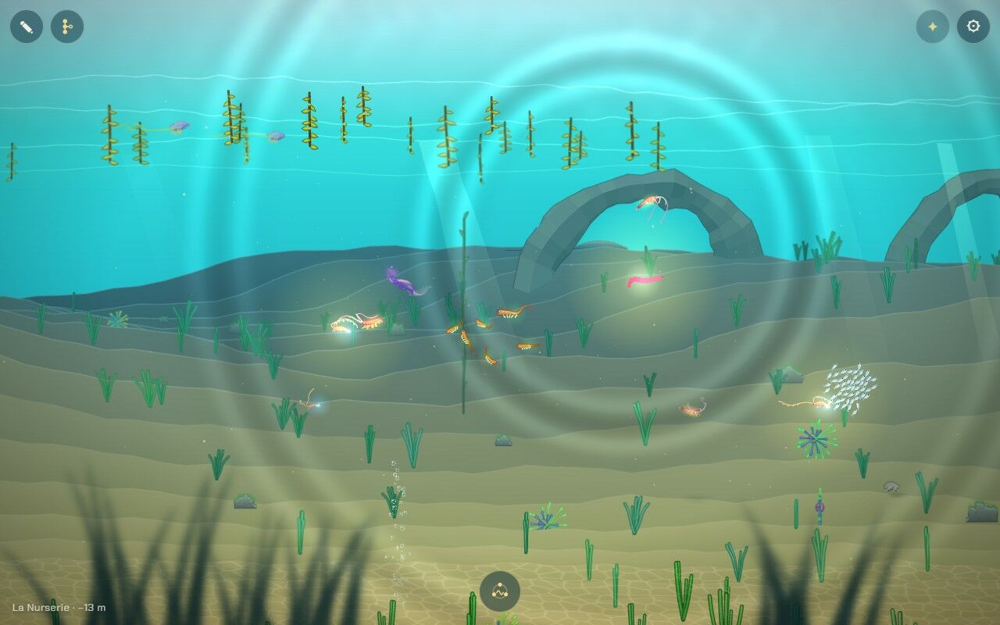
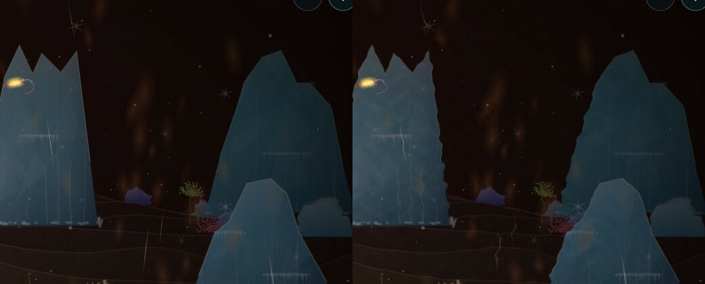
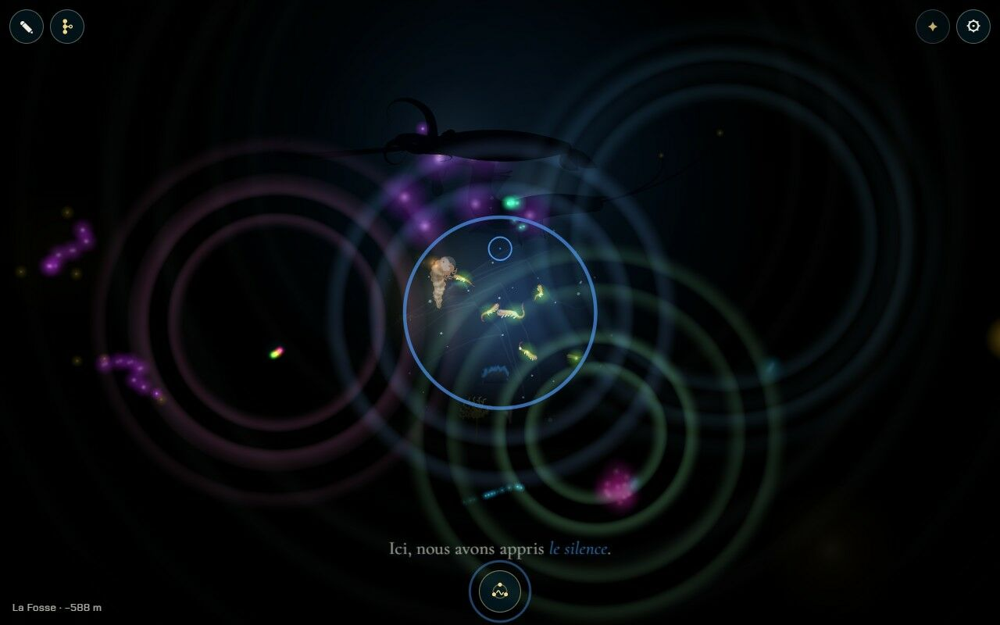
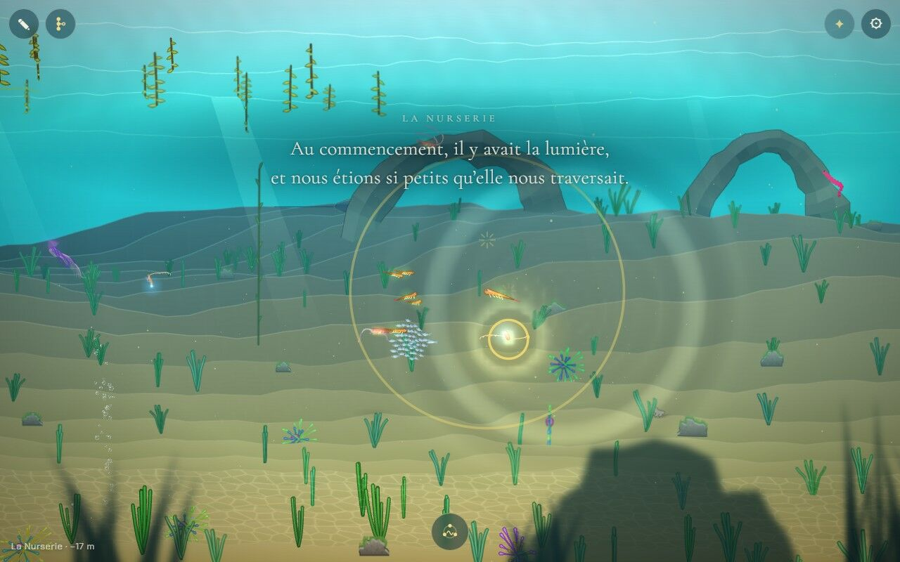
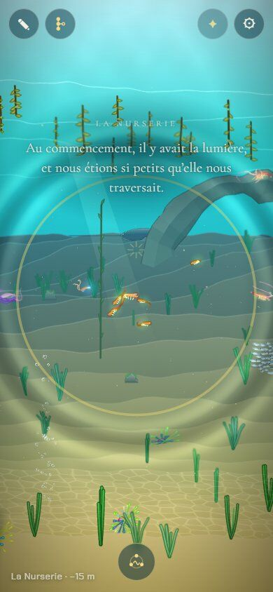

# Expérimenter des effets de déformation de l'eau

## Livré

L'eau plie maintenant la lumière : des ondes partent des animaux qui chantent ou crient, l'eau chaude et l'eau froide tremblent, la surface frémit. Trois façons de calculer ont été essayées (voir « Options non retenues ») ; celle qui est en jeu est un shader WebGL2, une « lentille » qui ne travaille que là où l'eau se plie. Une deuxième, un vrai champ de vagues simulé, est livrée comme expérience, à comparer.

**Les vagues aux moments de chant et de cri** (ce que demandait le chantier) :

- **Le chant** : chaque note chantée envoie une onde depuis le nageur, en même temps que l'anneau de lumière de la note (`chant-jeu.ts`) et un peu plus loin que lui. Le décor ondule à son passage, plus clair là où l'onde rassemble la lumière, plus sombre là où elle l'étale, et ses crêtes prennent la couleur de la note.
- **Les réponses** : chaque animal qui répond lance son onde, à sa taille ; une note apprise en fait une plus large et plus lente, le chant complet de la Remontée une par note.
- **Les cris au loin** : un grand visiteur visible (raie manta, tortue, requin-baleine, calmar, siphonophore, dragon abyssal) crie toutes les 30 à 75 s : deux longues ondes lentes, à 1,6 s d'écart.
- **La Fosse** : chaque éclat d'une lumière qui répond (ses trois éclats, ses échos, la floraison finale) fait une onde de sa couleur ; dans le noir, on ne voit que ses crêtes, des anneaux de lumière.

**L'eau qui tremble en permanence** :

- **L'eau chaude** : une colonne qui monte en s'élargissant au-dessus des quatre cheminées les plus proches (Sources) ; le couloir brûlant tremble de bas en haut, plus fort près de son passage.
- **Le froid et le courant** : l'eau glacée du Glacier ondule lentement en descendant ; le courant de la passe du Récif file vers l'arrière.
- **Le rendu** : par bouffées, avec de fines stries de lumière là où l'eau resserre l'image.
- **La surface**, vue d'en dessous, ondule.

**Ce qui reste net** : le nageur et ce qui nage près de lui (seul ce qui est derrière le plan de nage se déforme), le premier plan, les textes et les boutons. Les reflets des anneaux, eux, passent par-dessus tout, le noir de la Fosse compris. Si l'appareil demande moins d'animations (`prefers-reduced-motion`), l'eau qui tremble en permanence reste calme ; les ondes du chant, brèves, restent.

**Comment c'est fait** :

- `src/monde/ondes.ts` : les formes, en données pures et testées.
  - Les anneaux : `RINGS` par sorte, `ringAt` qui suit la croissance de l'anneau de lumière d'une note, `liveRings`.
  - Les flux : `plume`, `haze`, `surface`.
  - Les régions de l'écran à reprendre : `regions`, qui fusionne celles qui se touchent.
  - Le rythme des cris : `callGap`.
- `src/monde/ondes-gl.ts` : la lentille, deux passes d'un même shader.
  - **Plier** : au milieu de l'image, une fois peint ce qui est derrière le plan de nage, les régions concernées sont relues (un blit de l'écran multi-échantillonné vers une texture RGB8, copie en repli) et redessinées, chaque pixel déplacé.
  - **Briller** : à la fin de l'image, la lumière des crêtes des anneaux s'ajoute.
  - L'état du peintre (`engine3/gfx.ts`) est remis comme il était. Rien à plier : rien n'est fait.
- `src/monde/ondes-jeu.ts` : le branchement en jeu.
  - Les anneaux, branchés sur le chant (`chant.onLight`, nouveau), la Remontée (`remontee.onNote`), les lumières de la Fosse (lues dans `lumieres.answers`, sans toucher à `lumieres-jeu.ts`) et les visiteurs.
  - Les flux des cheminées, des obstacles (`GATES`) et de la surface.
  - Avec `?dev`, une section « Eau » dans le panneau ⚙.
- `src/monde/ondes-champ.ts` : le champ de vagues (l'expérience).
  - L'équation des ondes sur une grille de 320 × 200 cellules de 8 px, posée sur le plan de nage autour du nageur, ancrée dans le monde et qui s'enroule.
  - Neuf voisins par cellule, pour que les anneaux restent ronds ; bords absorbants ; murs dans la roche et dans l'air.
  - Pente et courbure emballées en octets pour la lentille.
- `main.ts` : des branchements courts.
  - Le pas : `ondes.step`.
  - Un élément `ondes` dans la liste triée par profondeur, juste derrière le plan de nage.
  - `ondes.shine()` après `g.end()`.
  - Le budget d'image : quand les images prennent du retard, l'eau qui tremble en permanence s'arrête la première (`ondes.ease`), avant le détail des animaux et la résolution ; les anneaux restent. Elle revient 30 s plus tard, puis deux fois plus tard à chaque nouvel arrêt (jusqu'à 10 min) : un démarrage lent ou un onglet quitté puis repris ne l'éteignent pas pour toute la partie.
- **Au passage, un petit bug corrigé** dans `engine3/gfx.ts` : le peintre WebGL jetait sa texture blanche au bout de 240 images et continuait de la lier (des avertissements « attempt to use a deleted object » dans la console, sans effet visible).

**Pour le voir** : chanter (bouton du chant, en bas). Avec `?dev`, le panneau ⚙ a une section « Eau » :

- « Une onde », « Un cri au loin » ;
- « Champ de vagues : oui/non » ;
- « Eau qui ondule : oui/non ».

Dans la console :

- `monde.ondes.ring('call', x, y, z)`, `monde.ondes.sung('song', monde.player.cr, 'recif')` ;
- `monde.ondes.mode` (`anneaux`, `champ`, `off`), `monde.ondes.stats` ;
- `monde.skip.add('ondes')` pour comparer ;
- dans l'adresse : `?ondes=champ`, `?ondes=0`.

**Tests** (23) :

- `ondes.test.ts` : les anneaux (croissance, plus loin que l'anneau de lumière, les plus forts gardés), les régions (découpe, fusion en chaîne, plein écran au-delà de 60 %), les flux (sens, côté le plus fort, surface) et le rythme des cris.
- `ondes-champ.test.ts` : un anneau rond et symétrique à la bonne vitesse, l'amortissement, les bords qui absorbent ce qui sortirait de l'autre côté, roche et air immobiles, les vagues qui restent en place quand la fenêtre bouge, l'emballage.
- `ondes-jeu.test.ts` : couleur et taille des ondes du chant, cris seulement quand le visiteur se voit, deux à la fois et au bon rythme, les trois éclats, échos et floraison de la Fosse, les anneaux oubliés en canvas 2D, le chant versé dans le champ.

**Ce que ça coûte** : temps GPU de l'image entière, mesuré par une requête de minuterie autour de toute l'image. Chrome Windows, Intel Iris Xe, 1280 × 800, même instant figé, effet coupé puis remis.

| Scène | Sans | Avec | Surcoût | Pixels relus |
| --- | --- | --- | --- | --- |
| Le chant, 2 anneaux (Carcasse) | 9,0 ms | 10,3 ms | +1,3 ms | 534 k |
| La surface (Nurserie) | 5,1 ms | 6,1 ms | +1,0 ms | 351 k |
| Les cheminées (Sources) | 7,8 ms | 9,4 ms | +1,7 ms | 584 k |
| Le couloir brûlant (Sources) | 7,6 ms | 9,9 ms | +2,3 ms | tout l'écran |
| La Fosse, éclats et note apprise | 10,1 ms | 12,2 ms | +2,1 ms | 605 k |
| Le champ de vagues | | | environ +1,6 ms de GPU, plus 1,2 ms de calcul | tout l'écran |

Ce que coûte chaque partie, dans le couloir brûlant :

- La relecture de l'écran : environ 0,9 ms avec le blit (1,2 ms avec une copie), à peu près quelle que soit la taille de la région. L'écran est multi-échantillonné et doit être résolu.
- Le shader : environ 0,5 ms.
- La première version coûtait 3,6 ms dans le couloir. La passe des reflets refaisait tous les flux ; elle ne garde que les anneaux (−0,8 ms) ; le blit remplace la copie (−0,3 ms) ; quatre cheminées au plus.
- Le champ de vagues : 0,45 ms par pas de simulation et 0,72 ms d'emballage par image (64 000 cellules, mesuré sous Node).

Pas mesuré sur un vrai téléphone.

## Choix retenus

Aucune question n'a été posée sur le tableau de bord : tous les choix sont tranchés par l'agent (option recommandée). Le chantier est une expérience aux effets seulement visuels, sans règle de jeu, sans format durable : rien de structurant à soumettre.

| Question | Choix retenu | Pourquoi |
| --- | --- | --- |
| Avec quoi calculer la déformation ? | Un shader WebGL2 « lentille » : anneaux et flux calculés pixel par pixel, sur les seules régions de l'écran concernées | Net, réglable, sans état, suit la perspective (taille et force selon la profondeur), coût nul quand rien ne se plie |
| Où dans la scène ? | Derrière le plan de nage, au milieu de l'image ; les reflets des anneaux à la fin, par-dessus tout | Le nageur, ses voisins, les animaux près de la surface restent nets ; une seule relecture de l'écran, comme à la fin ; les reflets se voient même dans le noir de la Fosse |
| Comment relire l'écran ? | Un blit vers une texture RGB8, copie en repli | L'écran garde son antialiasing ; le blit est moins cher que la copie (mesuré) ; le canvas sans alpha refuse une texture RGBA |
| À quels moments des vagues ? | Chaque lumière du chant (note, réponse, note apprise), le chant complet de la Remontée, les éclats, échos et floraison des lumières de la Fosse, et un cri de temps en temps des grands visiteurs visibles | Ce sont les moments de chant d'animaux qui existent déjà dans le jeu ; les cris donnent vie au loin |
| Quelle eau tremble en permanence ? | L'eau chaude des cheminées et du couloir brûlant, l'eau glacée du Glacier, le courant de la passe, la surface | Des milieux qui ont déjà leur matière (fumées, brume, filets de courant) : la déformation les rend physiques |
| L'« autre système de calcul » | Le champ de vagues (équation des ondes sur une grille) : livré en expérience, à activer par `?ondes=champ` ou le panneau | Le plus vivant (sillages, interférences, rebonds), mais trop cher pour le défaut, et ses ondes ne suivent pas l'anneau de lumière des notes |
| Et sur un téléphone qui peine ? | Rien à plier, rien à payer ; quand les images prennent du retard, l'eau d'ambiance s'arrête avant le détail des animaux et revient plus tard, de plus en plus tard ; les anneaux, brefs, restent | L'ambiance est un luxe, la créature et le chant non ; le premier retard au chargement ne doit pas l'éteindre pour toute la partie |
| En canvas 2D (le repli) ? | L'eau reste immobile | Effet cosmétique ; les anneaux de lumière du chant restent |
| Et ceux que le mouvement gêne ? | Avec `prefers-reduced-motion`, pas d'eau qui tremble en continu ; les ondes du chant restent | Un écran qui ondule sans cesse est ce qui gêne le plus ; les ondes sont brèves et répondent à un geste |
| Les cris ont-ils un son ? | Non, muets pour l'instant | Le son est le chantier des bruitages ; ne pas inventer sa voix ici |
| Le bug de la texture blanche du peintre | Corrigé (une ligne dans `gfx.ts`) | Trouvé en chemin : il remplissait la console d'avertissements qui auraient caché ceux de la lentille |

## Options non retenues

- **Avec quoi calculer la déformation**
  - Champ de vagues sur le processeur (livré en expérience) : interférences, sillages, rebonds sur le fond. Mais tout l'écran en permanence dès qu'on nage, 1,2 ms de calcul par image (plus sur un téléphone), et des ondes à vitesse fixe qui ne suivent pas l'anneau de lumière.
  - Champ de vagues sur le GPU (textures en ping-pong) : résolution plus fine pour presque rien. Mais il faut des cibles de rendu flottantes, pas garanties sur les téléphones (`EXT_color_buffer_half_float`), et plus de code d'état GL ; à reprendre si le champ devient le défaut.
  - Filtre SVG sur le canvas (`feTurbulence` + `feDisplacementMap`, essayé) : marche même en canvas 2D, fluide sur ce PC. Mais il déforme tout l'écran d'un bloc (ni anneaux localisés, ni profondeur), les bords de l'écran se déchirent, et les filtres SVG plein écran sont réputés lents sur téléphone (Safari surtout).
  - Déformer les sommets des formes dans le vertex shader du peintre : aucune copie. Mais une forme a peu de sommets (le fond, une bande de sol) et une image bouge d'un bloc : pas de réfraction, et toucher au moteur partagé.
  - Un fond d'eau dessiné par un shader procédural (surface, reflets) : aucune copie, mais seulement pour la surface ; la chaleur et les ondes doivent plier ce qui existe déjà.
- **Où dans la scène**
  - Toute l'image, à la fin : le plus simple, même coût. Mais le nageur et les animaux près de la surface ondulent aussi, ce qui brouille le jeu.
  - À la profondeur de chaque effet (une relecture par cheminée, par anneau) : le plus juste physiquement. Mais une relecture de l'écran par effet, ruineux sur les GPU de téléphone (chaque relecture coupe la passe de rendu).
  - Plus loin, vers z = 150 : seul le décor lointain ondule. Mais les ondes du chant ne toucheraient plus le sol juste derrière le nageur.
- **Comment relire l'écran**
  - `copyTexSubImage2D` (le repli) : partout, mais 0,3 ms de plus ici.
  - Dessiner tout le décor dans une image à part sans antialiasing, puis la poser déformée : aucune relecture, le moins cher sur téléphone. Mais le décor perd son antialiasing tant qu'un effet est là, sans compter un `main.ts` touché au début de l'image. À essayer si les téléphones peinent.
  - La même chose avec antialiasing (renderbuffer multi-échantillonné et blit) : même coût que la relecture sur PC, pire sur téléphone.
- **À quels moments des vagues**
  - Seulement le chant du nageur : moins chargé, mais le chantier demande aussi les cris et chants des animaux.
  - Les parades et les accouplements : beau, mais c'est le terrain du voisin `animation-plus-organique`. `ondes.ring` est prêt à servir.
  - Des cris réguliers et sonores : demande le son (chantier des bruitages).
- **Quelle eau tremble en permanence**
  - Une ondulation douce sur tout l'écran, partout : « on est sous l'eau ». Mais tout l'écran tout le temps, flou partout, et risque de mal de mer.
  - La langue d'eau glacée du Glacier elle-même : sa forme est un chemin, il faudrait plusieurs flux le long ; c'est l'obstacle qui a été choisi.
  - Rien en continu, seulement les anneaux : le moins cher, mais le chantier parle de déformations dans l'eau, pas seulement de vagues.
- **Le champ de vagues**
  - Par défaut : spectaculaire avec les sillages, mais coût permanent et anneaux moins lisibles que ceux du shader.
  - Retiré : moins de code (≈ 150 lignes), mais l'expérience ne serait plus comparable en jeu.
- **Sur un téléphone qui peine**
  - Un réglage pour les joueurs (« eau qui ondule : oui/non ») : le joueur choisit. Mais un réglage de plus dans un jeu qui n'en veut pas, et le budget s'en charge seul.
  - Laisser le budget baisser la résolution : rien à ajouter, mais tout devient flou pour payer un effet d'ambiance.
  - Arrêter l'eau d'ambiance pour toute la partie au premier retard : le plus simple, mais le chargement est toujours lent sur ses premières images, et le retour d'un onglet quitté compte comme un retard : elle s'éteindrait presque partout.
  - L'arrêter seulement après plusieurs retards de suite : plus prudent, mais le budget aurait déjà baissé le détail des animaux entre-temps.
- **Ceux que le mouvement gêne**
  - Tout couper (anneaux compris) : le plus sûr, mais le chant perd sa réponse visible dans l'eau ; l'anneau de lumière la donne encore.
  - Un réglage dans le panneau : plus fin, mais un réglage de plus, alors que l'appareil le dit déjà.
- **En canvas 2D** : dessiner de simples cercles clairs à la place. L'anneau de lumière du chant le fait déjà.
- **Le son des cris** : un gémissement grave fait avec la voix du chant (`chant-son.ts`). Mais elle n'a pas le timbre d'une baleine, et c'est au chantier des bruitages de le faire.

## Reste à faire / limites

- **Sur un vrai téléphone** : à mesurer (chantier « La performance sur téléphone »).
  - La relecture d'un écran multi-échantillonné au milieu de l'image peut coûter plus cher sur les GPU de téléphone, qui dessinent par tuiles.
  - Si c'est le cas, la piste est la relecture sans antialiasing (options non retenues), ou couper l'eau d'ambiance plus tôt.
- **Les cris sont muets** : le chantier des bruitages peut s'accrocher aux cris (`ondes-jeu.ts`, `step` : les deux `ring('call', …)`), par exemple avec un petit écouteur `onCall`.
- **Beaucoup de réponses à la fois** (huit animaux autour) : beaucoup d'anneaux, c'est voulu mais chargé. 12 au plus sont pliés, les plus forts.
- **Le champ de vagues reste une expérience** :
  - ses ondes vont à vitesse fixe ;
  - les animaux hors du plan de nage ne le remuent pas ;
  - il ne voit pas les reliefs (seulement le fond et la voûte de la Grotte) ;
  - en octets, la pente est un peu grossière.
- **Pas de déformation dans la Grotte, au Jardin (le vide) ni dans la Fosse** en dehors des ondes ; le jet d'eau glacée du Glacier pourrait trembler aussi.
- **La liste de l'API de test de `docs/agents.md`** ne mentionne pas `monde.ondes` : c'est la consigne des agents, pas un document de conception, donc pas touchée.
- **`src/monde/nouveautes/plugin.test.ts`** échouait avant ce chantier (les images des Nouveautés) ; il passe depuis la fusion de `backlog`, qui a reçu la correction de l'agent `tests`. `make check` : 539 tests, tous verts.

## Risques de fusion

- `src/monde/main.ts` : branchements courts.
  - Un import.
  - `ondes.step(t, px, py)` à la fin de `update`.
  - Un élément `ondes` poussé dans `items` juste avant le tri.
  - `ondes.shine()` après `g.end()` dans `renderGLTop`.
  - Le bloc `initOndes(…)` avec `chant.onLight` et `remontee.onNote`, après la Remontée.
  - `ondes` dans l'API `monde`.
  - Une seule ligne existante modifiée : la ligne `if (avg > 21)` du budget d'image (`ondes.ease()` en premier).
- `src/monde/chant-jeu.ts` : une petite fonction `shine` remplace les trois `lights.push`, plus `onLight` dans l'API (additif).
- `src/engine3/gfx.ts` : une ligne dans `end()`.
- `docs/direction-artistique.md` : une section « L'eau qui se déforme » et une ligne dans « Ce qui existe déjà ».
- Nouveaux fichiers : `src/monde/ondes*.ts` et leurs tests.
- La fusion de `backlog` (musique, flore, filaments, tests) n'a eu qu'un conflit : les imports de `main.ts`, à côté de ceux de la musique (les deux gardés). La musique ne touche pas aux mêmes lignes ; ses écouteurs du chant et de la Remontée vivent à côté de ceux des ondes.
