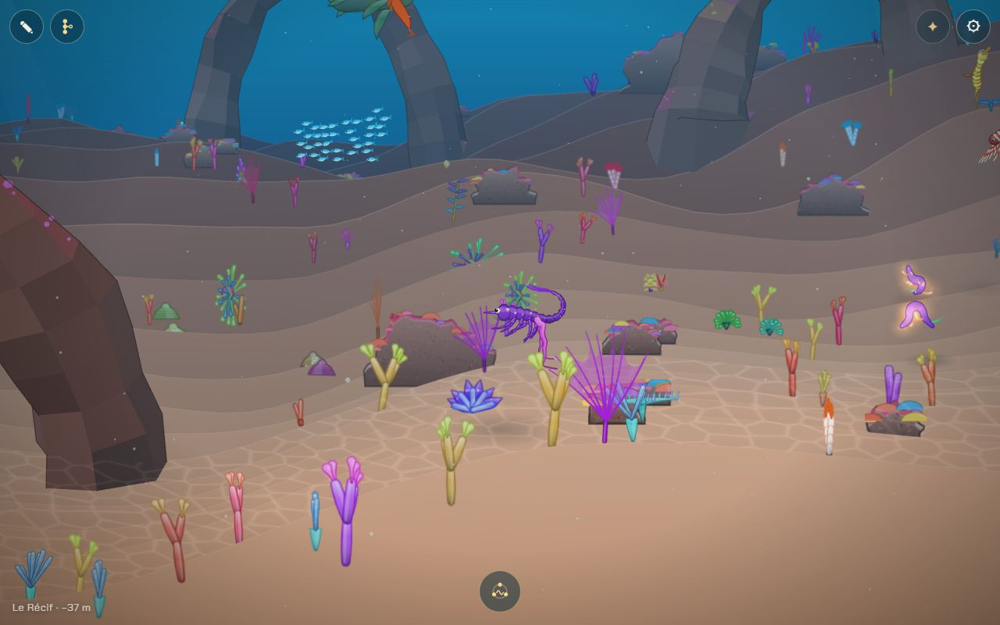
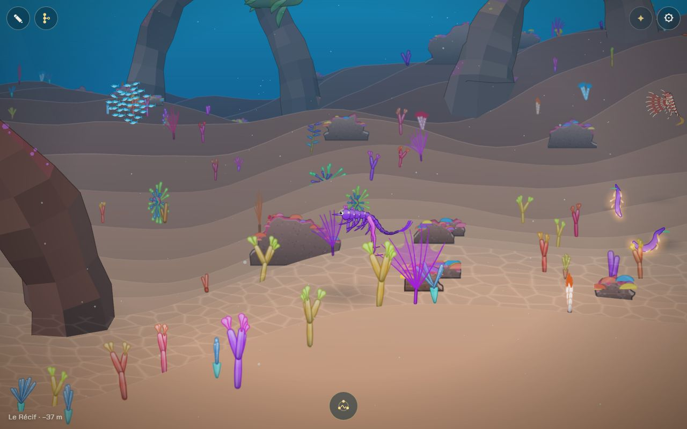
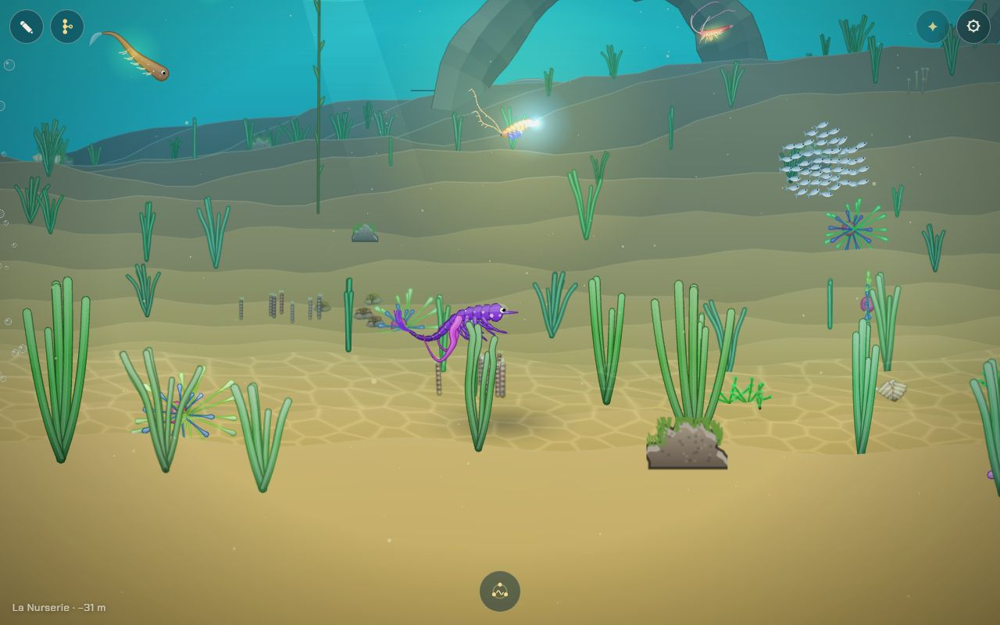
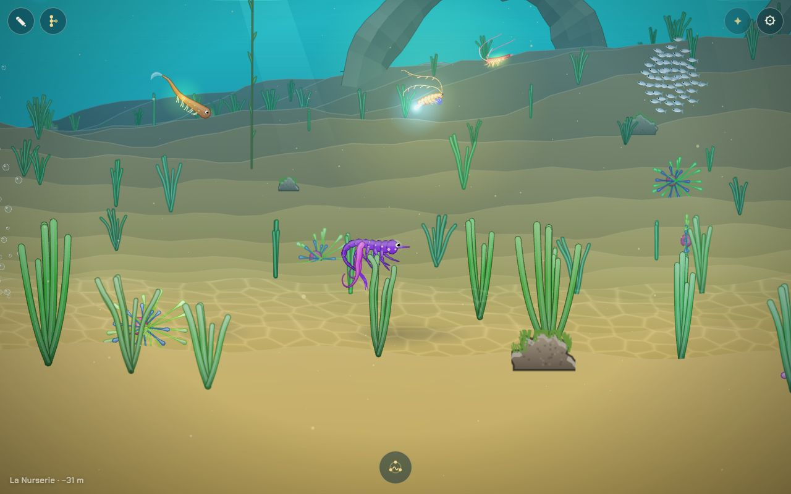
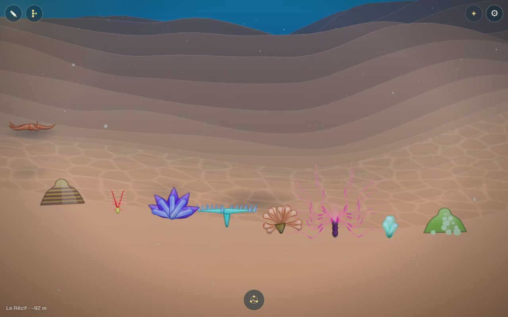
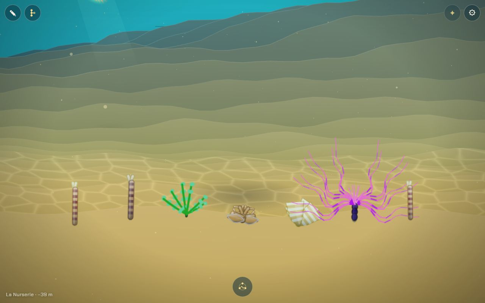
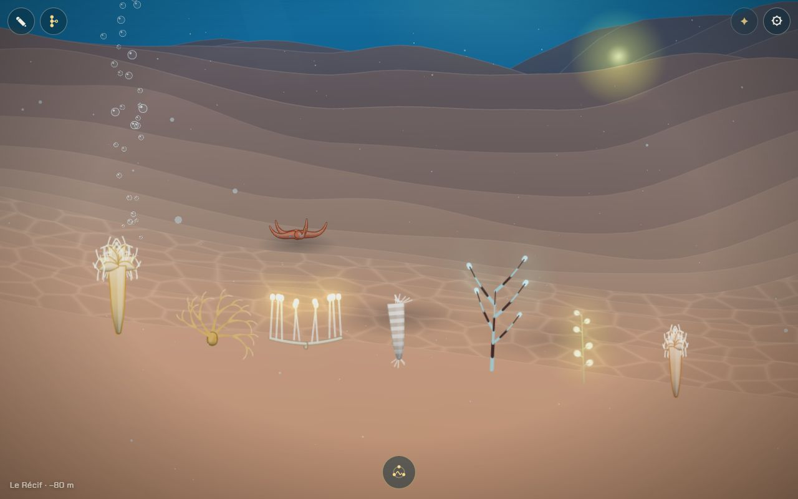
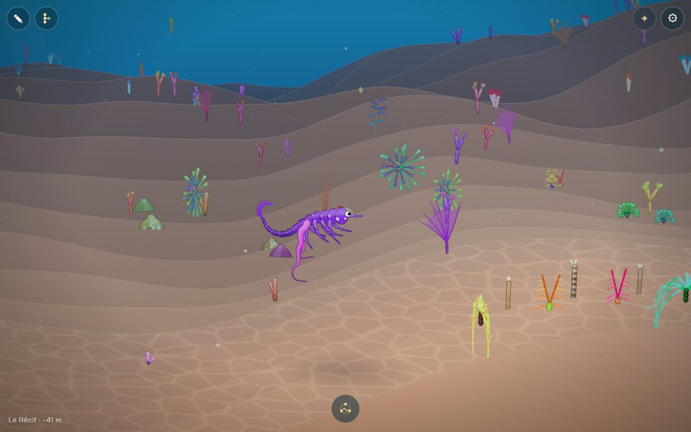
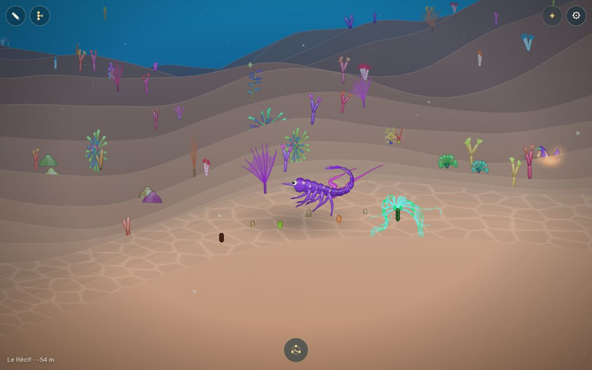
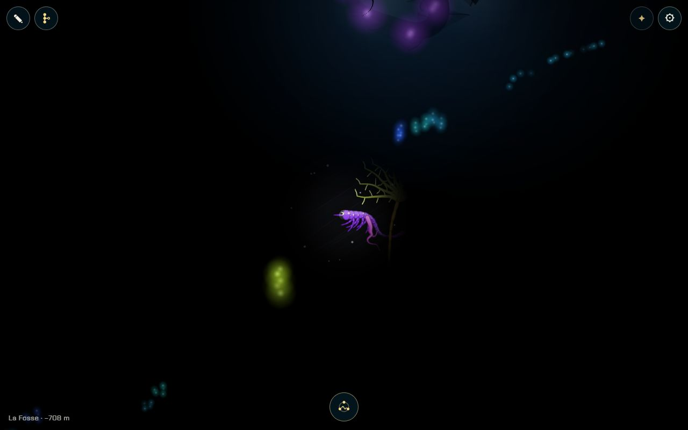

# Flore : encore plus de diversité (anémones, coraux, couteaux et créatures extraordinaires)

## Livré

18 nouvelles espèces fixées au fond, posées en bosquets dans chaque chapitre qui a un fond (rien dans le Jardin, sans fond).

| Espèce | Où | Particularité |
| --- | --- | --- |
| Cérianthe (anémone tubulaire) | Nurserie, Récif, Forêt, Carcasse | longs tentacules rayés qui retombent ; **timide** |
| Anémone à bulles | Nurserie, Récif | tentacules renflés, une perle au bout |
| Anémone plumeuse (Metridium) | Forêt, Grotte, Carcasse, Sources, Glacier | haute colonne, couronne de plumules ; pâle dans les profondeurs |
| Corail cerveau / corail étoilé | Récif | dôme côtelé, ou piqué de polypes (un sur trois) |
| Acropore table | Récif | pied court, large plateau hérissé de pointes |
| Corail corne de cerf | Récif | branches qui fourchent, pointes claires |
| Ver arbre de Noël | Récif, Grotte | deux panaches en sapin aux couleurs vives ; **timide** |
| Couteau | Nurserie, Forêt | coquille rayée plantée dans le sable, deux siphons ; **timide** (s'enfonce) |
| Bénitier | Récif | éventail de plis pâles, manteau tacheté bleu, vert ou violet |
| Ascidie | Récif, Forêt, Grotte | grappe de tonneaux translucides à deux siphons |
| Raisin de mer | Nurserie, Récif | tiges perlées de grains verts |
| Padine | Nurserie, Forêt | éventails pâles cerclés de blanc |
| Méduse à l'envers (Cassiopée) | Nurserie | couchée sur le sable, bras frangés en l'air, la cloche bat |
| Étoile-panier | Forêt, Carcasse, Glacier | cinq bras qui fourchent et s'enroulent |
| Corbeille de Vénus | Carcasse, Glacier, Fosse | vase de verre annelé, frange au sommet |
| Corail bambou | Grotte, Carcasse, Sources, Glacier, Fosse, Remontée | tiges blanches articulées de noir, polypes qui **luisent** |
| Éponge harpe | Glacier, Fosse, Remontée | deux bras au sol, une rangée de cordes, une perle qui **luit** au bout de chacune |
| Éponge ping-pong | Carcasse, Fosse, Remontée | tige fine, sphères claires qui **luisent** |

- **`src/monde/flore.ts`** (nouveau) : les définitions (`FLORE`, une fonction de graine par espèce, comme `plants.ts`), ce que chaque chapitre ajoute (`FLORE_OF`), le placement en bosquets (`placeFlore`, graine à part), les timides (`shy`, `shyStep`, `SHY`) et les lueurs (`floreLights`).
- **`src/monde/world.ts`** : `plantSpec2` passe la main à `floreSpec` ; `growPlant2` lit l'enfoncement (`sink`), la taille (`scale`), la pousse depuis le sommet (`top`, pour le dôme du corail cerveau) et le plan tourné vers l'œil (`face`, pour les formes larges) ; les espèces figées rejoignent `RIGID` ; `makePlants` ajoute les bosquets **après** les plantes existantes, qui restent donc exactement où elles étaient.
- **`src/monde/main.ts`** : deux branchements d'une ligne (`shy` dans la boucle des plantes simulées, `floreLights` dans celle du dessin).
- **Les timides** : un couteau, une cérianthe ou un ver arbre de Noël du plan de nage se rétracte en 0,25 s quand le nageur passe à moins de 60 unités, attend 2,5 s de calme, puis ressort en 2,5 s (lissé). Le couteau garde 30 % de sa longueur (il « s'enfonce »), la cérianthe 45 % de son tube, le ver garde son tube ; les parties portées (tentacules, siphons, panaches) se replient presque à rien.
- **Les lueurs** : poussées avec les lumières du monde, faibles en eau claire (0,12), nettes dans le noir (jusqu'à 0,67), chacune respirant lentement ; seulement dans les chapitres sombres (testé).
- **Tests** (`src/monde/flore.test.ts`, 9) : chaque espèce pousse en une créature finie de taille raisonnable, même graine même espèce, tous les noms connus et tous utilisés, chaque chapitre à fond reçoit des bosquets et le Jardin aucun, chaque espèce pousse dans son chapitre (ou le voisin près d'une frontière), lueurs seulement dans le sombre, et le rythme des timides (cachés d'un coup, attente remise à zéro au retour du nageur, sortie lente).
- **Doc** : `docs/direction-artistique.md`, nouvelle section « La flore des chapitres » (tableau par chapitre, timides, lueurs, coût) et une ligne dans « Ce qui existe déjà ».

**Comment le voir** : `?dev`, voyager au Récif ou à la Nurserie ; descendre près du sable pour voir les couteaux et les vers arbres de Noël se cacher ; dans la Fosse, les points bleus et verts au fond sont les éponges et les coraux bambous.

## Choix retenus

Aucune question posée sur le tableau de bord : tous les choix ci-dessous sont des choix d'agent (option recommandée).

| Question | Choix retenu | Pourquoi |
| --- | --- | --- |
| Où vit le code | Nouveau module `flore.ts`, branchements courts dans `world.ts` et `main.ts` | consigne : fichiers partagés effleurés seulement |
| Comment placer la nouvelle flore | Passe à part, en bosquets, graine à elle, après les plantes existantes | le reste du monde ne bouge pas d'un pouce (tests, captures, repères des autres chantiers) ; bosquets plus naturels (champs de couteaux, groupes d'anémones) |
| Toucher à `biomes.ts` (listes `flora`) | Non : `FLORE_OF` dans `flore.ts` | `biomes.ts` est partagé et sensible ; le premier plan (`foreground.ts`) lit `flora` et aurait changé |
| Quelles espèces | 18, du « couteau » demandé aux créatures des abysses réputées les plus étranges (harpe, ping-pong, corbeille de Vénus, bambou lumineux) | la demande nomme anémones, coraux, couteaux et « belles créatures extraordinaires » ; une ou plusieurs par chapitre à fond |
| Des animaux fixés (couteau, méduse à l'envers, ver) parmi les plantes | Oui, comme décor vivant (pas d'IA, pas d'accouplement) | ce sont des sédentaires ; en faire des espèces jouables est un autre chantier |
| Un comportement en plus du décor | Les timides se cachent au passage du nageur | c'est ce qu'on voit faire aux vrais (couteaux, cérianthes, spirobranches) ; doux, sans danger, rend le fond vivant |
| Lueurs | Oui pour trois espèces des chapitres sombres, faibles en eau claire | la Fosse est noire : quelques points vivants au fond, sans voler la vedette aux lumières du chant |
| Coût | La plupart figées en images (`rigid`) ; simulées seulement les timides et la méduse à l'envers | mesuré : quelques dixièmes de ms par image en plus (voir ci-dessous) |
| Formes larges vues par la tranche | Option `face` (plan tourné de ±0,4 rad au plus vers l'œil) | une plante est plane : une table, un bénitier ou une harpe vus de profil devenaient un trait |
| Dôme du corail cerveau | Pousse depuis le sommet vers le sol (`top`), profil `bell`, base plate au sol ; motif côtelé ou à pois | une forme ronde posée sur sa base aurait demandé d'enterrer la moitié du disque, que le fond ne masque pas toujours |

**Mesures** (Chrome Windows, GPU réel, même endroit avec et sans la nouvelle flore ; simulation / dessin, ms par image) : Nurserie 2,23 / 3,55 contre 2,19 / 3,33 ; Récif 2,62 / 3,37 contre 2,37 / 3,00 ; Forêt 3,30 / 6,01 contre 2,81 / 5,16 ; Glacier 2,34 / 4,09 contre 2,12 / 3,94 ; Fosse sans écart notable. 60 img/s partout. Une première version où tout était simulé coûtait jusqu'à +2 ms / +3 ms dans la Forêt.

## Options non retenues

- **Placement**
  - Ajouter les espèces aux listes `flora` de `biomes.ts` : distribution plus fondue, mais déplace toutes les plantes existantes et change le premier plan ; conflits probables avec les chantiers qui touchent la carte.
  - Densité plus forte : plus luxuriant, mais coût et lisibilité (le plan de nage doit rester clair).
- **Comportement**
  - Aucun comportement (décor seul) : moins cher, moins vivant.
  - Timides aussi face aux autres animaux : plus juste, mais une recherche de voisins par plante et par image ; à faire avec le chantier de performance si on le veut.
  - Couteaux qui s'enfoncent vraiment (racine descendue sous le sable) : le fond ne masque pas toujours ce qui est dessous ; le raccourcissement donne le même effet sans risque.
- **Lueurs**
  - Plus fortes, ou dans tous les chapitres : spectaculaire, mais brouille les lumières du chant dans la Fosse et brûle en eau claire.
  - Clignotement au contact du nageur (comme les vrais coraux bambous) : joli, à faire en suivant le modèle des timides.
- **Moteur**
  - Nouveaux profils dans `SHAPES` (`defs.ts`) pour un vrai dôme : plus fidèle, mais touche le moteur partagé et l'Atelier ; refusé pour rester additif.
  - Dessin d'une plante en plusieurs plans (vraie 3D) : hors de portée, le moteur des plantes est plan.
- **Espèces écartées pour l'instant** : anémone attrape-mouche, laitue de mer, corail laitue, éponge-baril géante, nudibranches fixés (déjà dans la faune) ; faciles à ajouter dans `FLORE` sur le même modèle.

## Reste à faire / limites

- Le bénitier se lit plutôt comme un éventail irisé que comme un coquillage vu de côté : la forme plane des plantes ne permet pas les deux valves.
- La méduse à l'envers reste petite et peu lisible de loin.
- Les sillons du corail cerveau sont un motif en bandes (des sillons dessinés par-dessus passaient derrière le dôme dès qu'il tourne).
- Les timides ne réagissent qu'au nageur, et seulement s'ils sont dans le plan de nage (les autres sont figés en images).
- Les espèces nouvelles ne sont pas dans l'Atelier (ce sont des plantes du monde, comme les autres plantes).
- Le chantier « La performance sur téléphone » devrait remesurer avec `?bench` sur un vrai téléphone, surtout dans la Forêt et le Récif.
- `make check` : le test `src/monde/nouveautes/plugin.test.ts` (« embeds the published versions only… ») échoue déjà sur `backlog`, sans lien avec ce chantier (noté aussi par le chantier des demi-tours).

## Risques de fusion

- `src/monde/main.ts` : un import et deux appels ajoutés dans des lignes existantes (la boucle des plantes simulées de `update`, la boucle des plantes de `render`). Conflit possible si un autre chantier réécrit ces deux lignes : garder les deux appels.
- `src/monde/world.ts` : import, deux lignes au début de `plantSpec2`, `growPlant2` (lignes `y`, `upright`, `scale`, `az`, `dv`, création de la créature), `RIGID`, et une boucle à la fin de `makePlants`.
- `docs/direction-artistique.md` : une ligne dans « Ce qui existe déjà » et une section avant « Une palette par chapitre ».
- Nouveaux fichiers : `src/monde/flore.ts`, `src/monde/flore.test.ts`.
- Voisins : `deplacement-crevette` et `tentacule-filements` touchent sans doute `creature3.ts` ; la flore utilise le même moteur (plantes planes, ancrées) : revoir la galerie après fusion si le moteur change le rendu des fouets ancrés.
