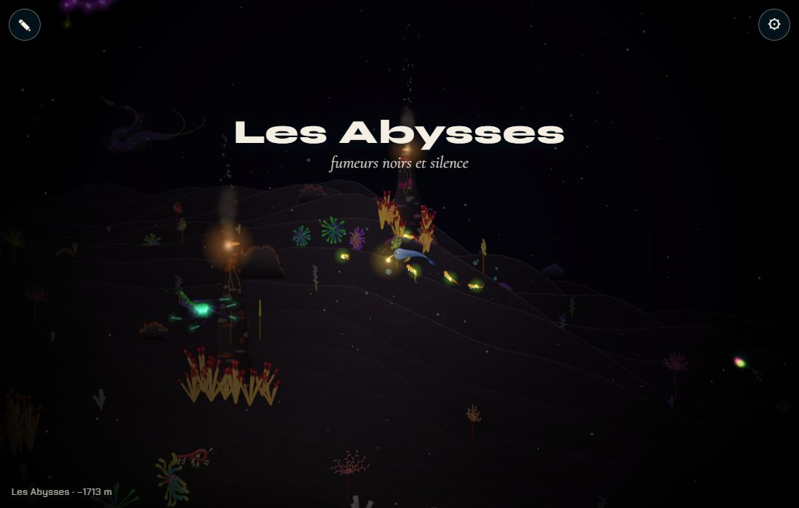
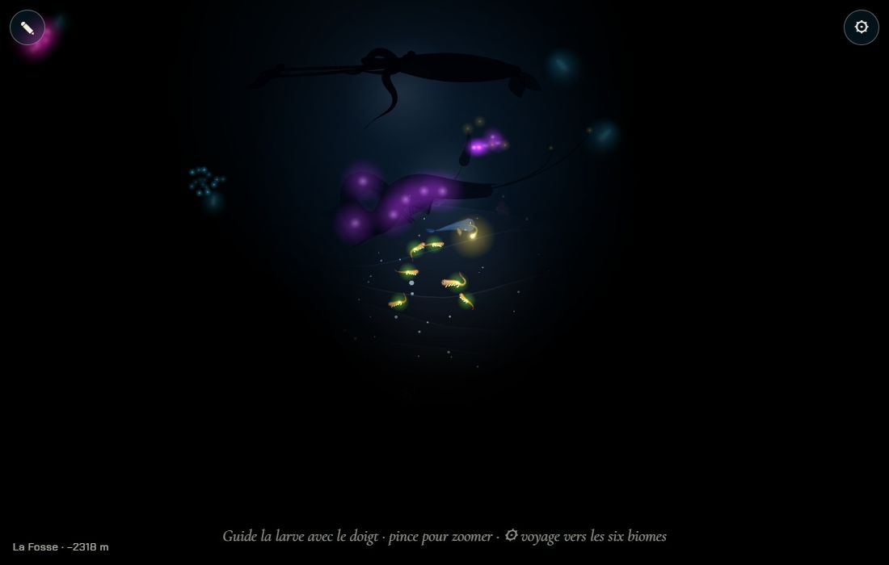
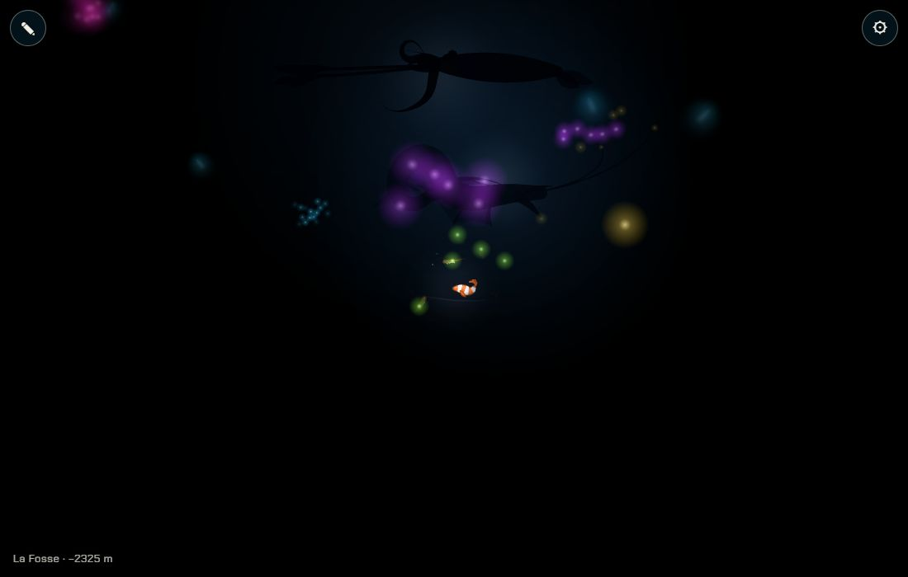
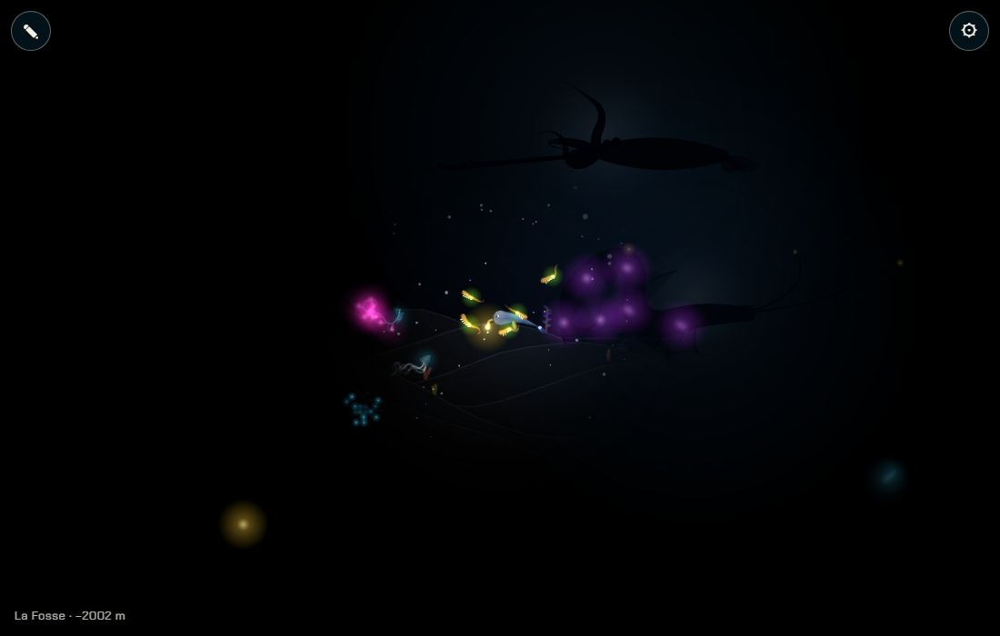
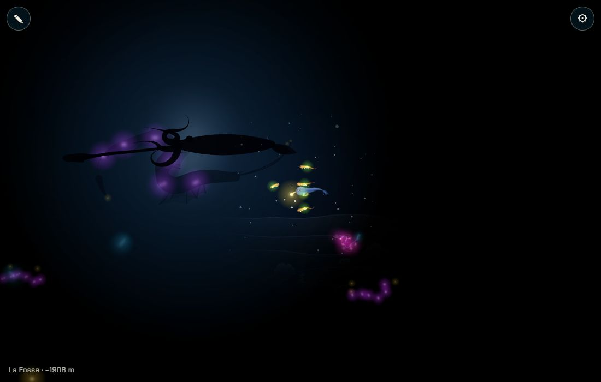
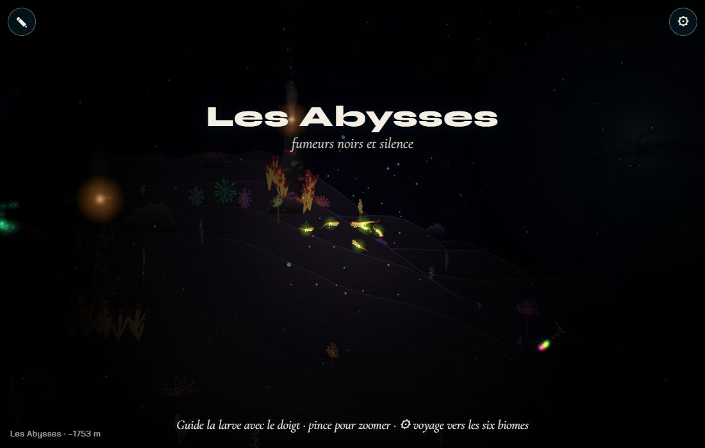

# La Fosse : noir total et ta propre lumière

## Livré

- **Un septième biome, la Fosse** (`src/monde/fosse.ts`, `FOSSE`), après les Abysses (x 21 800 → 25 600) : fond plus profond (jusqu'à 3 150 px), palette noir et bleu électrique, baudroies, dragons abyssaux, nautiles, cténophores, siphonophores, méduses-boîtes, un banc de poissons-lanternes.
- **Le noir total** : `pitchOf(dark)` passe de 0 (Abysses, `dark` 0.86, inchangées) à 1 (Fosse, `dark` 1), en fondu sur la frontière. `darkStops` remplace les trois anneaux codés en dur du noir (canvas et WebGL) : à 0 ils sont identiques à avant, à 1 seul le cercle de la lumière du nageur reste clair, tout le reste est noir (opacité 1).
- **Ta propre lumière** : `glowOf` additionne les lueurs des parties du nageur (comme `eachGlow3` les dessine), une lanterne (`role: light`) comptant triple ; `lightReach` en fait un rayon : ~45 px sans rien qui brille (poisson-clown), ~115 px pour la larve, ~145 px pour la baudroie, ~245 px pour le cténophore.
- **Ce qui brille** reste visible par-dessus le noir (lueurs des animaux, poissons-lanternes : le code existant, dessiné après le noir).
- **La neige marine** ne se voit que dans la lumière, blanche, plus forte près du nageur (`snowLit`) ; hors de la lumière, plus rien.
- **Les grandes silhouettes** : un dragon abyssal (×7) et un calmar géant (×9) passent au loin ; dans le noir ils sont dessinés après lui (`fosse-draw.ts`, `drawShape`) : un corps noir devant une faible lueur bleu électrique, et leurs photophores atténués.
- Tests : `src/monde/fosse.test.ts` (place et profondeur de la Fosse, fondu, portée de la lumière, anneaux du noir, neige, lanterne).
- Doc : section « La Fosse : le noir total » dans `docs/direction-artistique.md`.
- Pour le voir : ⚙ → « Fosse », ou `monde.gotoBiome(6)` ; `monde.becomes(SPECIES.baudroie())` puis `SPECIES.poissonClown()` pour comparer les lumières. `monde.fosse` donne `pitch`, `reach`, `glow`.

60 images/s sur le Chrome Windows (WebGL), vérifié aussi en canvas (`?gl=0`).

## Choix retenus

Aucune question posée sur le tableau de bord ; tout est tranché seul (option recommandée).

| Question | Choix retenu | Pourquoi |
| --- | --- | --- |
| Où est la Fosse ? | Un 7ᵉ biome après les Abysses, défini dans `fosse.ts` et ajouté en fin de `BIOMES` | La carte n'avait pas de Fosse ; on la voit tout de suite ; le chantier des 10 chapitres peut la déplacer d'une ligne |
| Comment déclencher le noir total ? | Par la valeur `dark` de l'ambiance (> 0.88), sans nouveau champ | Le fondu entre biomes existe déjà pour `dark` ; rien à changer dans `Mood` ni `moodAt` |
| Quelle lumière pour le nageur ? | Calculée depuis ses lueurs, lanterne ×3 | Rattache la lumière au corps (l'hérédité, la lanterne de la vision) sans nouvelle donnée d'espèce |
| Les grandes silhouettes ? | Des visiteurs géants dessinés en noir devant une faible lueur bleue, après le noir | Une forme noire sur du noir ne se voit pas ; le contre-jour bleu électrique suit la palette du chapitre |
| La neige marine ? | Visible seulement dans la lumière, en blanc | « On ne voit que ce que sa lumière éclaire » |

## Options non retenues

- **Où est la Fosse**
  - Pousser les Abysses plus loin (noircir la fin des Abysses) : pas de biome à gérer, mais pas de Fosse ni de nom à l'écran.
  - Attendre le chantier des 10 chapitres : aucun conflit, mais rien à montrer.
  - Un champ `fosse` sur chaque biome, activé par l'autre chantier : propre, mais invisible tant que la carte n'est pas refaite.
- **Déclencher le noir total**
  - Un nouveau champ `pitch` dans `Biome`/`Mood` : plus explicite ; touche `moodAt` et le type `Mood`, fichiers que l'autre chantier refait.
  - Par la profondeur (y) : indépendant de la carte, mais toucherait aussi les Abysses les plus basses.
- **Lumière du nageur**
  - Rayon fixe : simple, mais la lanterne ne servirait à rien.
  - Un trait « lanterne » dans la spec des espèces : plus lisible pour l'hérédité ; touche le bestiaire et le moteur (fichiers partagés).
  - Lumière qui grandit avec le temps passé dans la Fosse (les yeux s'habituent) : joli, à ajouter plus tard.
- **Silhouettes**
  - Les dessiner avant le noir, simplement assombries : disparaissent complètement.
  - Silhouettes à contour lumineux (liseré bleu) : plus lisibles, mais demandent un rendu de contour (coût GL et canvas).
  - Des ombres qui passent devant les lueurs des autres animaux seulement : subtil, peu visible sur téléphone.
- **Neige marine**
  - Garder la neige partout, atténuée : moins noir.
  - Neige qui scintille aussi autour des animaux lumineux : plus riche, un calcul de distance par flocon et par lueur.

## Reste à faire / limites

- L'obstacle du chapitre (« il faut une lanterne ou le chant ») n'est pas branché : la lumière est seulement visuelle, rien ne bloque le passage.
- Le chant et les lumières des ancêtres qui répondent (moment fort) : autre chantier.
- La larve a déjà ~115 px de lumière (ses bouts lumineux) : on pourra réduire son rayon pour que la lanterne compte plus.
- Le fond de la Fosse est un simple prolongement du profil (pas de « puits de lumière » vers la surface) ; `metres()` n'a pas été recalé (−2 300 m affichés vers 2 400 px), c'est au chantier des chapitres de fixer les profondeurs 500–650 m.
- Les silhouettes sont toujours là (deux visiteurs en va-et-vient) ; un passage rare et lent serait plus fort.

## Risques de fusion

- `src/monde/biomes.ts` : import de `FOSSE`, ajout en fin de `BIOMES`, `X1` 22 000 → 25 600, deux points de `PROFILE`, une 7ᵉ valeur dans `HILLS`/`BUMPS`/`DUNES`. **Conflit probable avec `10-chapitres-monde`**, qui refait la carte : garder `FOSSE` à sa place dans l'ordre des chapitres (9ᵉ) et une valeur par biome dans les tableaux par biome ; `pitchOf` ne dépend que de `dark` (mettre `dark: 1` à la Fosse, < 0.88 ailleurs).
- `src/monde/main.ts` : deux visiteurs ajoutés, les anneaux du noir passent par `darkStops` (canvas et WebGL), `drawShapes()` après le noir, `drawMotes` (neige dans la lumière), `fosse` exposé dans `window.monde`. Branchements courts ; `premier-plan-sombre` et `jardin-meduses-sans` touchent sans doute le même bloc de rendu.
- Nouveaux : `src/monde/fosse.ts`, `fosse-draw.ts`, `fosse.test.ts` ; `docs/direction-artistique.md` (une section ajoutée).
