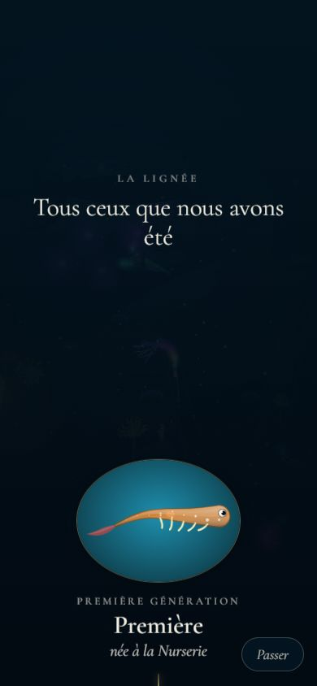
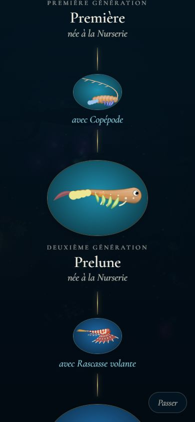
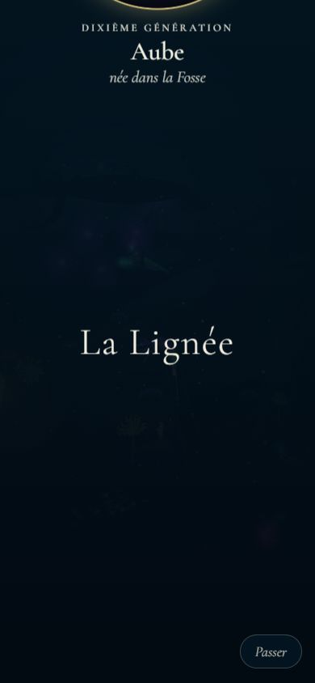
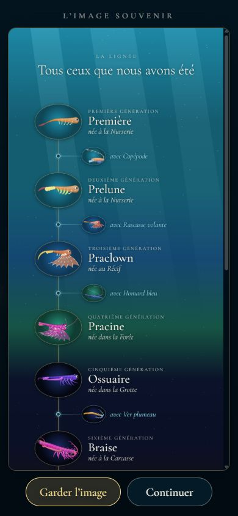
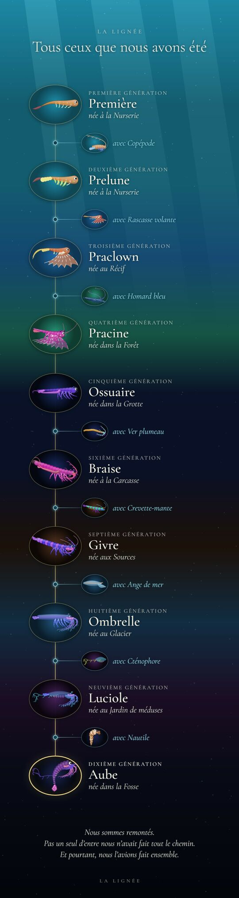
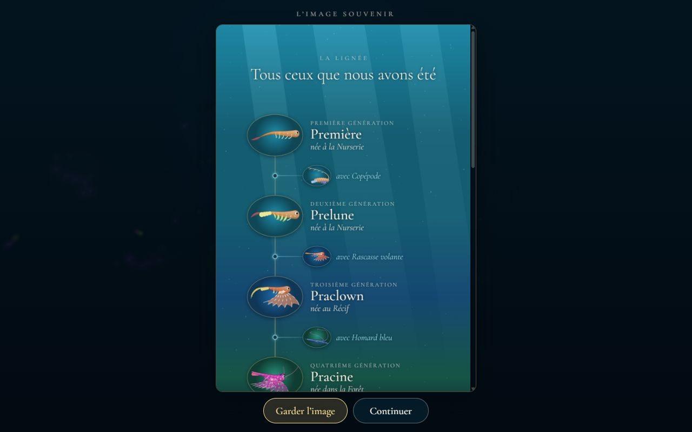
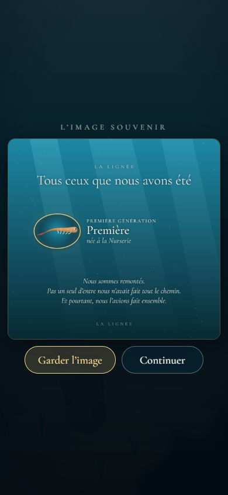
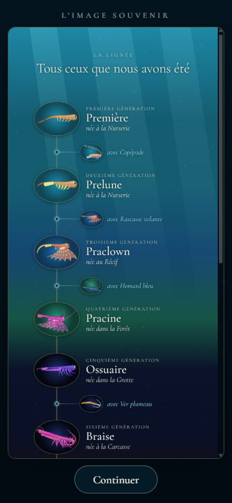
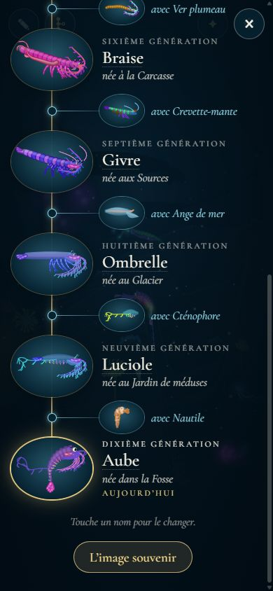

# Le générique et l'image souvenir

## Livré

À la fin de l'histoire, l'arbre complet de la lignée passe en générique, puis devient une image téléchargeable, sauf dans le lien Artifact.

- **Le générique** (`src/monde/generique-ecran.ts`, `generique.css`) : toute la lignée monte lentement à l'écran, comme un générique de film, sur la mer assombrie. Le jeu est en pause, comme pour l'arbre.
  - En tête, « La Lignée » et « Tous ceux que nous avons été ».
  - Puis chaque génération, de la première larve à la dernière (cerclée d'or) : son portrait dans un médaillon teinté de l'eau de son chapitre de naissance, « Troisième génération », son nom et « née au Récif ».
  - Entre deux générations, un bout de fil d'or et le partenaire (petit portrait, « avec Copépode », en bleu pâle). Les mots et les couleurs sont ceux de l'arbre (`arbre.ts`).
  - Il finit sur « La Lignée », seul au milieu de l'écran, puis l'image souvenir prend sa place en fondu.
  - Il défile à environ 52 px/s (plus vite pour une très longue lignée, deux minutes au plus), soit une quarantaine de secondes pour dix générations. Le défilement est une animation Web Animations sur `transform`, donc fluide même quand un portrait se dessine.
  - Un doigt ou Espace posé le presse (×6) ; « Passer » ou Échap mène à l'image. Avec « réduire les animations », l'image vient directement.

  
  
  

- **L'image souvenir** (`src/monde/generique-image.ts`) : l'arbre dessiné dans un canvas de 1 080 px de large, comme une tranche de la mer descendue.
  - L'eau derrière chaque génération est celle de son chapitre (`bandColour`) : claire sous la surface, de plus en plus sombre jusqu'à la Fosse, avec des rayons et de la neige marine.
  - Le fil d'or, les médaillons avec les portraits (`snapshot3`), les noms, les lieux de naissance et les partenaires, comme dans l'arbre.
  - En bas, le texte final de la Remontée, lu dans `docs/chapitres.md` comme les autres textes (`textes.ts`), puis « La Lignée ».
  - Elle est montrée dans un cadre qu'on fait défiler (une `` : un appui long l'enregistre aussi, là où le navigateur le permet), avec « Garder l'image » et « Continuer ».
  - Le bouton télécharge un JPEG (qualité 0,9, environ 370 Ko pour dix générations, 90 Ko pour la larve seule). Le fichier porte le nom de la dernière génération : `la-lignee-aube.jpg`.

  
  
  
  

- **Le lien Artifact** (`downloadsBlocked`, `generique.ts`) : pas de bouton « Garder l'image » quand la page est servie depuis `claudeusercontent.com`, ou dans un cadre ouvert depuis `claude.ai` ou `claude.site` (`location.ancestorOrigins`, `document.referrer`). `?artifact` dans l'adresse fait de même, pour les tests. L'image est montrée quand même.

  

- **La fin de l'histoire** : quand le générique est allé au bout (ou qu'on l'a passé), le jeu appelle `unlockBalade()`, et l'Atelier revient (`onEnd`, `main.ts`).
- **Revoir l'image** : une fois l'histoire finie (`baladeUnlocked()`, ou `?dev`), l'arbre de la lignée a un bouton « L'image souvenir » sous les générations. Il la montre de nouveau, avec la lignée du moment. Branché par un crochet `arbre.more` (3 lignes dans `arbre-ecran.ts`).

  

- **La logique pure** (`src/monde/generique.ts`, testée dans `generique.test.ts`, 11 tests) : `souvenirLayout` (la mise en page de l'image, réduite sous 12 000 px de haut pour les téléphones), `bandColour`, `souvenirFileName`, `rollMs` et `downloadsBlocked`.
- **Pour les tests** :
  - `monde.generique.play()`, `souvenir()` (l'image seule), `skip()`, `close()`, `stage`, `image` (le canvas), `canKeep` ;
  - avec `?dev`, le panneau ⚙ a un bouton « Le générique de fin ».
- **Mesuré dans le Chrome Windows** (390 × 844 et 1280 × 800, dix générations) :
  - 59 à 60 images par seconde pendant le générique, quelques images à 33 ms pendant que les portraits se dessinent (12 ms par image au plus, comme l'arbre) ;
  - passer tout de suite à l'image : 264 ms jusqu'à l'image affichée, portraits compris ;
  - le téléchargement part bien (`la-lignee-aube.jpg`, événement `download` de playwright) ;
  - après la fin, `lignee.balade` vaut 1 et ✎ est revenu.
- La doc de conception est à jour : `docs/mecaniques.md`, nouvelle section « Le générique et l'image souvenir », et une phrase dans `docs/chapitres.md`.

## Choix retenus

Une seule question envoyée au tableau de bord : un retour (pas de choix à trancher) sur le branchement avec la Remontée. Tous les choix ci-dessous sont `auto`.

| Question | Choix retenu | Pourquoi |
| --- | --- | --- |
| Qui lance le générique ? | `generique.play()`, à appeler par la fin de la Remontée ; un bouton dans ⚙ avec `?dev` | La Remontée se construit en même temps : un point d'entrée simple, sans toucher à son code ; testable dès maintenant. |
| La forme du générique | Un défilement vertical lent, centré, du plus ancien au plus récent | Le générique de film qu'on attend. Le texte qui monte fait écho à la remontée. L'ordre est celui de l'arbre. |
| La mer pendant le générique | En pause, sous un voile sombre | Comme l'arbre : aucune parade, portée ni texte ne part dessous, et les portraits se dessinent sans la scène. |
| Le rythme | Environ 52 px/s, deux minutes au plus ; doigt posé pour presser, « Passer » | Une quarantaine de secondes pour dix générations. On peut toujours aller vite. |
| La forme de l'image | Une colonne haute, 1 080 px de large, l'eau de chaque chapitre derrière sa génération | Même lecture que l'arbre. Elle raconte la descente en couleurs. Sa largeur est celle d'un téléphone. |
| Le format du fichier | JPEG, qualité 0,9 | 370 Ko pour dix générations, facile à partager. Le fond est opaque, donc un PNG n'apporterait rien. |
| Le nom du fichier | `la-lignee-<nom de la dernière génération>.jpg` | Deux parties ne s'écrasent pas, et le nom se reconnaît. |
| Le lien Artifact | Reconnu par l'adresse et les pages autour (`claudeusercontent.com`, `claude.ai`, `claude.site`), plus `?artifact` | On ne peut pas savoir si un téléchargement a échoué dans un cadre sandbox. L'adresse est le seul signe sûr. |
| Dans le lien Artifact | L'image sans bouton | La consigne (« sauf dans le lien Artifact ») ; l'image reste à regarder. |
| Le texte en bas de l'image | Le texte final de la Remontée, lu dans `chapitres.md` | Il dit la même chose que l'image. Les textes restent dans le document. |
| La fin de l'histoire | `unlockBalade()` à la fin du générique | La doc le demande « à la fin de l'histoire », et le générique en est le dernier moment. C'est sans effet si la Remontée le fait aussi. |
| Revoir l'image | Un bouton sous l'arbre, après la fin | Sinon elle serait perdue en touchant « Continuer ». L'arbre est l'endroit où elle a un sens. |

## Options non retenues

- **Qui lance le générique ?**
  - Détecter l'arrivée à la surface depuis le générique lui-même : ça marcherait sans la Remontée, mais c'est son rôle, et les deux se marcheraient dessus.
  - Seulement depuis l'arbre : on n'aurait pas de vraie fin.
- **La forme du générique**
  - Une génération à la fois, en fondu (un diaporama) : plus calme, mais moins « générique » et plus long à regarder.
  - Faire défiler l'écran de l'arbre lui-même : pas de code en plus, mais pas de mise en scène.
  - Les ancêtres nageant dans la mer avec leur nom : très beau, mais c'est la Remontée, et c'est bien plus cher.
  - Du plus récent au plus ancien (remonter le temps) : poétique, mais à rebours de l'arbre.
- **La mer pendant le générique**
  - La laisser vivre derrière : plus vivant, mais une parade, un texte ou une portée pourraient partir dessous. Les portraits se dessineraient aussi plus lentement. À reconsidérer si la Remontée veut garder sa dernière image en mouvement.
- **Le rythme**
  - Plus lent (30 px/s) : plus solennel, mais plus d'une minute pour dix générations.
  - Pas de raccourci : plus « cinéma », mais frustrant à la deuxième fois.
- **La forme de l'image**
  - Un format fixe 1 080 × 1 920 (le format des stories), les générations serrées : plus facile à partager, mais illisible au-delà de huit ou dix générations.
  - Deux colonnes, ou une grille : plus compact, mais on perd le lien parent, partenaire, enfant.
  - Un arbre horizontal : proche d'un arbre généalogique, mais très large.
- **Le format du fichier**
  - PNG : sans perte, mais 3 à 5 fois plus lourd pour un fond en dégradé.
  - WebP : plus léger, mais moins bien reconnu par les galeries des téléphones.
- **Garder l'image sur téléphone**
  - Le partage du système (`navigator.share` avec le fichier) : il enregistre directement dans les photos sur iPhone, mais sur ordinateur il ouvre une fenêtre de partage au lieu de télécharger. À ajouter pour les téléphones seulement, si on le souhaite.
- **Le lien Artifact**
  - Cacher le bouton dans tout cadre (iframe) : plus simple, mais faux ailleurs (itch.io, par exemple).
  - Toujours montrer le bouton : dans l'Artifact il ne ferait rien, sans rien dire.
  - Une page compilée à part pour l'Artifact : plus sûr, mais un deuxième fichier à publier.
- **Dans le lien Artifact**
  - Un mot pour dire d'ouvrir la page ailleurs : c'est utile, mais ça sort de l'histoire.
- **Le texte en bas de l'image**
  - Rien : plus sobre, mais l'image finirait sans respirer.
  - Une date : un souvenir en a souvent, mais « pas de chiffres ».
- **La fin de l'histoire**
  - Laisser `unlockBalade()` à la Remontée : c'est plus propre si elle le fait, mais rien ne le ferait si elle l'oublie.
- **Revoir l'image**
  - Nulle part : c'est plus simple, mais l'image serait perdue.
  - Dans le panneau ⚙ : ce panneau sert surtout aux tests.
  - L'image à tout moment depuis l'arbre, même avant la fin : c'est pratique, mais la conception en fait la récompense de la fin.

## Reste à faire / limites

- **Le branchement avec la Remontée** : rien ne lance encore le générique dans l'histoire. La fin de la Remontée doit appeler `generique.play()` (dans `main.ts`), après le texte final. Un retour est sur le tableau de bord. L'entrée pour les joueurs suppose que la Remontée sort dans la même version. Sinon, il faut la garder pour la suivante ou dire « bientôt ».
- **La détection du lien Artifact** repose sur les adresses de claude.ai connues aujourd'hui. Je n'ai pas pu l'essayer dans un vrai Artifact : seulement avec `?artifact` et les tests. Si Claude change de domaine, il faudra l'ajouter à la liste (`CLAUDE`, `generique.ts`).
- **Pas testé sur un vrai téléphone** : seulement Chrome à la taille d'un téléphone. Sur iPhone, `<a download>` range l'image dans Fichiers ; l'appui long sur l'image l'ajoute aux Photos.
- Les polices viennent de Google Fonts. Hors ligne, ou en `file://` sans réseau, l'image se dessine en Georgia au bout de 1,5 s d'attente au plus.
- Le portrait d'un partenaire est celui de son espèce, comme dans l'arbre. Les partenaires hors bestiaire (id vide) n'ont que leur nom.
- **Déjà là avant ce chantier** : `make check` échoue sur `src/monde/nouveautes/plugin.test.ts` (les images de la 0.2 que le budget de 400 Ko n'embarque plus). C'est le même échec sur `backlog`, déjà signalé par l'agent de l'arbre.

## Risques de fusion

- **`src/monde/main.ts`** : des branchements courts.
  - 1 import et `baladeUnlocked` ajouté à l'import d'`atelier-access` ;
  - 2 lignes après `initArbre(…)` : `initGenerique(…)` et `arbre.more = …` ;
  - `generique` dans `api` ;
  - `generique.isOpen` dans `narrator.quiet` ;
  - 4 lignes pour le bouton de test, après celui de la portée.

  La Remontée, le chant et les lumières toucheront sans doute les mêmes lignes (`api`, `narrator.quiet`) : il faut garder les deux côtés. Point à ne pas oublier : à la fin de la Remontée, appeler `generique.play()`.
- **`src/monde/arbre-ecran.ts`** : un champ `more` dans l'interface `Arbre` et 2 lignes dans `build()`, en ajout seulement.
- **`index.html`** : un bouton `#generiqueBtn` dans le panneau ⚙, après `#porteeBtn`.
- **`docs/mecaniques.md`** : une sous-section « Le générique et l'image souvenir » à la fin de « L'arbre de la lignée », et une phrase de cette section qui change. **`docs/chapitres.md`** : une phrase après « Générique ».
- **Nouveaux fichiers**, sans conflit possible : `src/monde/generique.ts`, `generique.test.ts`, `generique-image.ts`, `generique-ecran.ts`, `generique.css`.
