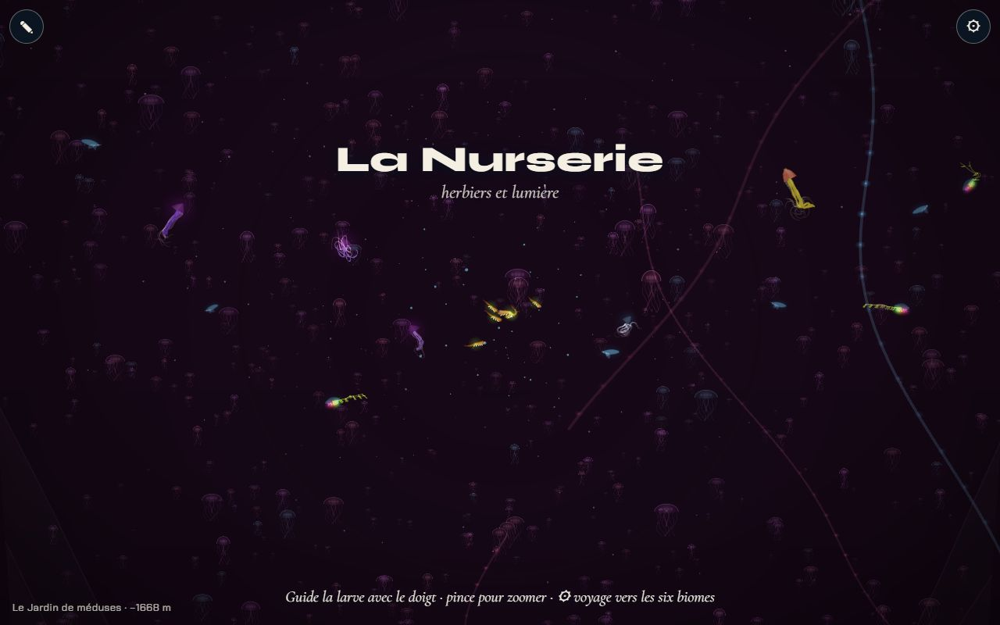
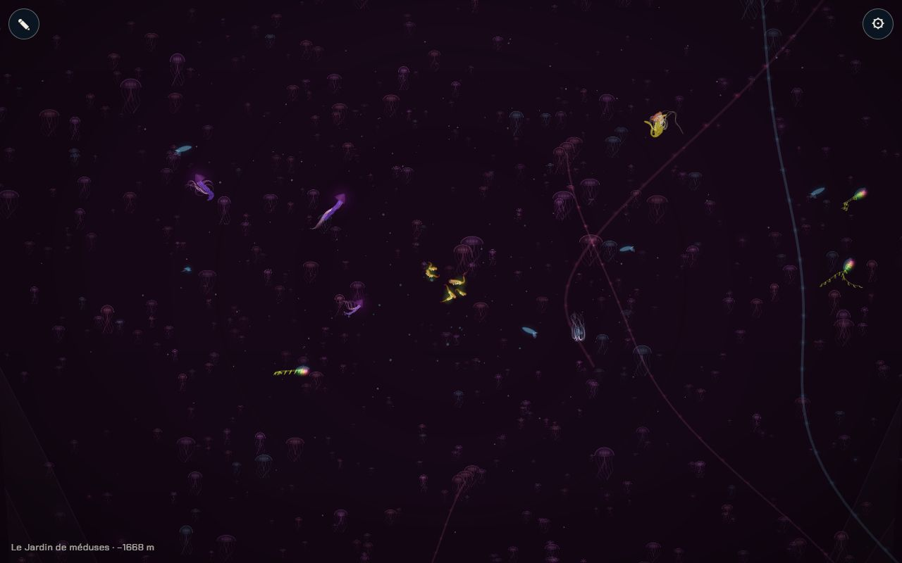
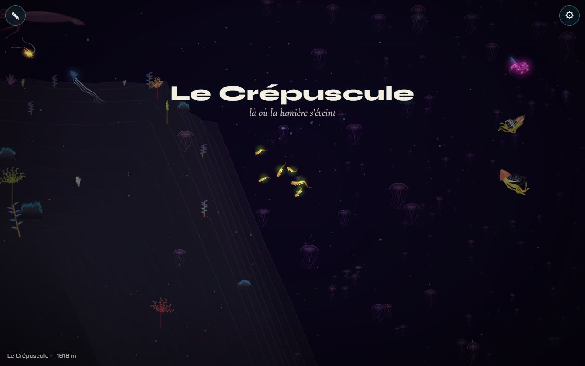

# Le Jardin de méduses : sans fond, des milliers de méduses

## Livré

- **Un biome `jardin`** (`src/monde/biomes.ts`) entre le Crépuscule et les Abysses (x 18 200 à 21 800 ; les Abysses sont décalées de 3 600 px, `X1` passe à 25 600, les cheminées et la baleine suivent dans `world.ts`). Palette violet et rose (direction artistique), faune proche simulée : méduse lune, cténophore, siphonophore, chrysaora, cuboméduse, clione.
- **Sans fond** : nouveau champ `abyss` d'un biome, fondu comme le reste (`blendOf`) : `floorAt` fait tomber le fond de 3 400 px hors de vue. `openFloor` donne le fond « d'avant » : les animaux de pleine eau (`homeY`), l'arrivée par `gotoBiome` et le banc s'en servent pour rester à mi-eau. En arrivant du Crépuscule, on voit le fond finir en falaise sur le vide.
- **Les milliers de méduses** (`src/monde/jardin.ts`, classe `Jardin`) : 2 400 méduses lointaines (1 200 en canvas 2D), chacune une image d'un atlas (3 teintes × 4 temps de pulsation + un point lumineux pour les minuscules), en 9 plans de profondeur (z 260 à 2 800) qui entrent dans la liste du peintre : les créatures simulées passent entre eux. Le champ se répète autour de la caméra, sans bord. Densité : champ `jellies` des biomes, précalculé tous les 50 px, qui s'éclaircit aux frontières.
- **Pulsation et montée** : chaque battement soulève la méduse (jet adouci), elle redescend lentement entre deux : le jardin monte (esquisse de la migration verticale du moment fort).
- **Elles s'éclairent** : toutes les 4 à 9 s, une onde de lumière part d'un point proche et traverse le jardin (halo en plus sur les méduses touchées).
- **Siphonophores géants** : 10 chaînes de 1 400 à 3 200 px au loin (z 800 à 2 200), en ondulation lente, cloches nageuses en tête, lumière qui court de la tête à la queue.
- **Tests** : `src/monde/jardin.test.ts` (répétition du champ plus large que la vue la plus large, pulsation, vagues, fond hors de vue et voisins intacts).
- **Voir** : panneau ⚙ → « Jardin de méduses », ou `monde.gotoBiome(5)`. `monde.skip.add('jellies')` enlève le champ ; `monde.jardin.stats` compte les méduses dessinées et le temps passé (`ms`).
- Doc : `docs/direction-artistique.md`, section « Le Jardin de méduses ».

### Budget (Chrome Windows, GPU réel, WebGL2, build de dev)

| | dessin du champ / image | méduses dessinées |
| --- | --- | --- |
| PC, 1280×800 | 0,7 ms | ≈ 570 + 9 points, 4 siphonophores |
| processeur bridé ×4, 412×870 (téléphone) | ≈ 3 ms | ≈ 290 + 18 points, 3 siphonophores |

`?bench=tour` à ×4 : le Jardin est dans la moyenne des biomes (dessin 27 ms contre 18 à 32 ms ; 13 img/s contre 12 à 28 : les créatures simulées dominent partout à ce bridage). Le champ ne pèse que ≈ 3 ms de ces 27 ms.

## Choix retenus

Aucune question posée sur le tableau de bord : tous les choix sont `auto` (option recommandée).

| Question | Choix retenu | Pourquoi |
| --- | --- | --- |
| Où placer le Jardin tant que la carte n'est pas refaite | Nouveau biome entre Crépuscule et Abysses, Abysses décalées | Ordre de la trame (Jardin avant la Fosse) ; le chantier des 10 chapitres n'a qu'à reprendre l'entrée |
| Comment « plus de fond » | Champ de biome `abyss` qui fait tomber le fond hors de vue, fondu aux frontières | Aucune exception dans le rendu ni les collisions ; réutilisable (la Fosse, la Remontée) |
| Méduses lointaines | Images d'un atlas, en plans de profondeur, champ répété autour de la caméra | Un seul atlas = un lot GPU ; mémoire et coût constants ; tri avec les animaux proches |
| Densité | Champ de biome `jellies` (nombre à pleine présence) | Données, pas code : un autre biome peut en avoir quelques-unes |
| Canvas 2D (repli) | Moitié moins de méduses | Le canvas paie chaque image |
| Luminosité | Vagues de lumière qui traversent le jardin + petit éclat à la contraction | « s'éclairent » lisible sans tout faire briller en permanence |
| Siphonophores | Chaînes dessinées (trait + perles + cloches), pas des créatures simulées | Géants et lointains : bon marché, et l'espèce simulée `siphonophore` reste dans la faune proche |
| Obscurité | `dark` 0,3 (moins que le Crépuscule) | Le jardin est un spectacle de lumières, pas le noir de la Fosse |

## Options non retenues

- **Place du Jardin** : remplacer la moitié du Crépuscule (pas de décalage, mais un Crépuscule de 1 800 px, plus court que le fondu de 1 400) ; le mettre après les Abysses (aucun décalage, mais contre l'ordre de la trame) ; attendre la nouvelle carte (rien de visible).
- **Sans fond** : cacher les rangées de fond dans ce biome (le fond resterait pour les collisions et les rochers, incohérent) ; un fond très bas codé dans `PROFILE` seulement (les animaux et l'arrivée tomberaient 3 000 px plus bas).
- **Méduses lointaines** : créatures simulées à bas niveau de détail (le coût par animal interdit les milliers) ; des points seuls (pas de pulsation lisible de près) ; méduses placées une fois pour toutes sur la carte (mémoire ×10, et un jardin qui a des bords) ; instanciation GPU dédiée (plus rapide, mais un nouveau chemin dans `gfx.ts`, partagé ; à garder si le budget téléphone serre).
- **Lumière** : toutes clignotent chacune à son rythme (bruit visuel) ; lumières dessinées après l'obscurité (brillent par-dessus les animaux proches, fausse profondeur).
- **Siphonophores** : visiteurs simulés à grande échelle comme la tortue ou la manta (coût d'une créature entière, et leur forme de 48 maillons tient mal à cette taille) ; images précuites (pas d'ondulation).

## Reste à faire / limites

- **La carte** : le chantier `10-chapitres-monde` doit reprendre l'entrée `jardin` (avec `abyss` et `jellies`) et `HILLS`/`BUMPS`/`DUNES` à 7 valeurs.
- **Le moment fort** (tout le jardin monte pendant que tu descends) n'est qu'esquissé : le jardin monte en permanence, lentement. Une vraie migration (accélération collective, déclenchée) est à faire avec les obstacles.
- **Les courants verticaux** de l'obstacle (étape 3) ne sont pas faits.
- Aux bords du biome, les rangées de fond lointaines des voisins restent visibles aux coins de l'écran, et des méduses (clairsemées) se dessinent devant la falaise du Crépuscule (le tri par rangée de fond est approximatif).
- `metres` donne ≈ 1 700 m dans le Jardin au lieu de 400–500 m : c'est l'échelle actuelle de toute la carte.
- Pas de mesure sur un vrai téléphone : bridage CPU ×4 du Chrome de bureau seulement.

## Risques de fusion

- `src/monde/biomes.ts` : nouvelle entrée `jardin`, Abysses à x0 21 800, `X1`, `PROFILE`, tableaux `HILLS`/`BUMPS`/`DUNES` (7 valeurs), champs `abyss` et `jellies` dans `Biome`, `floorAt` coupé en `floorAt` + `openFloor`. **Conflit certain avec `10-chapitres-monde`** : garder sa carte, y reporter l'entrée `jardin`, et garder `abyss`/`openFloor`.
- `src/monde/world.ts` : cheminées et baleine décalées avec le x0 des Abysses (conflit possible avec les décors Carcasse, Fosse).
- `src/monde/main.ts` : 5 branchements courts (import, `new Jardin`, `jardin.collect` dans `render`, `openFloor` dans `homeY` et `gotoBiome`, `jardin` dans l'API) et la plage du dragon abyssal.
- `src/monde/bench.ts` : une ligne (`openFloor`).
