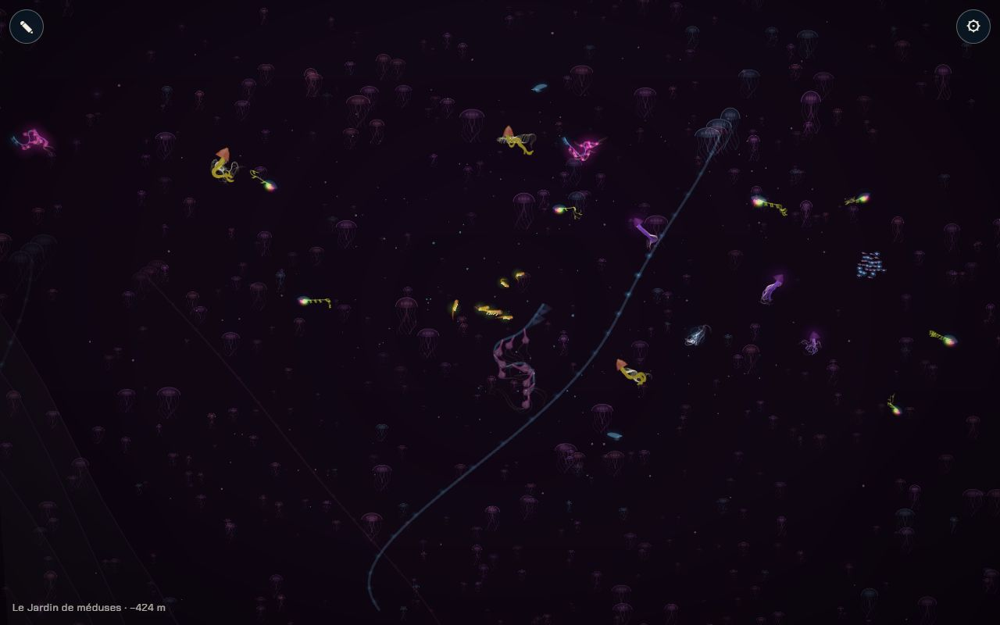

# Le Jardin de méduses : sans fond, des milliers de méduses

## Livré

- **Le chapitre `jardin`** (`src/monde/biomes.ts`, carte des 10 chapitres : x 22 000 à 25 200, entre le Glacier et la Fosse). Son entrée vient du chantier des 10 chapitres (palette violet et rose, faune, banc lumineux, siphonophore géant simulé en visiteur, `lift` 800) ; ce chantier y ajoute `abyss: 2800`, `jellies: 2400` et `dark` 0,3 au lieu de 0,55.
- **Sans fond** : nouveau champ `abyss` d'un chapitre : `floorAt` fait tomber le fond de 2 800 px hors de vue, en pente douce (fondu sur ±1 200 px de plus que les autres valeurs, table tous les 50 px) pour garder un fond sans marche. `openFloor` donne le fond « d'avant » : les animaux de pleine eau (`homeY`), les bancs et l'arrivée (`arrival`) s'en servent, relevés de `lift`. En arrivant du Glacier, on voit le fond finir en falaise sur le vide.
- **Les milliers de méduses** (`src/monde/jardin.ts`, classe `Jardin`) : 2 400 méduses lointaines (1 200 en canvas 2D), chacune une image d'un atlas (3 teintes × 4 temps de pulsation + un point lumineux pour les minuscules), en 9 plans de profondeur (z 260 à 2 800) qui entrent dans la liste du peintre : les créatures simulées passent entre eux. Le champ se répète autour de la caméra, sans bord. Densité : champ `jellies` des biomes, précalculé tous les 50 px, qui s'éclaircit aux frontières.
- **Pulsation et montée** : chaque battement soulève la méduse (jet adouci), elle redescend lentement entre deux : le jardin monte (esquisse de la migration verticale du moment fort).
- **Elles s'éclairent** : toutes les 4 à 9 s, une onde de lumière part d'un point proche et traverse le jardin (halo en plus sur les méduses touchées).
- **Siphonophores géants** : 10 chaînes de 1 400 à 3 200 px au loin (z 800 à 2 200), en ondulation lente, cloches nageuses en tête, lumière qui court de la tête à la queue.
- **Tests** : `src/monde/jardin.test.ts` (répétition du champ plus large que la vue la plus large, pulsation, vagues, fond hors de vue et voisins intacts).
- **Voir** : panneau ⚙ → « Jardin de méduses », ou `monde.gotoBiome(7)`. `monde.skip.add('jellies')` enlève le champ ; `monde.jardin.stats` compte les méduses dessinées et le temps passé (`ms`).
- Doc : `docs/direction-artistique.md`, section « Le Jardin de méduses ».

### Budget (Chrome Windows, GPU réel, WebGL2, build de dev)

| | dessin du champ / image | méduses dessinées |
| --- | --- | --- |
| PC, 1280×800 | 0,7 ms | ≈ 570 + 9 points, 4 siphonophores |
| processeur bridé ×4, 412×870 (téléphone) | ≈ 3 ms | ≈ 290 + 18 points, 3 siphonophores |

`?bench=tour` à ×4 : le Jardin est dans la moyenne des biomes (dessin 27 ms contre 18 à 32 ms ; 13 img/s contre 12 à 28 : les créatures simulées dominent partout à ce bridage). Le champ ne pèse que ≈ 3 ms de ces 27 ms.

### Fusion avec `backlog` (10 chapitres, premier plan)

- **Conflits** : `biomes.ts` (la carte des 10 chapitres gardée entière ; `abyss`, `jellies`, `openFloor` rebranchés dessus ; `arrival` passe par `openFloor`), `main.ts` (imports combinés, visiteurs par chapitre de `backlog`, `arrival` dans `gotoBiome`, `jardin` et `front` dans l'API), `world.ts` et `bench.ts` (côté `backlog` : décors placés par chapitre, `arrival` ; mon décalage des Abysses n'a plus lieu d'être).
- **Relu hors conflits** : les bancs de poissons (`Shoal`) prennent `openFloor` ; le premier plan sombre (`foreground.ts`) ne fait plus surgir de silhouettes dans un chapitre sans fond ; les tests de `foreground.test.ts` qui visaient les anciens biomes (`kelp`, `abysses`) visent `foret` et `fosse` ; celui de la jauge (`biomes.test.ts`) lit la profondeur de la vie sur `openFloor`.
- Mesure après fusion (PC, 1280×800) : ≈ 520 méduses et 3 siphonophores dessinés, 1,5 ms pour le champ, 59 img/s.

## Choix retenus

Aucune question posée sur le tableau de bord : tous les choix sont `auto` (option recommandée).

| Question | Choix retenu | Pourquoi |
| --- | --- | --- |
| Où placer le Jardin | Avant la fusion : un biome entre Crépuscule et Abysses ; après : le chapitre `jardin` de la carte des 10 chapitres | La carte de `backlog` suit la trame ; le Jardin n'y ajoute que ses champs |
| Comment « plus de fond » | Champ de biome `abyss` qui fait tomber le fond hors de vue, fondu aux frontières | Aucune exception dans le rendu ni les collisions ; réutilisable (la Fosse, la Remontée) |
| Méduses lointaines | Images d'un atlas, en plans de profondeur, champ répété autour de la caméra | Un seul atlas = un lot GPU ; mémoire et coût constants ; tri avec les animaux proches |
| Densité | Champ de biome `jellies` (nombre à pleine présence) | Données, pas code : un autre biome peut en avoir quelques-unes |
| Premier plan sombre dans un chapitre sans fond | Aucun | Des silhouettes qui surgissent du bas contrediraient « plus de fond visible » |
| Fond sans marche contre vide profond | Vide de 2 800 px en pente longue | Garde la règle du fond sans marche (test de `backlog`) et cache le fond aux zooms courants |
| Canvas 2D (repli) | Moitié moins de méduses | Le canvas paie chaque image |
| Luminosité | Vagues de lumière qui traversent le jardin + petit éclat à la contraction | « s'éclairent » lisible sans tout faire briller en permanence |
| Siphonophores | Chaînes dessinées (trait + perles + cloches), pas des créatures simulées | Géants et lointains : bon marché, et l'espèce simulée `siphonophore` reste dans la faune proche |
| Obscurité | `dark` 0,3 (0,55 dans le décor provisoire) | Le jardin est un spectacle de lumières, pas le noir de la Fosse |

## Options non retenues

- **Place du Jardin** : remplacer la moitié du Crépuscule (pas de décalage, mais un Crépuscule de 1 800 px, plus court que le fondu de 1 400) ; le mettre après les Abysses (aucun décalage, mais contre l'ordre de la trame) ; attendre la nouvelle carte (rien de visible).
- **Sans fond** : cacher les rangées de fond dans ce biome (le fond resterait pour les collisions et les rochers, incohérent) ; un fond très bas codé dans `PROFILE` seulement (les animaux et l'arrivée tomberaient 3 000 px plus bas).
- **Méduses lointaines** : créatures simulées à bas niveau de détail (le coût par animal interdit les milliers) ; des points seuls (pas de pulsation lisible de près) ; méduses placées une fois pour toutes sur la carte (mémoire ×10, et un jardin qui a des bords) ; instanciation GPU dédiée (plus rapide, mais un nouveau chemin dans `gfx.ts`, partagé ; à garder si le budget téléphone serre).
- **Lumière** : toutes clignotent chacune à son rythme (bruit visuel) ; lumières dessinées après l'obscurité (brillent par-dessus les animaux proches, fausse profondeur).
- **Premier plan dans le Jardin** : le garder (profondeur, mais des algues sans sol) ; le remplacer par des méduses floues au premier plan (joli, mais c'est un nouveau chantier du premier plan).
- **Vide et falaise** : vide de 3 400 px en fondu court (marche de 35 px, casse la règle du fond sans marche) ; assouplir le test (cache le problème) ; décaler le début du vide dans le Jardin (le fond resterait visible au début du chapitre).
- **Siphonophores** : visiteurs simulés à grande échelle comme la tortue ou la manta (coût d'une créature entière, et leur forme de 48 maillons tient mal à cette taille) ; images précuites (pas d'ondulation).

## Reste à faire / limites

- **Le moment fort** (tout le jardin monte pendant que tu descends) n'est qu'esquissé : le jardin monte en permanence, lentement. Une vraie migration (accélération collective, déclenchée) est à faire avec les obstacles.
- **Les courants verticaux** de l'obstacle (étape 3) ne sont pas faits.
- Aux bords du chapitre, les rangées de fond lointaines des voisins restent visibles aux coins de l'écran, et des méduses (clairsemées) se dessinent devant la falaise du Glacier (le tri par rangée de fond est approximatif).
- Tout zoomé en arrière, le fond peut affleurer au bas de l'écran (vide de 2 800 px, limité par la règle du fond sans marche).
- Pas de mesure sur un vrai téléphone : bridage CPU ×4 du Chrome de bureau seulement.

## Risques de fusion

- `src/monde/biomes.ts` : champs `abyss` et `jellies` de `Biome`, `floorAt` = `openFloor` + `abyssAt`, `arrival` sur `openFloor`, entrée `jardin` (3 valeurs).
- `src/monde/main.ts` : branchements courts (import, `new Jardin`, `jardin.collect` dans `render`, `openFloor` dans `homeY` et `Shoal`, `jardin` dans l'API).
- `src/monde/foreground.ts` : une condition (pas de premier plan sur un fond tombé) ; `foreground.test.ts`, `biomes.test.ts` : identifiants et `openFloor`.
