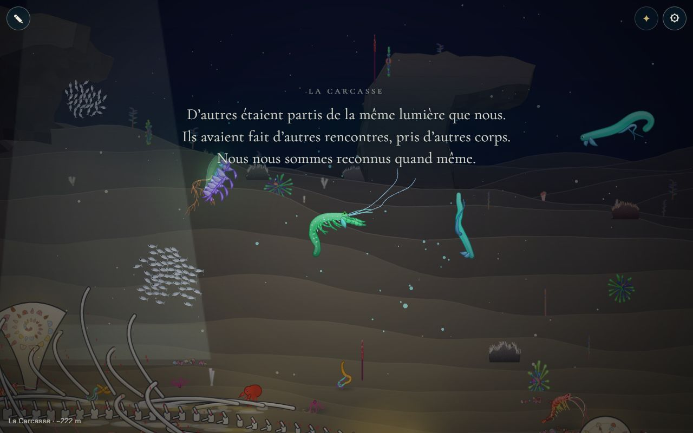
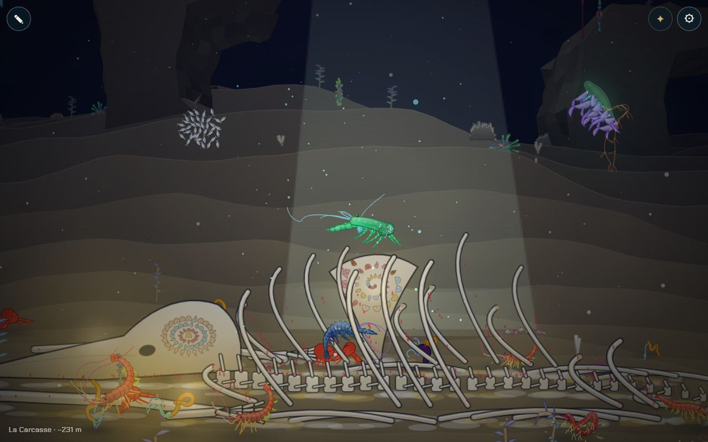
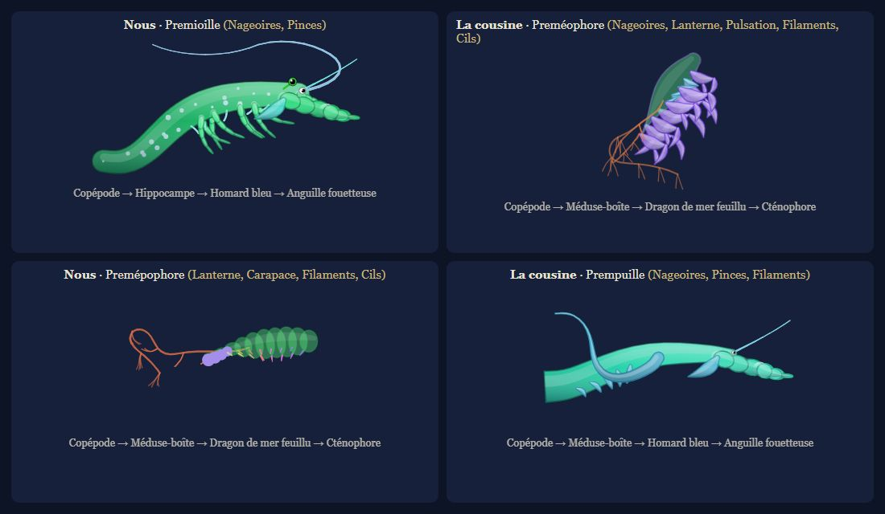
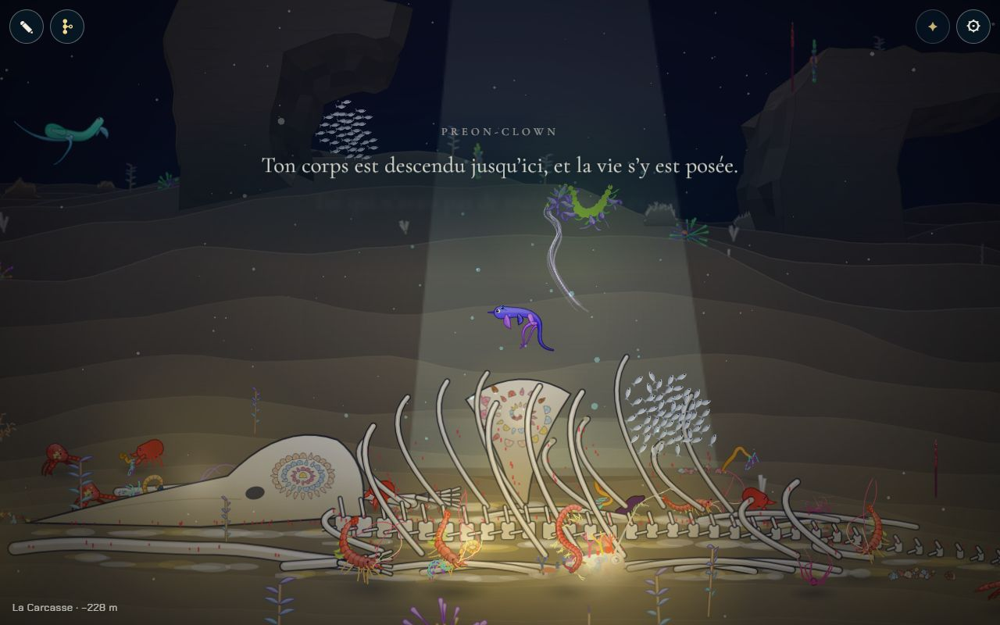
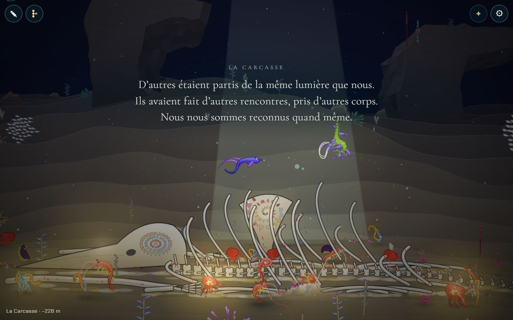

# La lignée rivale de la Carcasse

## Livré

À la Carcasse, une **cousine** : la créature d'une autre lignée, partie de la même larve que nous (`firstAncestor`), mais qui a choisi d'autres partenaires dans chacun des quatre chapitres d'avant (Nurserie, Récif, Forêt, Grotte).

- **Ses choix** (`rivalChoices`, `src/monde/rivale.ts`, pur et testé) : dans un chapitre à obstacle, elle prend un partenaire du chapitre (`PARTNERS`) qui apporte un trait qui le franchit (`KEYS`), d'abord le trait que **notre** corps n'a pas : si nous avons des nageoires, elle a pris la méduse-boîte (pulsation) ; des pinces, le dragon feuillu (corps fin) ; un corps fin, le cténophore (lanterne). Ensuite, le partenaire qui apporte le plus de traits que nous n'avons pas. À la Nurserie (sans obstacle), presque au hasard. Depuis la fusion avec l'arbre de la lignée, qui sauve le partenaire de chaque naissance, elle **ne prend jamais notre partenaire** d'un chapitre (`ourPartners`), sauf s'il est le seul à franchir l'obstacle. Elle a toujours pu franchir chaque obstacle (testé pour les 256 combinaisons de traits, avec des partenaires pris au hasard).
- **Ses générations** (`rivalLineage`) : quatre portées faites par `brood` (`src/content/portee.ts`), comme les nôtres, parade réussie à 0,8 ; elle garde chaque fois l'enfant qui franchit l'obstacle et porte le trait voulu, et parmi eux le plus loin de son parent. Le résultat est une créature étrange, de notre génération, dont le nom commence comme le nôtre (« Prem… »). Environ 12 ms dans le navigateur, une seule fois.
- **D'où elle vient** : de la créature de notre lignée qui est arrivée à la Carcasse (`arrivedAt` : le premier ancêtre qui a donné naissance à la Carcasse ou plus bas, sinon celle qu'on joue). Graine (`cousinSeed`) : un hachage de son corps (traits, forme, membres, couleur) et de nos partenaires, **pas de son nom**, que l'arbre de la lignée peut changer. C'est la même cousine à chaque visite, après un rechargement et après un renommage, **sans rien ajouter à la sauvegarde**.
- **Dans le monde** (`src/monde/rivale-jeu.ts`) : elle est faite la première fois qu'on entre dans la Carcasse (ou qu'on y revient des Sources), au-dessus des côtes, à peu près à notre taille (agrandie jusqu'à 1,8 fois si elle est bien plus petite que nous). Seule, elle va et vient le long du squelette. À 560 px, elle nous remarque : une lueur de sa couleur s'allume d'un coup puis respire (jamais l'or des partenaires, `cousinHue`). Elle vient nager à côté de nous, un peu au-dessus, et nous suit autour des os sans jamais nous toucher (elle s'écarte sous 90 px), puis y retourne quand on s'en éloigne (760 px de chez elle). Pendant une parade ou un adieu, elle nous laisse (`aside`). Ce n'est pas une partenaire : elle ne danse pas.
- **Le texte de la rencontre** : la première fois qu'on la croise (320 px), dès qu'aucun autre texte n'est à l'écran (ouverture, adieu, panneau) : « D'autres étaient partis de la même lumière que nous. / Ils avaient fait d'autres rencontres, pris d'autres corps. / Nous nous sommes reconnus quand même. » Écrit dans `docs/chapitres.md` sous le libellé « La rencontre : » (nouveau type de texte `meeting` dans `textes.ts`).
- **Pour le voir** : `?dev`, voyage à la Carcasse (panneau ⚙), puis nager vers le milieu du squelette. Console : `monde.rivale.rival` (sa définition, les partenaires choisis et les enfants gardés), `monde.rivale.cr`, `monde.rivale.met`, `monde.rivale.make()`.
- Tests : `src/monde/rivale.test.ts` (15). Doc : `docs/chapitres.md`, chapitre 5 (« La lignée rivale ») et « Les textes ».

## Choix retenus

Aucune question posée à l'utilisateur (le chantier ne demandait aucun choix structurant). Un retour (feedback) signale un test qui échoue déjà sur la base (voir « Reste à faire »).

| Question | Choix retenu | Pourquoi |
| --- | --- | --- |
| Ce qui rend ses choix « différents » | Les traits de notre corps (elle franchit chaque obstacle avec l'autre trait), et nos partenaires sauvés, qu'elle évite | Nos traits disent comment nous avons franchi, et c'est ce qui se voit ; nos partenaires, gardés depuis l'arbre de la lignée, rendent la différence exacte |
| Comment elle est faite | La même chaîne que la nôtre : `firstAncestor` puis `brood` avec les partenaires des chapitres | Une vraie cousine (même larve, mêmes règles d'hérédité), pas une espèce dessinée à part |
| Combien de créatures | Une seule, de notre génération | Lisible et léger ; « la cousine » répond au « nous » |
| Quand elle est faite | À l'entrée de la Carcasse, depuis la créature arrivée là | Avant, la créature qu'on joue n'est pas encore celle qui arrive |
| Garder la même cousine | Recalculée à partir de la lignée déjà sauvée (hachage du corps et des partenaires, sans le nom), rien de nouveau dans la sauvegarde | Pas de changement de format durable ; l'arbre renomme les créatures, le nom ne doit donc pas compter |
| Son comportement | Elle vient nager à côté de nous, sans toucher, puis retourne à ses os | Une reconnaissance, pas une rivalité : zéro danger, rien à gagner ni à perdre |
| Comment la repérer | Une lueur de sa propre couleur quand elle nous remarque | Les partenaires ont l'or : on ne confond pas ; dans le noir de la Carcasse elle reste visible |
| Sa taille | Au moins 90 % de la nôtre environ (agrandie jusqu'à 1,8 fois) | Les fusions donnent parfois une créature minuscule, qu'on ne remarquait pas |
| Un texte | « La rencontre », lu dans `chapitres.md` comme les autres | Le texte est la seule vraie interface ; il dit « d'autres choix » sans chiffre |
| Elle et la parade / l'adieu | Elle s'écarte pendant | Ces deux moments sont les nôtres |

## Options non retenues

- **Ce qui la rend différente** : nos partenaires seuls, sans nos traits — exact, mais les parties sauvées avant l'arbre n'ont pas de partenaire, et nos traits restent ce qui se voit ; tirer ses partenaires au hasard — simple, mais elle pourrait avoir fait exactement nos choix ; lui donner les traits qui nous manquent sans passer par des partenaires — moins cohérent avec l'hérédité.
- **Comment elle est faite** : une espèce du bestiaire dessinée à la main — plus belle et maîtrisée, mais toujours la même et sans lien avec nous ; `generate()` avec la famille « chimère » — étrange, mais pas cousine ; `fuse` en mode « chimère » avec tous les partenaires d'un coup — trop chargée pour un téléphone.
- **Combien** : toute sa lignée (ses quatre ancêtres, là où chacun a été quitté) — riche, mais coûte des acteurs et empiète sur « Les ancêtres restent dans le monde » ; la cousine et son parent — lisible comme « une lignée », mais son parent devrait être resté à la Grotte ; un petit groupe de sœurs — plus vivant, plus de coût.
- **Quand** : au chargement de la page — la créature n'est pas encore celle qui arrive ; à l'entrée de la Grotte — on peut encore y changer de corps.
- **Garder la même** : enregistrer sa définition dans la sauvegarde — robuste même si l'Atelier change notre corps, mais nouveau format durable ; la refaire à chaque session depuis la créature jouée — change après chaque naissance plus bas.
- **Comportement** : une rivale qui danse avec nos partenaires sous nos yeux (sa propre parade) — fort, mais demande une deuxième parade dans `parade-jeu.ts` ; une partenaire qu'on peut courtiser — mélangerait deux lignées, tentant pour plus tard, mais « rivale » dit le contraire ; une cousine qui fuit — lisible comme « rivale » mais triste et moins mémorable ; qui nous imite (miroir de nos gestes) — à essayer ensuite, demande de lire notre vitesse.
- **Repérage** : aucune lueur — plus sobre, mais on passe à côté dans le noir ; l'or des partenaires — ferait croire qu'on peut danser avec elle ; des lueurs qui montent comme pour la parade — plus de dessin pour peu de différence.
- **Taille** : telle que la fusion la donne — parfois un point à l'écran ; exactement la nôtre — force trop les grandes.
- **Texte** : aucun — le moment passerait inaperçu ; son nom à l'écran — contraire à « pas d'interface », il ira plutôt dans l'arbre de la lignée.

## Reste à faire / limites

- **Test déjà rouge sur la base** : `src/monde/nouveautes/plugin.test.ts` (« embeds the published versions only… ») échoue sur `backlog` 783f9a2 sans aucun changement (les images de la 0.4.0 prennent le budget de 400 Ko, les entrées de la 0.2.0 n'ont plus leur image). Signalé au tableau de bord ; `make check` est rouge pour cette seule raison.
- Une partie sauvée avant l'arbre de la lignée n'a pas nos partenaires : la cousine ne s'appuie alors que sur nos traits et peut, dans un chapitre, avoir fait le même choix que nous. Dans un chapitre où notre partenaire est le seul à franchir, elle le prend aussi (aucun chapitre n'est dans ce cas aujourd'hui).
- Si l'Atelier change notre créature avant la Carcasse, la cousine suit ce corps-là (sans Atelier dans l'histoire, cela ne concerne que les tests).
- Le texte de la rencontre est une proposition, à relire avec les autres textes.
- À faire ensuite : la cousine dans l'arbre de la lignée (une branche à part, `arbre-ecran.ts` existe maintenant), sa lignée revue à la Remontée, ou une trace d'elle plus bas (chantier des traces).

## Fusion avec backlog (l'arbre de la lignée, les ancêtres qui restent dans le monde)

- **Conflit dans `src/monde/main.ts`**, réglé en gardant les deux côtés : les imports (`mateFor`, `initArbre`, `ancestorsIn`, `placeOf` de `backlog`, puis `initRivale`) ; l'`api` (`arbre` de `backlog` et `rivale`).
- **Relu sans conflit** : la sauvegarde (`partie.ts`) garde maintenant le partenaire (`partner`) et le lieu (`at`) de chaque ancêtre, et l'arbre peut renommer une créature. D'où deux changements de mon côté :
  - la graine de la cousine ne lit plus le nom (`cousinSeed`), sinon un renommage aurait changé la cousine ;
  - la cousine évite nos partenaires sauvés (`ourPartners`, `rivalChoices(…, taken)`).
- L'arbre met le jeu en pause (`paused`) et fait taire le narrateur (`narrator.quiet`) : la cousine s'arrête et le texte de la rencontre attend, sans rien à changer. Les ancêtres remis dans le monde sont des acteurs `'parent'`, à côté de la branche `'rival'` de la boucle.
- Vérifié en jeu (Chrome Windows) : une lignée sauvée avec le poisson-clown, le homard et l'anguille donne une cousine qui a pris la méduse-boîte, le dragon feuillu et le serpent cilié. Après un rechargement, c'est la même cousine (même graine, même nom). Rien de neuf à l'écran : pas de nouvelle capture.

## Seconde fusion avec backlog (les traces de la lignée)

- **Conflit dans `src/monde/main.ts`**, réglé en gardant les deux côtés : l'import (`initTraces`, puis `initRivale`) ; l'`api` (`arbre, traces, rivale`).
- **Relu sans conflit** : `narration.ts` a maintenant `say(name, lines)`, pour les mots dits devant une trace. Ces mots bloquent aussi les autres textes tant qu'ils sont à l'écran (`farewellUntil`), et `say` n'interrompt rien de ce qui est affiché. Mon texte de la rencontre attend déjà tant qu'un texte est à l'écran (`quiet`, classe `show`) : les deux se suivent sans se couper la parole. Rien à changer dans mon code. `docs/chapitres.md` s'est fusionné seul : sa nouvelle section « Les traces de la lignée » est un titre sans numéro, que `parseChapterTexts` ne lit pas comme un chapitre, donc « La rencontre » de la Carcasse ne bouge pas.
- **Vérifié en jeu** (Chrome Windows) avec une lignée sauvée de quatre générations (copépode, poisson-clown, homard, anguille) :
  - l'ancêtre de la Forêt laisse son corps devenu récif au milieu du squelette, à côté de chez la cousine ;
  - en approchant, la lignée dit d'abord les mots de la trace, puis, une fois qu'ils se sont effacés, ceux de la rencontre ;
  - la cousine a pris la larve à la Nurserie (nous, le copépode), puis la méduse-boîte, le dragon feuillu et le serpent cilié.
- Juste après, `backlog` a encore reçu des changements du système d'agents (`agents/`, `docs/backlog.md`) : ils se sont fusionnés sans conflit, sans rien toucher au jeu.
- L'entrée pour les joueurs ne change pas : rien de neuf pour eux dans ces fusions.

## Risques de fusion

- `src/monde/main.ts` (branchements courts) : un import (après celui des traces) ; `'rival'` ajouté à `Actor.kind` ; `rivale.step(…)` après `parade.step` dans `update()` ; une branche `a.kind === 'rival'` avant celle du parent dans la boucle des acteurs ; `rivale.lights(…)` après `parade.lights` dans `render()` ; la création `initRivale({…})` juste avant `// ----- loop -----` ; `rivale` dans `api`. Conflit probable avec « Les ancêtres restent dans le monde » sur `Actor.kind` et la boucle des acteurs : garder les deux branches.
- `src/monde/textes.ts` : un type de texte de plus (`meeting`) et son libellé ; additif.
- `docs/chapitres.md` : une ligne dans « Les textes », un paragraphe et le texte « La rencontre » au chapitre 5 ; additif.
- Nouveaux fichiers : `src/monde/rivale.ts`, `rivale-jeu.ts`, `rivale.test.ts`.
- La cousine lit `partner.id` dans la lignée sauvée : si `Ancestor.partner` change de forme (`partie.ts`), mettre à jour `ourPartners`.
