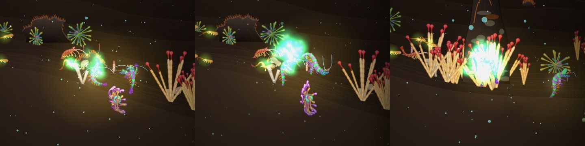
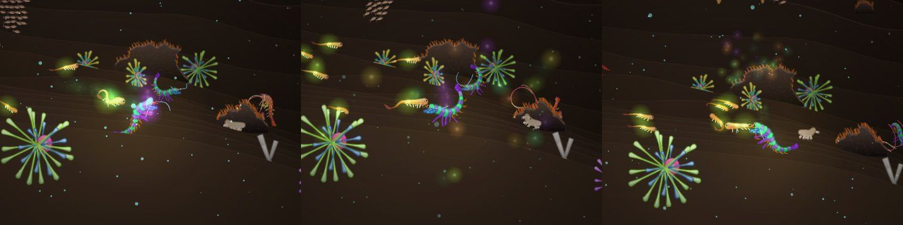
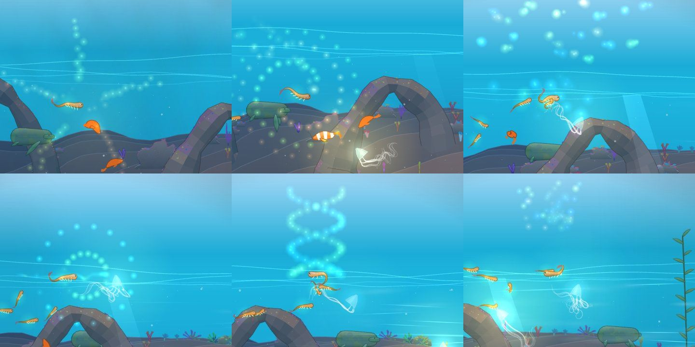
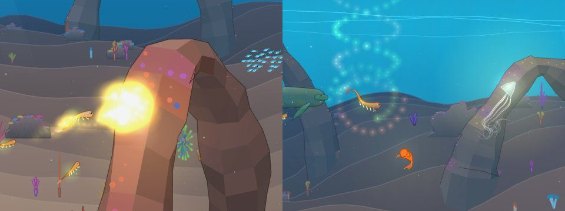
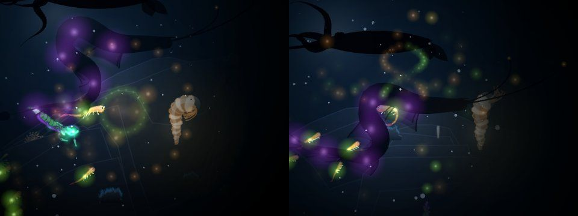

# Lueur de l'accouplement

## Livré

Les lumières de la parade (le sillage pendant la danse et l'éclat final) ne sont plus éblouissantes et ne sont jamais tout à fait les mêmes : chaque parade tire les siennes des gènes des deux danseurs, avec un peu de hasard.

- **Moins éblouissant** : l'ancien éclat empilait 10 à 40 grosses lueurs à 0,75 d'opacité au même point, en mode additif. On obtenait une tache blanche qui cachait les créatures, et le sillage faisait une colonne blanche.
  - Maintenant, chaque lumière reste sous 0,7 d'opacité.
  - Là où elles se rassemblent, celles d'une même case de 32 px du monde ne dépassent pas 1,8 à elles toutes : elles se partagent leur force (`CELL_CAP`, testé pour chaque figure, avec et sans écho, et avec le bonus d'eau claire).
  - Les figures s'étalent sur 100 à 150 px autour du couple au lieu de s'empiler.
  - Une parade réussie donne une figure **plus riche** (plus de lumières), plus jamais plus forte.
  - Pendant la danse et juste après, le halo doré du partenaire baisse à 30 %.
- **Plein d'effets, un peu de hasard** :
  - 7 sillages : poussière, bulles, étincelles, ruban (une ligne qui dessine le huit), volutes, pouls (des anneaux qui partent du partenaire), lucioles.
  - 7 figures finales : corolle, spirale, pluie, lucioles, anneaux, hélice, fontaine.
  - Une fois sur deux, un **écho** : une seconde figure, plus petite, tirée de nos seuls gènes.
  - Le sens de rotation, la taille des lumières et le rythme varient aussi. La figure de la parade précédente ne revient que rarement (son poids tombe à 15 %).
- **Selon les gènes des accouplés** (`genesOf`) :
  - **Les couleurs** : celles des parties lumineuses d'abord, puis la palette. Celle du partenaire vient en premier, puis la nôtre ; la spirale et l'hélice ont un bras de chaque couleur.
  - **Les traits** (`traitsOf`) et **la façon de nager** orientent le tirage. Un gène compte double chez le partenaire, simple chez nous : pulsation ou cloche → anneaux et pouls ; carapace, pinces ou marche → fontaine et étincelles ; lanterne ou parties lumineuses → lucioles ; corps fin → ruban et hélice ; nageoires → corolle, spirale, bulles.
  - **La symétrie** du partenaire (anneau de bras, éventail de tentacules) donne le nombre de pétales et de perles : 5 pour une étoile ou une crevette, 6 pour une méduse, 8 pour un poulpe. Sans symétrie, c'est le hasard qui la choisit, entre 3 et 7.
  - Ceux qui nagent par jets ou par élans rendent les figures plus vives.
- **Fichiers** :
  - `src/monde/lueur.ts` (nouveau, pur) : les gènes, le tirage (`lueurOf`), les lumières (`Motes` : délai, dérive, rotation, scintillement, plafond par case), les sillages (`wake`), les figures (`burst`) et la remarque (`notice`).
  - `src/monde/lueur.test.ts` : 12 tests.
  - `src/monde/parade-jeu.ts` : branché à la place de ses anciennes lueurs.
  - `src/monde/main.ts` : une ligne, le halo du partenaire atténué.
  - `docs/mecaniques.md` : nouvelle section « La lueur de l'accouplement ».
- **Le voir** : danser avec un partenaire, dans n'importe quel chapitre. En test :
  - `monde.parade.forceLight({ wake: 'ruban', burst: 'helice', echo: 'spirale' })` impose la lumière de la parade suivante ;
  - `monde.parade.light` donne celle de la parade en cours, ou de la dernière ;
  - `monde.parade.quiet = () => false; monde.parade.start(monde.partners()[0], monde.player.cr)` lance une parade.

Avant, aux Sources (le sillage, puis l'éclat de deux parades) :

Après, dans la même scène (poussière et lucioles, puis ruban et fontaine) :

Les figures au Récif, près de la surface (corolle à 5 pétales, spirale, pluie, anneau, double hélice, fontaine) :

Au Récif, l'ancien éclat, puis une hélice avec une spirale en écho :

Dans le noir de la Fosse, où l'additif éblouissait le plus (un anneau, puis une hélice en écho). Les grandes taches violettes sont les lueurs d'un visiteur de la Fosse, pas celles de la parade :

## Choix retenus

Aucune question n'a été posée à l'utilisateur : tous ces choix sont `auto`, faits seul, avec l'option recommandée.

| Question | Choix retenu | Pourquoi |
|---|---|---|
| Quelle est « la lueur de l'accouplement » ? | Les lumières de la parade (sillage et éclat final) ; le halo doré du partenaire est atténué pendant la danse et juste après | C'est ce qui éblouissait (captures « avant »), et « les gènes des accouplés » désigne le couple qui danse |
| Comment la rendre moins éblouissante ? | Opacité plafonnée par lumière et par case de 32 px, figures étalées, richesse au lieu de force | Garde l'additif et le sprite commun (rien à changer au rendu), et la garantie est testable |
| Quelle part au hasard, quelle part aux gènes ? | Un tirage pondéré : chaque gène d'une figure ajoute du poids (double chez le partenaire), le hasard tranche | « Pas forcément les mêmes à chaque fois » et « peut-être en fonction des gènes » : les deux comptent, aucun ne décide seul |
| Quelles formes ? | Des arrangements de lueurs rondes (lignes, anneaux, spirales, hélices), sans nouveau sprite | Tout passe par la liste `lights` existante (canvas et WebGL) : aucun changement à `scene-gl.ts` ni à la boucle de dessin |
| Répéter la même figure deux fois de suite ? | Rarement (poids × 0,15) | Varier sans l'interdire |
| Une seconde figure ? | Un « écho » une fois sur deux, tiré de nos seuls gènes | Les deux accouplés ont chacun leur part dans la fin |
| Eau claire | Bonus jusqu'à ×1,5, appliqué **avant** les plafonds | En surface, un bonus appliqué après les plafonds redonnait des traînées presque blanches |
| Durée de la figure | Tenir dans les 1,6 s avant la portée (inchangé) | Ne pas toucher l'enchaînement parade → portée, que d'autres chantiers touchent |

## Options non retenues

- **La lueur de l'accouplement** :
  - Le halo doré des partenaires seul (`partnerGlow`) : il n'éblouit pas vraiment et il concerne une créature, pas le couple. Coût faible.
  - Refaire aussi ce halo selon les gènes : hors du chantier, et le futur chantier des indices pour trouver le partenaire le touchera sans doute. Coût moyen.
- **Moins éblouissant** :
  - Un mode de fusion non additif (`screen`, ou par-dessus) : des couleurs plus franches, mais il faut un chemin de dessin à part en canvas et en WebGL. Coût moyen, risque de fusion dans `main.ts` et `scene-gl.ts`.
  - Un sprite de lueur plus saturé, au cœur moins blanc : joli, mais le sprite est commun à toutes les lueurs du jeu. Il faudrait un second atlas en WebGL. Coût moyen.
  - Simplement baisser l'opacité : trop pâle en eau claire et toujours blanc là où les lueurs s'empilent (essayé en premier).
  - Assombrir selon le noir alentour : moins lisible, et le plafond par case suffit. Coût faible.
- **Hasard et gènes** :
  - Tout au hasard : plus simple, mais sans lien avec les accouplés.
  - Tout déterminé par les gènes (le même couple donne toujours la même lumière) : ce serait lisible, mais contraire à « pas les mêmes à chaque fois ».
  - Une lumière par chapitre : sans lien avec les créatures.
- **Formes** :
  - De nouveaux sprites (anneau, trait, étoile) : plus de formes, mais il faut toucher l'atlas WebGL et le format de `lights`, partagé par les autres modules (traces, rivale, grotte). Coût moyen à élevé.
  - Un dessin à part pour la parade (ses propres appels de dessin) : plus de liberté, mais un branchement plus long dans les deux chemins de `main.ts`.
- **Durée** :
  - Allonger à 2,2 s le délai avant la portée (`main.ts`, `parade.onEnd`) pour les figures longues : utile, mais il touche l'enchaînement que `titre-chantier-2` (l'œuf imposé) remanie sans doute. Coût d'une ligne.
- **Ancienne lumière** :
  - La garder comme un sillage parmi d'autres : c'était elle qui éblouissait. La « poussière » en est la version douce.

## Reste à faire / limites

- Toutes les lueurs restent rondes : il n'y a pas de vrai trait ni d'anneau plein (voir « Formes » ci-dessus).
- La figure dure 1,5 à 2 s. La portée s'ouvre 1,6 s après la fin de la parade et la recouvre en partie : son voile est translucide, on la voit encore derrière.
- La pondération des gènes (`WAKES`, `BURSTS`) est un premier réglage, à affiner en jouant.
- Pas mesuré sur un vrai téléphone. Le plafond est de 400 lueurs (l'ancien était de 220). Une figure en fait 35 à 100 (un peu plus avec son écho) et un sillage en ruban environ 180, soit au plus 330 à la fois environ. Ce sont les mêmes `drawImage` et `glowsGL` qu'avant.
- `make check` : `src/monde/nouveautes/plugin.test.ts` (« embeds the published versions only, each entry with its first image ») échoue aussi sur `backlog` sans ce chantier (vérifié sur une copie de `backlog` extraite hors du dépôt). Il lit `changes/v0.2.0`, qu'on ne touche pas ici.

## Risques de fusion

- `src/monde/parade-jeu.ts` : les anciennes lueurs (`motes`, `emit`) remplacées par `lueur.ts`. S'ajoutent `light`, `forceLight` et `danced(a)`. Un chantier qui toucherait le début ou la fin de la parade (l'œuf imposé, les indices) peut entrer en conflit sur `start` et `finish`, par de petites lignes.
- `src/monde/main.ts` : une ligne dans `pushPartnerLight` (`* (parade.danced(a) ? 0.3 : 1)`) et son commentaire.
- `docs/mecaniques.md` : la section « La parade » (deux lignes) et une nouvelle section « La lueur de l'accouplement » juste après.
