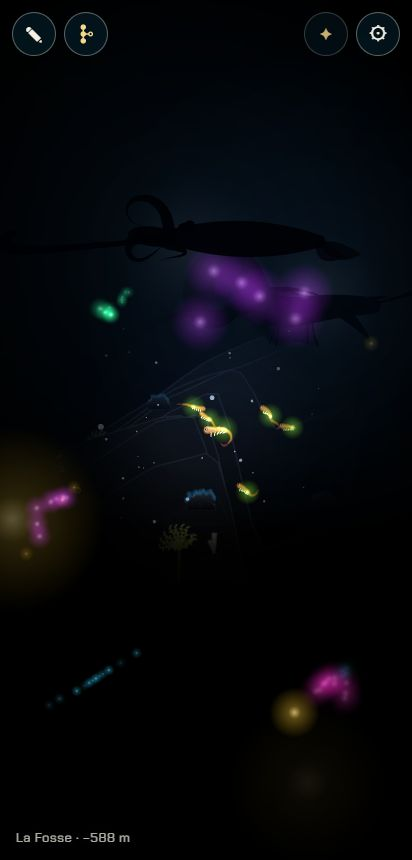
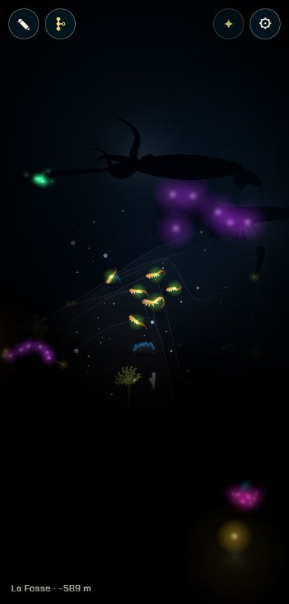
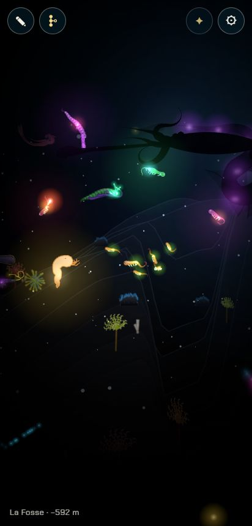
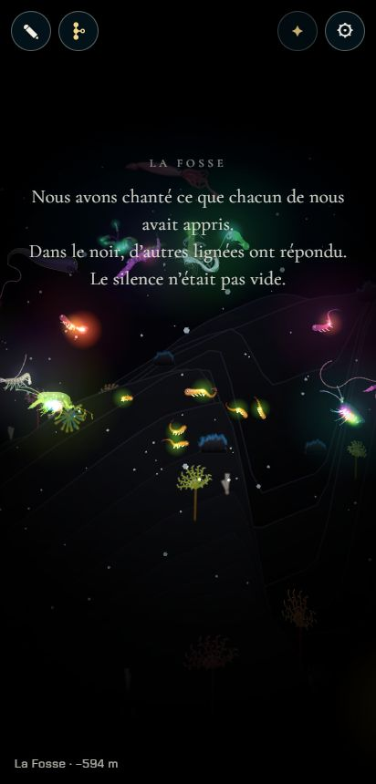
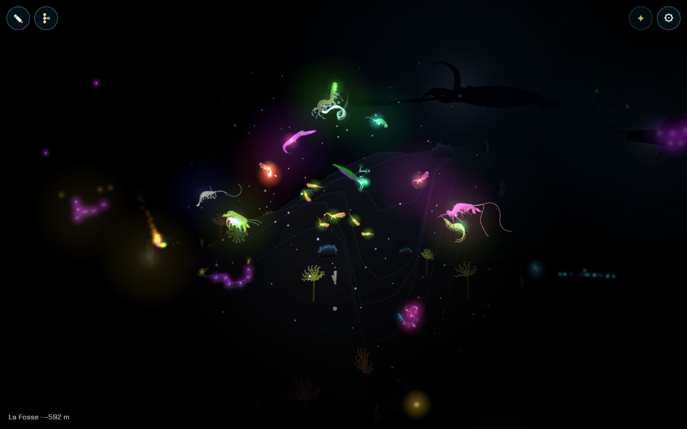
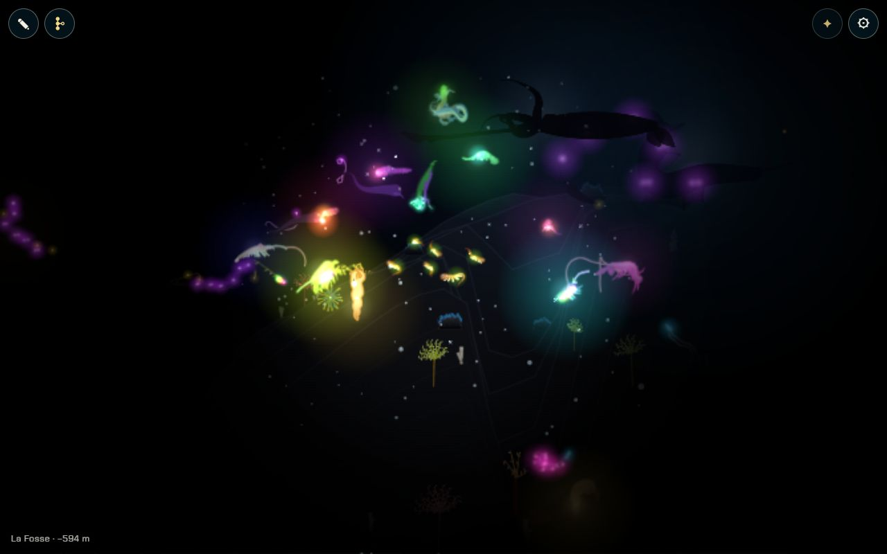

# Les lumières qui répondent dans la Fosse

## Livré

Dans la Fosse, **chaque note apprise qu'on chante fait répondre une lumière**, une à une : c'est l'ancêtre d'une autre lignée, celui qui a appris cette note. Il répond de loin, vient nager à nos côtés, et quand toutes les notes ont eu leur réponse, **le chant a franchi le noir** : l'obstacle de la Fosse (« le noir et le silence », clés lanterne ou chant) s'ouvre.

- **Les règles** (`src/monde/lumieres.ts`, pures, 22 tests dans `lumieres.test.ts`) :
  - **Les notes apprises** : `notesTo(chapitre)` donne une note par chapitre de la descente, jusqu'à celui qu'on a atteint. C'est un bouche-trou en attendant le chant, qui les tiendra (`chant.learned`, même résultat dans une partie normale).
  - **Les autres lignées** (`startWalk`, `walkStep`, `otherAncestor`) : une lignée par note, partie d'une première larve d'une autre couleur. Dans chaque chapitre, elle choisit un partenaire (`PARTNERS`) qui franchit l'obstacle et fait sa portée avec `brood`, comme nous (parade à 0,8). Elle garde un enfant qui franchit l'obstacle, jusqu'au chapitre de la note. La graine vient de la note et de notre lignée sauvée (`gameSeed` : chapitres et partenaires, pas les noms) : les mêmes lumières d'une visite à l'autre, sans rien de plus dans la sauvegarde.
  - **Une à une** (`answerAt`) : une réponse vient 1,1 s après sa note, et jamais moins de 1,8 s après la précédente, même si l'on chante vite.
  - **D'où elles viennent** (`dirOf`, `farAlong`, `roomAlong`) : d'au-dessus ou des côtés, jamais d'en dessous, chacune de sa direction. Elles viennent du bord de l'écran visible : 520 px au plus, moins sur les côtés d'un téléphone tenu droit.
  - **Leur lumière** (`answerLight`) : trois éclats au loin, puis une respiration. Elle brille de nouveau quand on rechante sa note, et toutes brillent en vague quand le chant a franchi le noir.
  - **Où elles nagent** (`answerGoal`, `spotOf`) : immobiles pendant qu'elles répondent, puis elles viennent sans se presser à leur place autour de nous (170 à 226 px, en trois rangs). Elles ne viennent jamais sur nous.
  - **Notre lumière** (`answerGlow`) : chaque lumière proche y ajoute ; les neuf ensemble éclairent plus loin qu'une lanterne.
  - **La fin** (`answered`) : chaque note apprise a eu sa lumière, et elle est arrivée.
  - **Les mots** (`parseAnswerText`) sont lus dans `docs/chapitres.md`, chapitre 9, sous « Les lumières qui répondent : ». Ce libellé est inconnu de `textes.ts`, que je n'ai donc pas touché.
- **Dans le jeu** (`src/monde/lumieres-jeu.ts`) :
  - À 2 500 px de la Fosse, les autres lignées se font, une naissance par pas de simulation (3 à 6 ms, 36 naissances en tout).
  - `hear(chapitre)` : une note chantée. Dans la Fosse seulement ; sinon elle ne fait rien et rend `false`.
  - La **cousine de la Carcasse** (lignée rivale) répond à la note du souvenir, si on l'a croisée.
  - Chaque réponse est un acteur de type `answer`. Quand le chant a franchi le noir : `limits.crossed.add('fosse')`, `onDone(f)`, puis les mots de la lignée sous « La Fosse », dès qu'aucun autre texte n'est à l'écran et hors d'un adieu.
- **Le dessin** (`src/monde/lumieres-draw.ts`) :
  - leur corps est dessiné **après le noir**, teinté de sa couleur, comme éclairé par lui-même (WebGL et Canvas 2D) ;
  - leur halo passe avec les lumières du monde, dans leur couleur (`cousinHue` : jamais l'or des partenaires).
- **Pour le voir** : `?dev`, voyage à la Fosse (⚙), puis dans la console `monde.lumieres.sing()`. Il chante toutes les notes apprises, une toutes les 0,9 s ; en 25 s environ, les neuf ont répondu. `monde.lumieres.hear('recif')` chante une seule note. Pour suivre où on en est : `monde.lumieres.answers`, `done` ; `monde.skip.add('answer')` cache les lumières.
- **Doc** : `docs/chapitres.md`, chapitre 9 (« Les lumières qui répondent », le texte proposé, la Fosse dans « Les obstacles-clés ») ; `docs/direction-artistique.md`, « La Fosse : le noir total ».

Téléphone (412 × 860, WebGL, Chrome Windows) :

Grand écran, WebGL puis Canvas 2D (`?gl=0`) :

## Choix retenus

Aucune question de choix posée à l'utilisateur : rien de structurant qui ne se tranche avec la doc. Un retour (feedback) signale le test des Nouveautés, rouge sur `backlog` (voir « Reste à faire »). L'interface avec le chant a été convenue directement avec l'agent `chant-note-chapitre`, par message. Il expose `chant.onNote((chapitre, k) => …)` et `chant.learned`, et me laisse l'ouverture de la Fosse. Ses animaux répondent partout, sans ouvrir d'obstacle. L'agent `remontee` sait ce que j'expose (`answers`, `done`, `onDone`).

| Question | Choix retenu | Pourquoi |
| --- | --- | --- |
| Qui répond | L'ancêtre d'une **autre lignée par note**, fait avec nos règles d'hérédité (`firstAncestor`, puis `brood` avec les partenaires des chapitres) : la génération qui a appris cette note | « Les ancêtres des autres lignées », au pluriel : de vraies lignées cousines, pas des espèces du bestiaire |
| La note de la Carcasse | La cousine de la lignée rivale, si on l'a croisée | Sa génération a appris « le souvenir » à la Carcasse : on la retrouve, c'est un rappel qui touche, sans rien coûter |
| Combien de lumières | Une par note apprise différente ; rechanter une note fait briller de nouveau sa lumière | Autant de lumières que de notes, soit neuf dans une partie normale ; chanter plus n'encombre pas le noir |
| Une à une | Au moins 1,8 s entre deux réponses, 1,1 s de silence avant la première | Le « une à une » du chantier, quelle que soit la vitesse du chant |
| Les notes apprises | `notesTo(chapitre atteint)`, remplacé par `chant.learned` à la fusion | Même résultat que la règle du chant dans une partie normale ; pas de doublon durable |
| Ce que le chant ouvre | L'obstacle de la Fosse, quand chaque note apprise a eu sa lumière et qu'elle est arrivée | La doc donne « lanterne ou chant » ; tout le moment compte, pas une seule note |
| D'où elles viennent | Du bord de l'écran visible, d'au-dessus ou des côtés | Dans le noir et au loin, mais toujours visibles, même sur un téléphone tenu droit |
| Le rendu | Le corps dessiné par-dessus le noir, teinté de sa couleur, et un halo | On voit à la fois une lumière et un ancêtre ; sous le noir, le corps serait invisible hors de notre lumière |
| Notre lumière | Chaque lumière proche l'agrandit (`fosse.glow`) | « Leurs lumières ouvrent le noir » se voit, sans rien changer au dessin du noir |
| Le coût de génération | Une naissance par pas de simulation, en approchant de la Fosse | 36 naissances, environ 150 ms sur ordinateur : réparties, sans à-coup |
| Les mots | Un texte « Les lumières qui répondent », lu sous la Fosse dans `chapitres.md`, avec mon propre petit lecteur | Le texte est la seule vraie interface ; `textes.ts` reste intact, sans conflit avec le chant |
| Garder les réponses | Pour la session seulement | L'obstacle de la Fosse ne se garde pas non plus au rechargement (limites) ; pas de nouveau format de sauvegarde |
| Chanter sans le chant | `monde.lumieres.sing()` et `hear()` pour les tests ; rien pour les joueurs | Le bouton et le cercle de notes sont le chantier du chant, lancé en même temps |

## Options non retenues

- **Qui répond** :
  - une seule autre lignée, dont chaque génération répond à sa note : moins cher (8 naissances au lieu de 36), mais une seule lignée, alors que le chantier en veut plusieurs ;
  - des animaux lumineux du bestiaire (baudroie, cténophore) : simple et beau, mais ce ne sont pas des ancêtres ;
  - nos propres ancêtres : c'est la Remontée ;
  - toute la lignée rivale (ses quatre générations) : elle ne va que jusqu'à la Carcasse.
- **La note de la Carcasse** : une lignée générée comme les autres, plus uniforme mais sans le rappel ; la cousine pour toutes les notes : une seule lignée.
- **Combien** : une lumière par note chantée, même répétée, qui encombrerait vite le noir ; une seule lumière pour le chant complet, qui perdrait le « une à une » ; un nombre fixe (trois), qui ne dirait plus rien de notre lignée.
- **Une à une** : répondre tout de suite, au rythme du chant (trop vite si l'on chante vite) ; attendre la fin du chant, puis répondre en file (plus lent, et le lien entre une note et sa lumière se perd).
- **Notes apprises** : déduites des naissances de la sauvegarde (la Nurserie et la Carcasse, souvent sans naissance, manqueraient) ; écrire ma propre règle durable, qui doublerait celle du chant.
- **Ce que le chant ouvre** :
  - dès la première réponse, trop facile ;
  - à partir de trois réponses, une règle arbitraire ;
  - rien, un moment purement contemplatif, alors que la doc fait du chant une clé ;
  - la Remontée elle-même, qui n'existe pas encore (chantier voisin).
- **D'où elles viennent** :
  - toujours à 520 px, hors de l'écran sur les côtés d'un téléphone ;
  - directement autour de nous, sans le « au loin » ;
  - d'en dessous, depuis le fond, souvent caché par le sol ou hors de l'eau.
- **Rendu** :
  - des silhouettes noires sur un halo, comme les géants de la Fosse : beau, mais elles se liraient comme des ombres et non comme des lumières ;
  - un halo seul, un point lumineux : moins cher, mais on ne voit pas d'ancêtre ;
  - le corps dessiné sous le noir : invisible hors de notre lumière.
- **Notre lumière** : rien de plus, et le noir ne s'ouvre pas vraiment ; un cercle de lumière autour de chaque réponse, plus juste mais qui change le dessin du noir (`darkStops`, anneaux WebGL) pour chaque lumière.
- **Coût** : tout faire d'un coup à la première note, un à-coup de 35 ms sur ordinateur et bien plus sur téléphone ; tout faire au chargement, qui retarde l'ouverture de la page ; un Web Worker, plus de code pour un gain faible.
- **Les mots** : un nouveau type de texte dans `textes.ts` (comme `meeting`), plus uniforme mais un conflit probable avec le chant ; pas de texte, et le moment passerait sans mots.
- **Garder les réponses** : les écrire dans la sauvegarde, un nouveau format durable pour un moment qu'on revit volontiers.
- **Chanter sans le chant** : un bouton de dev dans ⚙, inutile dès la fusion du chant ; un chant minimal à moi, qui doublerait le chantier voisin.

## Reste à faire / limites

- **Le branchement du chant**, à faire à la fusion (deux lignes dans `main.ts`) :
  - `chant.onNote((c) => lumieres.hear(c))` ;
  - dans `initLumieres`, `learned: () => chant.learned` à la place de `notesTo(partie.chapter)`.
  - Sans le chant, les joueurs ne peuvent pas encore chanter : l'entrée pour les joueurs suppose que les deux chantiers sortent ensemble.
- **Le son** : les lumières répondent sans bruit. Il faudrait un écho de la note (son timbre, plus doux et plus lointain), à brancher sur les timbres du chant ou sur « La musique générée ».
- **La Remontée** : `onDone` et `answers` sont prêts pour que ces ancêtres remontent en formation ; le fond reste la fin du monde tant que la Remontée n'est pas là.
- **Performance** : les neuf ancêtres (environ 300 chaînes en tout, comme une dizaine d'animaux) ajoutent environ 2,4 ms de simulation et 2 ms de dessin par image sur ordinateur (60 img/s tenues). Le chantier « La performance sur téléphone » pourra les simplifier au loin.
- **Au rechargement**, il faut chanter de nouveau, comme l'obstacle de la Fosse qui ne se garde pas non plus.
- Les animaux du chant, qui répondent partout, peuvent aussi répondre dans la Fosse : à regarder ensemble une fois les deux chantiers fusionnés.
- Le texte « Les lumières qui répondent » est une proposition, à relire avec les autres.
- **Test déjà rouge sur la base** : `src/monde/nouveautes/plugin.test.ts` (« embeds the published versions only… ») échoue sur `backlog` 865e30a sans aucun de mes changements. Les images des versions 0.3 à 0.5 prennent le budget de 400 Ko, et les entrées de la 0.2.0 n'ont plus leur image. Signalé au tableau de bord ; `make check` est rouge pour cette seule raison.

## Risques de fusion

- **`src/monde/main.ts`** : que des branchements courts.
  - deux imports ;
  - `'answer'` ajouté à l'union `Actor['kind']` ;
  - `lumieres.step` après `rivale.step` ;
  - une branche `a.kind === 'answer'` dans la boucle des animaux ;
  - `lumieres.lights` après `rivale.lights` ;
  - les acteurs `answer` sautés dans le dessin ordinaire ;
  - `+ lumieres.glow(…)` sur `fosse.glow` ;
  - une ligne en tête de `drawShapes` ;
  - le bloc `initLumieres` après `initRivale` ;
  - `lumieres` dans l'`api`.
  - Conflits probables avec le chant et la Remontée sur la ligne de l'`api`, les imports et l'union des types d'acteurs : garder les deux côtés.
- **`docs/chapitres.md`** : dans le chapitre 9 (La Fosse), une puce « Les lumières qui répondent » et un texte « Les lumières qui répondent : » avant l'adieu ; une phrase changée dans « Les obstacles-clés » (la Fosse et le chant). Le chant et la Remontée touchent sans doute aussi le chapitre 9 et le 10 : garder les deux côtés.
- **`docs/direction-artistique.md`** : une puce dans « La Fosse : le noir total ».
- Nouveaux fichiers seulement pour le reste : `lumieres.ts`, `lumieres.test.ts`, `lumieres-jeu.ts`, `lumieres-draw.ts`.
