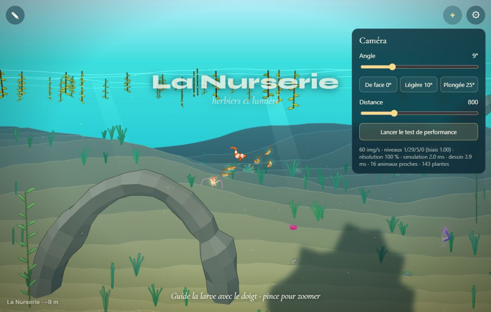
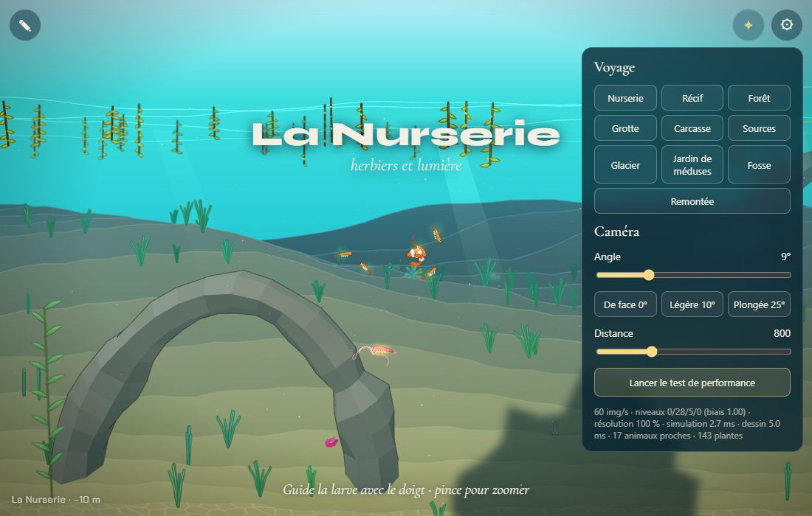
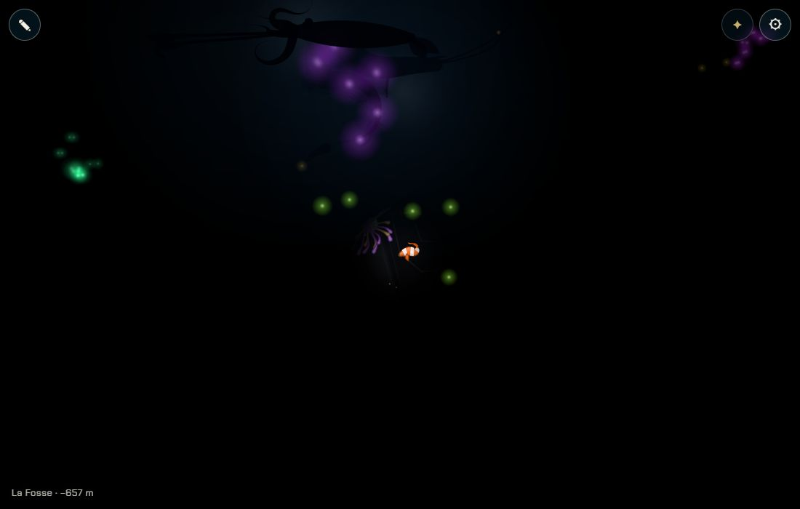

# Un monde fini, du début à la fin

## Livré

- `src/monde/limites.ts` (nouveau, testé dans `limites.test.ts`) : le début du monde (surface de la Nurserie, x = −600), la fin (fond de la Fosse, x = 27 600, hors de la lumière de la Remontée), un obstacle au bout de chaque chapitre qui en a un (`GATES`, d'après `docs/chapitres.md`), la portée du nageur (`reach`) jusqu'au premier obstacle qu'il ne peut pas franchir, la mémoire des obstacles franchis (`pass`), et la retenue douce près d'une borne (`holdBack` : la nage vers la borne s'éteint sur 420 px et un léger courant repousse ; zéro danger).
- En attendant l'étape 3, `canCross` laisse tout passer (`everyone`) : seuls le début et la fin retiennent. L'étape 3 n'a qu'à passer à `reach(limits, can)` une fonction qui lit les traits.
- Le voyage du panneau ⚙ n'apparaît qu'avec `?dev`. Voyager (panneau, `monde.gotoBiome`, `monde.teleport`) compte les obstacles d'avant l'arrivée comme franchis ; au-delà de la fin (la Remontée), toute la carte s'ouvre jusqu'au rechargement, pour les tests et le banc.
- L'aide de départ ne parle plus du voyage. API de test : `monde.limits`, `monde.bounds`.
- Doc : `docs/chapitres.md`, section « Les bornes du monde ».
- Vu en jeu (Chrome Windows) : en pilote automatique vers la droite, le nageur s'arrête à x ≈ 27 540 au fond de la Fosse (−656 m) ; vers la gauche, à x ≈ −544 dans la Nurserie ; avec `?dev`, le voyage vers la Remontée marche encore.

## Choix retenus

Aucune question posée à l'utilisateur : tout est tranché seul (option recommandée).

| Question | Choix retenu | Pourquoi |
| --- | --- | --- |
| Où finit le monde ? | 800 px avant la Remontée (x = 27 600) | on reste au fond de la Fosse sans voir la lumière de la Remontée (fondu de 1 400 px) |
| Où est un obstacle ? | au bout de son chapitre (frontière avec le suivant) ; celui de la Fosse garde le fond | « barre la descente » ; le chapitre se joue en entier avant d'être bloqué |
| Comment on est arrêté ? | retenue douce (la nage s'éteint, léger courant contraire) + borne dure | zéro danger, « l'obstacle repousse » (mécaniques.md), marche pour toutes les locomotions car on agit sur la consigne de nage |
| Un obstacle franchi le reste ? | oui, mémorisé (`limits.crossed`) | on peut remonter et redescendre ; un enfant qui perdrait le trait ne se retrouve pas coincé |
| Comment cacher le voyage ? | `?dev` dans l'adresse | simple, marche aussi dans le fichier publié ; le même paramètre peut servir à l'Atelier (chantier voisin) |
| Le voyage et les bornes | voyager franchit les obstacles d'avant ; au-delà de la fin, toute la carte s'ouvre | les tests et le banc (`?bench` va dans la Remontée) ne sont pas ramenés en arrière |

## Options non retenues

- Fin du monde : à la frontière même (x = 28 400) — on verrait la lumière de la Remontée, qui trahit la suite ; réduire la carte (X1) — casse le banc et les décors de la Remontée à venir.
- Place de l'obstacle : au début du chapitre suivant — on entreverrait le chapitre sans y entrer ; au milieu du chapitre — une moitié de chapitre perdue ; position choisie par chapitre dans `biomes.ts` — plus souple mais touche la carte que d'autres chantiers modifient (à faire à l'étape 3 si besoin).
- Arrêt : borne dure seule — brutal, on bute contre un mur invisible ; mur visible (rideau d'algues, courant dessiné) — c'est le travail des obstacles-clés de l'étape 3 ; demi-tour automatique du nageur — enlève le contrôle au joueur.
- Obstacle franchi : non mémorisé (dépend des traits de la créature du moment) — plus strict mais peut bloquer un joueur déjà passé ; sauvegardé dans le navigateur — c'est au chantier de la sauvegarde de le reprendre (`limits.crossed`).
- Cacher le voyage : en dev seulement (`import.meta.env.DEV`) — invisible dans le fichier publié, où on teste aussi ; le supprimer — perd un outil de test ; `?voyage` — un paramètre de plus à retenir ; le garder visible avec un avertissement — les joueurs s'en serviraient.
- Voyage : libre sans toucher aux bornes — le nageur serait tiré vers la borne après un voyage vers la Remontée ; tout ouvrir dès le premier voyage — on ne pourrait plus tester une borne après un voyage.

## Reste à faire / limites

- L'étape 3 branche les traits : `reach(limits, can)` dans `main.ts` (aujourd'hui `reach(limits)`), et dessine chaque obstacle là où est sa porte (`GATES`).
- La Remontée n'est plus atteignable à la nage : le passage de la Fosse vers la Remontée viendra avec l'obstacle de la Fosse et la fin de l'histoire.
- La sauvegarde automatique (chantier voisin) peut garder `limits.crossed`.
- Le test de performance reste dans le panneau ⚙ pour tous ; à cacher aussi derrière `?dev` si on veut.
- Les autres animaux ne sont pas bornés (ils restent dans leur chapitre d'eux-mêmes).

## Risques de fusion

- `src/monde/main.ts` : un import, une ligne dans `steer`, trois lignes dans `update` (à la place de la borne `X0 + 200 / X1 - 200`), deux dans `teleport`, deux dans le panneau (le voyage caché), deux champs de l'API. Proches de `showChapter` (textes narratifs, transitions) sans le toucher.
- `index.html` : l'aide de départ perd « ⚙ voyage vers les dix chapitres ».
- `docs/chapitres.md` : une section ajoutée avant « À écrire ».
