# Le moteur de danse : des pas chorégraphiés pour tous les corps

## Livré

- **Le moteur** (`src/engine3/`, pur et testé) :
  - `groove.ts` : ce qu'une danse pose sur un corps à chaque pas de jeu. Le tronc plié en plus (9 points de la tête à la queue), la tête tournée (tangage, lacet, roulis) et le corps déplacé de quelques pixels. Pour les membres : le balancement avant-arrière, la levée et l'enroulement, par sorte (nageoire, patte, bras et pince, filament et cil, antenne et lanterne, frange), par côté, et en 5 points de l'avant à l'arrière.
  - `dance.ts` : le « kit » d'un corps (ce qu'il a de chaque sorte de membre, la longueur et la souplesse de son tronc, cloche ou marcheur), 33 pas et 8 danses, plus le salut de la fin. `perform` écrit le groove d'un danseur à un temps donné (fondus entre mesures, entrée en un demi-temps, sortie après la pose). `accentAt` donne les temps forts.
  - `creature3.ts` lit le groove sans casser les chaînes. Dans `Seg3.update` : le pli du tronc s'ajoute à la cible de forme ; un membre se balance dans son plan, se lève vers le haut du corps et s'enroule ; les bras en couronne et les filaments en bord de cloche s'ouvrent. Dans `Creature3.update` : la tête est tournée le temps d'une mise à jour, et le corps est déplacé d'un bloc (`translate`, sans vitesse ajoutée). Sans groove, rien ne change (testé).
- **Ce qu'un corps n'a pas** : chaque pas dit quels membres il veut, dans l'ordre. Le corps prend le premier qu'il montre assez (30 % de son tronc), sinon le plus grand qu'il a.
  - La méduse fait les pas de pattes avec ses filaments, le crabe bat des pinces comme des ailes, l'étoile danse avec ses bras.
  - Sans membres (la larve), le tronc se tortille à la place.
  - Une cloche penche au lieu de plier, et sa pirouette devient une culbute.
  - La caudale d'un poisson et l'éventail d'un crabe suivent la queue au lieu de danser comme des nageoires.
- **Les danses** : le twist, la vague, le pas de crabe, le moonwalk, le tango (l'un fait plonger l'autre), la valse (3 temps, ils tournent l'un autour de l'autre), le disco (un membre pointé vers le haut puis vers le bas) et la danse des canards. Ce sont des mesures avec la réponse du second danseur (pareil, en miroir, en canon, ou son propre geste) et une pose finale tenue ensemble.
- **Dans la danse à deux** (`src/monde/danse.ts`, `parade-jeu.ts`) :
  - Elle enchaîne l'ouverture d'aujourd'hui, une ou deux vraies danses (parfois une ronde de plus avant ou après quand il n'y en a qu'une), puis le face-à-face, où les deux se saluent de la tête.
  - Les danses sont tirées selon les deux corps (`likes`) : marcheurs → pas de crabe, moonwalk ; méduses → vague, valse. Jamais la même suite deux fois de suite.
  - Elles suivent le tempo de la musique du chapitre (`beatOf`, de 0,42 à 0,72 s par temps). Le partenaire mène et nous répondons ; ils se font face sans jamais être menés à se tourner le dos.
- **Le son** (`src/monde/danse-son.ts`) : sur les temps forts de celui qui mène, une note douce de ré majeur dans la musique. Ré sur le premier temps, la sur le troisième, l'accord de ré égrené sur la pose.
- **Ouvert** (`src/monde/danse-jeu.ts`) :
  - `monde.danse.play(animal, 'twist', { with, beat, hold })`, avec aussi `stop`, `list`, `playing` et `beatAt`. Un animal du monde est tenu sur place pendant sa danse ; le nageur, jamais.
  - Avec `?dev`, une liste « Danses » dans le panneau ⚙ joue chaque danse sur la créature jouée.
- **Coût** : environ 1 µs par danseur et par pas de jeu pour `perform`, et 3 à 12 µs de plus pour la nage de son corps, mesurés sous Node sur ordinateur. Pas de simulation en plus.
- **Docs** : « La parade » mise à jour et nouvelle section « Les danses » dans `docs/mecaniques.md` ; une ligne dans « Le son » de `docs/direction-artistique.md`.
- **Tests** : `src/engine3/dance.test.ts`, `src/monde/danse-jeu.test.ts` et `src/monde/danse.test.ts` (étendu).
  - Le groove vide ne change rien, les chaînes gardent leur longueur, le corps est rendu à la fin.
  - Les membres de remplacement sont choisis comme prévu.
  - Chaque pas agit sur un poisson et sur un crabe ; le miroir et le canon sont exacts ; aucune danse ne saute d'une mesure à l'autre ; les temps forts tombent où il faut.
  - Les danses à deux contiennent une ou deux danses et une ou deux rondes, sont tirées selon les corps, ne se répètent pas, et gardent les danseurs face à face.
  - Le tempo de chaque chapitre est vérifié.

Pour le voir : `?dev`, ⚙, « Danses » ; ou une parade avec un partenaire (`monde.parade.forceDances(['tango'])` avant `mate`).

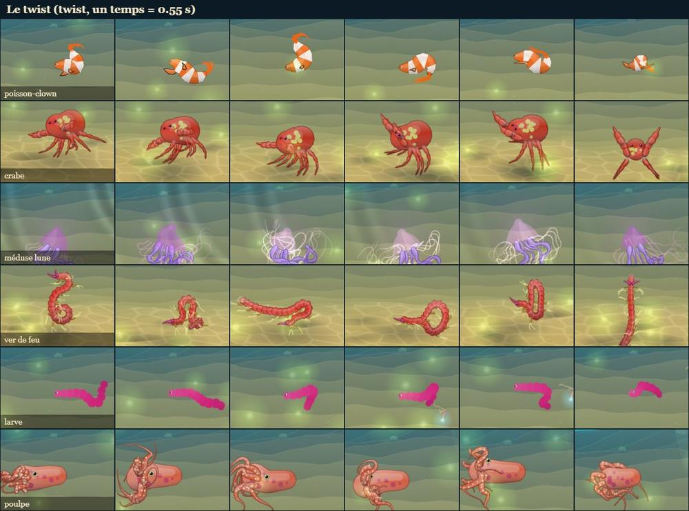
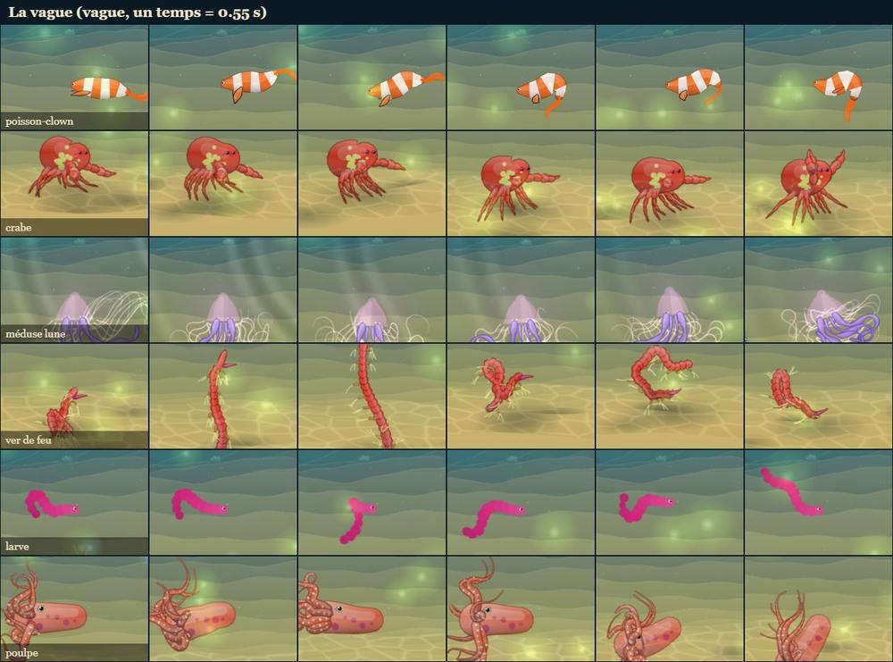
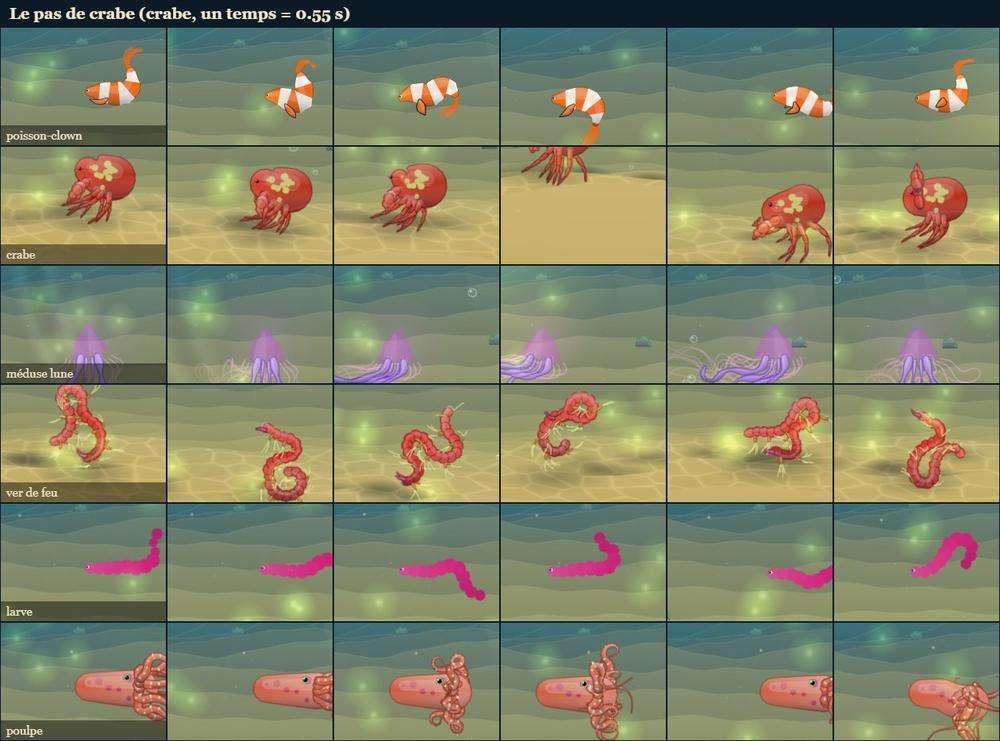
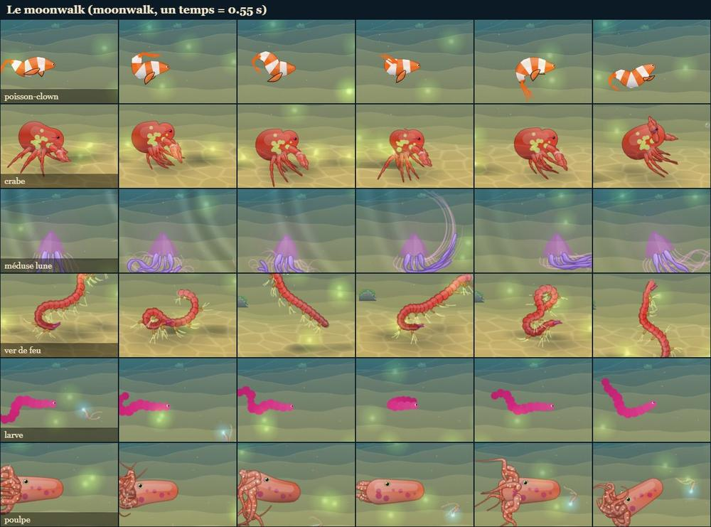
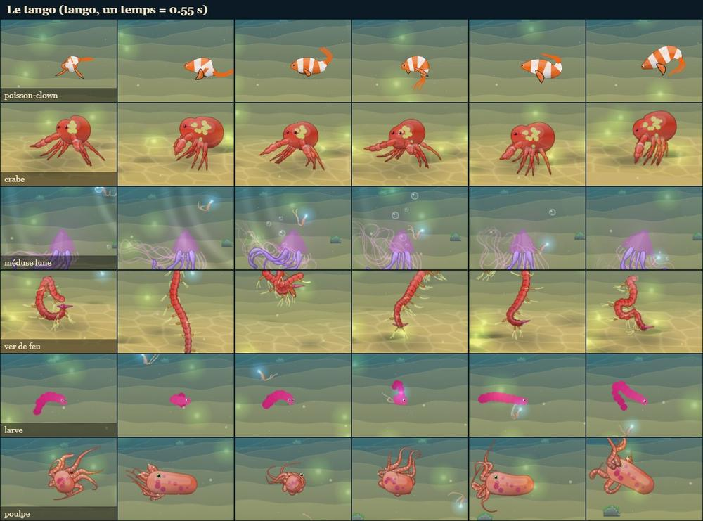
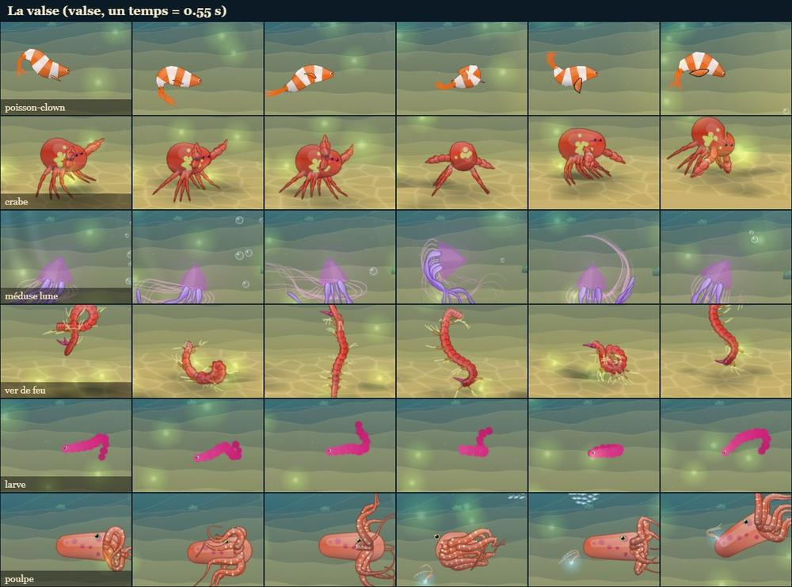
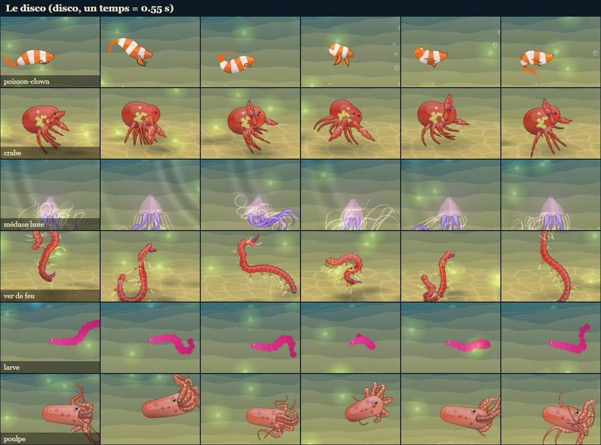
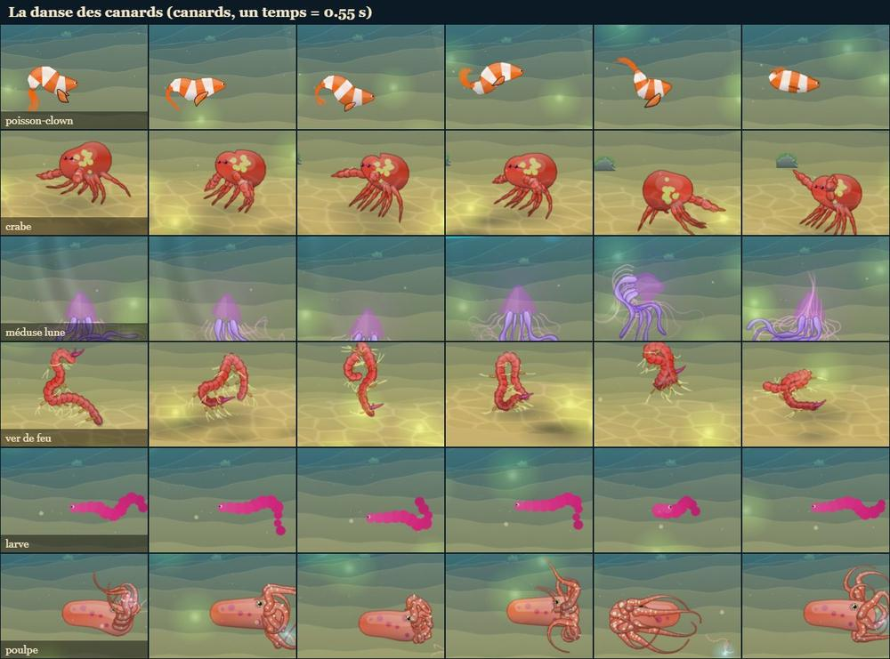
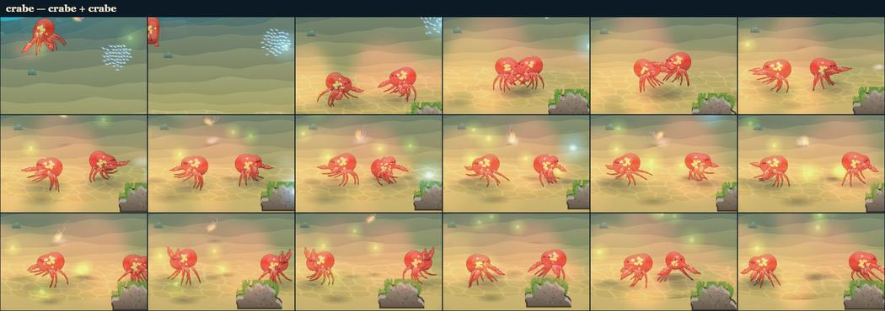
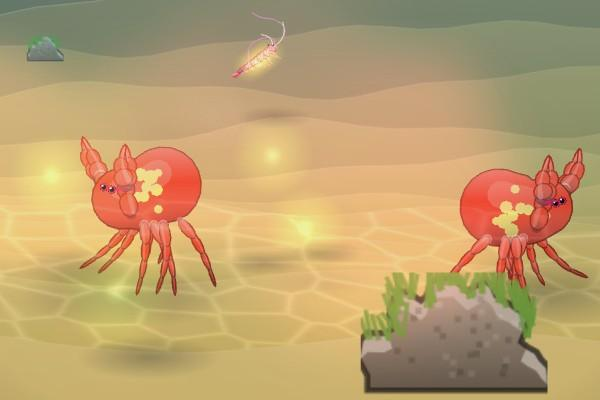
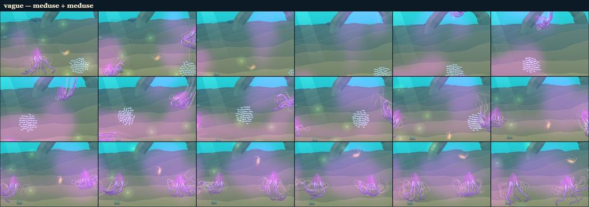
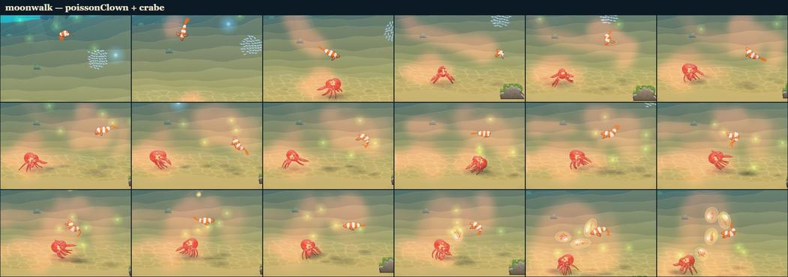
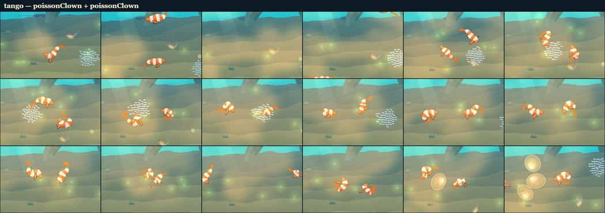
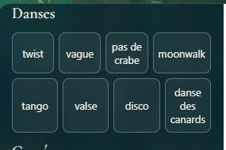

## Choix retenus

Aucune question posée sur le tableau de bord : la consigne laissait tout trancher (option recommandée, `auto`).

| Question | Choix retenu | Pourquoi |
| --- | --- | --- |
| Comment un pas se pose sur la nage | Un « groove » : quelques champs d'angles (tronc en 9 points, membres en 5 points par sorte et par côté), lus pendant la mise à jour des chaînes | Les chaînes et la nage restent intactes, tout reste additif (deux pas se somment, deux mesures se fondent), quelques multiplications par maillon |
| Comment une danse déplace le corps (rebond, pas de côté, moonwalk) | Translation de tout le corps d'un bloc (positions et anciennes positions) | Déplacer la tête seule poussait la chaîne par l'avant : le poisson se pliait en deux (vu en capture) |
| Comment lever un membre | Le tourner vers le haut du corps, quelle que soit sa direction (axe : bas × direction), sinon autour du tronc | Une pince pointée vers l'avant ne bougeait pas quand on la tournait autour du tronc |
| Sortes de membres | 6 sortes tirées du rôle, de la propulsion et du style des parties ; yeux, points de lumière et piquants raides exclus ; une nageoire au bout du tronc et dans son axe suit la queue | Ce que tout squelette a, sans liste d'espèces ; la caudale qui s'agitait cassait la silhouette du poisson |
| Ce qu'un corps n'a pas | Liste de préférences par pas, seuil de 30 % du tronc, sinon le plus grand, sinon le tronc ; une cloche penche | Couvre les 43 espèces (méduse, étoile, larve, oursin…) sans cas particulier |
| Les danses | 8 danses (twist, vague, crabe, moonwalk, tango, valse, disco, canards), 10 à 12 temps, et un salut | Celles du chantier ; assez courtes pour tenir deux danses dans la danse à deux |
| Composition de la danse à deux | Ouverture + 1 ou 2 danses (2 : 45 %) + parfois une ronde quand il n'y a qu'une danse + face-à-face ; 16,5 s au plus avec deux danses | « une ronde ou deux, et une ou deux vraies danses » sans que l'accouplement s'éternise (8 à 17 s, contre 8 à 10 s avant) |
| Placement pendant une danse | Face à face (0,62 du rayon, 0,3 au tango), tournés l'un vers l'autre là où ils sont, jamais menés à s'éloigner l'un de l'autre ; la valse tourne | Sinon une petite correction faisait faire demi-tour à un danseur, qui tournait le dos à l'autre |
| Qui mène | Le partenaire mène, le nageur répond | Il menait déjà la parade ; « l'un fait, l'autre répond » |
| Le tempo | Celui du pas des notes du chapitre (`motif.step`), multiplié ou divisé par 2, 3 ou 4, le plus près de 0,55 s, borné à 0,42–0,72 s ; temps comptés sur l'horloge du jeu | La musique n'a pas de mesure ; l'horloge du jeu garde les pas et les figures ensemble même si une image saute |
| L'accent sonore | Une note de ré majeur (ré, la, l'accord de ré sur la pose), synthétisée, dans le bus de la musique, du seul danseur qui mène | En ré majeur comme tout le jeu, réglée par le volume de la musique, jamais doublée |
| L'API d'essai | `monde.danse.play(animal \| créature, id, { with, beat, hold, role })` ; un animal du monde est tenu sur place, le nageur jamais | Ce que demande le chantier, et assez pour les futurs usages (deux animaux qui dansent ensemble) |
| La liste `?dev` | Boutons créés par `danse-jeu.ts` après « Le générique de fin » | Aucun changement d'`index.html` (fichier partagé) |
| Le face-à-face final | Un salut dansé (l'un hoche la tête, l'autre répond, une révérence) | « en se saluant de la tête » devient un vrai geste |

## Options non retenues

- **Poser un pas** :
  - Retoucher les positions après la nage : simple, mais casse les longueurs et les vitesses des chaînes (verlet).
  - Des forces ou des impulsions sur les maillons : plus physique, mais plus coûteux et imprévisible (les danses ne tomberaient plus en rythme).
  - Changer les paramètres de mouvement des parties (`motion`) : ne permet ni le miroir, ni les côtés, ni le tronc.
- **Déplacer le corps** :
  - Le piloter (vitesses) : il se retournerait vers où il va, plus de moonwalk ni de pas de côté.
  - Déplacer seulement la tête : le corps se plie (essayé).
- **Lever un membre** :
  - Rotation autour du tronc seulement : les membres alignés sur le corps ne bougent pas (essayé).
  - Changer l'angle d'attache (`slot.angle`) : n'existe que dans le plan de montage.
- **Sortes de membres** :
  - Par nom de partie (`parts.ts`) : fragile pour les espèces générées et l'Atelier.
  - Une seule sorte « membre » : plus de « battre des nageoires » contre « faire des pas ».
- **Remplacement** :
  - Sauter le pas sans le remplacer : un ver ou une méduse resteraient immobiles.
  - Une table par espèce : contraire au chantier.
- **Les danses** :
  - Plus de danses (cancan, macarena, madison, toupie) : faciles à ajouter, car une danse n'est qu'une liste de mesures.
  - Des danses plus longues (16 temps) : plus de temps pour les voir, mais une seule par accouplement.
- **Composition** :
  - Toujours deux danses : 15 à 20 s, l'accouplement s'éternise.
  - Garder deux rondes et ajouter une danse : moins de place pour les danses.
- **Placement** :
  - Côte à côte face à nous : impossible pour un poisson vu de profil.
  - Forcer le cap dans le moteur de nage : touche `creature3.ts` plus profondément.
- **Le tempo** :
  - Caler les notes de la musique sur la grille de la danse pendant la parade : plus musical, mais touche `musique-son.ts`, qu'un autre chantier modifie.
  - L'horloge audio comme horloge de la danse : désaccord avec les figures quand le jeu ralentit ou saute des images.
  - Un tempo fixe : moins vivant d'un chapitre à l'autre.
- **L'accent** :
  - Un échantillon (percussion) : dépendance de fichiers, ton moins doux.
  - Un accent sur chaque temps : trop présent.
  - Les deux danseurs : notes doublées.
- **L'API** :
  - Créature seule (sans acteur) : moins pratique en console.
  - Ne jamais tenir l'animal sur place : il quitte la scène en dansant.
- **Liste `?dev`** :
  - Dans `index.html` : fichier partagé, conflits.
  - Une page à part : plus de code pour rien.

## Reste à faire / limites

- Vu de profil, un poisson montre surtout son tronc et sa tête ; ses petites nageoires pectorales se voient peu (le disco du poisson pointe peu). Le crabe, le poulpe et la méduse lisent mieux les gestes de membres.
- Certains corps très souples (le ver de feu) s'enroulent déjà d'eux-mêmes ; leurs danses restent un peu emmêlées (dressés sur la queue, en boucles), drôles mais moins lisibles.
- Un marcheur qui rebondit est en partie retenu par le fond (`stand` le ramène) : son rebond est plus petit que celui d'un nageur.
- La musique d'ambiance n'a pas de grille : la danse en prend le tempo, pas la mesure ; les notes de la musique et les accents ne tombent pas ensemble. Une suite possible : caler les notes du motif sur la grille de la danse pendant la parade.
- Le son des accents n'a pas été écouté (captures sans haut-parleur) : leur niveau est celui des notes de la musique (0,045 à 0,07).
- Coût mesuré sous Node sur ordinateur, pas sur un téléphone (il reste de l'ordre de la dizaine de µs par danseur).
- À brancher plus tard, comme le chantier le prévoit : les petits jeux des animaux, un animal qui danse quand on chante, les nouveau-nés qui sortent de l'œuf, la Balade libre.
- Les captures ont été faites avec un temps fixe de 0,55 s, et en solo avec `monde.onlySp` (les autres animaux cachés) et sans plantes.

## Risques de fusion

- `src/engine3/creature3.ts` (partagé, le moteur) : ajouts seulement, et rien ne change sans danse (testé).
  - `Seg3.limb`, fixé à l'attache (`instantiate`).
  - Dans `Seg3.update` : la lecture du groove (balancement, levée, enroulement, pli du tronc) et `RING_DANCE`.
  - Dans `Creature3` : `groove`, `gx`/`gy`, `tilt`, et la translation et la tête tournée dans `update`.
- `src/monde/main.ts` : sept lignes courtes.
  - L'import et `initDanse`.
  - `danse` dans les dépendances de la parade.
  - `danse.step(t)` au début d'`update`.
  - L'animal tenu sur place dans la boucle des acteurs.
  - `danse` dans l'API.
  - La liste `?dev`.
- `src/monde/parade-jeu.ts` : la dépendance `danse`, `forceDances`, `state.dance.beat` et `dancing`, et le bloc qui lance les pas au début de chaque figure. Les danseurs y sont menés là où ils nagent, sans compter les pas.
- `src/monde/danse.ts` et son test : la figure `danse`, les options de `newDanse` (`beat`, `last`, `dances`), `beatOf`, `facing`, `danceAt` et `signature`. La durée testée passe de < 12 s à < 18 s, une règle changée exprès.
- `docs/mecaniques.md` (« La parade », nouvelle section « Les danses ») et `docs/direction-artistique.md` (une ligne).
