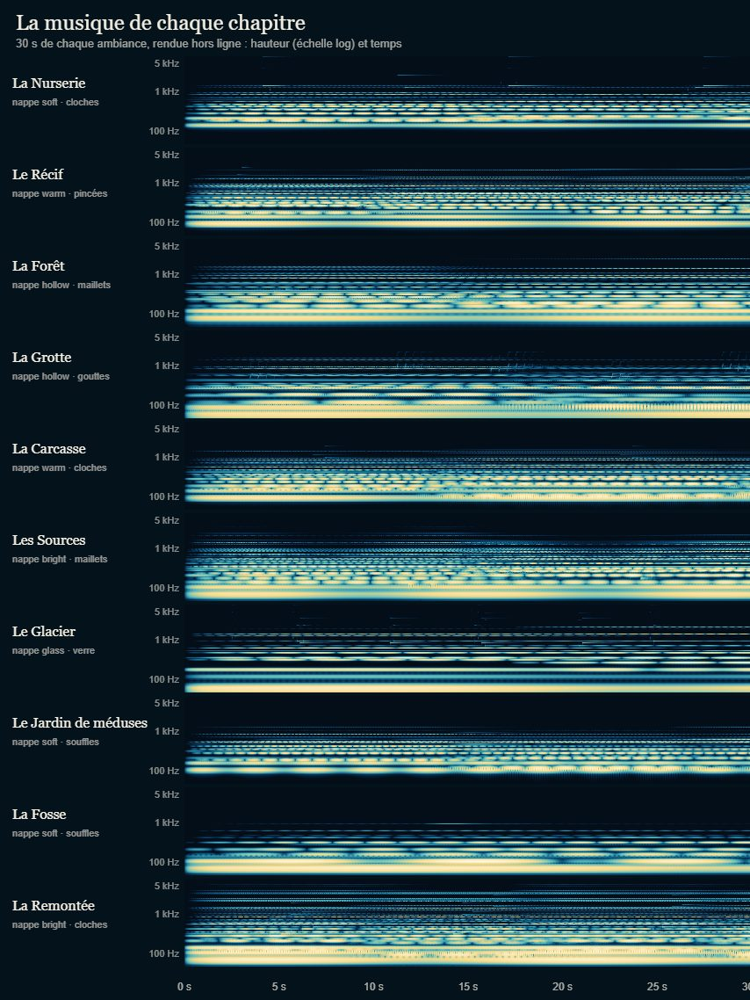
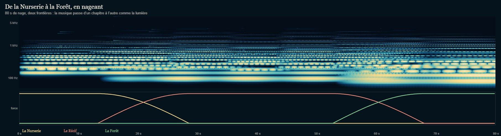
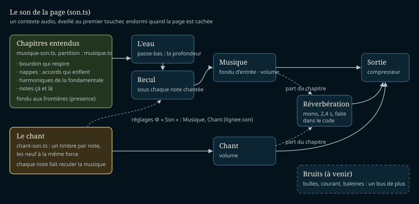
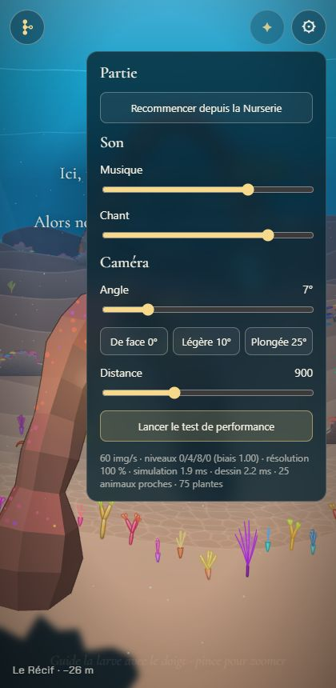

# La musique générée

## Livré

- **Une ambiance par chapitre, les dix**, générée avec la Web Audio API, sans fichier audio ni bibliothèque. La partition est dans `src/monde/musique.ts` (pure, testée), le moteur dans `src/monde/musique-son.ts`. Chaque chapitre a quatre voix : un **bourdon** grave qui respire, des **nappes** (des accords qui enflent et s'effacent l'un sous l'autre, chaque note doublée de deux voix un peu désaccordées, sous un filtre qui balaie lentement), les **harmoniques** de sa fondamentale, qui vont et viennent à gauche et à droite, et quelques **notes** çà et là en courtes phrases : cloches de lumière à la Nurserie, figures pincées sur l'accord au Récif, maillets dans la Forêt, gouttes en écho dans la Grotte, les quatre premières notes du chant « en souvenir » à la Carcasse, braises graves aux Sources, cristaux au Glacier, souffles au Jardin, une note bleue lointaine dans la Fosse, le chant qui remonte dans la Remontée. Le détail par chapitre est dans `docs/direction-artistique.md`, « Le son ».
  
- **Tout est en ré majeur**, la tonalité du chant ; les notes éparses restent sur sa gamme pentatonique (testé note par note, harmoniques comprises) : ce qu'on chante tombe toujours juste.
- **Elle suit le nageur** : les chapitres se mêlent aux frontières avec la même bande que la lumière (`presence`), à puissance égale (testé sur toute la carte). Un chapitre quitté se tait, ses voix sont libérées 6 s plus tard. Plus on descend, plus l'eau l'étouffe (un passe-bas de 16 kHz à la surface à 5,5 kHz au fond de la Fosse).
  
- **Les moments** : pendant l'adieu au parent, la musique baisse (×0,6) et ne garde que ses accords, pour laisser les mots ; pendant une parade, ses notes viennent deux fois plus souvent (34 contre 23 en 12 s, mesuré en jeu).
- **La Remontée** : chaque chapitre éclairé par la lignée qui remonte (`remontee.litAt`) s'éclaire en musique : l'ambiance lumineuse de la Remontée monte par-dessus la sienne, qui s'efface à moitié, et l'eau cesse d'étouffer le son. Vérifié en jeu : la musique recule sous le chant du puits, puis le filtre s'ouvre à 18 kHz et la Remontée domine chaque chapitre traversé.
- **Un seul son pour la page** (`src/monde/son.ts`) : un contexte audio éveillé au premier toucher (ou touche), endormi quand la page est cachée (onglet, autre application) et réveillé au retour ; un bus et un volume pour la musique, un pour le chant ; une réverbération faite dans le code (2,4 s, mono) partagée ; un compresseur doux en sortie. La musique entre en fondu (environ 6 s) au premier toucher.
  
- **Le chant et ses timbres** (`chant-son.ts`) : la voix passe par ce son commun. Elle sonne dans l'espace du chapitre (sa part de réverbération : longue dans la Grotte, courte au Récif), la musique recule de 5 dB sous chaque note chantée (et pendant qu'on trace le cercle), et les neuf timbres ont été mis à la même force : sur un haut-parleur de téléphone simulé, de −24,3 à −15,2 dB avant (le battement, avec son trémolo, et la braise trop faibles ; le souvenir trop fort), de −19,3 à −17,1 dB après. Chaque note libère ses nœuds quand elle s'est éteinte (son écho 4 s plus tard). L'appel `chant.voice.note(…)`, dont se sert la Remontée, n'a pas changé.
- **Les réglages** : le panneau ⚙ a une section « Son », Musique et Chant (`son-reglages.ts`, `index.html`), de muet à un peu plus fort que le mélange voulu, gardés dans le stockage du navigateur (`lignee.son`). « coupée » / « coupé » quand l'un est à zéro, sans chiffres. La musique coupée libère aussi ses voix (batterie).
  
- **Niveaux mesurés** (rendu hors ligne dans Chrome, 40 s par chapitre) :

  | Chapitre | RMS | Téléphone* | Coût (× temps réel) |
  | --- | --- | --- | --- |
  | La Nurserie | −26,5 dB | −24,4 dB | 28 |
  | Le Récif | −28,7 dB | −27,8 dB | 28 |
  | La Forêt | −25,5 dB | −26,0 dB | 31 |
  | La Grotte | −26,3 dB | −28,7 dB | 36 |
  | La Carcasse | −26,9 dB | −26,2 dB | 28 |
  | Les Sources | −29,3 dB | −28,7 dB | 31 |
  | Le Glacier | −29,8 dB | −28,5 dB | 23 |
  | Le Jardin de méduses | −28,1 dB | −26,7 dB | 31 |
  | La Fosse | −33,3 dB | −34,4 dB | 35 |
  | La Remontée | −27,3 dB | −27,4 dB | 24 |

  *passe-haut 280 Hz et passe-bas 9 kHz, comme un petit haut-parleur. Une note chantée : crête −9,9 dB, −19,6 dB sur sa première seconde. Une frontière (deux chapitres) se calcule 21 à 23 fois plus vite que le temps réel.
- **Le coût** : la première version coûtait environ deux fois plus. Mesuré nœud par nœud : un filtre dont la coupure est modulée par un oscillateur coûte ~3 ms par seconde de son (ses coefficients sont recalculés à chaque échantillon), un vibrato branché sur la hauteur d'un oscillateur ~2 ms, une réverbération stéréo de 2,4 s ~27 ms contre ~13 ms en mono, un oscillateur seul ~0,4 ms. D'où : balayage des filtres et filtre de l'eau par pas de l'horloge (0,2 s), plus de vibrato par oscillateur, une enveloppe par accord, réverbération mono de 2,4 s (au lieu de 3,6 s stéréo).
- **Pour les tests et la console** : `monde.musique` : `awake`, `heard` (les chapitres entendus et leur force), `sources`, `level()` (le niveau de sortie), `volumes`, `setVolume('musique' | 'chant', 0..1)`, `son.graph` (les nœuds). Pour écouter une ambiance seule : `(await import('/src/monde/musique-son.ts')).renderAmbience(i, secondes)` rend un `AudioBuffer` hors ligne.
- **Tests** : `musique.test.ts` (16 : une ambiance par chapitre, tonalité et pentatonique, hauteurs du chant, registres, souvenir et remontée du chant, fondu à puissance égale sur toute la carte, filtre de l'eau, volumes, accords sans répétition, phrases dans leur registre et leur gamme, harmoniques, moments, balayage) et `son.test.ts` (4 : volumes gardés, réverbération).
- **Doc** : `direction-artistique.md`, section « Le son » réécrite comme dans le jeu (avec le tableau des ambiances) ; `mecaniques.md`, une ligne dans « Contrôles et interface ».

## Choix retenus

Aucune question posée à l'utilisateur (consigne : trancher avec l'option recommandée) ; tous les choix sont `auto`.

| Question | Choix retenu | Pourquoi |
| --- | --- | --- |
| Comment faire la musique | Synthèse en direct : oscillateurs et filtres, accords et notes planifiés un peu en avance (1,2 s) par une horloge | Infinie et jamais pareille, légère en mémoire, rien à embarquer dans la page unique ; la même partition rend hors ligne pour les mesures. |
| Le son de la page | Un seul contexte audio partagé (`son.ts`), un bus et un volume par famille | Un navigateur limite les contextes (iOS surtout) ; une seule réverbération ; le chant peut faire reculer la musique ; les bruitages auront leur bus. |
| L'harmonie | Tout en ré majeur, notes éparses en pentatonique de ré | La tonalité des notes du chant : tout chant sonne juste sur toute musique, aux frontières aussi. Les chapitres se distinguent par leurs accords, leur registre, leurs timbres et leur espace. |
| Les frontières | La bande de la lumière (`presence`), à puissance égale | La musique change exactement avec l'eau qu'on voit ; ni creux ni bosse au passage. |
| La profondeur | Registres et timbres par chapitre, plus un passe-bas qui suit la profondeur | « Nappes et harmoniques qui changent avec la profondeur », dans un chapitre aussi. |
| La réverbération | Une convolution mono de 2,4 s sur une réponse faite dans le code, partagée | Ce que disent les décisions (convolution), au coût le plus bas mesuré ; le son sec garde la stéréo. |
| Le chant et ses timbres | Garder les timbres du chantier du chant, les mettre à la même force, les faire sonner dans l'espace du chapitre, faire reculer la musique sous eux | Les timbres sont réussis ; il manquait l'équilibre (9 dB d'écart sur téléphone) et le lien avec la musique. |
| Les réglages | Deux curseurs, Musique et Chant, dans le panneau ⚙ | Sobre (pas de bouton de plus sur la mer), comme les réglages de caméra ; on peut garder le chant et couper la musique. |
| La Remontée | L'ambiance de la Remontée monte sur chaque chapitre éclairé (`remontee.litAt`) | « Chaque chapitre s'illumine au passage » s'entend aussi ; une ligne dans `main.ts`. |
| Les moments | L'adieu baisse la musique et retient ses notes ; la parade double ses notes | Deux moments du cœur du jeu, pour quelques lignes ; les mots de l'adieu passent devant. |
| Le démarrage | Fondu d'environ 6 s au premier toucher | Le navigateur l'impose ; la mer s'éveille doucement, sans invite à toucher. |
| La page cachée | Le contexte s'endort, et se réveille au retour (ou au toucher suivant) | Batterie ; un jeu ne joue pas dans un onglet caché. |

## Options non retenues

- **Comment faire la musique** :
  - des boucles rendues à l'avance (`OfflineAudioContext`) puis rejouées : très peu de calcul en jeu, mais des dizaines de Mo de mémoire pour dix chapitres, une attente au chargement, et des boucles qui se répètent ;
  - un `AudioWorklet` maison (synthèse en JavaScript sur le fil audio) : tout est possible, mais un fichier de module à part (difficile dans la page unique et le lien Artifact) et bien plus de code ;
  - Tone.js : dépendance npm interdite, du poids ;
  - des fichiers audio : la page est un seul fichier, exclu par les décisions.
- **Le son de la page** : un contexte par module (le chant avait le sien) : simple, mais deux réverbérations, pas de recul de la musique sous le chant, et une limite de contextes sur iOS.
- **L'harmonie** : une tonalité ou un mode par chapitre (plus de couleurs : la Fosse en phrygien…), mais un chant faux sur certaines musiques et des frontières dissonantes ; transposer le chant selon le chapitre : les notes n'auraient plus leur hauteur, que le joueur apprend.
- **Les frontières** : un basculement net au milieu de la bande (un saut) ; un fondu dans le temps à chaque entrée de chapitre (ignore les allers-retours sur la frontière) ; une musique par chapitre seulement après le titre d'ouverture (en retard sur la lumière).
- **La profondeur** : les registres seuls (rien ne change dans un chapitre) ; une transposition continue avec la profondeur (des glissandos permanents, faux avec le chant).
- **La réverbération** : stéréo de 3,6 s (la première version, deux fois plus chère) ; une réverbération algorithmique en lignes à retard (moins chère, mais métallique sans beaucoup de réglage, et elle s'écarte des décisions) ; une réponse par chapitre (une convolution de plus à chaque frontière) ; pas de réverbération (sec, peu marin).
- **Le chant et ses timbres** : refaire les timbres (le travail du chantier du chant est bon et les joueurs les connaissent déjà) ; les laisser tels quels (le battement et la braise disparaissaient sur un téléphone) ; une réverbération à part pour le chant (deux fois le coût).
- **Les réglages** : un bouton muet sur la mer (rapide, mais un bouton de plus sur un écran voulu sans interface) ; un seul volume général (on ne peut plus garder le chant sans la musique) ; des chiffres en pourcentage (la vision veut « pas de chiffres »).
- **La Remontée** : une partition à part pour toute la scène (plus écrite, mais elle aurait caché les chapitres traversés) ; rien (la Remontée aurait sonné comme la descente).
- **Les moments** : aucun (moins de code, moins d'émotion) ; d'autres moments : la portée, l'arbre et le générique (laissés : le jeu s'y arrête, la musique continue doucement), l'apprentissage d'une note (le chant s'en charge), les obstacles (sans danger : pas de musique d'alerte).
- **Le démarrage** : une invite « touche pour entendre » (un texte de plus) ; un son dès le chargement (impossible : le navigateur bloque).
- **La page cachée** : continuer à jouer (batterie, et la musique qui sort d'un onglet oublié).

## Reste à faire / limites

- **Pas écouté** : je n'ai pas d'oreilles. Tout est vérifié par des rendus hors ligne dans le Chrome Windows (niveaux, spectrogrammes, coût), par des tests en jeu à très bas volume (réveil, chapitres entendus, frontières, recul sous le chant, Remontée, adieu, parade, sans erreur) et par les tests unitaires. Le goût de chaque ambiance (accords, timbres, densité des notes, équilibre bourdon / nappes) reste à juger à l'oreille, au casque et sur un vrai téléphone ; tout se règle dans `AMBIENCES` (`musique.ts`).
- **Les bruitages** (bulles, courant, baleines, résonance de la Grotte, craquements du Glacier) sont un chantier à part : ils auront leur bus à côté de ceux de la musique et du chant dans `son.ts` (et sans doute leur curseur « Bruits »).
- **Téléphones modestes** : une ambiance coûte environ 3 % d'un cœur d'ordinateur, une frontière 5 % ; sur un téléphone d'entrée de gamme, cela peut peser. Si le chantier « La performance sur téléphone » le mesure trop lourd : une voix par note au lieu de deux, ou la réverbération coupée.
- **iOS** : non essayé. L'interrupteur silencieux d'un iPhone coupe le son des pages web ; le contexte se réveille au toucher suivant après un appel ou une autre application.
- Le générique et la Balade libre jouent la musique du chapitre où l'on est ; un thème propre au générique pourrait venir.
- Le test `nouveautes/plugin.test.ts` (« embeds the published versions only… ») échoue déjà sur `backlog`, sans lien avec ce chantier. Les avertissements WebGL (« bindTexture: attempt to use a deleted object ») vus pendant les voyages de test viennent du rendu, pas du son.

## Risques de fusion

- `src/monde/main.ts` (+12 / −0) : deux imports après celui de `./lumieres` ; un bloc `initMusique({ where, bright, moment })` entre le bloc des lumières (`initLumieres`) et celui du chant, qui lit `remontee.litAt`, `adieu.on` et `parade.active` ; `musique,` dans l'`api` (ligne à part) ; `initReglagesSon();` après l'écouteur du bouton ⚙.
- `index.html` (+5) : la section « Son » du panneau, après « Recommencer depuis la Nurserie ».
- `src/monde/chant-son.ts` : `createVoice` passe par `son()` (le réveil au toucher est désormais dans `son.ts`) ; `sound()` libère ses nœuds ; un champ `level` par timbre. L'appel `voice.note(…)` ne change pas.
- Nouveaux fichiers : `son.ts`, `son.test.ts`, `son-reglages.ts`, `musique.ts`, `musique.test.ts`, `musique-son.ts`.
- Docs : `direction-artistique.md`, section « Le son » réécrite (un agent des bruitages y ajoutera ses lignes) ; `mecaniques.md`, une ligne.
