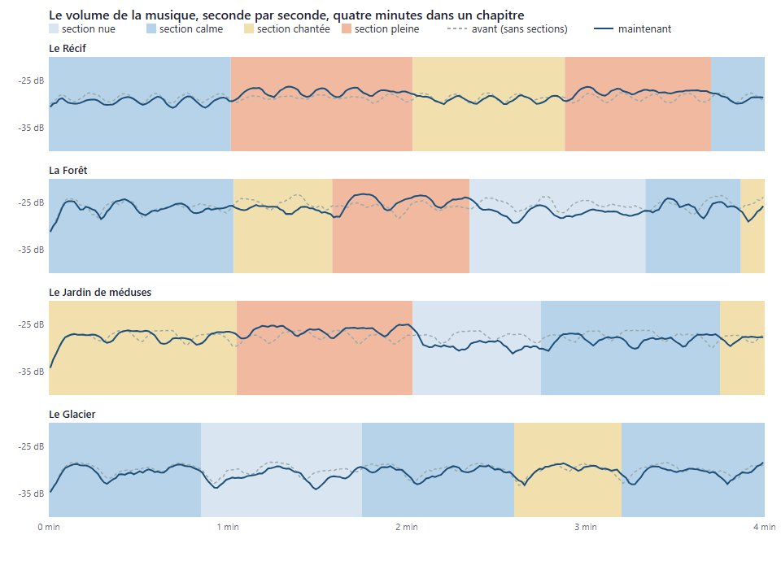

# Des musiques qui changent

## Livré

- **Les sections** (`src/monde/musique-forme.ts`, pur, testé dans `musique-forme.test.ts`) : chaque ambiance passe par des sections de quelques accords (2 à 6 selon le chapitre, soit 30 s à 1 min 30) : **nue** (bourdon et harmoniques devant, accords minces qui se balancent, notes rares, filtre sombre), **calme**, **chantée** (notes 1,5× plus souvent, plutôt plus haut), **pleine** (toutes les voix, accords élargis, filtre clair). La suite va le plus souvent d'une sorte à la voisine, parfois saute, jamais deux fois la même ; on arrive sur une section calme ou chantée.
- **Les accords varient** sans sortir du chapitre : voicings (tel, mince, haut = renversé, ouvert, plein = basse redoublée + une note de la « palette » du chapitre sans demi-ton qui frotte) et chemins (suite, balancement entre deux, ordre libre). Toujours les notes des accords du chapitre, donc en ré majeur.
- **Les motifs ne reviennent pas à l'identique** : une section commence une phrase neuve, puis chaque phrase revient transformée (transposée sur la gamme, rétrograde, miroir, autre rythme, plus longue ou plus courte), jamais deux fois la même de suite. Le chant (Carcasse, Remontée) n'est que glissé le long de lui-même, raccourci, allongé, rythmé autrement : il reste reconnaissable et garde son sens. Une section peut porter les notes à l'octave, seulement là où le chapitre le permet (`FORMS.octaves`).
- **Le caractère reste** : chaque chapitre a son amplitude (`FORMS.swing`) : Glacier (0,55, cristaux toujours en haut) et Fosse (0,45) changent peu, Récif et Remontée le plus.
- **Le moteur** (`musique-son.ts`) : la section change sur un accord ; le bourdon glisse vers son gain, les harmoniques et les accords sont pondérés, la clarté du filtre des accords suit en ~4 s (par pas de l'horloge, comme avant). Les moments (adieu, parade) se combinent aux sections. `musicEngine(G, seed, false)` / `renderAmbience(…, false)` jouent l'ambiance sans sections, pour comparer ; `monde.musique.heard` donne la section en cours.
- **Doc** : `docs/direction-artistique.md`, « Le son », puce « Une musique qui change ».

**Mesures** (rendu hors ligne, Chrome Windows, 4 min par chapitre, 22,05 kHz, avant / après) : niveau moyen inchangé à ±1 dB partout (ex. Récif −28,6 / −28,2 dB, Fosse −32,3 / −32,5 dB), 4 à 6 sections en 4 min, coût identique (20 à 60× le temps réel avant comme après). En jeu : au Récif, `heard` = `[{ chapter: 'recif', section: 'calme' }]`, aucune erreur.

Le changement s'entend surtout dans la texture (voicings, densité des notes, registre, clarté), plus que dans le volume : les sections pleines montent d'environ 1 à 2 dB, les nues descendent d'autant ([SVG](img/forme.svg)).

## Choix retenus

Aucune question posée sur le tableau de bord (rien de structurant : la partition reste dans le même format, le jeu ne change pas de règle).

| Question | Choix retenu | Pourquoi |
| --- | --- | --- |
| Où mettre la forme | Nouveau module pur `musique-forme.ts` à côté de `musique.ts`, branchements courts dans `musique-son.ts` | Additif (voisins `distance-sons`, `vrais-sons-ambiance` sur le son), testé à part, `AMBIENCES` inchangé |
| Comment faire évoluer | Sections de quelques accords, changées sur un accord, quatre sortes en marche aléatoire de proche en proche | Respire comme une forme musicale (montées, éclaircies) sans être une boucle ; aligné sur l'harmonie |
| Les variations d'accords | Dérivées des accords existants (voicings, chemins, une note de la palette du chapitre) | Garde le caractère et le ré majeur par construction ; pas de nouveaux accords à écrire et faire valider |
| Les motifs | Germe par section, puis développement (transposition, rétrograde, miroir, rythme, longueur) | Une idée reconnaissable qui évolue, jamais identique ; le chant n'est que glissé pour rester reconnaissable |
| Le caractère par chapitre | Une amplitude (`swing`) et des octaves permises par chapitre | Glacier immobile et Fosse presque silencieuse restent eux-mêmes |
| Le volume | Moyenne des sections ≈ ambiance d'origine (testé, mesuré) | Les niveaux de la doc (−27 dB, Fosse −33 dB) et l'équilibre avec chant et bruits tiennent |

## Options non retenues

- **Où** : dans `musique.ts` même (plus simple à lire, mais grossit un fichier que d'autres touchent) ; champs `form` dans chaque `Ambience` (tout au même endroit, mais modifie la table partagée).
- **Comment évoluer** : une forme fixe écrite par chapitre (A-B-A-C…, plus composée mais revient à l'identique à la longue, beaucoup d'écriture) ; une lente modulation continue des paramètres (LFO de densité/volume : plus doux mais sans « moments » nets, et les modulations continues coûtent cher dans Chrome) ; changer selon l'activité du joueur (immobile → plus calme ; intéressant mais déborde du chantier, à voir avec `distance-sons`) ; plusieurs couches qui entrent/sortent (stems) : plus d'oscillateurs, coût.
- **Accords** : écrire des progressions alternatives par chapitre (plus de variété harmonique, mais risque de perdre le caractère, travail d'écoute) ; modulations vers une autre tonalité (interdit : le chant doit tomber juste) ; accords empruntés hors de la gamme (même raison).
- **Motifs** : génération entièrement aléatoire (déjà le cas avant : pas d'idée qui revient) ; chaîne de Markov apprise sur le chant (plus « mélodique », plus lourd à régler) ; contre-chant à deux voix (plus riche, plus de sources).
- **Caractère** : mêmes réglages pour tous (plus simple, mais le Glacier et la Fosse bougeraient trop).
- **Volume** : sections plus contrastées (±4 dB : plus spectaculaires, mais casse l'équilibre avec le chant et les bruits, et le téléphone).

## Reste à faire / limites

- Écoute humaine à faire dans chaque chapitre (je n'ai pu que mesurer) : régler `KINDS` et `FORMS` à l'oreille si besoin.
- Les sections se décident par chapitre : à une frontière, les deux chapitres ont chacun la leur (indépendantes).
- La Remontée : la section suit l'ambiance de la Remontée quand elle s'éclaire ; pas de lien avec la progression de la lignée qui remonte (idée : une section pleine quand un ancêtre arrive).
- Idée : que le chant du joueur influe sur la section (une section chantée qui répond).

## Risques de fusion

- `src/monde/musique-son.ts` : imports, champs ajoutés à `Group`, `section()` / `gap()` nouveaux, `chord()` / `motif()` / `harmonics()` / `tick()` retouchés en quelques lignes, paramètre `form` de `musicEngine` et `renderAmbience`, `section` dans `heard`. Conflit possible si `distance-sons` ou `vrais-sons-ambiance` touchent ces fonctions.
- `docs/direction-artistique.md` : une puce ajoutée après « Les moments » (section « Le son »).
- Nouveaux : `src/monde/musique-forme.ts`, `src/monde/musique-forme.test.ts`. `musique.ts` et `main.ts` non touchés.
