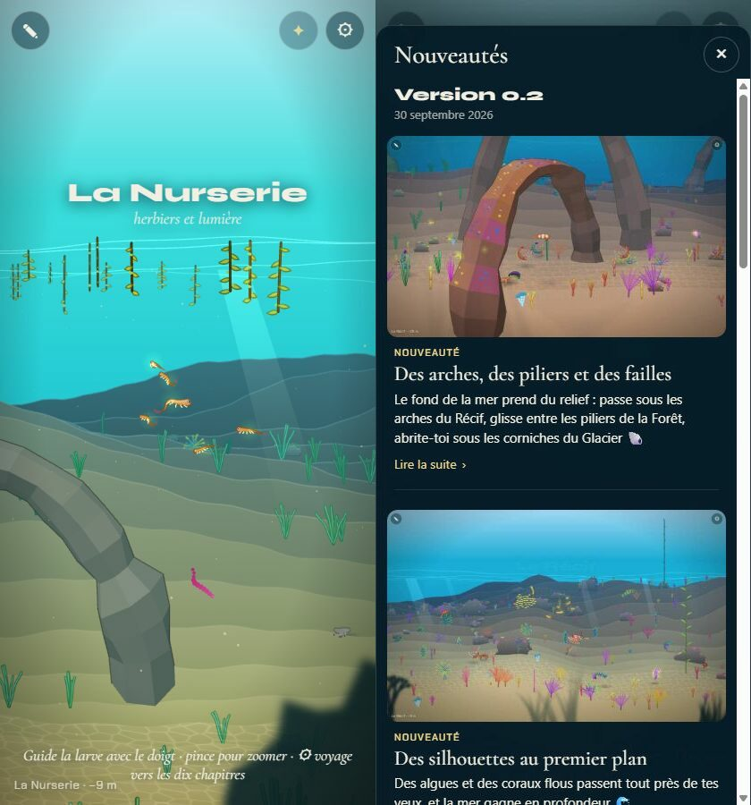
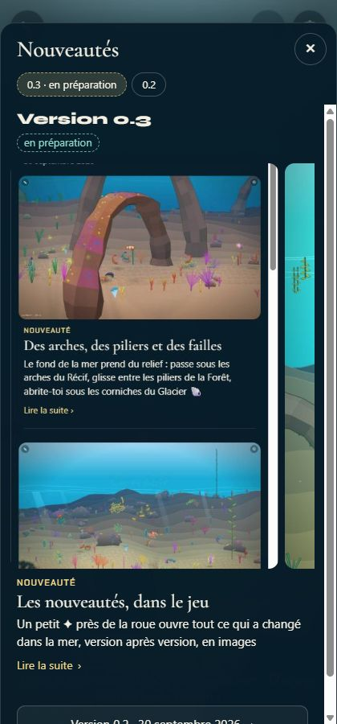
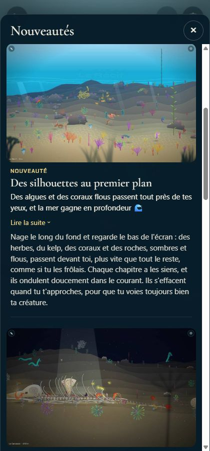
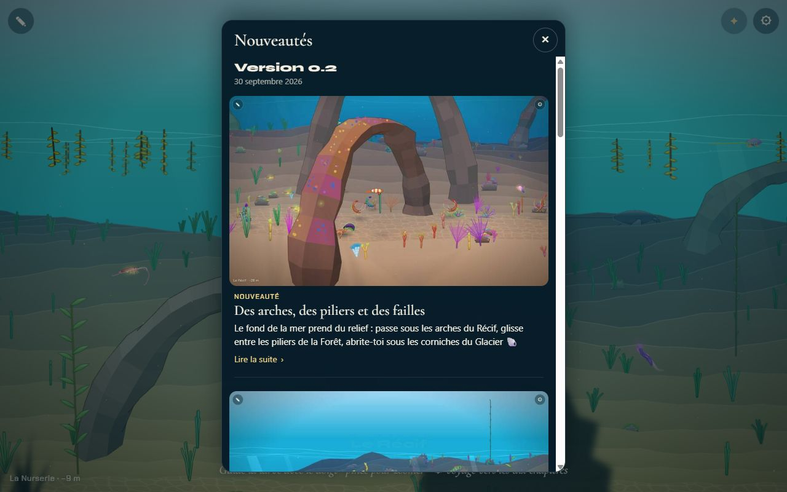

# Les nouveautés dans le jeu

## Livré

Le panneau « Nouveautés » se lit dans le jeu, en dev comme dans la page publiée (un seul fichier, ouvert aussi par `file://`).

- **Le bouton ✦**, discret, à gauche de ⚙ (même cercle, plus effacé). Il ouvre et referme le panneau à tout moment.
- **Le panneau** (`src/monde/nouveautes/`), pensé pour le téléphone :
  - une feuille qui monte du bas sur téléphone, centrée sur grand écran ;
  - une version à la fois, la plus récente en tête : « Version 0.2 », sa date, puis ses nouveautés dans l'ordre du moteur (nouveautés, améliorations, corrections) ;
  - pour chaque entrée : la capture en grand, le type en couleur, le titre, l'accroche, et le texte derrière « Lire la suite » ;
  - des pastilles en haut pour passer d'une version à l'autre (dès qu'il y en a deux), et un bouton « Version précédente » en bas de liste ;
  - Échap, la croix, ou un toucher à côté du panneau le ferment ; les gestes dans le panneau ne pilotent pas la larve.
- **Il s'ouvre tout seul une fois** (`seen.ts`), 1,8 s après l'arrivée, quand une version publiée est plus récente que la dernière montrée dans ce navigateur (`localStorage['lignee.nouveautes']`). Pas pendant l'Atelier ni le banc de performance.
- **En dev** (`make dev`), la version en préparation apparaît aussi, en tête, marquée « en préparation » (pastille et mention en pointillés). Les images viennent directement de `changes/`. L'ouverture automatique, elle, montre la version publiée qui est nouvelle.
- **Le plugin Vite** `whatsNewPlugin.mjs` écrit `whatsNew()` dans la page, dans un `` ne coupe. Il construit aussi les vraies données de la page : la 0.2, ses 8 entrées, une image chacune, dans le budget ; et le texte seul quand le budget est trop petit.

## Choix retenus

Aucune question posée sur le tableau de bord : la consigne demandait de trancher chaque question avec l'option recommandée.

| Question | Choix retenu | Pourquoi |
| --- | --- | --- |
| Quelles images dans le fichier unique ? | La première image de chaque entrée, en JPEG de 720 px (qualité 70), dans un budget de 400 Ko, les versions les plus récentes d'abord | 156 Ko pour la 0.2, net sur un téléphone à 2x ; le budget borne la page quand les versions s'ajoutent (environ 2 à 3 versions comme la 0.2) |
| Avec quoi réduire les images ? | ImageMagick (`magick` ou `convert`) au build ; sans lui, les images telles quelles, dans le même budget | Aucune dépendance npm, installé sur la machine qui publie, 0,3 s ; le build ne casse jamais |
| Comment la page reçoit les données ? | Un script JSON écrit par le plugin dans la page, en dev comme au build | Un seul chemin de lecture ; pas de `fetch`, qui échoue en `file://` et dans le lien Artifact |
| Où vit le plugin ? | `whatsNewPlugin.mjs` et ses types `whatsNewPlugin.d.mts`, à la racine | Le projet n'a pas `@types/node` (ce serait une dépendance) ; même forme que `agents/release/changes.mjs` |
| Première visite ? | Pas d'ouverture automatique : la version actuelle est retenue, la suivante ouvrira le panneau. Un joueur venu avant le panneau (des clés `lignee.*` dans son stockage) le voit une fois | On commence par la mer, pas par des nouvelles d'un jeu qu'on ne connaît pas encore |
| Stockage bloqué (cadre isolé, navigation privée) ? | Jamais d'ouverture automatique ; le bouton marche | Sinon il s'ouvrirait à chaque visite |
| Forme du panneau | Feuille du bas (téléphone) ou centrée, une version à la fois avec pastilles, capture en grand, accroche, suite derrière « Lire la suite » | Lisible au pouce, texte court, peu de gestes |
| Bouton | ✦ doré, à gauche de ⚙, même cercle en plus effacé | Discret, dans la famille de ✎ et ⚙ (des signes, pas des emojis en couleur) |
| Le jeu pendant la lecture | Il continue derrière un voile sombre, comme avec ⚙ | Pas de branchement de plus dans `main.ts` ; le panneau est presque opaque, sans flou coûteux |
| Types et badges | Les types de `changes.d.mts`, les badges sans leur emoji (« Nouveauté ») et une couleur par type | Une seule définition des données ; les emojis 🔧 🩹 du changelog détonnent dans le jeu |

## Options non retenues

**Quelles images embarquer**

- Les premières images telles quelles : aucun outil, mais environ + 760 Ko pour la 0.2 (page d'environ 1,06 Mo), et encore autant à chaque version.
- Toutes les images de chaque entrée, réduites (44 pour la 0.2) : plus riche, mais environ + 900 Ko ; la galerie horizontale existe déjà en dev.
- Des vignettes plus petites (480 px, qualité 60 : 68 Ko pour la 0.2) : deux fois plus léger, mais flou sur un téléphone à 2x ou 3x.
- WebP : 25 à 30 % plus léger, mais la consigne suggérait JPEG, et c'est le format des captures.
- Pas d'images dans le fichier unique (texte seul) : le plus léger, mais on perd les captures en grand.
- Un plafond en nombre de versions (les 3 dernières) plutôt qu'en octets : simple, mais une grosse version ferait gonfler la page.

**Avec quoi réduire**

- Un décodeur et un encodeur JPEG en JavaScript dans le plugin : aucun outil système, mais environ 500 lignes de codec à maintenir.
- Le Chrome de playwright au build (canvas, puis `toDataURL`) : exact, mais il faut un navigateur pour construire la page.
- Des vignettes versionnées dans le dépôt, faites une fois par version : aucun outil au build, mais une étape de plus à chaque publication, et des fichiers que le cadriciel ne connaît pas.
- Une dépendance npm (sharp, jpeg-js) : interdite par la consigne.

**Comment la page reçoit les données**

- Comme Allèle : `fetch('/whats-new/whats-new.json')` en dev, un fichier à côté au build. Pas possible dans un fichier unique ouvert sans serveur.
- Un module virtuel (`virtual:whats-new`) : importé et typé, mais les données deviennent du code JavaScript, et il faut un chemin à part pour les recharger en dev.

**Première visite**

- L'ouvrir aussi à la première visite, comme Allèle : le nouveau joueur tombe sur des nouvelles d'un jeu qu'il n'a pas encore vu.
- Ne l'ouvrir que si le navigateur a déjà vu le panneau : les joueurs d'avant la 0.2 ne verraient jamais la 0.2 s'ouvrir seule.
- Un point sur ✦ au lieu d'une ouverture automatique : plus doux, mais la consigne demande qu'il s'ouvre.

**Forme du panneau**

- L'arbre d'évolution d'Allèle (`tree.ts`) : propre à Allèle, dense sur un téléphone.
- Un carrousel, une nouveauté par écran : immersif, mais beaucoup de gestes, et on ne survole plus la version.
- Tout le texte affiché : la version 0.2 devient un long défilement sur téléphone.
- Une page publique à part (`quoi-de-neuf.html` chez Allèle) : utile pour partager, mais hors du fichier unique ; possible plus tard.

**Bouton**

- À côté de ✎, en haut à gauche : du côté de l'Atelier, hors de l'histoire.
- Dans le panneau ⚙ : moins visible, deux touches au lieu d'une.
- Un emoji 🐚 : plus parlant, mais en couleur, plus bruyant que ✎ et ⚙.

**Le jeu pendant la lecture**

- Le mettre en pause comme l'Atelier : moins de batterie pendant la lecture, mais un branchement de plus dans `main.ts` et une mer figée derrière.

## Reste à faire / limites

- **Page jouable** : je n'ai pas reconstruit `play/lignee-monde.html` (la consigne du projet le réserve à l'intégrateur). `npm run play` y mettra le panneau, à la machine où ImageMagick est installé. Le `play/` actuel (240 Ko) date d'avant la 0.2.
- **Sans ImageMagick**, les images partent telles quelles. Le budget s'applique par version entière : la 0.2 (567 Ko d'originaux) serait alors sans images. Le build le dit.
- **Les captures automatiques des agents** : un navigateur qui a déjà des clés `lignee.*` pour l'adresse du client, mais pas encore `lignee.nouveautes`, verra le panneau une fois, 1,8 s après le chargement. Ce n'est pas le cas sous `navigator.webdriver` ni avec `?bench`. Pour l'éviter : `localStorage.setItem('lignee.nouveautes', '{"version":"99.0.0"}')` avant la capture.
- En dev, les données sont lues au chargement de la page : recharger après avoir modifié une entrée.
- Pas d'agrandissement d'une capture au toucher, pas de piège du focus clavier dans le panneau (il prend le focus à l'ouverture et le rend au bouton à la fermeture).
- `agents/docs/changes.md` (section « Dans le jeu ») ne décrit que la façon d'Allèle. On pourrait y ajouter celle du fichier unique ; je ne l'ai pas fait, car `agents/` est réservé à l'orchestrateur.
- Une page publique des nouveautés, à partager, reste possible avec les mêmes modules.

## Risques de fusion

- `src/monde/main.ts` : 2 lignes (l'import, et `initNouveautes(…)` juste après l'écouteur `touchmove`).
- `vite.config.ts` : le plugin ajouté avant `viteSingleFile()`, et une ligne de commentaire.
- `docs/decisions.md` : un point « Nouveautés » dans la section « Technique ».
- Nouveaux fichiers : `whatsNewPlugin.mjs`, `whatsNewPlugin.d.mts`, `src/monde/nouveautes/` (modules, styles, tests).
- `index.html` n'est pas touché : le bouton est créé en JavaScript, juste après `#gear`. Un chantier qui déplace ⚙ doit aussi déplacer `#nvBtn` (`right: 64px`, dans `src/monde/nouveautes/style.css`).
- Le panneau est en `z-index: 4`, sous l'Atelier (5).
