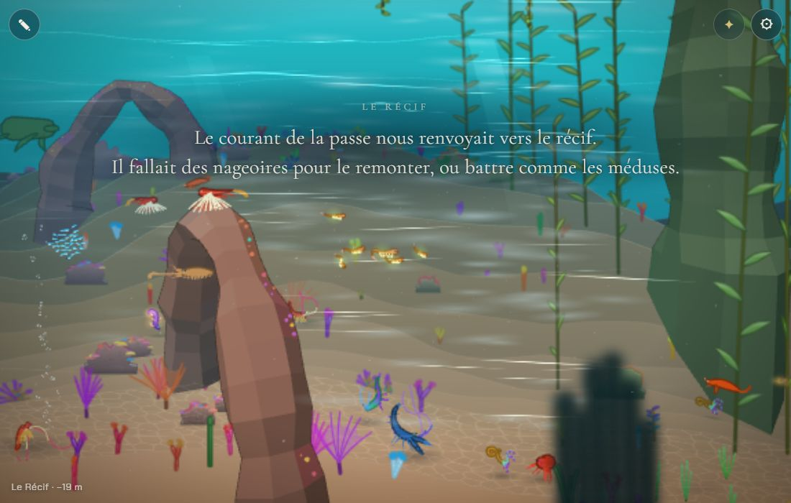
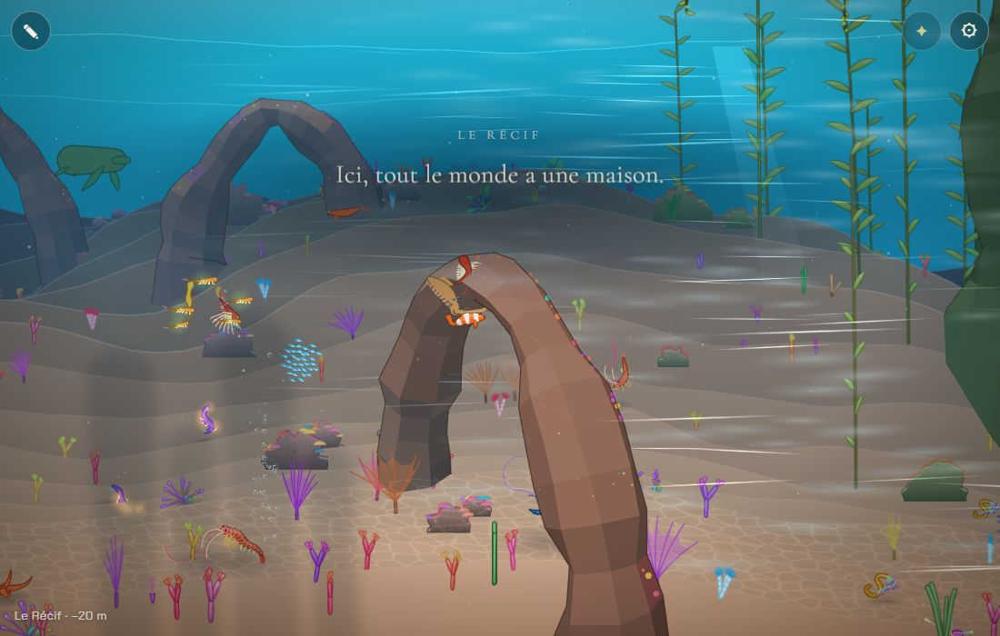
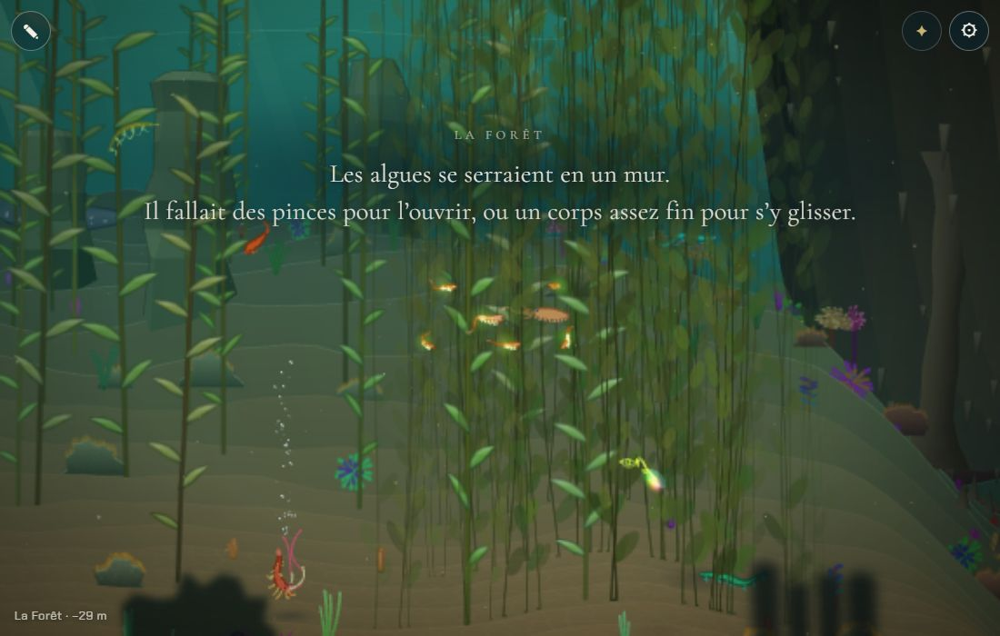
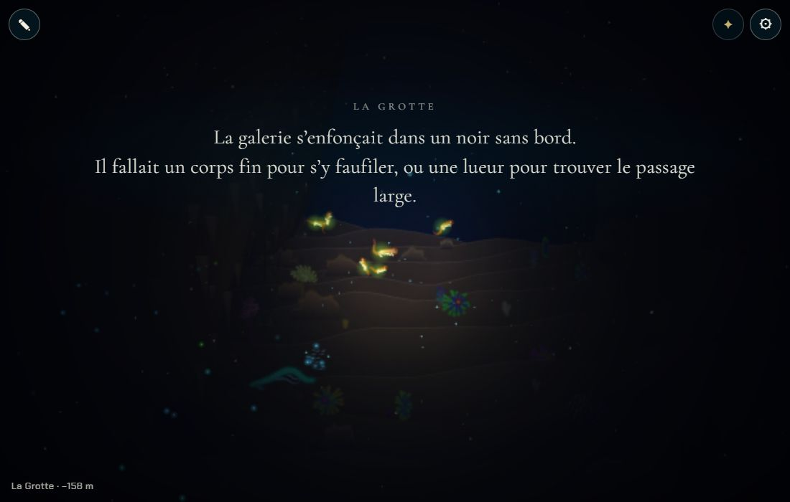
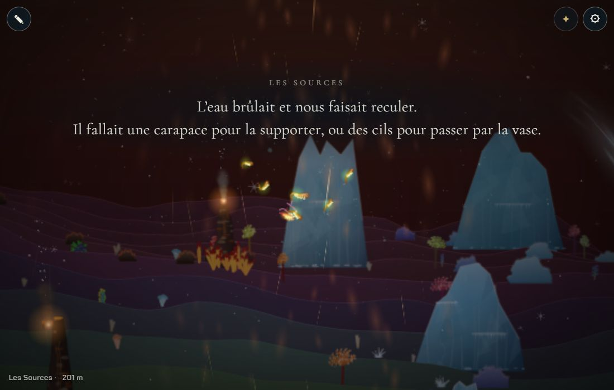
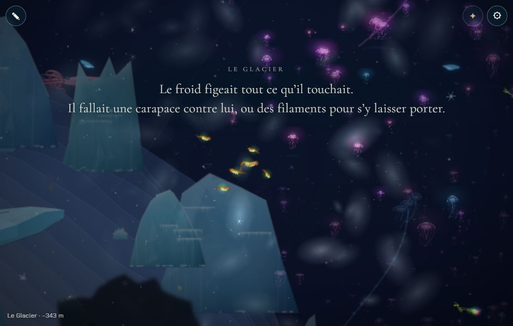
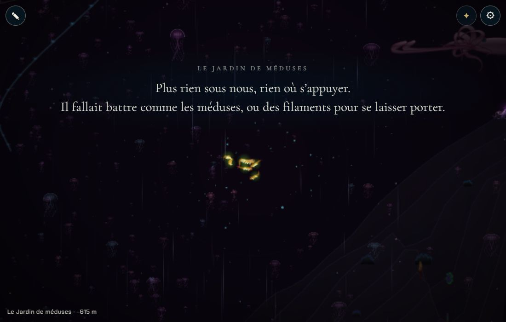

# Les obstacles-clés

## Livré

- **Un obstacle par chapitre**, à la fin de son étendue (les bornes `GATES` de `limites.ts`) : il barre la descente tant que le corps joué n'a aucun des traits qui le franchissent. Table dans `src/monde/obstacles.ts` (`OBSTACLE`, `KEYS`, `crosses`, `crossWith`, `keyOf`), conforme à la vue d'ensemble de `docs/chapitres.md` (un test le vérifie).

  | Chapitre | Obstacle | Il… | Traits |
  | --- | --- | --- | --- |
  | Récif | courant de passe | repousse | nageoires, pulsation |
  | Forêt | mur d'algues | ralentit | pinces, corps fin |
  | Grotte | galerie noire | cache le chemin | corps fin, lanterne |
  | Sources | couloir brûlant | repousse | carapace, cils |
  | Glacier | eau glacée | ralentit (aussi en y) | carapace, filaments |
  | Jardin | le vide | repousse | pulsation, filaments |
  | Fosse | noir et silence | cache le chemin | lanterne, chant |

- **Zéro danger** : `feel()` modifie seulement la vitesse de nage du joueur sur 700 à 900 px avant la borne. *Repousse* : un courant qui finit plus fort que toute nage ; *ralentit* : chaque coup porte moins, en x et en y ; *cache* : le noir se referme (`keys.dark`, ajouté au `dk` de la scène) et l'eau fait doucement demi-tour. **Avec un trait-clé**, l'obstacle se sent encore un peu (courant qui tire, eau qui freine) mais laisse passer. Mesuré en jeu (pilote auto, 7 s vers la borne) : la larve reste à 220–300 px de chaque obstacle ; le poisson-clown (nageoires) passe le Récif.
- **Ce qu'on voit** (`src/monde/obstacles-draw.ts`, canvas et WebGL, pièces triées en profondeur) : traînées claires qui filent vers le récif, rideau de kelp serré et sombre, eau orangée qui tremble et monte, brume blanche du Glacier, fils de courant qui montent sous le Jardin ; la Grotte et la Fosse, par leur noir.
- **Le texte « Devant l'obstacle »** : la première fois qu'un obstacle retient (à mi-chemin de l'approche), la lignée dit ce qu'il aurait fallu. Les textes sont dans `docs/chapitres.md` (étiquette « Devant l'obstacle : », nouveau `TextKind` `'obstacle'` de `textes.ts`), affichés par le narrateur existant ; ils attendent qu'aucun panneau ne couvre la mer.
- **Branchement** : `src/monde/obstacles-jeu.ts` (`createKeys(limits, () => player.cr.spec)`) : les traits du corps joué, les bornes (`reach` avec la vraie règle), la nage retenue, le noir, le texte. API de test : `monde.keys.traits`, `monde.keys.force = ['nageoires']` (null pour revenir).
- **Traits du corps** : `src/monde/obstacles-traits.ts`, une version approchée de `traitsOf(sp): Trait[]` (mêmes ids et même signature que `src/content/traits.ts` de `traits-corps`, convenus avec lui). La larve de départ n'y a aucun trait.
- Docs : `docs/chapitres.md` (nouvelle section « Les obstacles-clés », Récif : second trait = pulsation, textes des obstacles, bornes du monde).
- Tests : `obstacles.test.ts` (table ≥ 2 traits, accord avec chapitres.md, textes présents, partenaires qui ouvrent chaque obstacle, effets), `obstacles-jeu.test.ts` (bornes selon le corps, obstacle franchi qui le reste, noir de la Grotte, texte dit une fois, fin du monde gardée).

## Choix retenus

| Question | Choix retenu | Pourquoi |
| --- | --- | --- |
| Activer les obstacles tout de suite (la larve reste bloquée au Récif tant que les naissances n'existent pas) ? | **Actifs tout de suite** — choix de l'utilisateur (tableau de bord) | c'est le chantier ; les naissances arrivent dans la même étape 3 |
| Second trait du Récif | pulsation | proposition de chapitres.md ; `especes-compatibles-leur` ajoute un partenaire qui pulse (méduse-boîte) |
| Où vit la table obstacle → traits | `src/monde/obstacles.ts`, `KEYS` | convenu avec `especes-compatibles-leur`, qui l'importe |
| Fonction des traits en attendant `traits-corps` | version approchée à part (`obstacles-traits.ts`), même signature | fusion = un re-export, pas de conflit add/add |
| Comment un obstacle retient | trois manières (repousse / ralentit / cache) sur la vitesse de nage, puis la borne de `limites.ts` | zéro danger, lisible, sans toucher au moteur |
| Avec le trait | l'obstacle se sent encore un peu | on comprend que c'est le corps qui passe |
| Dire au joueur quel trait il faut | une citation « Devant l'obstacle » dans la voix du « nous », une fois | interface minimale, textes dans chapitres.md |
| La Fosse | garde la fin du monde même avec une lanterne | la Remontée (étape 5) n'existe pas ; le chant n'est pas un trait du corps |
| Un obstacle déjà passé | reste franchi (même sans le trait) | règle existante de `limites.ts`, on peut remonter et redescendre |

## Options non retenues

- **Activation** : actifs dès la première naissance seulement (jamais bloquant, mais règle provisoire à retirer) ; derrière `?cles` (zéro risque, invisible aux joueurs).
- **Second trait du Récif** : filaments (se laisser porter par le courant ; mais le courant va dans le mauvais sens) ; cils (peu crédible face à un courant fort).
- **Table** : dans `limites.ts` (fichier déjà partagé, plus de conflits) ; dans `biomes.ts` avec la carte (fichier très partagé).
- **Traits** : attendre `traits-corps` (le chantier ne se voyait pas) ; écrire `src/content/traits.ts` moi-même (conflit add/add avec le voisin).
- **Effets** : un mur dur pour tous (lisible mais sec, loin de « repousse, ralentit, cache ») ; agir sur le moteur (`creature3.ts`, commun aux 43 espèces et à l'Atelier, risqué).
- **Avec le trait** : l'obstacle disparaît (plus simple, mais on ne sent pas ce que le trait apporte) ; les algues qui s'écartent devant le joueur (plus beau, bien plus coûteux).
- **Indice** : aucun (le joueur ne comprend pas pourquoi il est bloqué) ; icône du trait (contraire à « pas de chiffres, le texte est la seule interface ») ; texte à chaque fois (lassant).
- **Fosse** : l'ouvrir avec une lanterne sur la Remontée (le puits de lumière et la fin n'existent pas encore).

## Reste à faire / limites

- **Remplacer `obstacles-traits.ts`** par la fonction de `traits-corps` à la fusion : `export { traitsOf } from '../content/traits';` (mêmes ids ; le type `Trait` de `obstacles.ts` peut alors venir de là, plus `'chant'`). Les résultats diffèrent un peu (par ex. l'anguille : filaments chez lui). Le test « les partenaires ouvrent chaque obstacle » doit rester vert avec sa fonction.
- **Sans naissances** (parade, portée, adieu), la larve s'arrête au Récif : à publier ensemble. En dev, `?dev` (voyage, qui compte les obstacles d'avant comme franchis) ou `monde.keys.force`.
- Les visuels sont des voiles et des traînées, pas du décor : pas de barrières de corail autour de la passe, les algues ne s'écartent pas quand on passe, pas de passage large éclairé dans la Grotte.
- La Grotte : la borne est à la fin du chapitre (x = 13 600), juste après la voûte ; « le passage large » avec une lanterne n'a pas de géométrie propre.
- Le chant (Fosse) viendra à l'étape 5 ; la Remontée ouvrira la Fosse.
- Le texte « Devant l'obstacle » n'est dit qu'une fois par session (non sauvé).

## Risques de fusion

- `src/monde/main.ts` : 2 imports, `steer` (1 ligne), 3 appels `reach(limits)` → `keys.bounds()`, `keys.update`, `obstacleItems` après `glacierItems`, `keys.dark` dans le `dk`, `keys` dans l'API, `keys.onBarred` après le narrateur. Branchements courts.
- `src/monde/textes.ts` : `TextKind` + `'obstacle'`, un champ, une étiquette (additif). Si `adieu-parent` touche les étiquettes, garder les deux.
- `src/monde/limites.ts` : deux commentaires seulement.
- `docs/chapitres.md` : vue d'ensemble (Récif), citations « Devant l'obstacle » à la fin des chapitres 2, 3, 4, 6, 7, 8, 9, section « Les obstacles-clés » sous « Les bornes du monde ». `adieu-parent` écrira sans doute des adieux dans les mêmes chapitres : garder les deux blocs.
- Nouveaux fichiers : `obstacles.ts`, `obstacles-jeu.ts`, `obstacles-draw.ts`, `obstacles-traits.ts` et leurs tests.
