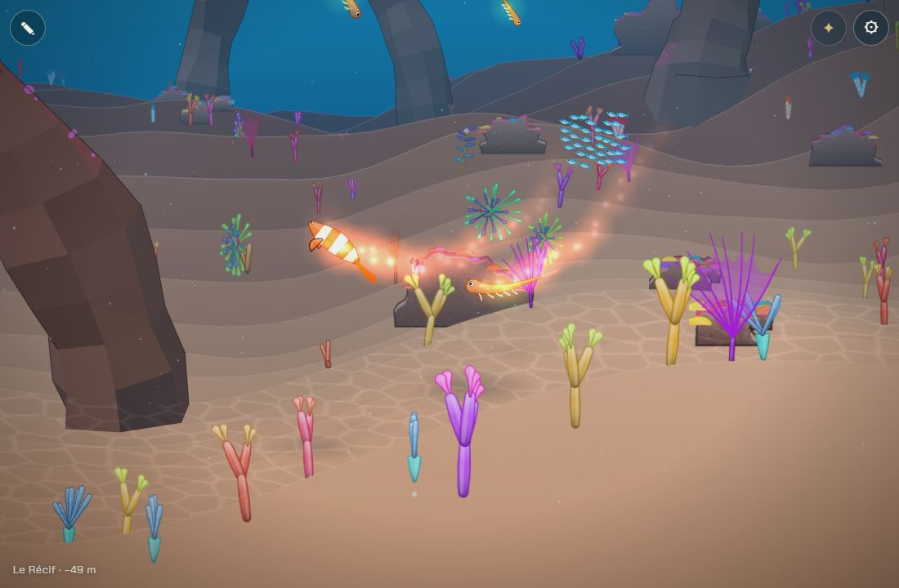
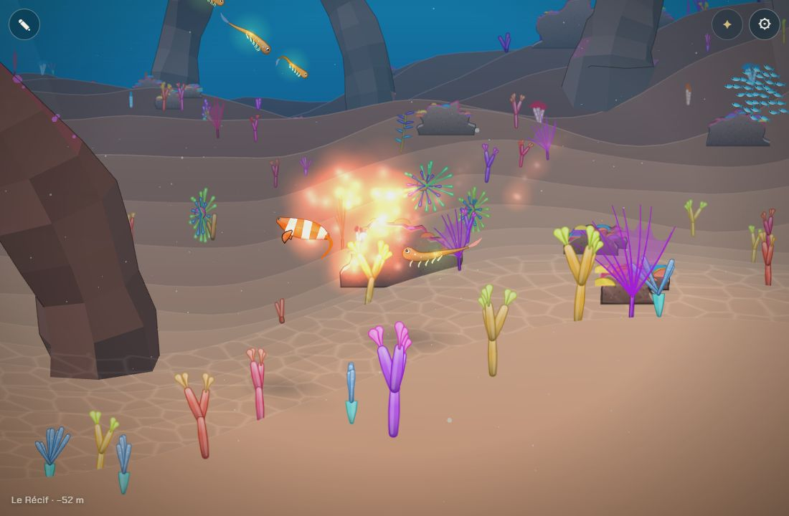
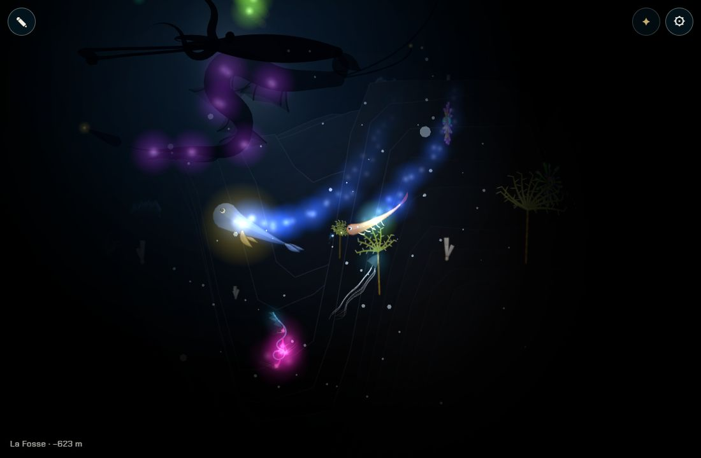
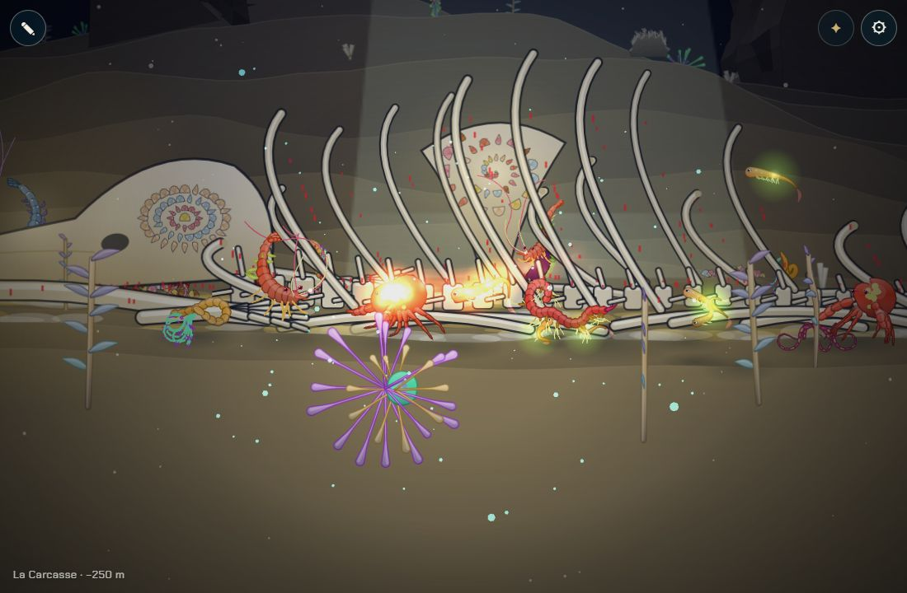
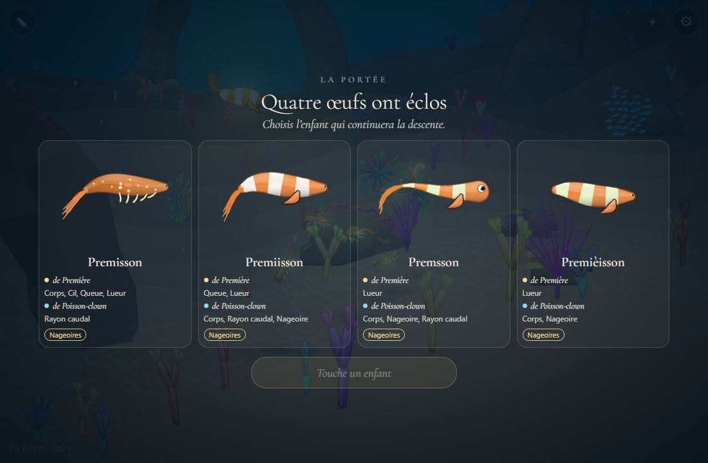

# La parade

## Livré

Environ 20 secondes de nage synchronisée avec un partenaire du chapitre, sans échec possible, qui donnent une qualité de 0 à 1 pour la portée.

- **Le début** : on reste 1,2 s à moins de 130 d'un partenaire du chapitre, c'est-à-dire un animal marqué `actor.partner` par le chantier des espèces compatibles. Il nous remarque (quelques lueurs montent de lui), vient dans notre plan et mène la danse. Rien ne commence pendant qu'un texte est à l'écran, que l'Atelier ou la portée sont ouverts.
- **La danse** : le partenaire dessine un grand huit autour de l'endroit de la rencontre, en partant à l'opposé de nous. Il attend quand il prend du retard et ralentit quand on s'éloigne. Les marcheurs (crabe, homard…) font l'aller-retour sur le fond. Il ne mène jamais au-delà d'un obstacle non franchi, ni hors de l'eau, ni dans le plafond de la Grotte.
- **La qualité** : la moyenne, sur les 20 s, de trois mesures.
  - Le suivre : 40 %, pleine jusqu'à une distance de 120, nulle au-delà de 360.
  - Passer dans son sillage : 30 %, là où il était il y a 0,3 à 1,5 s.
  - Tourner avec lui : 30 %, le même cap que lui, lissé sur 12 pas.

  Mesures en jeu (Chrome Windows, pilote automatique qui suit le partenaire) :

  | Partenaire | Suivi | Immobile à côté |
  | --- | --- | --- |
  | Poisson-clown, Récif | 0,95 | 0,33 à 0,40 |
  | Baudroie, Fosse | 0,95 | |
  | Crabe, Carcasse | 0,80 | |

- **Ce qu'on voit** (aucun chiffre) :
  - Le sillage du partenaire brille de sa couleur.
  - Le nôtre s'allume de la même couleur quand on danse en rythme.
  - À la fin, un éclat de lumière d'autant plus grand que la parade était réussie.
  - Ce sont des lumières du monde (`lights`) : elles restent visibles dans le noir de la Fosse.
- **Puis la portée** : 1,6 s après la fin (le temps de l'éclat), le jeu ouvre la portée avec ce partenaire et la qualité de la parade (`openPortee(spec, quality)`). Vérifié en jeu : parade au Récif, qualité 0,95, puis les quatre œufs.
- **Le résultat** : `monde.parade.last`, avec `partner` (l'id de l'espèce), `spec` (sa définition, pour `fuse`), `chapter`, `quality` et `parts`. `parade.onEnd(f)` est appelé à la fin de chaque parade.
- **Fichiers** :
  - `src/monde/parade.ts` : les règles, pures (figure, meneur qui attend, mesures, qualité, approche).
  - `src/monde/parade.test.ts` : 7 tests.
  - `src/monde/parade-jeu.ts` : le jeu (détection, conduite du partenaire, lumières, API).
  - `docs/mecaniques.md` : la section « La parade ».
- **Le voir** :
  1. Ouvrir `?dev`, aller au Récif et rester près d'un poisson-clown, d'une rascasse ou d'un hippocampe.
  2. Ou, dans la console : `monde.parade.quiet = () => false; monde.parade.start(monde.spawn('poissonClown', 'swim', 90, 0), monde.player.cr)`. Un animal ajouté par `spawn` n'est pas marqué partenaire : `start` le fait danser quand même.
  3. Suivre `monde.parade.state`, puis `monde.parade.last`.

## Choix retenus

Aucune question posée à l'utilisateur : tous les choix sont `auto`. Un retour (feedback) signale les liens avec les chantiers voisins.

| Question | Choix retenu | Pourquoi |
| --- | --- | --- |
| Comment la parade commence | Rester 1,2 s près d'un partenaire | Aucun bouton (interface minimale), un geste naturel ; on voit qu'il nous remarque |
| Ce que fait le partenaire | Un grand huit autour du lieu de la rencontre | Il contient les trois gestes (suivre, sillage, tourner) et reste dans une petite zone, sans aller se perdre |
| « Sans échec » | Le meneur attend et ralentit ; 20 s fixes | On peut toujours rattraper ; la qualité seule varie |
| Mesure de la qualité | Moyenne pondérée : suivre 40 %, sillage 30 %, tourner 30 % | Reprend les trois gestes de la conception ; simple, testable |
| Retour visuel | Lumières de sillage, et éclat final selon la qualité | « Pas de chiffres » ; lisible même dans le noir |
| Qui est partenaire | Le marqueur `actor.partner` des espèces compatibles (depuis la fusion de `backlog`) | Une seule source, qui ne compte que les animaux du plan de nage, là où on peut les rejoindre ; la table provisoire est retirée |
| Partenaire hors de notre plan | Il vient au plan z = 0 pendant la danse, puis retourne au sien | On ne peut danser qu'avec ce qu'on touche |
| Le résultat pour la portée | `parade.onEnd` ouvre la portée 1,6 s après la fin, avec la qualité | La portée est arrivée sur `backlog` avec `openPortee(partner, quality)` ; le délai laisse voir l'éclat |
| Après une parade | Pause de 8 s ; le même partenaire est ignoré jusqu'à 500 de distance | Pas de nouvelle parade juste après la portée, avec le même animal |

## Options non retenues

- **Début**
  - Toucher le partenaire du doigt : explicite, mais le doigt sert déjà à nager.
  - Contact immédiat : se déclencherait par accident dans les bancs.
  - Un bouton « Parader » : contraire à l'interface minimale.
- **Figure**
  - Figures variées par espèce (spirale pour les méduses, zigzag…) : plus riche, coût moyen, à faire plus tard.
  - Une nage libre du partenaire, qu'on suivrait : moins lisible, et il risquerait de partir loin.
  - Une imitation « à tour de rôle » (on refait son geste) : plus difficile à lire sans interface.
- **Sans échec**
  - La parade finit plus tôt quand on s'éloigne : ressemble à un échec.
  - Pas de minimum de qualité (garder 0 à 1) : c'est le choix retenu.
  - Un plancher, 0,2 par exemple : la portée pourra le faire.
- **Qualité**
  - Seulement la distance : trop facile, ne récompense pas le sillage.
  - Un score de synchronisation des battements (phase de nage) : juste, mais coûteux et peu lisible.
  - Une courbe non linéaire (plus exigeante en haut) : réglable plus tard selon les retours.
- **Retour visuel**
  - Un texte « nous dansons » : réservé aux ouvertures et adieux.
  - Une jauge : interdite (pas de chiffres).
  - Un son : il n'y a pas encore de son dans le jeu ; une bonne suite (Web Audio).
- **Partenaires**
  - Lire la table dans `chapitres.md` : fragile.
  - Garder une table dans la parade : une deuxième source à tenir à jour.
  - `isPartner(chapitre, id)` de `partenaires.ts`, sans le plan : on pourrait danser avec un animal hors d'atteinte.
- **Enchaînement vers la portée**
  - L'ouvrir tout de suite : on ne verrait pas l'éclat.
  - Attendre un geste (toucher le partenaire) : une étape de plus, sans valeur.
  - Un texte entre les deux : ce sera peut-être le rôle de l'adieu.
- **Plan**
  - Détecter aussi les partenaires lointains en z : on les verrait sans pouvoir les rejoindre.
- **Résultat**
  - L'écrire dans la sauvegarde (`partie`) : utile si l'on quitte entre parade et portée, mais cela touche le format de sauvegarde ; à décider avec la portée.

## Reste à faire / limites

- **Fusion avec `backlog`** (ordre de l'intégrateur) :
  - Le marqueur des partenaires remplace la table provisoire.
  - La fin de la parade ouvre la portée.
  - Le bouton de test « portée » du panneau ⚙ reste, pour ouvrir une portée sans parade.
- **Partenaires peu mobiles** : le plumeau de la Carcasse est fixé au fond, sa danse sera presque immobile. À vérifier en jeu, ou à lui donner une figure à lui.
- **Tourner avec un marcheur** : la mesure reste basse (0,2 à 0,4 avec le pilote automatique), car on nage au-dessus de lui à petite vitesse. Un vrai joueur reste à essayer sur téléphone.
- Pas de son.
- La parade n'est pas sauvée si l'on ferme la page avant la portée.

## Risques de fusion

- **Fusion de `backlog`** : deux conflits dans `src/monde/main.ts`.
  - Les imports : on garde ceux de `partenaires`, `portee-ecran`, `obstacles`, et `parade-jeu`.
  - L'objet `api` : on garde `keys`, `portee` et `openPortee`, avec `parade`.
- **`src/monde/main.ts`** : environ 17 lignes ajoutées, sans rien retirer.
  - Un import.
  - La création de `parade` juste après `let bounds = reach(limits);`, et son `onEnd`, qui ouvre la portée.
  - `parade.step(p, actors)` juste après `collide(p)` dans `update()`.
  - Une ligne dans la boucle des acteurs : le partenaire mené, avant le cas `'sib'`.
  - `parade.lights(...)` juste après `lights.length = 0;` dans `render()`.
  - `parade` dans l'objet `api`.
  - Le commentaire du bouton de test de la portée.
- **`docs/mecaniques.md`** : les sections « La parade » et, une phrase, « La portée ».
- **Nouveaux fichiers** : `src/monde/parade.ts`, `parade.test.ts`, `parade-jeu.ts`.
