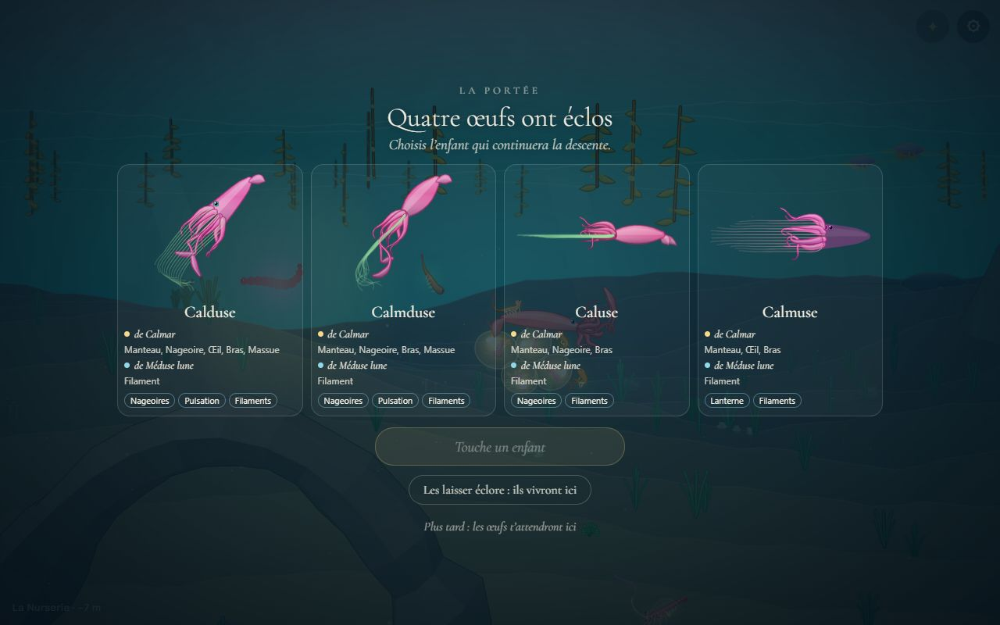
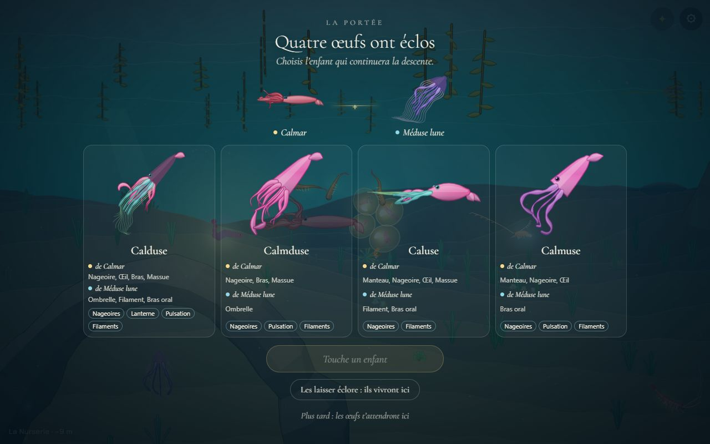
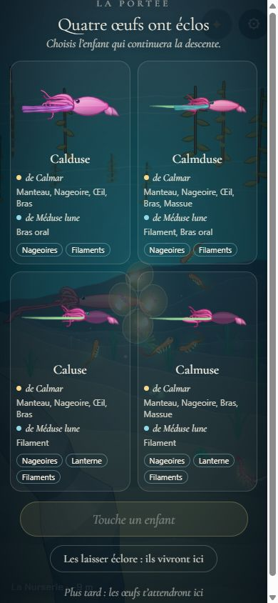
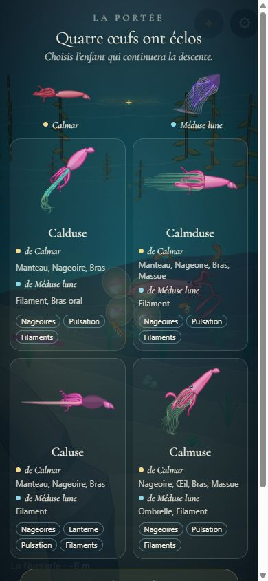

# Les parents au-dessus de la portée

## Livré
- Dans l'écran de la portée (`src/monde/portee-ecran.ts`, `src/monde/portee.css`), un bandeau entre le titre et les enfants : le parent et le partenaire, chacun avec son portrait (`snapshot3`) et son nom, plus petits que les enfants, reliés par un « + » sur un fil de lumière dorée. Les noms portent le même point de couleur (or / bleu) que les lignes « de … » des enfants.
- Sur téléphone (largeur ≤ 480 px ou hauteur ≤ 700 px), les parents rapetissent encore (96 px).
- Correctif au passage : l'écran centré (`justify-content: safe center`) ne coupe plus le haut (titre) quand il déborde sur téléphone.
- Doc : `docs/mecaniques.md`, « La portée ».
- Pour voir : `monde.openPortee('meduse', 0.7)`.

## Choix retenus
| Question | Choix retenu | Pourquoi |
|---|---|---|
| Où placer les parents | Bandeau entre le titre et les enfants | Lu juste avant les « de … » des cartes, pas de nouvelle ligne de texte |
| Signe qui les relie | « + » doré sur un fil de lumière dégradé | Les deux idées du chantier en une, doux |
| Code couleur | Point or (parent), bleu (partenaire), repris des cartes | Relie d'un coup d'œil chaque ligne d'hérédité à son parent |
| Petite hauteur | Portraits réduits (96 px) par media query | Garde le bandeau sans le cacher |
| Animation | Les parents flottent doucement, sans œuf | Ils ne naissent pas : ils sont déjà là |

Aucune question posée sur le tableau de bord (choix tous `auto`, petit chantier).

## Options non retenues
- Placement : au-dessus du titre (les parents avant le récit, mais le titre descend) ; dans les cartes (redondant ×4, cartes plus hautes).
- Signe : un cœur (trop mièvre pour la voix du jeu) ; seulement le fil (moins lisible) ; un arc qui descend vers les enfants (beau mais coûteux en SVG et fragile en grille 2×2).
- Téléphone : cacher les portraits et ne garder que les noms (perd l'intérêt) ; un bandeau collant en haut (prend de la hauteur pendant le défilement).
- Animation : faire apparaître les parents en fondu avant les œufs (joli, plus de minutage à régler).

## Reste à faire / limites
- Pas de test automatique : le changement est purement visuel (DOM et CSS), aucune logique pure nouvelle.
- Les portraits des parents sont recalculés à chaque ouverture (deux `snapshot3` de plus, de petite taille).

## Risques de fusion
- `src/monde/portee-ecran.ts` : un bloc ajouté dans `open()` et un `requestAnimationFrame` élargi.
- `src/monde/portee.css` : une règle changée (`safe center`), un bloc ajouté à la fin.
- `docs/mecaniques.md` : une phrase ajoutée dans « La portée ».
