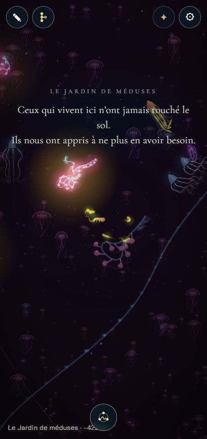
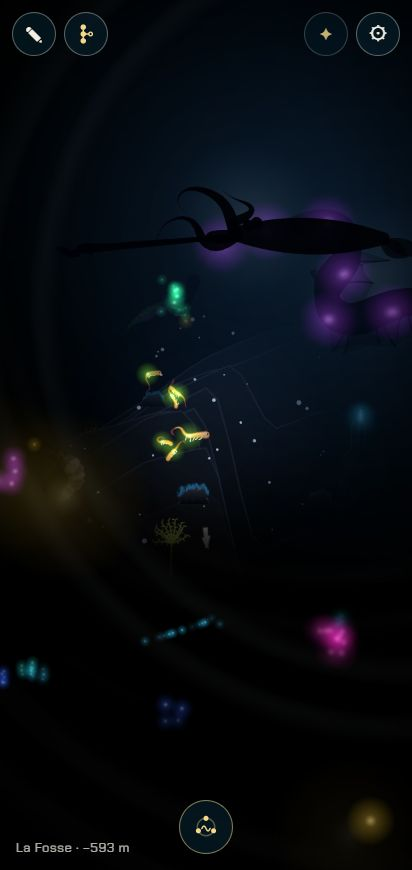
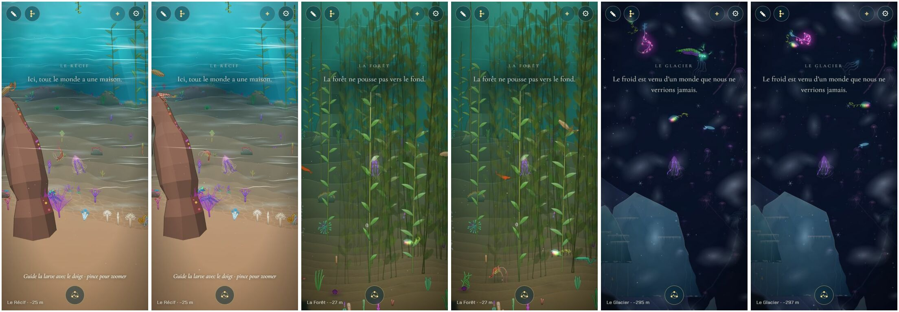

# La performance sur téléphone

## Livré

Le jeu demande nettement moins au processeur d'un téléphone, surtout pour faire vivre les animaux, et envoie ses images au processeur graphique en trois fois moins d'appels. Rien ne change à l'image : chaque modification du rendu a été comparée pixel à pixel, temps figé (voir « Vérifié »). Le banc `?bench` sait maintenant mesurer un vrai téléphone et en rapporter le résultat.

### Mesures

Téléphone imité dans le Chrome Windows (Intel Iris Xe) : fenêtre 412 × 870, densité 2,625 (image de 618 × 1 305 px), processeur bridé **×4** (un téléphone modeste), `?bench=tour` (le tour des dix chapitres à la distance du jeu, qualité entière). « Avant » est la base du chantier (`cb66210`), « après » la branche ; deux pages compilées, servies côte à côte et mesurées l'une après l'autre.

| Chapitre | img/s | ms par image | simulation par pas (ms) | dessin (ms) |
| --- | --- | --- | --- | --- |
| La Nurserie | 23 → **30** | 37 → 29 | 11,8 → 8,0 | 16,7 → 14,8 |
| Le Récif | 12 → **32** | 70 → 28 | 14,5 → 6,6 | 26,7 → 16,2 |
| La Forêt | 11 → **24** | 84 → 40 | 16,5 → 9,8 | 34,6 → 16,8 |
| La Grotte | 13 → **35** | 59 → 26 | 12,5 → 6,8 | 23,2 → 14,7 |
| La Carcasse | 8 → **25** | 111 → 36 | 27,6 → 9,3 | 28,8 → 15,5 |
| Les Sources | 14 → **32** | 54 → 29 | 10,7 → 7,1 | 24,0 → 16,0 |
| Le Glacier | 9 → **26** | 82 → 36 | 16,7 → 8,1 | 32,1 → 17,6 |
| Le Jardin de méduses | 11 → **30** | 64 → 30 | 15,2 → 7,6 | 19,3 → 15,4 |
| La Fosse | 12 → **29** | 77 → 32 | 15,4 → 7,7 | 30,6 → 16,1 |
| La Remontée | 25 → **51** | 37 → 16 | 8,6 → 4,8 | 17,5 → 10,6 |

Sur ce téléphone modeste, chaque chapitre passe de « lent » (8 à 25 img/s) à « correct » ou presque (24 à 35, la Remontée fluide) ; le temps de processeur d'une image est divisé par 1,3 à 3, la simulation par pas par 1,5 à 3, le dessin par 1,1 à 2. Sans bridage, sur le même portable, la branche tient 55 à 57 img/s dans tous les chapitres, à l'arrêt.

### Ce qui a changé

**La simulation** (le poste qui dominait sur un téléphone lent : plus une image est longue, plus elle doit rattraper de pas, jusqu'à trois) :

- **Hors champ, rien ne bouge** (`src/monde/hors-champ.ts`, branché dans `update` de `main.ts`) : un animal qui flâne (`swim`, `floor`, `surface`) ou une plante vivante n'est simulé que s'il est à l'écran ou à moins de 300 px de ses bords, à sa propre profondeur (`View.xRange`). Avant, tout ce qui était à 1 100 px du nageur l'était ; un téléphone tenu droit en voit environ 200 de chaque côté (127 à 205 selon la profondeur de la caméra), et de 1 225 à 3 706 nœuds simulés par chapitre au lieu de 2 114 à 6 731. Hors de vue, l'animal attend et reprend quand il revient dans le champ (la marge de 300 px dépasse celle du dessin, 200 px : rien de ce qui est dessiné n'est figé). Restent toujours simulés : la fratrie, les parents, la rivale, les lumières qui répondent, les ancêtres, le partenaire d'une parade (`parade.leads`) et tout animal pris dans une scène de la vie (`vie.goal`), pour qu'un curieux venu de hors champ arrive bien jusqu'à nous.
- **Le moteur sans `Math.hypot`** : `len2` et `len3` (`src/engine/util.ts`) dans `creature3.ts`, `render3.ts`, `paint-gl.ts`, `flow.ts`, `view.ts`. Dans V8, `Math.hypot` coûte treize fois une racine carrée (mesuré sous Node 22) ; `norm`, appelé deux fois par nœud et par pas, faisait à lui seul jusqu'à un quart du profil à la Carcasse. Pas des animaux, banc Node : 1,0 → 0,53 ms pour 40 animaux.
- **L'eau entre les corps** (`src/engine3/flow.ts`, réécrit) : la grille est plate (tableaux typés, rangés par tri par comptage, sans `Map` ni allocation par pas) ; chaque corps ajouté garde sa boîte ; un corps hors de portée de tous les autres est laissé tel quel et, dans un corps, seuls les nœuds qui peuvent en toucher un autre sont examinés. Les poussées sont exactement celles d'avant : `flow.test.ts` compare, au bit près, avec l'implémentation d'origine sur une foule mêlée (corps emmêlés, isolés, et au-delà du repli de la grille). Banc Node très dense : 2,4 → 1,1 ms par pas.
- **Les plantes poussent dans un budget par image** (`main.ts`) : 3 ms par image pour faire pousser celles qui approchent, et non plus 3 ms par pas (jusqu'à 9 ms quand un téléphone lent fait trois pas). Le crédit est consommé par la seule croissance : un téléphone lent qui arrive aux plantes après 10 ms de simulation en fait encore pousser.

**Le dessin** (`src/engine3/gfx.ts`, `src/monde/obstacles-draw.ts`) :

- **Le dessin additif ne coupe plus le lot** : le mélange reste `ONE, ONE_MINUS_SRC_ALPHA` ; les sommets additifs portent un drapeau (mode + 4) et le fragment sort un alpha nul, ce qui ajoute sa couleur prémultipliée exactement comme `ONE, ONE`. Chaque lueur entre deux corps coûtait un appel de dessin (306 changements de mélange par image au Glacier, 274 au Jardin).
- **Un envoi par image** : les sommets et les indices de toute l'image partent en un seul `bufferData` chacun, puis un `drawElements` par suite de formes qui partagent une texture (les formes sans texture rejoignent la suite où elles tombent). Une suite coûte deux appels WebGL au lieu de six et deux envois. Un canvas redessiné pendant que sa texture attend dans le lot envoie d'abord le lot (`Tex.batch`). `flush()` garde son sens pour les modules qui dessinent eux-mêmes au milieu d'une image (l'eau qui ondule, `ondes-jeu.ts`).
- **Les obstacles en planches** : les morceaux du courant de la passe, du mur d'algues, de l'eau brûlante, de la brume du Glacier et des fils du vide venaient de sprites d'une couleur chacun, qui alternaient à chaque morceau (jusqu'à 220 changements de texture par image dans la Forêt). Ils viennent maintenant d'une planche par sorte (sept taches de lumière, douze brins de kelp), avec une marge transparente entre les cases.
- Appels de dessin par image, téléphone 412 × 870 : **Nurserie 126 → 102, Récif 219 → 111, Forêt 302 → 99, Grotte 207 → 62, Carcasse 90 → 80, Sources 191 → 95, Glacier 353 → 88, Jardin de méduses 251 → 31, Fosse 103 → 44, Remontée 57 → 36**.

**La qualité qui s'adapte** (`src/monde/qualite.ts`) : quand les images sont en retard, le jeu calme l'eau, puis grossit le niveau de détail des animaux, puis baissait la résolution jusqu'à 55 %. Il ne la baisse plus que si c'est le processeur graphique qui fait attendre (le processeur a fini avant les trois quarts de l'image) : sur un téléphone qui peine à simuler, une image floue ne faisait rien gagner.

**Le banc** (`src/monde/bench.ts`, `bench-texte.ts`, `chrono-gpu.ts`) :

- il mesure à la distance du jeu (900), quel que soit le zoom du joueur : l'origine de mon port gardait un zoom à 150 (6 fois plus près) laissé par un agent précédent, et le banc d'avant mesurait au zoom courant, ce qui faussait tout ;
- il lit le temps du processeur graphique quand le navigateur le donne (`EXT_disjoint_timer_query_webgl2`), d'un début d'image au suivant pour compter aussi les passes après la scène ;
- il donne un verdict par chapitre (fluide à partir de 50 img/s, correct à partir de 30, lent en dessous) et la résolution où la qualité s'est posée ;
- `?bench=jeu` fait le tour avec la qualité qui s'adapte, comme en jouant ; c'est aussi ce que lance le bouton « Lancer le test de performance » des réglages pour un joueur (le banc complet, plusieurs minutes, reste à `?bench` et au bouton avec `?dev`) ;
- « Copier le résultat » met le tableau en texte dans le presse-papiers (ou le laisse sélectionné), pour l'envoyer depuis un téléphone ;
- il n'affiche que les parties mesurées.

**La conception** : `docs/performance.md` (nouveau) dit ce qu'on vise, comment mesurer (sur ordinateur et sur un vrai téléphone), ce que coûte une image et les règles que le jeu suit.

### Comment le voir

- Sur un téléphone : réglages, « Lancer le test de performance » (ou la page publiée avec `?bench=jeu`), attendre la fin du tour (deux à quatre minutes), « Copier le résultat ».
- Sur ordinateur : Chrome, outils de développement, appareil 412 × 870, processeur bridé ×4 (ou ×2,5 avec le protocole de débogage), puis `?bench=tour`.
- Les appels de dessin d'une image : `monde.gfx.calls`.

### Vérifié

- **L'image ne change pas** : pour le dessin additif puis pour l'envoi différé, temps figé (`timeScale.v = 0`, sans l'eau qui ondule ni le plancton), les pixels de l'ancien envoi (émulé dans la page) et du nouveau diffèrent autant que deux images successives du même envoi, dans les dix chapitres (écart moyen 0,02 à 1,3 sur 765, le même que le bruit).
- **Les obstacles** : captures avant et après, côte à côte (ci-dessous).
- **L'eau entre les corps** : identique au bit près (`flow.test.ts`), et le test échoue si l'on casse le tri préalable.
- `make check` vert après la fusion de `backlog` (bruitages, Balade libre).

### Fusions avec `backlog`

- **Les bruitages et la Balade libre** : un seul conflit, les imports de `src/monde/main.ts` (`initBruits`, `currentNear` d'un côté, `hors-champ` et `qualite` de l'autre) ; les quatre gardés. Relu sans conflit : les bruitages ne lisent ni les animaux simulés ni la boucle d'image (les cris des visiteurs passent par `ondes.onCall`, et les visiteurs restent simulés) ; la Balade ne touche ni aux obstacles dessinés ni au banc.
- **L'arbre vivant** (portraits animés, et la largeur des filaments tournés dans `src/engine/render.ts`) : aucun conflit. Relu : `arbre-vivant.ts` anime ses portraits avec `Creature3.steer` et `draw3` (canvas), il profite du moteur allégé sans rien demander de plus ; la correction de `minWidth` (qui prend maintenant `Math.hypot(m.a, m.b)`) est gardée telle quelle : elle n'est appelée qu'une fois par trait sur le canvas, loin des boucles chaudes.
- Après chaque fusion : typecheck et `make check` verts (la dernière : 72 fichiers, 645 tests).
- **Le refus de « Accepter »** : le rapport, l'entrée et les captures de `changes/unreleased/performance-telephone/` n'étaient pas commités (la session s'était arrêtée pendant une série de mesures). Ils le sont ; l'entrée ne cite que des images présentes.

## Choix retenus

Aucune question posée sur le tableau de bord (la consigne du chantier : trancher avec l'option recommandée) : tous les choix sont `auto`.

| Question | Choix retenu | Pourquoi |
| --- | --- | --- |
| Comment mesurer un téléphone moyen sans téléphone | Le Chrome Windows (vrai processeur graphique) dans une fenêtre 412 × 870, densité 2,625, processeur bridé ×4 (téléphone modeste : ce qui passe là passe sur un téléphone moyen, plus près de ×2,5) ; deux pages compilées (la base et la branche) servies côte à côte et mesurées l'une après l'autre | Le Chrome de WSL n'a pas de processeur graphique ; la machine est partagée avec les autres agents, il faut comparer dans les mêmes conditions |
| Que faire des animaux hors de l'écran | Figés hors champ (300 px au-delà du bord, à leur profondeur), sauf ceux qui suivent le nageur ou jouent une scène | Le plus gros gain (moitié des nœuds simulés sur un téléphone) sans rien de visible |
| Les grands visiteurs | Simulés comme avant | Ils coûtent peu (30 à 340 nœuds, quelques dizaines de µs par pas) et doivent passer au loin même quand on ne bouge pas |
| `Math.hypot` | Remplacé dans le moteur (`engine3`) seulement | C'est là que sont les boucles chaudes ; ailleurs le gain est nul et la fusion plus risquée |
| L'eau entre les corps | Grille plate et boîtes, résultat identique | Le gain sans changer le comportement des 43 espèces |
| Les lueurs qui coupaient le lot | Alpha nul dans le même mélange | Exact, local à `gfx.ts`, aucun appelant à changer |
| Les appels par texture | Un envoi par image et des suites ; planches pour les obstacles | Les deux causes mesurées, sans atlas général |
| La résolution qui baisse | Seulement quand le processeur graphique fait attendre | Une image floue ne fait rien gagner à un processeur trop lent |
| La croissance des plantes | Un crédit de 3 ms par image | Les à-coups d'un téléphone lent qui fait trois pas |
| Le seuil des verdicts | 50 et 30 img/s | Ce qu'on ressent : 60 est l'écran, 30 la limite du jouable |
| Rapporter une mesure de téléphone | Texte à copier | Sans serveur ni dépendance ; le joueur choisit d'envoyer |
| Où documenter | `docs/performance.md`, nouveau | Aucun document ne parlait de la performance ; additif |

## Options non retenues

**Mesurer un téléphone moyen**
- Un vrai téléphone en débogage à distance (USB, `chrome://inspect`) : la seule mesure qui fait foi, mais je n'en ai pas ; c'est ce qui reste à faire (voir plus bas).
- Le Chrome de WSL : sans processeur graphique (SwiftShader), 2 img/s, pas représentatif.
- Lighthouse ou le profil de performance de Chrome seuls : pas de tour des chapitres ni de comparaison de versions.
- Brider seulement ×4 : un téléphone moyen est plus près de ×2,5 ; ×4 reste utile pour un téléphone modeste.

**Les animaux hors de l'écran**
- Garder 1 100 px autour du nageur : aucun gain.
- Un rayon fixe plus petit (600 px) : simple, mais trop court sur ordinateur ou en paysage, et trop long sur un téléphone en portrait.
- Les simuler un pas sur deux : le moteur avance d'un pas fixe ; ils iraient à mi-vitesse.
- Les déplacer d'un bloc sans simuler leur corps : bon marché, mais un corps raide qui reprend vie à l'entrée du champ, ou qui nage à reculons après un demi-tour.
- Une marge plus petite (150 px) : plus de gain, mais un grand animal à demi hors champ risquerait de se figer.

**Les grands visiteurs**
- Les figer hors champ : un joueur immobile ne les verrait plus jamais passer.
- Les déplacer d'un bloc hors champ : demi-tours à reculons.

**`Math.hypot`**
- Partout dans `src/monde` (`vie.ts` en a 28) : hors des boucles chaudes, le gain ne se mesure pas ; plus de fichiers touchés.
- Le garder : le premier poste de la simulation.

**L'eau entre les corps**
- La sauter hors champ seulement : déjà fait par la règle du hors champ ; ne suffit pas dans la Carcasse, où les habitants se serrent à l'écran.
- L'appliquer un pas sur deux : moitié moins chère, mais les corps se traversent un peu plus.
- Sauter ses propres nœuds par plages dans chaque case : gain faible pour une boucle plus compliquée.

**Les lueurs qui coupaient le lot**
- Dessiner toutes les lueurs dans une passe à part, à la fin : change l'ordre du peintre (une lueur passerait devant un corps plus proche).
- Garder deux mélanges : un appel par lueur.

**Les appels par texture**
- Un atlas général pour tous les sprites (plantes, animaux lointains, décors) : le moins d'appels possible, mais un rangement, une éviction et des bords à gérer dans le moteur de dessin ; à envisager si un vrai téléphone montre qu'il le faut.
- Le dessin instancié : demande de refaire les formes du peintre.

**La résolution**
- La laisser baisser comme avant : image floue sans gain quand c'est la simulation qui coince.
- Lire le temps du processeur graphique en jeu : le navigateur ne le donne pas partout (pas sur la plupart des téléphones).
- Un réglage de qualité pour le joueur : utile un jour, mais l'adaptation automatique suffit ici.

**La croissance des plantes**
- La poser en plusieurs images (40 à 70 pas répartis) : plus fin, mais un état « en croissance » de plus dans `world.ts`.
- Moins de pas pour poser une plante : sa première pose changerait.

**Le seuil des verdicts** : 55 et 40 (plus exigeant, mais trop sévère pour un téléphone modeste) ; le 95 % des images au lieu de la moyenne (plus juste pour les à-coups, moins lisible).

**Rapporter une mesure** : l'envoyer à un serveur (il n'y en a pas, et c'est au joueur de choisir) ; un fichier à télécharger (moins simple à partager depuis un téléphone) ; un QR code (une dépendance).

**Où documenter** : une section des [décisions](../../../docs/decisions.md) (déjà longue, et elle décide plus qu'elle ne mesure) ; seulement ce rapport (introuvable pour le chantier suivant).

## Reste à faire / limites

- **La mesure sur un vrai téléphone n'est pas faite** : je n'en ai pas. Il suffit d'ouvrir la page publiée avec `?bench=jeu` (ou de toucher « Lancer le test de performance » dans les réglages), d'attendre la fin du tour et de toucher « Copier le résultat ». Les chiffres ci-dessus viennent d'un ordinateur portable (Intel Iris Xe) dont on bride le processeur ; le processeur graphique d'un téléphone ne se bride pas ainsi.
- **Pas de mesure à ×2,5** (le téléphone moyen) : la série a été interrompue ; à ×4, plus sévère, la branche est déjà à 24-51 img/s. À refaire avec `?bench=tour` si l'on veut le chiffre.
- **Le temps du processeur graphique mesuré ici n'est pas fiable** : le processeur graphique de la machine est partagé avec les fenêtres des autres agents, ce qui gonfle et fait varier les temps (3 à 25 ms par image selon les moments). Il faut le lire sur le téléphone.
- **Les mesures varient beaucoup** d'une fois à l'autre sur cette machine (autres agents) : les comparaisons ont été faites l'une juste après l'autre, et je donne d'abord le temps de processeur par pas.
- Ce qui pèse encore sur un téléphone lent : le moteur des corps lui-même (`Seg3.update`, environ 15 % du profil), le dessin des corps en triangles (`paint3`, environ 10 %), la Forêt pendant qu'on la traverse (les plantes qui poussent).
- Si le téléphone montre que le dessin coince encore : un atlas pour les sprites des plantes et des animaux lointains, puis le niveau de détail des animaux plus tôt sur un petit écran.
- Le chronomètre du banc et celui de l'eau qui ondule (`lens.timing`, en mode `?dev`) ne doivent pas tourner en même temps (une seule requête de temps à la fois).

## Risques de fusion

- `src/monde/main.ts` : deux imports ; dans `update`, la liste `awake` remplace la fonction `near` (trois boucles : l'eau ajoutée, les animaux dirigés, l'eau appliquée), la condition `inSight` sur les plantes vivantes, la boucle de croissance des plantes (crédit `growLeft`) ; dans `frame`, `growLeft = 3` et la condition `gpuBound` sur la baisse de résolution ; `const awake` près de `flow`. Un chantier qui touche ces boucles : garder les deux.
- `src/engine3/gfx.ts` : le shader de fragment (mode + 4 additif), `setBlend` sans vidage, les suites (`runTex`, `runEnd`, `cut`, `batch`) dans `bind`, `image`, `useTexture`, `texture` et `flush`. Un module qui changerait l'état WebGL lui-même doit appeler `flush()` avant (comme `ondes-gl.ts`), et laisser le mélange à `ONE, ONE_MINUS_SRC_ALPHA`.
- `src/engine3/flow.ts` : réécrit (même interface).
- `src/engine3/creature3.ts`, `render3.ts`, `paint-gl.ts`, `view.ts` : `Math.hypot` → `len2`/`len3`, imports.
- `src/engine/util.ts` : deux exports ajoutés.
- `src/monde/obstacles-draw.ts` : les sprites en planches, `put` prend une case.
- `src/monde/bench.ts` : le tour, l'affichage, le chronomètre ; `src/monde/style.css` : deux lignes à la fin.
- Nouveaux fichiers : `src/monde/hors-champ.ts`, `qualite.ts`, `chrono-gpu.ts`, `bench-texte.ts` et leurs tests, `src/engine3/flow.test.ts`, `docs/performance.md`.
