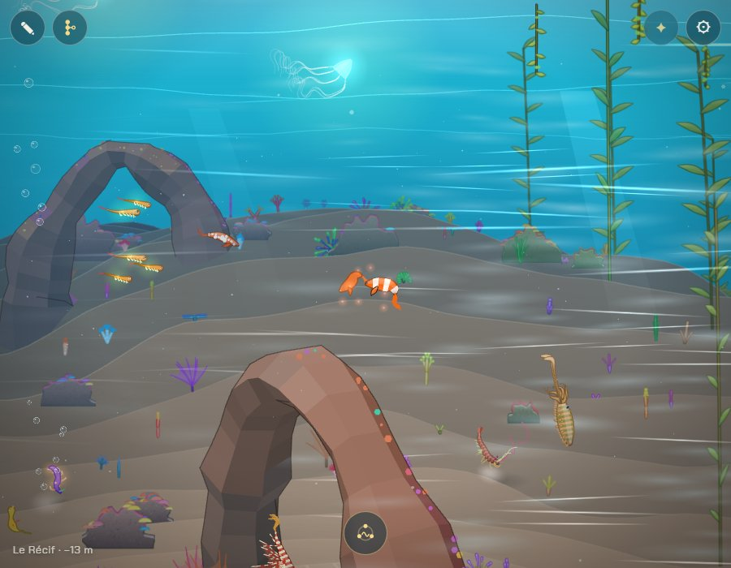
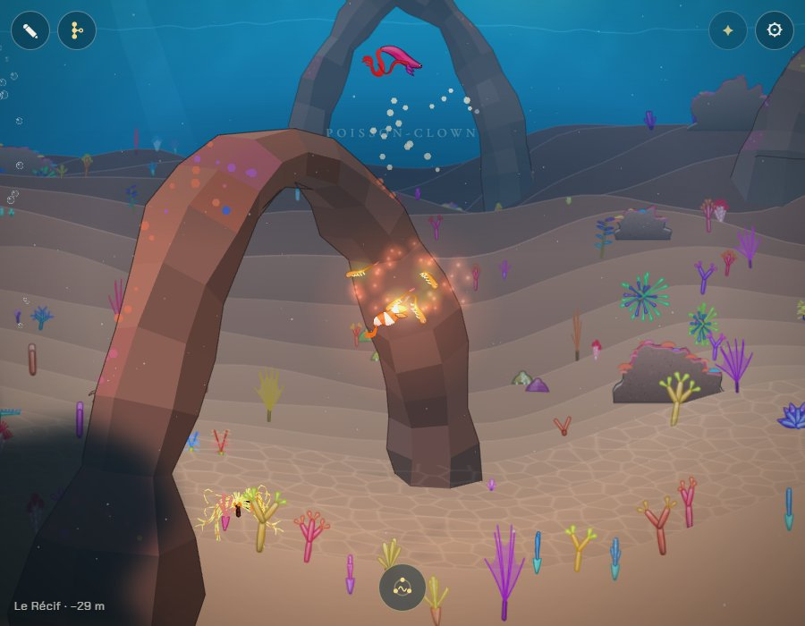
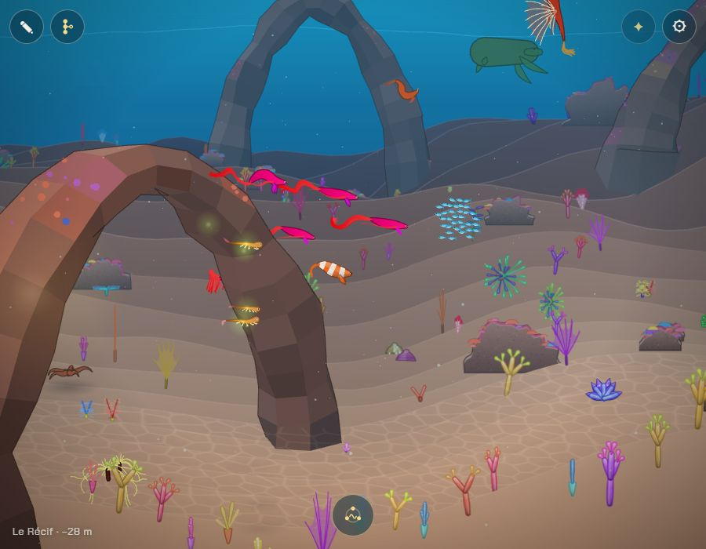
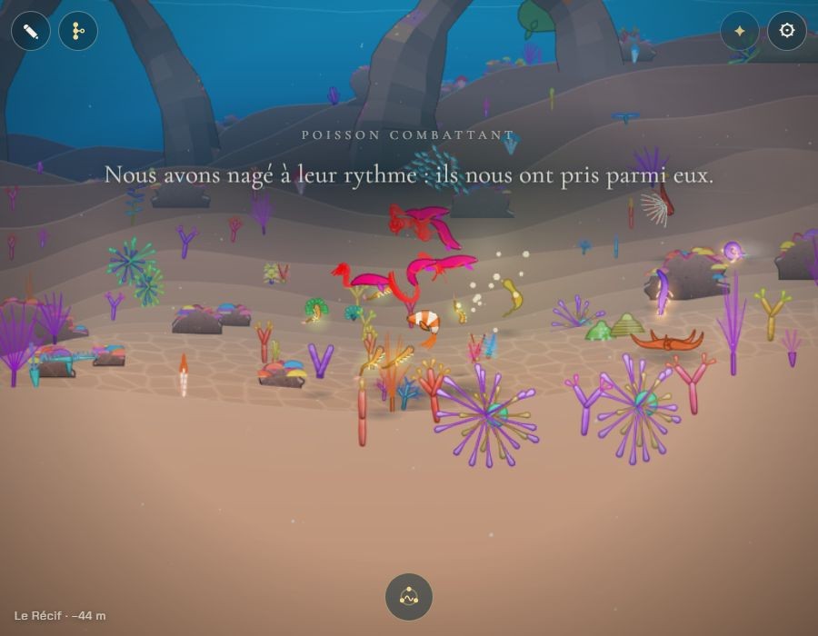
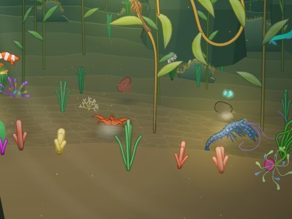
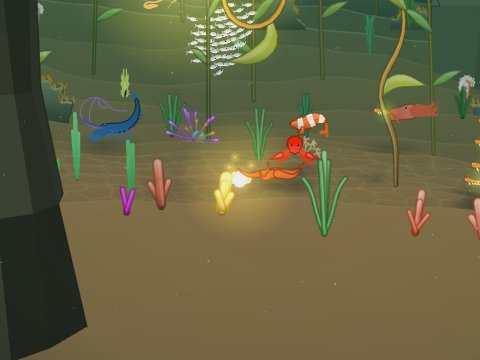

# Les petits jeux des animaux

## Livré

Trois jeux, sans enjeu, que des animaux proposent au nageur, chacun avec un petit cadeau à la fin et jamais d'échec. Ils prolongent la vie des animaux (`vie.ts`) : mêmes animaux (`Being`), mêmes buts (`Goal` : vitesse, cap, plan en profondeur, tempo du corps, couleurs).

- **`src/monde/jeux.ts`** (pur, testé) : les règles. `JEUX` (qui peut jouer à quoi), `chooseJeu` (le jeu qu'offrent les animaux libres près du nageur), `newJeu`, `stepJeu` (les étapes, les tours, le cadeau ; rend les événements à montrer : touche, attrape, accepte, arrive, encre, indice, trouve, cadeau, miette), `goalOf` (ce que fait chaque animal). Les réglages sont des constantes en tête (`ROUNDS`, `CHASE`, `ACCORD`, `PASSING`, `HIDINGS`, `HINT`, `HINTS`, `SHOW`, `LOOKING`, `AWAY`).
  - **chat** : le poisson vient toucher, file (au plus 2,3 px/pas, le nageur va à 2,6), change de cap, attend en se retournant si l'on traîne ; attrapé (seulement s'il a pu filer, et si l'on nage vers lui), il fait une boucle et revient. 3 prises : la lueur. Ignoré deux fois : il s'en va.
  - **banc** : la troupe passe et repasse ; l'accord monte quand on nage à moins de ~170 px de son centre et à sa vitesse (écart < 0,6 px/pas), retombe lentement sinon ; plein (3,5 s), elle nous fait une place derrière le meneur et nous mène au coin caché (`nook`, ~760 px plus loin, près du fond), en nous attendant ; là, 16 bouchées montent, elle picore avec des pauses, on mange en nageant dessus.
  - **cache** : il vient, se trémousse, lâche de l'encre, se cache à 190–310 px, 110–200 px plus loin dans la profondeur, près du fond, couleur sable ; indices (sable, bulles, frémissement) à 9 s puis toutes les 5 s ; trouvé en nageant au-dessus (aussi bas que notre fond le permet) ; à 30 s il se montre si l'on cherche encore (< 500 px), sinon il s'en va. Deux cachettes : la perle, dans sa cachette.
- **`src/monde/jeux-jeu.ts`** : le jeu dans le monde. Propose un jeu (25 s après l'ouverture, puis toutes les 70 à 130 s, une chance sur trois chaque seconde quand des animaux savent jouer), tient ses animaux, applique les buts (plan, tempo par le décalage d'horloge, couleurs en trois temps, plus vives, plus pâles ou couleur du sable, et qui reviennent en trois temps à la fin, rythme de nage des poissons), et montre : étincelles (en lumières de la scène), encre et sable (`Dust` de `vie-draw.ts`), nourriture (`drawFood`), lueur sur le nageur (6 s), perle dans sa coquille (disques, avec sa lumière et un scintillement), sons (`bruits.play('bubbles' | 'tinkles')`), deux lignes de la lignée la première fois que chaque jeu donne son cadeau. `onPlayed(f)` dit avec qui l'on a joué.
- **`src/monde/main.ts`** : des branchements courts (une vingtaine de lignes) : `initJeux` après `initVie`, `held` de la vie qui lâche les animaux d'un jeu, `jeux.step` après `vie.step`, les animaux d'un jeu simulés hors champ, `jeux.goal(a) ?? vie.goal(a)`, `jeux.items` dans la scène, `monde.jeux`.
- **Tests** : `src/monde/jeux.test.ts` (12 tests) : qui peut jouer à quoi ; le chat qui fuit moins vite que nous, nous attend, donne sa lueur au bout de trois prises, s'en va sans cadeau si on l'ignore ; le banc qui nous prend si l'on nage à son rythme, nous mène et nous nourrit, et s'en va si l'on s'agite ; le cache-cache trouvé deux fois (la perle), caché en profondeur, qui se montre de lui-même à qui le cherche mal (la perle quand même), qui s'en va si l'on ne cherche pas ou si l'on part loin.
- **Doc** : `docs/direction-artistique.md`, « Les petits jeux des animaux » (après « La vie des animaux »).
- **Pour le voir** : au Récif ou dans la Forêt, attendre un peu près des poissons ; ou dans la console `monde.jeux.start('chat' | 'banc' | 'cache', undefined, monde.actors)`, puis `monde.jeux.now`. Pour un banc là où il n'y en a pas : `const t = [0,1,2,3].map(k => monde.spawn('combattant', 'swim', -260 - k * 45, 0)); monde.jeux.start('banc', t)`.

Le chat : il file, on le poursuit ; au bout de trois prises, sa lueur.

Le banc nous a pris parmi lui ; son coin caché, la nourriture et les mots de la lignée.

Le poulpe caché, couleur de sable, qui se trahit (sable et bulles) ; puis sa perle.

## Choix retenus

Aucune question posée par le tableau de bord : tout est tranché ici (`auto`), avec l'option recommandée.

| Question | Choix retenu | Pourquoi |
|---|---|---|
| Où mettre le code | Nouveaux modules `jeux.ts` (pur) et `jeux-jeu.ts`, à côté de la vie | Fusions simples (main.ts ne prend que des branchements), règles testables, `vie.ts` intact |
| Comment les jeux commencent | L'animal propose (il vient à nous), un jeu à la fois, 25 s puis toutes les 70–130 s | Rien à apprendre ni bouton : on joue ou on laisse ; pas trop souvent (environ 3 par chapitre) |
| Qui joue | Chat : poisson vif ; banc : 3–6 de même espèce qui ne marchent pas ; cache : céphalopode d'abord, à défaut un marcheur sur pattes | Chaque chapitre a de quoi jouer, et le « poulpe » du chantier reste le premier choix |
| Jamais d'échec | Le poisson attend, l'accord du banc ne retombe que lentement, le caché se trahit puis se montre ; un animal ignoré s'en va sans un mot | La règle du jeu (zéro danger, rien à perdre) |
| Les cadeaux | Chat : une lueur sur nous ; banc : une bouchée dans son coin ; cache : une perle à prendre | Les trois récompenses du chantier, une par jeu, sans chiffre ni inventaire |
| La perle | Juste un éclat doré à prendre (lueur et mots), pas gardée | Le carnet des trésors est un autre chantier (« Les trésors de la lignée ») |
| Les mots | Deux lignes de la lignée, la première fois que chaque jeu donne son cadeau | Le texte est la seule interface, mais il ne doit pas lasser |
| Avec la parade | Pas de jeu quand un partenaire nous remarque ; jamais un partenaire comme compagnon de jeu ; la parade finit un jeu en cours | La reproduction est le cœur du jeu ; parade-jeu.ts reste intact |
| Avec la vie des animaux | Le jeu prend des animaux sans scène, la vie les lâche (`held`) et les reprend ensuite | Pas deux maîtres pour un animal |
| Le coin caché | Un point près du fond, 760 px plus loin dans le sens de la troupe, marqué par sa lueur et sa nourriture | Simple et toujours atteignable (dans les bornes du monde) |

## Options non retenues

- **Où mettre le code** : ajouter les jeux comme nouveaux gestes de `vie.ts` (réutilise toute la mécanique des rôles, mais grossit un module partagé et mêle le nageur aux scènes entre animaux) ; un module unique sans partie pure (moins de fichiers, mais pas de tests des règles).
- **Comment les jeux commencent** : un geste du joueur pour inviter (toucher un animal, chanter près de lui ; plus de contrôle, mais un geste de plus à apprendre sur téléphone) ; seulement à des endroits fixes de chaque chapitre (mise en scène plus forte, mais coûte un placement par chapitre et se répète) ; plus souvent (plus vivant, mais envahissant pendant la descente).
- **Qui joue** : seulement les espèces du chantier (poisson, banc, poulpe ; certains chapitres n'auraient aucun jeu) ; une liste d'espèces par jeu dans le bestiaire (plus fin, mais touche `species.ts`, très partagé).
- **Jamais d'échec** : le jeu attend indéfiniment le nageur (aucun échec, mais un animal collant qui gêne la descente) ; un cadeau même si l'on n'a pas joué (gentil, mais vide de sens).
- **Les cadeaux** : le même cadeau pour tous (plus simple, moins varié) ; un vrai trésor gardé dans la sauvegarde (attend le carnet des trésors) ; un effet sur le nageur (vitesse, lumière durable : une forme d'enjeu, contraire au chantier).
- **La perle** : la garder dans la sauvegarde dès maintenant (format durable à décider avec « Les trésors de la lignée », qui la reprendra).
- **Les mots** : à chaque cadeau (risque de lasser) ; jamais (le joueur peut ne pas comprendre qu'il a joué) ; gardés dans la sauvegarde pour ne les dire qu'une fois par partie (un champ de plus dans la sauvegarde).
- **Avec la parade** : bloquer la parade pendant un jeu (le jeu n'est jamais coupé, mais un partenaire ne peut plus nous remarquer pendant une minute ; touche `parade-jeu.ts` par son `quiet`) ; ne rien coordonner (une parade peut naître au milieu d'un cache-cache, plus souvent).
- **Avec la vie** : prendre aussi des animaux déjà en scène (plus de candidats, mais des scènes coupées net).
- **Le coin caché** : derrière un rocher ou sous une arche du chapitre (plus beau, mais rochers et reliefs sont rarement dans le plan de nage, et la carte va changer avec les 10 chapitres) ; un coin décoré exprès (une petite grotte de lumière : beau, mais un décor de plus à dessiner).

## Reste à faire / limites

- **Les trésors de la lignée** : la perle pourrait devenir un trésor du carnet (le chantier des trésors la reprendra : `give` dans `jeux-jeu.ts`).
- **Les amis qui suivent** (voisin) : `monde.jeux.onPlayed((cr, gift) => …)` dit avec quel animal on a joué ; à brancher quand ce chantier arrivera.
- Le coin caché n'est pas un décor à lui : un point près du fond, que marquent la lueur et la nourriture.
- Les mots de la lignée ne sont dits qu'une fois par session et par jeu (pas gardés dans la sauvegarde).
- Le chat suppose un nageur à 2,6 px/pas (la nage d'aujourd'hui) : avec « La nage : accélération et élan », revoir sa vitesse de fuite (`flee`, dans `jeux.ts`) pour que la poursuite reste un jeu.
- Coût non mesuré précisément (ni sur un vrai téléphone) : un à six animaux guidés de plus (ils l'étaient déjà par la vie) et au plus 200 étincelles, dessinées comme les autres lumières de la scène ; aucun à-coup vu dans le Chrome Windows pendant les captures.

## Risques de fusion

- `src/monde/main.ts` : branchements courts (import, `initJeux` après `initVie` et `held` de `initVie`, une ligne dans `update` après `vie.step`, une condition dans le calcul des animaux éveillés, `jeux.goal(a) ?? vie.goal(a)`, une ligne `jeux.items` après `vie.items`, `jeux` dans `monde`). Conflit possible avec un chantier qui touche les mêmes lignes de la vie (à garder des deux côtés).
- `docs/direction-artistique.md` : une section ajoutée après « La vie des animaux ».
- Aucun changement de `vie.ts`, `vie-jeu.ts`, `parade-jeu.ts`, `creature3.ts`, du bestiaire ni de la sauvegarde.
