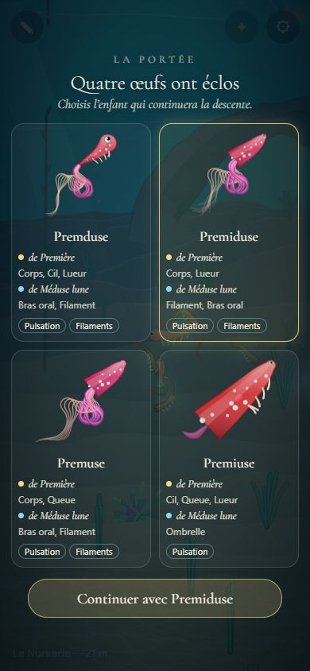
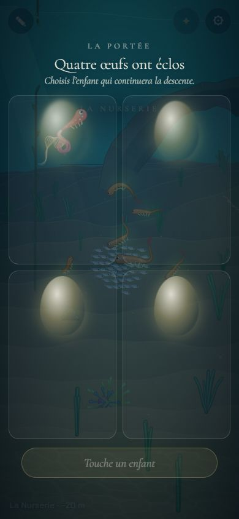
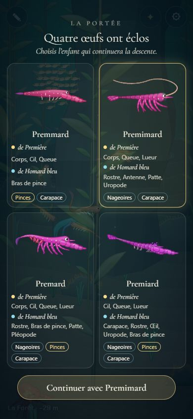
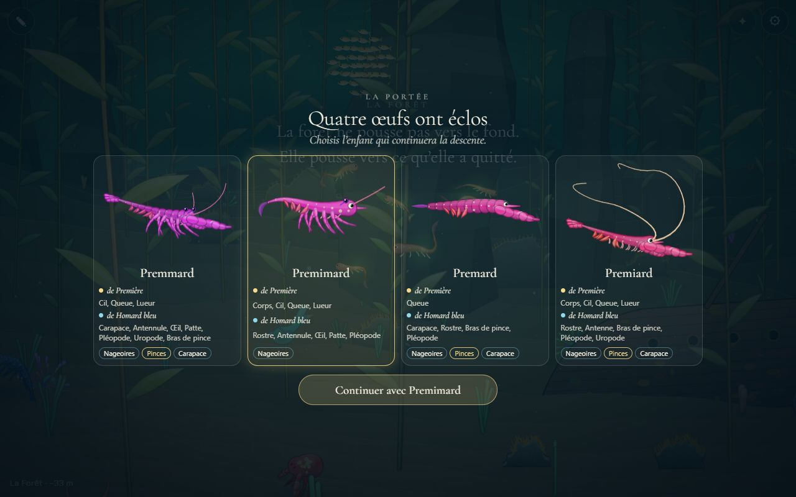
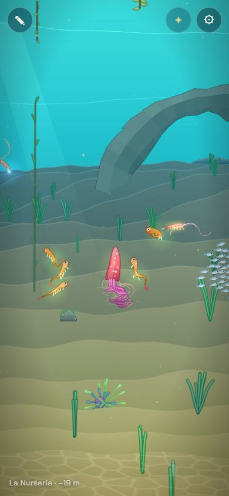

# La portée : 4 enfants, en choisir un

## Livré

- **La fusion en portée** (`src/content/portee.ts`, testé) : `brood(parent, partenaire, { quality, seed, wanted })` rend 4 enfants faits par `fuse` en mode « mélange », avec une part du partenaire de 30, 37, 43 et 50 % (mélangées par la graine, 40 % en moyenne). Sur 200 portées d'essai, ~60 % des membres viennent du parent. Chaque enfant dit d'où vient chacun de ses membres (`fromParent`, `fromPartner`), à qui ressemble son corps (`body`), et reçoit au moins un membre du côté qui ne lui a pas donné son corps. Le nom du corps suit le côté dont il vient. Même graine, même portée. Pas plus de 170 chaînes (téléphone).
- **La qualité de la parade** : les membres « voulus » du partenaire vont à `carriers(q)` enfants : 1 (q = 0), 2 (q = 0,5), 3 (q = 1). Jamais aucun (on ne se bloque pas), jamais les 4 (il reste un choix). Les membres voulus sont ceux qui apportent les **traits de l'obstacle du chapitre** (`KEYS` de `obstacles.ts`, sans le chant) ; sans obstacle, les traits du partenaire que le parent n'a pas. Ce qu'apporte un membre : `limbTraits` (les traits du tronc avec ce membre, moins ceux du tronc nu, par `traitsOf` de `src/content/traits.ts`).
- **Les noms** : `childNames` donne 4 noms différents (début du nom du parent, fin de celui du partenaire : Premduse, Premiduse, Premuse, Premiuse).
- **L'écran** (`src/monde/portee-ecran.ts`, `portee.css`) : quatre œufs lumineux qui tremblent et fondent l'un après l'autre, le portrait (`snapshot3`) qui flotte doucement, le nom, puis « de Première : Corps, Cil, Lueur / de Méduse lune : Filament, Bras oral » (pastille dorée pour le parent, bleue pour le partenaire), puis ses **traits** (« Nageoires », « Pinces »…), en or ceux qui franchissent l'obstacle du chapitre, ou « Pas encore de trait ». 2 × 2 sur téléphone, 4 de front en paysage. On touche un enfant (il s'entoure d'or), puis « Continuer avec … ».
- **Le choix** (`main.ts`) : l'enfant devient la créature jouée et `partie.born` range le parent dans la lignée. Le premier ancêtre, qui n'est pas sauvé tant qu'on ne l'a pas changé, est d'abord sauvé, pour qu'il ne se perde pas. Le récit d'un chapitre attend que l'écran soit fermé, et un texte déjà affiché s'efface derrière lui.
- **Pour le voir** : `?dev`, panneau ⚙, « Une portée avec un partenaire d'ici » (un partenaire du chapitre, `PARTNERS`, sinon un animal du chapitre ; qualité 0,7) ; ou dans la console `monde.openPortee('meduse', 0.8)`, `monde.portee.children`, `monde.portee.choose(i)`.
- Doc : `docs/mecaniques.md` (« La portée », et la sauvegarde).

## Choix retenus

Aucune question posée à l'utilisateur : tout est tranché ici (`auto`).

| Question | Choix retenu | Pourquoi |
| --- | --- | --- |
| Mode de fusion | `mix`, part du partenaire 0,3 à 0,5 | Le vrai mélange des deux corps ; la part varie pour que les 4 enfants diffèrent, 40 % en moyenne. |
| Effet de la parade | nombre d'enfants qui portent les membres voulus : 1 + round(q × 2) | Lisible, testable, ne bloque jamais, garde un choix. |
| Traits voulus | ceux de l'obstacle du chapitre, sinon ceux du partenaire que le parent n'a pas ; remplaçable par `wanted` | La parade sert à franchir l'obstacle : c'est ce que la lignée vient chercher. |
| Ce que l'écran montre | les parties héritées par côté, puis les traits de l'enfant, ceux de l'obstacle en or | La partie qu'on voit, et ce qu'elle permet ; pas de chiffres. |
| Quel `traitsOf` | celui de `src/content/traits.ts` (traits-corps), pas le remplaçant de `obstacles-traits.ts` | C'est la fonction du jeu ; le remplaçant attendait qu'elle arrive. |
| Déclenchement | API `monde.openPortee` + bouton ?dev ; la parade l'appellera | La parade se fait en parallèle ; l'écran reste indépendant. |
| Monde derrière | continue de vivre, voilé | Plus doux qu'une pause ; le doigt ne pilote plus la nage sous l'écran. |
| Confirmation | toucher, puis « Continuer avec … » | Un toucher égaré ne décide pas d'une génération. |
| Noms | début du parent + fin du partenaire, 4 différents | `blendName` de `fuse` donnait parfois « Pre », « Pree » ; le nommage libre viendra avec l'arbre de la lignée. |

## Options non retenues

- **Mode de fusion** : `bodyA` (corps toujours du parent : moins de surprises, moins de variété) ; un mode différent par enfant (plus varié, mais des enfants trop éloignés du parent) ; une part fixe de 0,4 (4 enfants trop proches).
- **Effet de la parade** : faire varier la part du partenaire avec q (brouille le 60/40) ; q = 1 donne les membres voulus aux 4 (plus de choix) ; retirer les membres voulus après une parade ratée (risque de blocage).
- **Traits voulus** : tous les membres nouveaux du partenaire (trop : un homard donnait 8 membres) ; les membres d'un rôle absent chez le parent (première version, avant l'arrivée des traits) ; tous les traits du partenaire, même hors obstacle (dilue l'effet de la parade).
- **Ce que l'écran montre** : les traits seuls (on ne voit plus d'où ils viennent) ; les traits gagnés ou perdus par rapport au parent (plus précis, plus chargé sur téléphone) ; une jauge 60/40 (des chiffres, contraire à l'interface) ; les portraits animés (4 créatures simulées, plus lourd).
- **Déclenchement** : œufs posés dans le monde, qu'on touche un à un (plus beau, plus long à faire) ; ouverture automatique à la fin de la parade (chantier `parade`).
- **Monde derrière** : pause complète comme l'Atelier (plus simple, moins vivant).
- **Confirmation** : un seul toucher (plus rapide, risque d'erreur) ; un double toucher (peu découvrable).
- **Noms** : garder `blendName` (noms parfois laids) ; pas de nom (moins attachant).

## Reste à faire / limites

- **Brancher la parade** : à sa fin, `openPortee(partenaire, qualité)` (ou `portee.open(player.cr.spec, partner, { quality })`).
- **Traits du tronc** : la parade ne favorise que les membres. La pulsation (clé du Récif et du Jardin) et le corps fin viennent du tronc et de la nage, tirés au hasard par `fuse` selon la part du partenaire : une bonne parade ne les rend pas plus probables. Pour eux, il faudrait que la qualité pèse aussi sur le choix du corps.
- `obstacles-jeu.ts` (les obstacles) lit encore le `traitsOf` remplaçant de `obstacles-traits.ts`, et l'écran le vrai (`content/traits.ts`) : les seuils diffèrent un peu. Un enfant peut donc montrer « Pinces » en or sans que le mur le laisse passer, ou l'inverse. À unifier (chantier de l'intégrateur ou des obstacles).
- Sur téléphone, avec un partenaire aux nombreux membres (homard), l'écran dépasse la hauteur et défile.
- **L'adieu** (`adieu-parent`) : après `onChoose`, le texte d'adieu et le parent qui reste dans le monde ; aujourd'hui le parent disparaît simplement.
- Les enfants d'un `mix` peuvent avoir le corps de l'un et la nage de l'autre (hérité de `fuse`) : parfois étrange, à surveiller avec les vraies paires de chaque chapitre.
- Les portraits sont fixes (`snapshot3`) ; ils flottent seulement en CSS.

## Fusion avec `backlog` (traits, obstacles, partenaires)

- Conflits dans `src/monde/main.ts` seulement : l'import (`partenaires` de backlog et `portee-ecran` gardés tous deux) et la ligne de l'`api` (`keys` de backlog et `portee, openPortee` combinés). `docs/mecaniques.md` s'est fusionné sans conflit.
- Relu après fusion : `bud` (les ébauches de la larve) se conserve dans les enfants, comme le veut traits-corps (ils ne gagnent un trait que par le partenaire) ; la portée utilise maintenant `traitsOf`, `KEYS` et `PARTNERS` (voir « Livré »).

## Risques de fusion

- `src/monde/main.ts` : `PARTNERS` ajouté à l'import de `partenaires`, un import de `KEYS` ; `becomes(sp, born = false)` (une ligne change pour appeler `partie.born`), le bloc `createPortee` / `openPortee` juste après, `portee` et `openPortee` dans l'`api`, `|| portee.isOpen` dans `narrator.quiet`, le bouton de test avant `benchOut`. `adieu-parent` et `parade` touchent sans doute les mêmes endroits (naissance, API).
- `index.html` : une ligne (`#porteeBtn`) dans le panneau, sous le voyage.
- `docs/mecaniques.md` : la section « La portée » et une ligne de « Durée et sauvegarde ».
- Nouveaux fichiers : `src/content/portee.ts` (+ test), `src/monde/portee-ecran.ts` (+ test), `src/monde/portee.css`. Rien dans `generate.ts`, `species.ts`, `parts.ts` ni le moteur.
