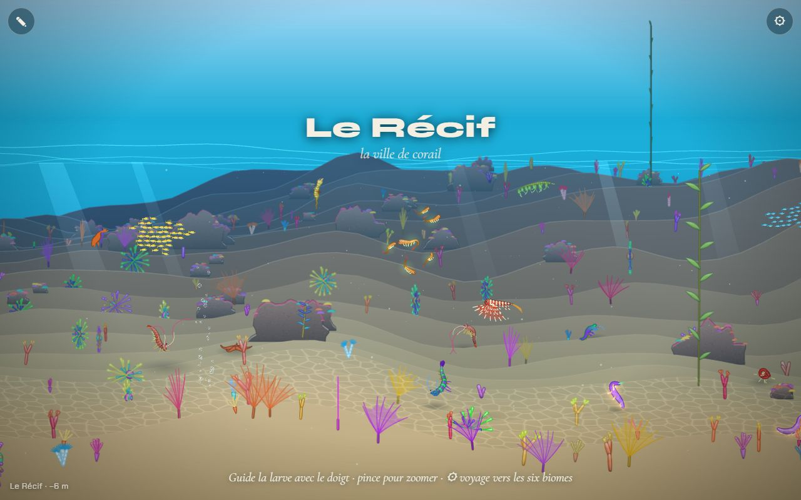
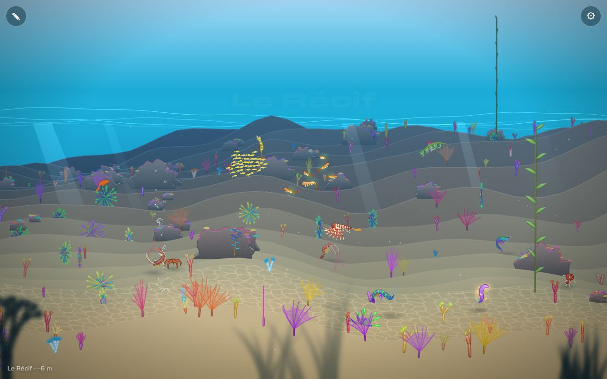
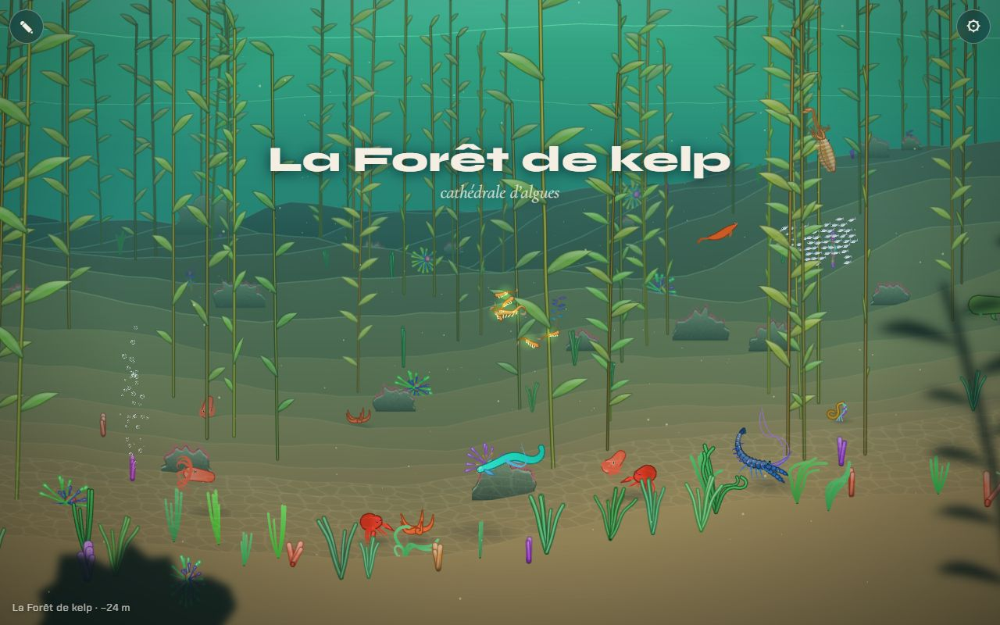
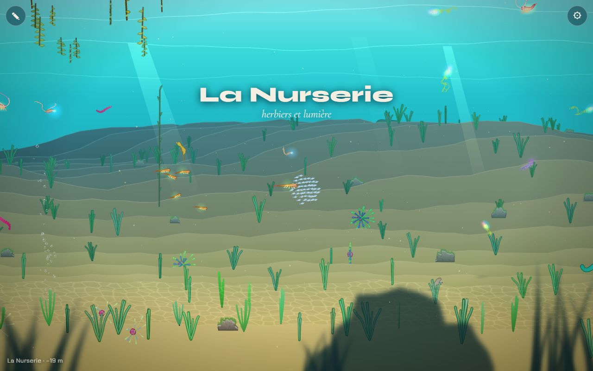
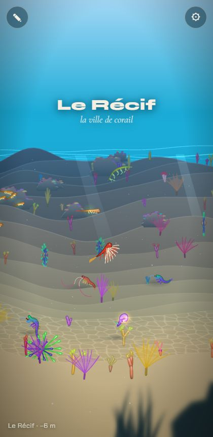

# Premier plan sombre et flou

## Livré

Un plan de silhouettes entre l'œil et le plan de nage, dans tout le monde.

- **`src/monde/foreground.ts`** (nouveau) : les pièces du premier plan (`makeFront`, déterministe, triées du loin au proche), à z entre −620 et −380 (l'œil est vers −900) : la perspective les fait défiler environ deux fois plus vite que le plan de nage. Leurs formes viennent de `flora.kinds` du biome (kelp → kelp, posidonie / anémone → herbes, corail / corail mou → coraux, gorgone → éventail, éponge / tubes / riftia → tubes, crinoïde / plume de mer → tiges ; le reste et un fond de roches → roche), en groupes et en clairières, moins denses là où `dark` est fort.
- **Sombre et flou** : chaque silhouette est cuite une fois (0,55 px par unité, `filter: blur`) dans la couleur de l'eau très assombrie (`frontColour`), puis agrandie 4 à 5 fois, ce qui la floute encore. Elle ondule depuis son pied (cisaillement). Les images sont oubliées loin de la caméra.
- **Lisibilité** : le pied est sur le sol quand il est à l'écran, sinon juste sous le bord bas (`footY`) ; la pièce s'efface (jusqu'à 8 %) quand sa boîte approche le nageur (`clearance`). Force réduite dans le noir (`1 − dark/2`), et le noir des profondeurs passe par-dessus.
- **`src/monde/main.ts`** : branchement court (`drawFrontLayer`, appelé après la scène triée, avant le noir et les lueurs), `front` et `frontCount` dans `window.monde`, couche `skip.add('front')` pour comparer.
- **Tests** : `src/monde/foreground.test.ts` (9 tests : bornes, ordre, formes par biome, densité, parallaxe réelle avec `View`, pied, dégagement, couleur, dessin et effacement).
- **Doc** : `docs/direction-artistique.md`, sous-section « Le premier plan ».

Pour le voir : n'importe quel chapitre, nager le long du fond ; `monde.skip.add('front')` pour l'enlever.

Avant / après (Récif) :

Coût : 1 à 5 images par trame ; 60 img/s en WebGL sur le Chrome Windows (les mesures variaient avec les autres agents sur le même GPU). Le repli canvas (`?gl=0`) dessine les mêmes silhouettes.

## Choix retenus

Aucune question posée sur le tableau de bord (choix tranchés seul, option recommandée).

| Question | Choix retenu | Pourquoi |
| --- | --- | --- |
| Où placer le plan | Vraie profondeur (z < 0) projetée par la `View` | la vitesse de défilement et la taille découlent de la perspective, cohérentes avec le zoom et l'angle |
| Comment flouter | Cuisson petite + `ctx.filter` blur, puis agrandissement | un flou quasi gratuit, identique en WebGL et en canvas, sans shader |
| Couleur | Couleur de l'eau du biome, très assombrie, cuite dans l'image | silhouette sombre qui reste dans l'ambiance du chapitre, pas de teinte à la volée |
| Formes | Tirées de `flora.kinds` de chaque biome, plus des roches | suit les chapitres sans champ nouveau dans `biomes.ts` (le chantier des 10 chapitres le refait) |
| Garder le plan de nage clair | Pied au bas de l'écran + effacement par pièce près du nageur | simple, lisible ; aucune pièce ne coupe le nageur |
| Où dans l'ordre de dessin | Après la scène, avant le noir et les lueurs | le noir des profondeurs les avale, les lueurs restent visibles |

## Options non retenues

- **Où placer le plan**
  - Couche en espace écran avec un facteur de défilement fixe : plus simple, mais incohérente avec le zoom et l'angle de caméra.
  - Pièces posées au vrai sol seulement : physiquement juste, mais invisibles dès qu'on nage à mi-eau (le sol proche sort de l'écran).
- **Comment flouter**
  - Flou en shader WebGL (passe séparée) : plus beau et réglable, mais une passe plein écran de plus et rien en canvas.
  - `ctx.filter` à chaque trame : trop cher en canvas.
  - Sans flou, juste sombre : ne répond pas au chantier.
- **Couleur**
  - Noir pur : tranche trop dans les chapitres clairs.
  - Teinte blanche recolorée à la volée (`tintR` de Gfx) : suivrait la profondeur de la caméra, mais pas de teinte équivalente en canvas.
- **Formes**
  - Un champ `front`/`foreground` par biome dans `biomes.ts` : plus de contrôle, mais conflit certain avec le chantier des 10 chapitres ; à ajouter après la fusion.
  - Réutiliser les vraies plantes (`growPlant2`) floutées : plus riches, mais une simulation et une cuisson bien plus chères.
- **Garder le plan de nage clair**
  - Masque par pixel autour du nageur (trou dégradé) : plus fin, mais demande un shader ou une composition en canvas.
  - Silhouettes seulement dans le tiers bas, sans effacement : le kelp haut disparaîtrait.
- **Ordre de dessin**
  - Après le noir : les silhouettes resteraient visibles en noir total, ce qui gâcherait la Fosse.
  - Dans la liste triée (comme les autres objets) : même résultat, un tri plus long.

## Reste à faire / limites

- Les formes sont génériques ; les chapitres nouveaux (Grotte, Carcasse, Glacier, Jardin, Fosse) auront peut-être leurs silhouettes propres (stalactites, côtes de baleine, glace) : un champ facultatif par biome serait le bon endroit, après la fusion des 10 chapitres.
- L'effacement se fait par pièce, pas par pixel : une grande pièce près du nageur pâlit en entier.
- Pas de silhouettes qui pendent du haut (sargasses, surplombs), à voir avec les reliefs composés.
- Sur téléphone (écran étroit), il y en a moins à l'écran ; la densité pourrait suivre la largeur.

## Risques de fusion

- `src/monde/main.ts` : un import, une constante `front`, une ligne dans `render()` (après `lodCount`), une fonction `drawFrontLayer` avant « chapters and the depth gauge », `front, frontCount` ajoutés à la ligne de l'`api`. Conflit possible sur la ligne de l'`api` si d'autres y ajoutent aussi.
- `docs/direction-artistique.md` : sous-section ajoutée avant « Une palette par chapitre » ; la ligne « le premier plan sombre et flou » de « Il manque » est laissée à l'intégrateur.
- Lit `BIOMES[i].flora.kinds`, `dark`, `x0`, `presence` et `biomeIndex` : si le chantier des 10 chapitres renomme ces champs, adapter `makeFront`. Les ids de biome ne servent qu'aux tests (`kelp`, `recif`, `nurserie`, `abysses`).
