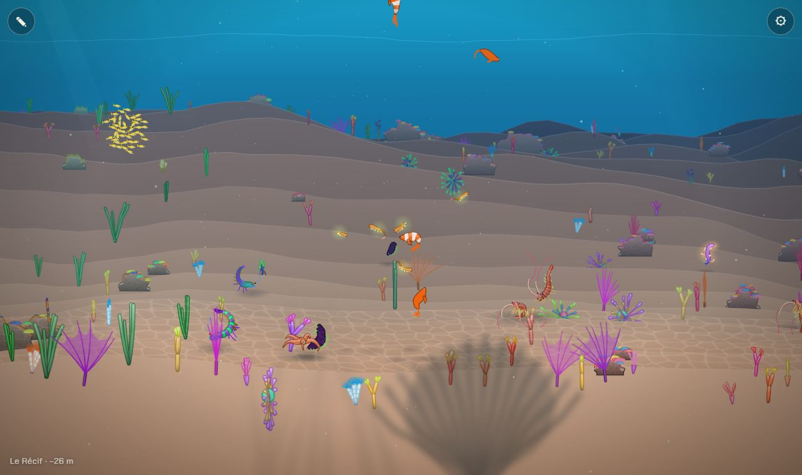
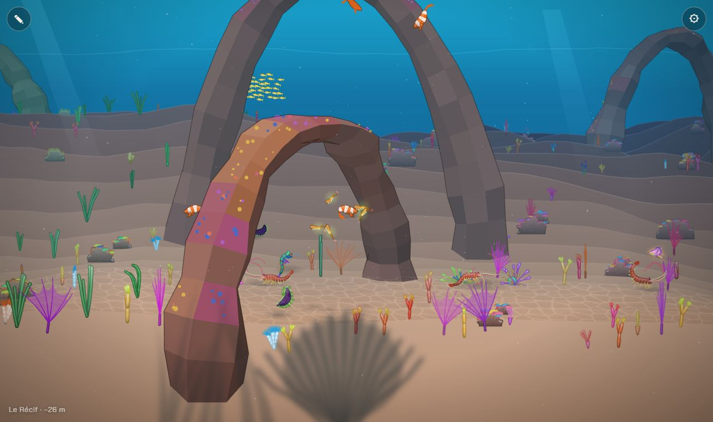
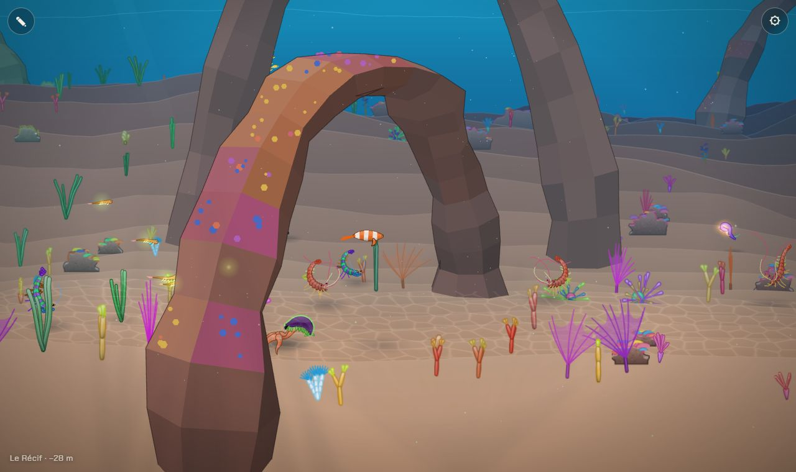
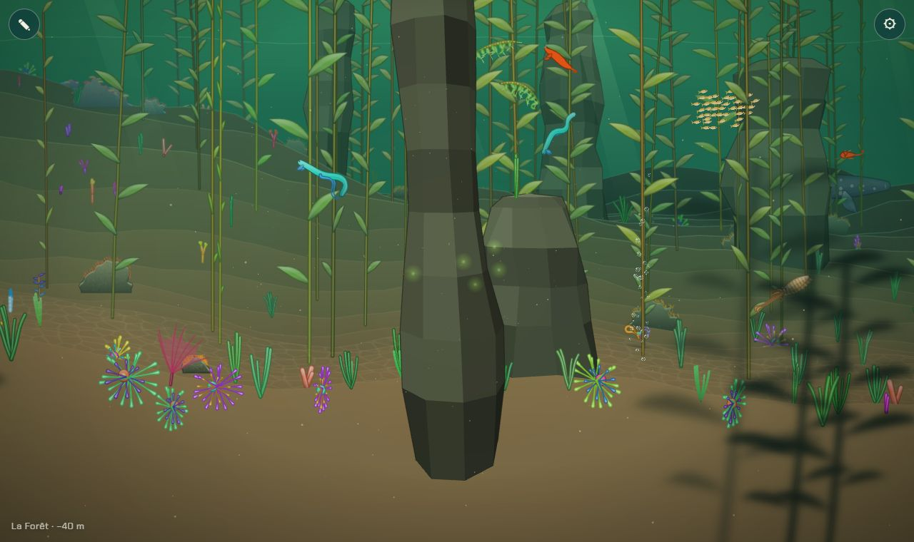
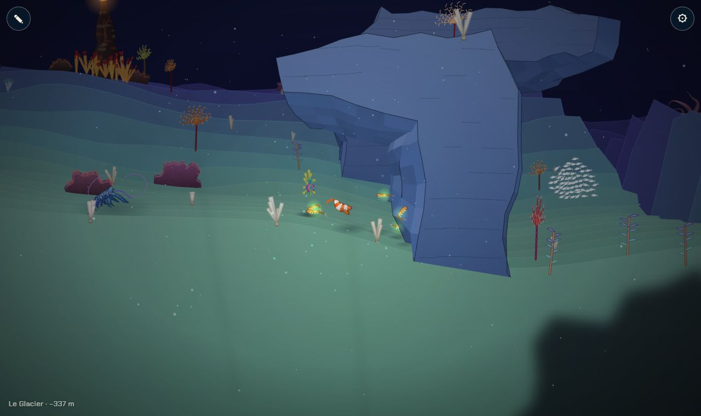
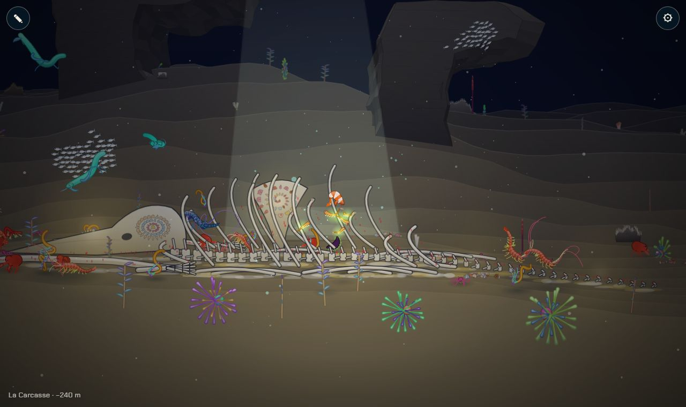

# Reliefs composés : arches, grottes, failles, surplombs, piliers

## Livré

Quatre types de relief, placés chapitre par chapitre, qui passent devant, en travers et derrière le plan de nage, et sur lesquels le nageur bute.

- **`src/monde/relief.ts`** (géométrie pure, sans DOM, testée dans `relief.test.ts`) :
  - les **piliers** (`pillar`) : une colonne de roche empilée, un peu penchée, arrondie en haut, sa base posée sur le fond ;
  - les **arches** (`arch`) : un anneau balayé le long d'une courbe d'un pied à l'autre. Au loin, elles sont de face ; dans le plan de nage, elles sont posées en travers (un pied devant à z ≈ −170, un pied derrière à z ≈ +200, la voûte au-dessus du nageur) : on passe derrière le pied avant, sous la voûte, devant le pied arrière ;
  - les **surplombs** (`overhang`) : un contour (paroi, dessus, corniche épaisse avec un creux dessous) poussé le long de z, un peu différent à chaque pas, avec un biseau qui accroche la lumière et des strates sur la face avant ;
  - les **failles** : des tranchées creusées dans le fond lui-même (`carve`, ajouté à `floorAt`), de l'avant jusqu'au loin, qui se referment au fond de la scène. On peut y plonger ;
  - les **collisions** : la coupe d'un relief par le plan z d'une créature (segments, en cache par 8 unités de z), dont on la repousse en gardant sa vitesse le long de la paroi (`pushOut`, `bump`, 1,75 µs par appel) ;
  - la **vie dessus** : `groundAt` fait pousser sur le sommet d'un relief une plante dont le pied tombe dedans, `solidAt` écarte les rochers qui tomberaient dedans ;
  - la **disposition** (`initReliefs`, table `PLANS` par id de chapitre) : d'abord les failles, puis, dans le plan de nage, un relief à intervalles réguliers là où le fond est doux (une corniche peut surplomber une pente plus raide : celle du Glacier domine la descente vers le Jardin), puis ceux de devant et de derrière ; aucun ne prend la place d'un décor (une zone en x et en z par décor : large pour les cheminées, les os de la baleine et l'épave, plus petite pour la glace et les suintements, le givre ne compte pas) ni ne tombe dans une faille. Le plan de nage n'est jamais fermé : il reste toujours au moins 90 unités de passage, dessus ou dessous (testé).
- **`src/monde/relief-draw.ts`** (dessin, WebGL et Canvas 2D) : chaque relief est projeté sommet par sommet ; les faces tournées vers l'œil sont peintes de loin en près, éclairées d'en haut (facettes, strates sur les piliers, plus sombres près du fond), avec un contour d'encre sur la silhouette et le brouillard de l'eau. Le relief est coupé en tranches le long de z (le plan de nage est toujours une limite) : chaque tranche est un élément de la liste triée de la scène. Là où le chapitre est couvert de vie (`encrust`), des plaques de polypes couvrent le haut des reliefs. Ce qui vient trop près de l'œil s'efface.
- **Par chapitre** (nouvelle carte des 10 chapitres) :

  | Chapitre | Reliefs | Dans le plan de nage |
  | --- | --- | --- |
  | La Nurserie | quelques arches au loin | rien (le chapitre reste ouvert) |
  | Le Récif | arches couvertes de polypes, devant et derrière | arches à traverser (x ≈ 4000, 5130, 6530) |
  | La Forêt | piliers, comme une cathédrale, devant et derrière | piliers (x ≈ 7870, 9230) |
  | La Grotte | rien : elle a sa voûte et ses piliers (`grotte.ts`) | — |
  | La Carcasse | surplombs au loin, autour de la baleine | rien : la baleine (`carcasse.ts`) occupe le plan de nage |
  | Les Sources | colonnes de basalte au loin, entre les cheminées | rien |
  | Le Glacier | des corniches de glace, entre les falaises de `glacier.ts` | une corniche (x ≈ 20870) |
  | Le Jardin de méduses | rien : pas de fond | — |
  | La Fosse | failles, visibles seulement dans la lumière du nageur (le noir total du chapitre) | failles (x ≈ 26000, 27000, 27680) |

- **Comment le voir** : ⚙ → Voyage → Récif, Forêt, Glacier ; ou `monde.teleport(4060, 520)` (les arches du Récif, une voûte en travers du chemin), `monde.teleport(8348, 660)` (un pilier qui cache), `monde.teleport(21040, 1790)` (sous la corniche du Glacier), `monde.teleport(27003, 3500)` (dans une faille de la Fosse), `monde.teleport(14700, 1350)` (la baleine de la Carcasse dans son creux de surplombs). La couche `relief` de `monde.skip` les retire pour comparer.
- **Mesures** (Chrome Windows, 1280 × 760, carte finale) : 60 img/s en WebGL avec ou sans reliefs ; le dessin d'une image passe de 4,0 à 4,2–4,5 ms au Récif, de 3,5 à 4,0–4,4 ms au Glacier. En Canvas 2D (`?gl=0`, mesuré avant les dernières fusions), 44 ms par image contre 39 sans reliefs au Récif.
- **Branchements** : `floorAt` ajoute `carve(x, z)` (`biomes.ts`) ; `main.ts` appelle `initReliefs` après les décors, `bump(cr)` dans `collide`, `pushReliefs` dans le tri de la scène ; `world.ts` fait pousser les plantes sur les reliefs (`groundAt`) et n'y pose pas de rochers (`solidAt`).
- **Doc** : section « Les reliefs composés » dans `docs/direction-artistique.md`.
- **Test voisin** : `foreground.test.ts` (premier plan sombre) cherchait les biomes `kelp` et `abysses`, disparus de `backlog` avec la carte des 10 chapitres ; je l'avais corrigé (la Forêt et la Fosse), puis la même correction est arrivée sur `backlog` avec la Carcasse : il n'en reste aucune différence. `make check` est vert.

## Choix retenus

Aucune question structurante posée à l'utilisateur : tout est tranché seul (option recommandée). Un retour d'information a été posté sur le tableau de bord (harmonisation avec la Grotte et le Glacier).

| Question | Choix retenu | Pourquoi |
| --- | --- | --- |
| Comment représenter un relief | Un maillage de quadrilatères en vraie 3D, projeté à chaque image | Seule façon d'avoir une arche qui passe devant et derrière le nageur avec la bonne parallaxe ; quelques centaines de sommets par relief ; même code en WebGL et en canvas |
| L'arche « qu'on traverse » | Posée en travers du plan de nage : pied avant, voûte au-dessus, pied arrière | Une arche de face dans le plan de nage est fermée (on ne peut pas bouger en z) ; en travers, on la traverse vraiment et on voit la voûte en perspective |
| Les collisions | La coupe du maillage par le plan z de la créature, en segments, repoussée hors de la coupe | Exacte pour toutes les formes (même concaves), rien à décrire à la main, 1,75 µs par appel ; les animaux derrière le plan butent aussi à leur profondeur |
| Les failles | Creusées dans le fond (`floorAt` + `carve`) | Le fond, ses collisions, les plantes et les animaux qui marchent les suivent sans rien de plus ; la tranchée se voit en perspective avec les rangées du sol |
| Le tri avec la scène | Des tranches de 150 en z, le plan de nage toujours en limite ; une tranche qui touche le plan de nage se trie contre ce qui nage près de l'œil | Un seul élément par relief se trie mal (une arche est devant et derrière le nageur) ; une face par élément coûterait trop en canvas |
| Le pied des reliefs | Posé sur le fond (4 unités dedans), sommet par sommet | Un pied enfoui se voyait par-dessus les rangées du sol proches (défaut de tri) |
| Où placer les reliefs | Table `PLANS` par id de chapitre ; dans le plan de nage à intervalles réguliers là où ils tiennent, devant et derrière au hasard | Chaque chapitre a sûrement les siens (le hasard seul en privait parfois un chapitre) ; la table se règle sans toucher `biomes.ts` |
| Quel relief pour quel chapitre | Récif : arches ; Forêt : piliers ; Carcasse : surplombs au loin ; Sources : colonnes au loin ; Glacier : corniches de glace ; Fosse : failles ; Nurserie : arches lointaines ; rien dans la Grotte et le Jardin | Suit la trame (cathédrale d'algues, ville de corail, fosse) ; la Grotte a déjà sa voûte, le Jardin n'a pas de fond, le Glacier ses falaises et sa langue froide (`glacier.ts`) |
| La place des décors | Une zone réservée en x et en z par décor, d'un rayon selon son type ; le givre ne compte pas ; les failles n'évitent que les grands décors | Un filtre sur x seul excluait des chapitres entiers (le Glacier, couvert de givre et de falaises au fond) ; une touffe de givre sous une roche ne se voit pas |
| La vie sur les reliefs | Une teinte légère de la couleur du chapitre et des polypes, sur ce qui fait face au ciel | Des faces entières colorées faisaient un damier ; les polypes se lisent comme une croûte de corail |
| Le rendu | Facettes éclairées d'en haut, strates, contour d'encre sur la silhouette | Se lit comme de la roche taillée, reste cohérent avec l'encre des animaux ; pas de dégradé par sommet en canvas |
| Un relief trop près de l'œil | Il s'efface selon sa profondeur | Un pilier du premier rang remplirait l'écran quand on zoome |
| La dépendance entre `biomes.ts` et les reliefs | `relief.ts` n'importe rien du monde ; `main.ts` lui passe les chapitres, `floorAt` et les décors (`initReliefs`) | Pas d'import circulaire entre `biomes.ts` (qui creuse les failles) et `relief.ts` (qui pose les pieds sur le fond) |
| Le test du premier plan cassé sur `backlog` | Corrigé a minima (ids de la nouvelle carte) | `make check` doit être vert ; deux mots dans un test, sans toucher au code du voisin |

## Options non retenues

- **Représentation** :
  - des images cuites (comme les rochers), une par relief : plus de détail peint, mais une seule profondeur par image (pas de pied devant et de pied derrière), à recuire quand on s'approche, lourdes en mémoire pour de grandes formes ;
  - des « dalles » plates à une profondeur chacune, sans épaisseur : plus simple, mais sans flancs ni dessus éclairés, l'arche en travers impossible ;
  - étendre le fond en carte de hauteurs à plusieurs couches : pas de surplomb ni d'arche (une hauteur par point), et tout le dessin du sol à refaire ;
  - un vrai rendu 3D avec tampon de profondeur en WebGL : exact partout, mais sans équivalent en canvas et à côté du peintre de la scène.
- **Arche qu'on traverse** : une arche de face dans le plan de nage, franchie par-dessus seulement (ce n'est plus une arche qu'on traverse) ; une arche seulement décorative, sans collision (se traverse, mais on passe à travers la roche) ; une arche de face devant le plan de nage, qu'on longe par derrière (gardée pour les arches du premier rang, mais elle ne se traverse pas).
- **Collisions** : des cercles ou capsules approchés à la main pour chaque type (moins exacts pour les surplombs et les arches) ; des collisions seulement pour le nageur (les animaux traverseraient la roche) ; une grille d'occupation par chapitre (mémoire, et imprécise).
- **Failles** : des maillages en creux posés sur le fond (le fond resterait plein : pas de plongée possible) ; des failles seulement dessinées (on nagerait dans le vide sans pouvoir descendre) ; un échantillonnage du sol calé sur la grille du monde (des bords plus nets, mais toucher `computeProfiles` de `main.ts`).
- **Tri** : un élément par relief (faux pour l'arche en travers) ; un élément par face (exact, mais des centaines de tracés en canvas) ; une clé par tranche sans règle pour le plan de nage (le nageur passait derrière le pied arrière).
- **Pied** : enfoui dans le fond (se voyait par-dessus les rangées proches) ; coupé exactement par la ligne du sol (plus juste, mais le sol est dessiné en lignes droites entre ses points : même résultat pour bien plus de calcul).
- **Placement** : tirage au hasard du rang (dans le plan, devant, derrière) pour chaque relief (un chapitre pouvait n'en avoir aucun dans le plan de nage) ; positions écrites à la main (à refaire à chaque changement de carte) ; un champ `relief` dans chaque chapitre de `biomes.ts` (conflit avec la carte des 10 chapitres, refaite en même temps).
- **Chapitres** : des voûtes et galeries dans la Grotte (déjà faites par le chantier de la Grotte, en double) ; des surplombs au Tombant et des failles au Crépuscule (ces chapitres n'existent plus dans la nouvelle carte) ; des failles aux Sources (les cheminées occupent tout le chapitre) ; une crevasse au Glacier (essayée : très belle, mais les falaises de glace du fond s'y enfonceraient) ; des surplombs autour de la baleine dans le plan de nage (ils la cacheraient).
- **Place des décors** : un filtre sur x seul (excluait le Glacier entier) ; ignorer les décors (des roches à travers les cheminées et les os) ; une boîte exacte par décor (il faudrait la taille de chaque image, décidée dans le module de chaque décor).
- **Vie** : des faces entières de la couleur du corail (un damier) ; des plantes simulées sur chaque relief (chères) ; rien (le Récif perdait son corail sur les arches).
- **Rendu** : un dégradé par sommet en WebGL (plus lisse, mais différent du canvas) ; des textures cuites plaquées (détail, mais coût et mémoire) ; pas de contour (les reliefs se fondaient dans le fond).
- **Près de l'œil** : les couper net (apparition brusque) ; ne jamais placer de relief devant le plan de nage (plus de « pilier qui cache »).
- **Dépendance** : un import circulaire entre `biomes.ts` et `relief.ts` avec construction paresseuse (fragile) ; un crochet `setCarve` dans `biomes.ts` (plus de lignes dans un fichier refait par un voisin).
- **Test voisin** : le laisser cassé (make check rouge) ; le réécrire plus largement (conflit probable avec la correction de l'intégrateur).

## Reste à faire / limites

- Les **bancs de poissons** traversent les reliefs : `Shoal.update` (`main.ts`) ne les voit pas. Un `pushOut` par poisson coûterait peu, mais touche une fonction déjà modifiée par la Grotte.
- Les **lueurs** d'un animal caché derrière un pilier restent visibles : elles sont peintes après la scène (limite du moteur, déjà vraie pour les rochers).
- Seule la **racine** d'une créature bute (comme pour le fond et les rochers) : une queue peut passer dans la roche.
- **Canvas 2D** : environ 5 ms de plus par image au Récif, et de fines coutures claires entre les facettes (l'anticrénelage du canvas entre deux tracés voisins) ; le WebGL (par défaut) n'a ni l'un ni l'autre. Un trait de la couleur des faces les couvrirait, pour un tracé de plus par couleur.
- `drawRow` (`main.ts`) prend la couleur du sol à la verticale de la caméra : au-dessus d'une faille, elle vient du fond de la faille (un peu plus sombre au loin). Rien de visible aux essais ; à reprendre avec un fond non creusé si besoin.
- La **Grotte** a sa propre voûte (`ceilAt`, `grotte.ts`) : elle pourrait devenir un relief, et ses piliers aussi. Au **Glacier**, une seule corniche trouve sa place entre les falaises et les suintements. À la **Carcasse**, les surplombs évitent les os de la baleine (`CARCASSE.pieces` dans les décors) et restent donc au loin.
- Les **failles** de la Fosse ne se voient que dans la lumière du nageur : une faille bien visible manque depuis que le Crépuscule a quitté la carte (une crevasse au Glacier, si ses falaises s'en écartent, ou une faille en bord des Sources).
- Les **grottes** comme type de relief (une galerie qu'on traverse) ne sont pas faites ici : la Grotte les a à sa façon. Les **failles** ne font pas encore d'obstacle (étape 3).
- Pas de **son** pour les reliefs (écho sous une voûte, par exemple).

## Risques de fusion

- `src/monde/main.ts` : deux imports, `initReliefs(...)` juste après `makeDecor()` (avec un rayon par type de décor : `seep`, `frost`, `ice`, les autres), `bump(cr)` à la fin de la boucle des rochers de `collide` (la Grotte ajoute aussi deux lignes dans `collide` : garder les deux), `pushReliefs(...)` après la boucle des décors dans `render`.
- `src/monde/biomes.ts` : un import, `+ carve(x, z)` dans le `return` de `floorAt` (à garder si un voisin réécrit `floorAt`).
- `src/monde/world.ts` : un import, `groundAt` dans `growPlant2`, deux conditions `solidAt` dans `makeRocks`.
- `docs/direction-artistique.md` : une section « Les reliefs composés » avant « Une palette par chapitre », une ligne retirée de « Il manque ».
- Nouveaux fichiers : `src/monde/relief.ts`, `relief-draw.ts`, `relief.test.ts`.
- La table `PLANS` suit les ids de la nouvelle carte (`nurserie`, `recif`, `foret`, `carcasse`, `sources`, `glacier`, `fosse`) : un chapitre renommé perd ses reliefs sans erreur.
