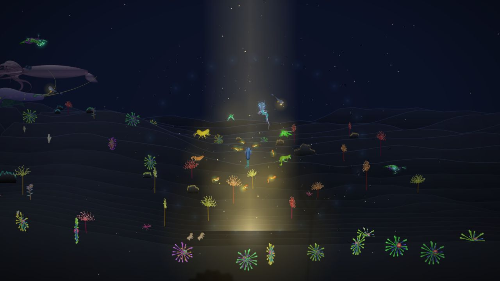
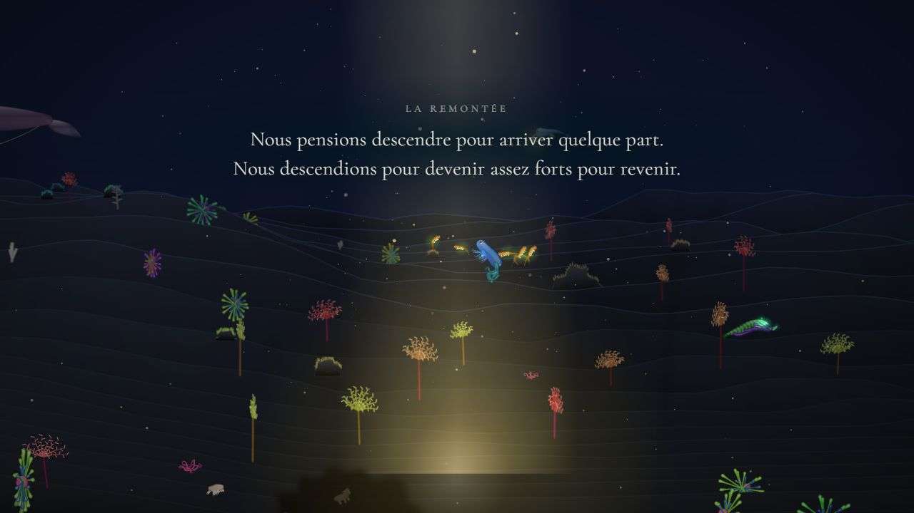
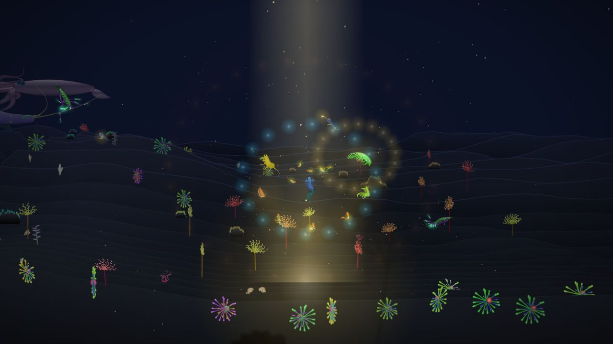
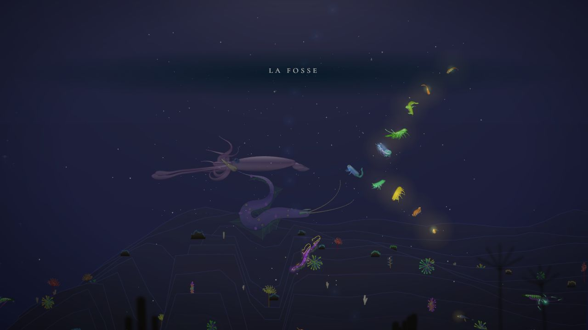
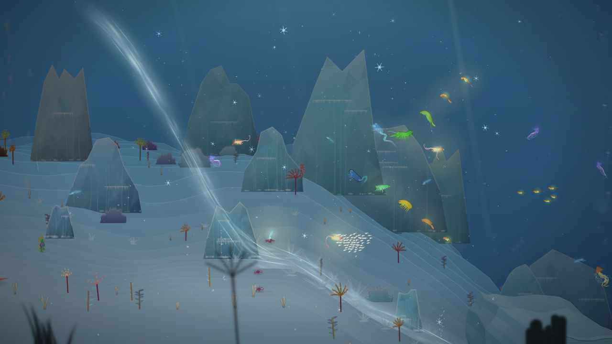
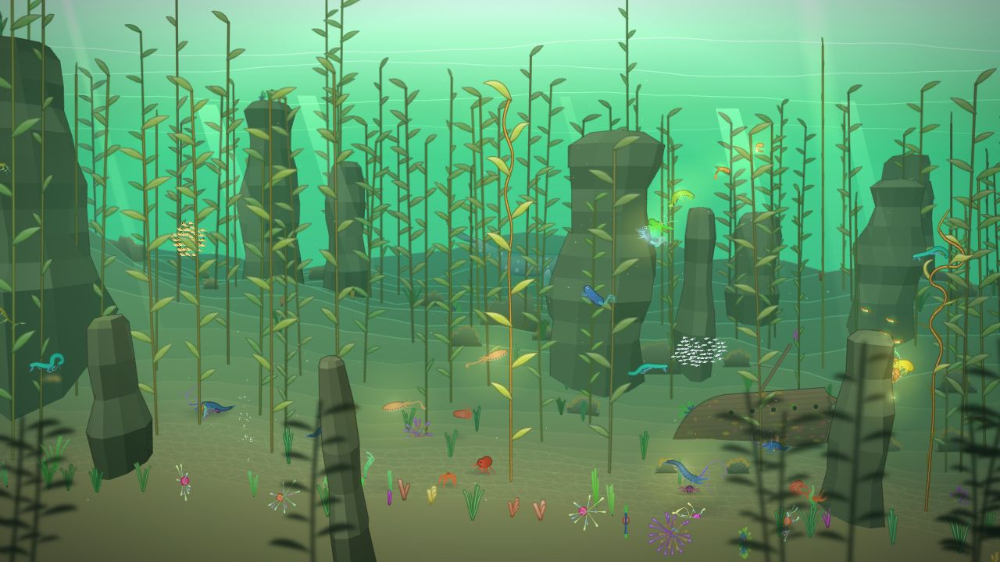
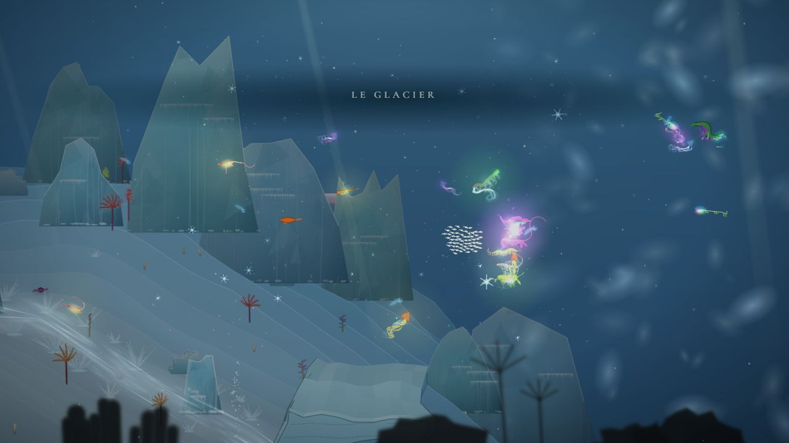
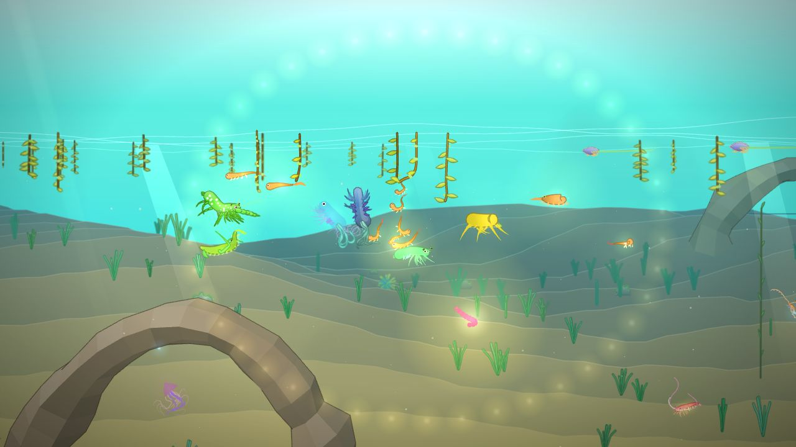
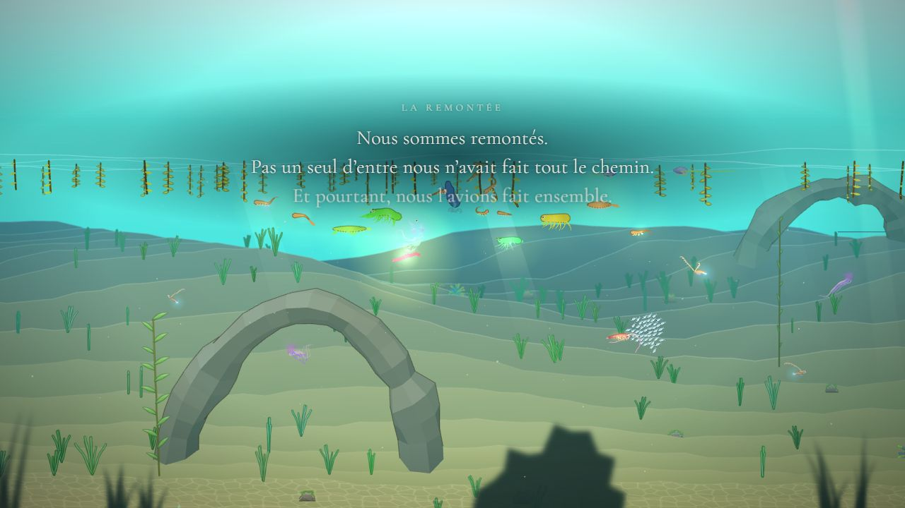
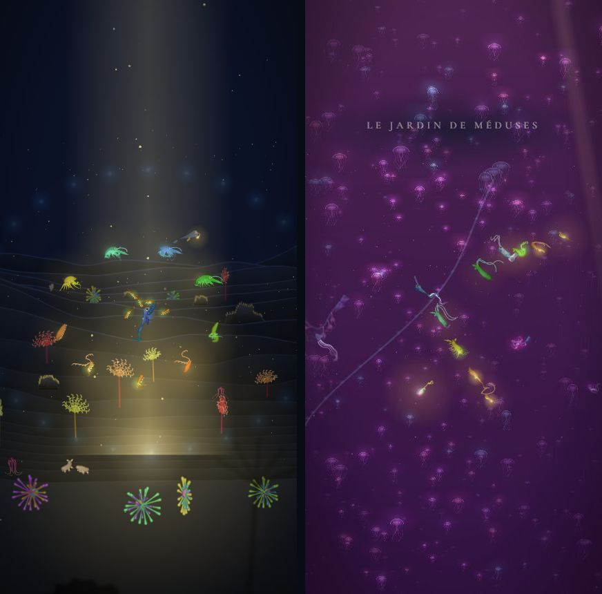

# La Remontée

## Livré

La fin de l'histoire, d'un seul tenant : le puits de lumière au fond, le retournement, le chant complet qui appelle tous les ancêtres, la remontée en formation à travers chaque chapitre qui s'illumine, la lumière qui perce la surface et la larve qui naît. Environ deux minutes, sans rien à faire (comme l'adieu) : ~21 s dans le puits, un peu plus d'une minute de remontée, ~21 s à la surface.

- **Le monde s'ouvre sur la Remontée** (`src/monde/limites.ts`) : l'obstacle de la Fosse garde toujours son fond (`FOSSE_BOTTOM`, x = 27 600, l'ancienne fin du monde), mais une fois franchi (lanterne, ou le chant par les lumières qui répondent), le monde continue jusqu'à `WORLD_END` = 29 800, un peu après le puits.
- **Le puits de lumière** (`remontee-draw.ts`) : au milieu du chapitre (x = 29 200), une colonne dorée tombe de tout en haut jusqu'au sable, avec une flaque de lumière au fond et des grains de lumière qui montent ; le noir s'ouvre sur 1 500 px autour (`wellLight`).
- **La scène** (`remontee-jeu.ts`, règles pures dans `remontee.ts`) :
  1. Entrer dans sa lumière la commence. Le nageur est mené au milieu du puits, se tourne vers le haut et nage sur place ; « Le retournement » est dit (le texte de `chapitres.md`, qui n'est plus dit à l'entrée du chapitre : `holds`).
  2. Il chante le chant complet : neuf notes, une toutes les 1,25 s, chacune un anneau de points de lumière de la couleur de sa note (`noteOf`, `chant.ts`) et sa voix (`chant.voice`, branché par `onNote` dans `main.ts`). À chaque note viennent, dans un éclat doré, les ancêtres qui l'ont apprise, c'est-à-dire ceux qui ont donné naissance dans ce chapitre (`callTimes`), en couronne autour de lui (`crown`). Les parents restés dans le monde (acteurs `parent`) quittent leur place : ce sont eux qui viennent.
  3. Un courant les emporte (`carrySpeed`) : il prend de la vitesse en 5 s, porte vite (6,4 px par pas) et ralentit sur les 1 900 derniers px. Le chemin (`ascentPath`) monte droit dans le puits, puis repasse tous les chapitres à l'envers à mi-hauteur, sans jamais redescendre sauf sous la voûte de la Grotte, à l'écart des reliefs, jusque sous la surface où la première larve est née (x = 420). La couronne s'ouvre en V derrière le nageur (`slot`), le plus ancien au bout, un bras un peu derrière le plan de nage, l'autre un peu devant ; chacun garde un halo doré. Chacun nage à sa façon et le courant le porte (`translate`) : les 43 espèces et leurs fusions suivent sans toucher au moteur.
  4. Chaque chapitre s'illumine quand la lignée y entre (`reached`, `litAt`, `litMood`) : eau plus claire et plus dans sa couleur, noir levé (celui de la Fosse et des galeries de la Grotte aussi : `open` passé à `pushCave`), lueur dorée d'en haut, rais dorés, grand anneau de la couleur de sa note et son nom.
  5. Les lumières qui ont répondu dans la Fosse (voisin `lumieres-qui-repondent`) viennent avec nous : le courant les porte aussi et les ramène vers la lignée si elles traînent (`carry(c, true)`).
  6. À la surface : un éclat blanc et doré (`#remonteeFlash`), les ancêtres s'étalent sous la surface, un œuf de lumière bat de plus en plus vite, la caméra s'en approche, il éclot et une larve en sort (elle brille un moment, puis nous suit) ; le texte final est dit.
  7. On reprend la main avec la créature finale, parmi ses ancêtres qui restent sous la surface de la Nurserie. La Balade libre est débloquée (`unlockBalade`, le bouton ✎ revient) et `onEnd` est appelé (pour le générique).
- **La caméra** : proche au retournement, plus large pendant le chant, puis cadrée pour que toute la formation tienne sur le côté le plus étroit de l'écran (téléphone tenu droit compris), et près de l'œuf à la naissance.
- **La sauvegarde** : pendant la scène, la partie reste au chapitre de la Remontée (un rechargement reprend au puits, la scène recommence) ; à la fin, elle reprend à la Nurserie avec la créature finale et toute la lignée. Le chant n'apprend pas de note pendant la remontée.
- **Pour le voir** : `?dev`, puis dans la console `monde.remontee.start()` (au puits, la scène commence) ; `monde.remontee.jump(x)` pendant la remontée pour être porté plus loin ; `monde.remontee.phase`. Pour une vraie lignée : quelques `monde.farewell()` dans des chapitres différents avant.
- **Tests** : `remontee.test.ts` (le puits, les notes et l'appel des ancêtres, la couronne et le V, le chemin : du puits à la surface, à travers les 10 chapitres, toujours dans l'eau, hors des reliefs, sans marche ; la durée du courant ; la lumière des chapitres), `limites.test.ts`, `obstacles-jeu.test.ts`, `traces.test.ts` adaptés.
- **Mesures** (Chrome Windows, GPU de bureau, 1280 × 720) : 55 à 60 images/s, un creux à 47 dans le Récif quand le courant porte vite (les plantes poussent en chemin). Pas mesuré sur un vrai téléphone.

## Choix retenus

Aucune question n'a été posée sur le tableau de bord : tous les choix sont tranchés par l'agent (option recommandée).

| Question | Choix retenu | Pourquoi |
| --- | --- | --- |
| Comment arrive-t-on à la Remontée ? | L'obstacle de la Fosse garde son fond ; derrière, le monde continue jusqu'au puits, et entrer dans sa lumière commence la scène | Suit ce que la doc prévoyait (« le franchir ouvrira la Remontée ») ; aucun bouton en plus ; le puits se voit en arrivant |
| Par où remonter ? | Par tous les chapitres à l'envers, le long de x, en montant | « Chaque biome traversé en sens inverse » à la lettre ; on revoit tout le monde qu'on a descendu |
| Qui dirige pendant la remontée ? | La scène (comme l'adieu) ; on peut zoomer | Un chemin sûr (voûte de la Grotte, reliefs) et une formation lisible ; c'est un finale |
| Le chant complet | Joué par la créature, seul, les neuf notes, couleurs et voix du chant | « Ta créature finale joue le chant complet » ; il sonne avec la voix déjà faite |
| Quand viennent les ancêtres ? | Chacun avec la note du chapitre où il a donné naissance | C'est la note qu'il a apprise : le chant les appelle un à un |
| Les parents restés dans le monde | Ils quittent leur place à la première note et reviennent dans la formation | Pas de doublon ; « le chant appelle les ancêtres » |
| La formation | Une couronne dans le puits, puis un V derrière le nageur, le plus ancien au bout | Le V se lit tout de suite comme une migration ; la couronne montre qu'ils sont tous là |
| Comment la lignée avance | Chacun nage à sa façon, un courant commun les porte | Marche pour toutes les nages (cloches, jets, marcheurs) sans toucher au moteur, vitesse maîtrisée |
| Un chapitre « s'illumine » | Eau plus claire dans sa couleur, noir levé, lueur et rais dorés, anneau et nom | Chaque chapitre reste reconnaissable, en plus lumineux |
| La durée | ~2 min, dont un peu plus d'une minute de remontée | Assez pour voir chaque chapitre (~7 s chacun), pas trop pour une scène sans main |
| Percer la surface | Un éclat blanc et doré sur tout l'écran | Le monde ne se dessine pas au-dessus de l'eau ; l'éclat dit la même chose |
| La larve | Un œuf de lumière qui bat puis éclot parmi la lignée ; la larve nous suit ensuite | « Tu vois la larve naître » : la caméra s'approche |
| Après la fin | On garde la créature finale, parmi ses ancêtres, et la Balade libre est débloquée | Rien n'est perdu ; la Balade libre (étape 6) partira de là |
| La sauvegarde pendant la scène | La partie reste à la Remontée jusqu'à la fin | Une page rechargée rejoue la fin au lieu de nous laisser au milieu |
| Les lumières qui ont répondu | Portées par le courant et ramenées vers la lignée | Une idée du voisin ; une ligne, et la Fosse nous accompagne |

## Options non retenues

- **Arriver à la Remontée**
  - Un bouton « Remonter » ou le chant joué du doigt au fond : plus d'interface, alors que le texte est la seule interface.
  - Déclencher la fin juste après la dernière naissance : on ne verrait pas le puits.
  - Garder la fin du monde au fond de la Fosse et commencer la scène là : pas de puits à voir, la Remontée n'aurait pas de lieu.
- **Par où remonter**
  - Monter à la verticale dans le puits, les chapitres passant comme des couches de couleur : bon marché mais abstrait, on ne revoit aucun décor.
  - Un fondu vers un écran de fin (images des chapitres) : moins de travail, mais on quitte le monde au moment fort.
- **Qui dirige**
  - Le doigt libre dans le courant (le courant porte, le doigt décale) : plus d'agence, mais les collisions et le cadrage deviennent incertains ; faisable ensuite en ajoutant un décalage borné à `lead`.
  - Le joueur nage lui-même toute la remontée : 30 000 px à nager, plusieurs minutes.
- **Le chant complet**
  - Le tracer au doigt dans le cercle du chant : plus interactif, mais bloque si des notes manquent (une partie peut ne pas les avoir toutes).
  - Une mélodie sans lumière : moins lisible sans le son.
- **Quand viennent les ancêtres**
  - Tous à la fois : moins de sens pour les notes.
  - Un par note dans l'ordre des générations : ne lie pas l'ancêtre à la note qu'il a apprise.
- **Les parents restés dans le monde**
  - Les laisser à leur place et faire venir des copies : deux fois le même ancêtre visible.
  - Les faire nager jusqu'au puits : trop loin, et on les croise de toute façon à la remontée.
- **La formation**
  - Une colonne (l'un derrière l'autre) : se lit mal, la lignée s'étire sur 1 000 px.
  - Un cercle qui tourne autour du nageur toute la montée : joli mais confus avec les anneaux du chant.
- **Comment la lignée avance**
  - Demander à chaque créature de nager à 6 px par pas : les cloches et les jets avancent par à-coups, les marcheurs mal.
  - Déplacer tout le monde sans nage (translation seule) : des corps figés.
- **« S'illumine »**
  - Toute la mer dorée, sans les couleurs des chapitres : moins de relief d'un chapitre à l'autre.
  - Changer `moodAt` lui-même (le décor lointain aussi) : touche `biomes.ts`, partagé, et le cache des ambiances ; le décor lointain se découpe aujourd'hui un peu sombre sur l'eau claire, ce qui se lit bien.
- **La durée**
  - 45 s : les chapitres défilent trop vite pour être vus.
  - 3 à 4 min : long pour une scène sans main.
- **Percer la surface**
  - Dessiner le ciel au-dessus de l'eau et faire sauter la lignée : un nouveau décor à faire, pour une seconde d'écran.
- **La larve**
  - La faire naître de la créature finale (une portée) : complique la fin et la sauvegarde.
  - Jouer la larve et recommencer une partie : on perdrait la lignée juste avant le générique.
- **Après la fin**
  - Relancer une nouvelle partie tout de suite : brutal, et le générique a besoin de la lignée.
  - Un écran de fin fixe : la Balade libre part mieux du monde lui-même.
- **La sauvegarde pendant la scène**
  - Sauver chaque chapitre traversé : un rechargement nous laisserait au milieu de la remontée, sans la scène.
  - Sauver un drapeau « fin vue » : un format de sauvegarde durable de plus ; `lignee.balade` le dit déjà.
- **Les lumières qui ont répondu**
  - Les faire entrer dans le V : elles sont dessinées par `lumieres-jeu.ts`, qui les suit lui-même ; les deux les dessineraient.
  - Les laisser dans la Fosse : on les perd au moment où tout le monde remonte.

## Reste à faire / limites

- **Le générique** (voisin `generique-image-souvenir`) : `monde.remontee.onEnd(f)` est appelé à la fin de la scène ; il n'y est pas encore branché.
- **Le son** : le chant complet sonne avec la voix du chant ; ni musique ni bruit propre à la remontée (étape 6).
- Les ancêtres restent sous la surface de la Nurserie pour la session seulement ; au rechargement, ils retrouvent leur place dans le monde (`ancetres-jeu.ts`).
- La scène ne se rejoue pas dans la même visite (seulement après un rechargement, ou par `monde.remontee.start()`).
- `monde.remontee.jump(x)` (tests) déplace la formation d'un coup : le V se reforme en quelques secondes.
- Le décor lointain garde la couleur de l'eau d'avant la lumière : il se découpe un peu sombre sur l'eau claire.
- Pas de mesure sur un vrai téléphone. Sur le Chrome de bureau, un creux à 47 images/s dans le Récif pendant la remontée.
- `make check` : `src/monde/nouveautes/plugin.test.ts` échoue déjà sur `backlog`, sans ce chantier (noté aussi par `titre-chantier`). Des avertissements WebGL « bindTexture: attempt to use a deleted object » apparaissent aussi en voyageant sans la Remontée.

## Risques de fusion

- `src/monde/main.ts` : branchements courts. L'import, le genre d'acteur `ancestor`, `remontee.on` dans le calme de la parade, `lead`, `carry` du nageur, la branche des acteurs `ancestor`, `carry(c, true)` dans la branche `answer`, `partie.reach` et `chant.step` suspendus pendant la scène, `mood`, `lights`, `items`, le noir multiplié par `open` (et passé à `pushCave`), `showChapter` qui respecte `holds`, le bloc `initRemontee` après les lumières, `onNote` vers la voix du chant, la caméra, `api.remontee` et `onEnd(api.unlockBalade)`.
- `src/monde/limites.ts` : `WORLD_END` n'est plus le fond de la Fosse mais la fin de la Remontée (29 800) ; `FOSSE_BOTTOM` (27 600) le remplace pour la borne de la Fosse. Tout code qui lisait `WORLD_END` comme « le fond de la Fosse » doit lire `FOSSE_BOTTOM` : c'est fait pour `traces.ts` (et son test).
- `src/monde/grotte-draw.ts` : `CaveScene.open`, facultatif, qui éclaircit le noir et le voile de la Grotte.
- Tests adaptés : `limites.test.ts`, `obstacles-jeu.test.ts`, `traces.test.ts`.
- Docs : `chapitres.md` (chapitre 10, les bornes, la Fosse, la fin des lumières qui répondent), `mecaniques.md` (le chant, les ancêtres, la Balade), `direction-artistique.md` (« La Remontée : tout s'éclaire »).
- `remontee.css` cache pendant la scène `#hud`, `#gear`, `#atBtn`, `#arBtn`, `#nvBtn`, `#chBtn`, `#hint` : un bouton ajouté par un autre chantier y est à ajouter.
