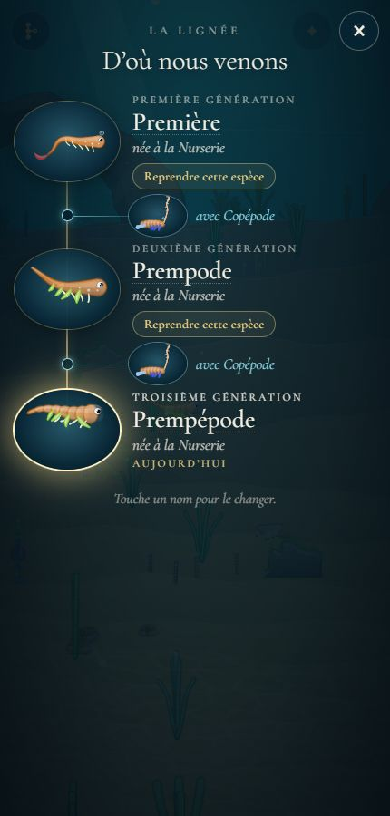
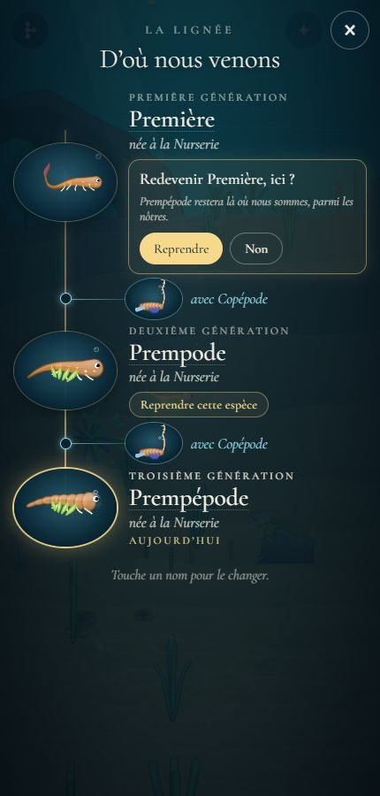
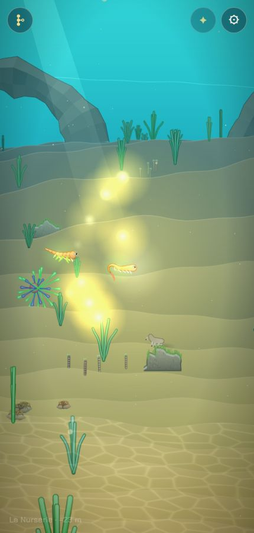
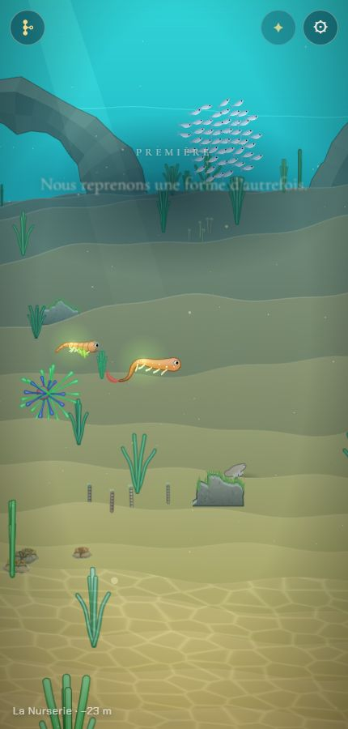
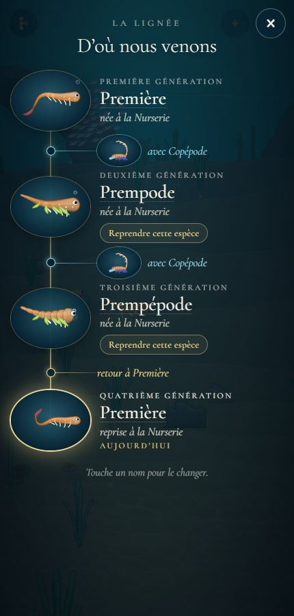

# Revenir à une espèce antérieure de la lignée

## Livré

- **Le geste** : dans l'arbre de la lignée, sous chaque génération d'avant (sauf celle dont on a déjà la forme), un bouton « Reprendre cette espèce » ; une confirmation dans l'arbre même (« Redevenir Première, ici ? », « Prepode restera là où nous sommes, parmi les nôtres. », « Reprendre » / « Non »). Absent pendant un adieu, une parade, la portée, la Remontée, le générique ou une autre reprise (`retour.can`).
- **La scène** (`src/monde/retour-jeu.ts`) : là où l'on nage, la créature quittée reste sur place comme un parent laissé (`adieu.stay`) ; 14 lueurs dorées partent d'elle en s'enroulant et s'assemblent un peu devant, où la forme reprise sort, petite (×0,3), et grandit en 2,4 s (`growth`/`rescale` de l'éclosion), avec un halo qui s'éteint. La lignée dit « Nous reprenons une forme d'autrefois. / Celle que nous étions nage ici, parmi les nôtres. » sous le nom de la forme reprise (attend que la mer soit libre, 5 s au plus). On garde la main.
- **L'obstacle** : la forme reprise est gardée même si elle ne franchit pas l'obstacle du chapitre ; `indices.feel(chapitre)` éveille les indices (vérifié en jeu : larve reprise au Récif → `indices.felt = ['recif']`).
- **La sauvegarde** (`src/monde/retour.ts`, pur) : `returnTo(p, k, chapitre, at)` ajoute la créature quittée à `lineage` comme un parent (avec `at`, donc elle revient à sa place au rechargement, `ancestorsIn`), sans partenaire et avec `back: k` ; la créature jouée devient une copie de `lineage[k].creature`. Rien n'est effacé ; on peut reprendre ensuite celle qu'on vient de quitter. Dans la Balade libre, la copie est seulement jouée (`playIn`) : la lignée de l'histoire ne bouge pas. `partie.returnTo(k, chapitre, at)` dans `partie-jeu.ts`.
- **L'arbre, le générique et l'image souvenir** (`arbre.ts` : `Generation.back`, `again`, `originWords`, `backWords`) : sur le fil, « retour à Première » en or à la place du partenaire ; la forme reprise est « reprise au Récif » au lieu de « née au Récif ». `souvenirLayout` réserve la même place qu'un partenaire.
- Tests : `src/monde/retour.test.ts` (sauvegarde, relecture, lien `back` invalide ignoré, arbre, mise en page de l'image, croissance, lueurs) ; `arbre.test.ts` mis à jour (deux champs de plus).
- Doc : `docs/mecaniques.md`, « Reprendre une espèce ». Test en console : `monde.retour.take(0)`.

## Choix retenus

Aucune question posée sur le tableau de bord (consigne : trancher avec l'option recommandée) ; tous les choix sont `auto`.

| Question | Choix retenu | Pourquoi |
|---|---|---|
| Jusqu'où remonter | Toutes les générations de la lignée (y compris celles qu'on a quittées par un retour), sauf la forme déjà jouée | Les seules que la partie garde ; reprendre la forme quittée rend tout réversible |
| Où reprendre | Là où l'on est, dans le chapitre courant | Pas de retour en arrière sur la carte, aucune punition |
| Et la créature quittée | Elle reste là, comme un parent après l'adieu, et y revient aux visites suivantes | Cohérent avec les ancêtres du monde ; rien ne disparaît |
| Obstacle non franchi | On garde la forme, les indices s'éveillent | Demandé par le chantier ; le fil mène aux partenaires calculés pour la nouvelle forme |
| Enregistrement | La quittée entre dans `lineage` avec `back: k` (et `at`), la jouée est une copie de l'ancêtre | Champ optionnel, rétrocompatible, rien d'effacé ; arbre, générique, Remontée, traces et ancêtres du monde le lisent sans changement |
| Compte des générations | Dans l'ordre où on les a jouées (la forme reprise est la « Quatrième génération ») | Simple, monotone, ne touche ni les notes du chant (`gen`) ni le générique |
| Le geste | Bouton sous chaque génération + confirmation en place (Reprendre / Non) | Clair au doigt ; le portrait est déjà pris par les tours des portraits vivants |
| La transition | Lueurs dorées de l'ancienne vers la nouvelle forme, qui grandit (2,4 s), mots de la lignée, sans prendre la main | Réutilise l'éclosion et la lumière des indices ; court, doux |
| Balade libre | Autorisé, la copie est seulement jouée | Même règle que l'Atelier et les portées dans la Balade |

## Options non retenues

- **Jusqu'où** : aussi les frères et sœurs des portées (intéressant, mais la partie ne les garde pas : il faudrait sauver les portées entières, format plus lourd) ; seulement le parent direct (trop limité) ; seulement les espèces jamais quittées (moins réversible).
- **Où** : au début du chapitre courant (coupure, punitif) ; dans le chapitre de naissance de l'ancêtre (remonte la carte, casse la progression) ; à côté de l'ancêtre dans le monde (téléportation, possible plus tard).
- **La créature quittée** : disparaît dans la lumière (plus magique, mais un corps qui revient au rechargement serait incohérent) ; ne reste pas dans le monde mais dans l'arbre (simple, mais moins vivant).
- **Obstacle** : refuser une forme qui ne franchit pas (punitif) ; prévenir dans la confirmation (« elle ne passera pas le mur d'algues ») — bonne idée pour la suite, coût faible (`crosses` du chapitre).
- **Enregistrement** : effacer la génération quittée et rejouer l'ancêtre (perd l'histoire, refusé par le chantier) ; une liste `returns` à part dans la partie (arbre et générique à recomposer, plus de code) ; pas d'entrée quand on reprend une copie sans enfant (moins de doublons après des allers-retours, mais règle plus subtile).
- **Compte** : par descendance (la copie redevient « Première génération », ses enfants « Deuxième ») : plus juste biologiquement, mais deux « Première » dans l'arbre et une progression qui recule.
- **Le geste** : toucher le portrait (déjà pris), double toucher comme « Recommencer » (moins lisible), confirmation en fenêtre `confirm()` (bloquée dans certains cadres).
- **La transition** : coupure nette (demandé d'éviter) ; une mue (la forme quittée se fend, plus long à dessiner) ; caméra qui se rapproche comme l'adieu (plus solennel, prend la main).

## Reste à faire / limites

- Des allers-retours répétés ajoutent chaque fois une génération (honnête, mais l'arbre, la Remontée et le générique s'allongent).
- Des œufs laissés « Plus tard » restent ceux de l'ancienne forme ; s'ils éclosent après une reprise, l'enfant choisi a pour parent dans la lignée la forme reprise.
- Le bouton ne dit pas encore si la forme franchirait l'obstacle du chapitre (voir options).
- Pas vérifié sur un vrai téléphone (captures en 430 × 900 dans le Chrome Windows).

## Risques de fusion

- `src/monde/main.ts` : un import, deux dépendances ajoutées à `initArbre` (`resume`, `canResume`), `retour.step()` dans `update`, `retour.lights(...)` dans `render`, le bloc `initRetour` juste après la boucle des ancêtres (avant `initRivale`), `retour` dans `window.monde`, `type ChapterId` dans l'import de `biomes`.
- `src/monde/arbre-ecran.ts` : import de `retour.css`, deux deps, le bouton dans la boucle des générations, le fil « retour à », `againButton` (le voisin `croix-arbre-especes` touche la croix et `arbre.css` : je n'ai pas touché `arbre.css`).
- `src/monde/arbre.ts` : deux champs dans `Generation`, `generations` réécrit (même résultat sans retour), `originWords`, `backWords`.
- `src/monde/partie.ts` (`back?` dans `Ancestor`), `partie-jeu.ts` (`returnTo`), `generique.ts`, `generique-ecran.ts`, `generique-image.ts` : changements courts et additifs.
