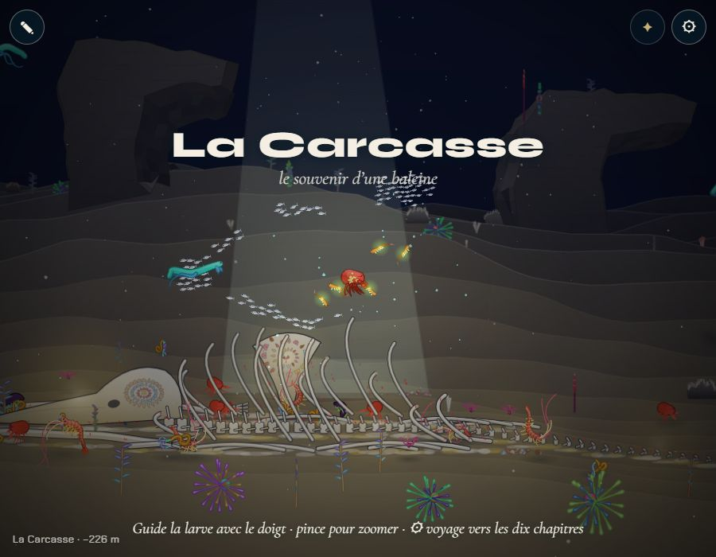
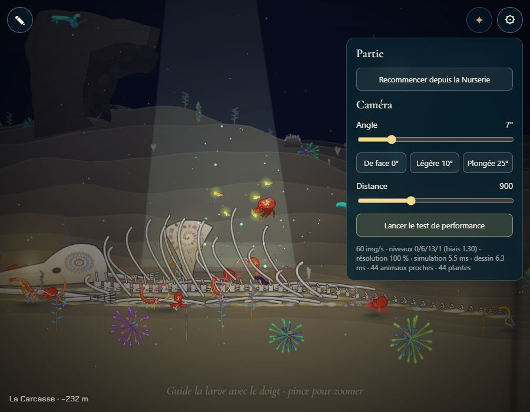

# La sauvegarde automatique

## Livré

- **La partie sauvée** dans `localStorage` sous `lignee.partie` : `{ v: 1, chapter, creature, lineage, savedAt }`. Le chapitre est gardé par son id (`recif`, `carcasse`…), pas par son rang, pour survivre aux changements de carte ; la créature est le JSON de sa définition ; `lineage` range les parents (créature + chapitre de naissance), vide tant que les naissances n'existent pas.
- **Quand** : à chaque nouveau chapitre atteint, à chaque changement de créature (Atelier), et à chaque naissance via `monde.partie.born(spec)` (prêt pour l'hérédité, pas encore appelé).
- **Reprise** : à l'ouverture, le joueur arrive au début du chapitre sauvé (`arrival`, comme le voyage du panneau), avec sa créature, et le titre de ce chapitre s'affiche. Une ancienne sauvegarde `lignee.player` (la créature seule) est reprise à la Nurserie.
- **Recommencer** : bouton « Recommencer depuis la Nurserie » dans ⚙ (deux touches en 3 s, `confirm()` étant bloqué dans certains cadres), et `?nouvelle` pour les tests (le paramètre est retiré de l'URL).
- Fichiers : `src/monde/partie.ts` (logique pure, 11 tests dans `partie.test.ts`), `src/monde/partie-jeu.ts` (branchement dans la page), branchements courts dans `main.ts`, bouton dans `index.html`, style dans `style.css`, doc dans `docs/mecaniques.md`.
- Vérifié dans le Chrome Windows : `?nouvelle` → Nurserie ; devenir le crabe puis aller à la Carcasse → `carcasse Crabe` sauvé ; rechargement → reprise à la Carcasse avec le crabe ; « Recommencer » deux fois → Nurserie, sauvegarde effacée. Aucune erreur de page.

## Choix retenus

Aucune question posée à l'utilisateur (aucun choix jugé structurant) : tout est `auto`.

| Question | Choix retenu | Pourquoi |
| --- | --- | --- |
| Quand sauver, faute de naissances ? | À chaque nouveau chapitre, à chaque changement de créature, et à la naissance (API prête) | Sans naissance, sauver « à chaque naissance » ne garderait jamais le chapitre |
| Où reprendre ? | Au début (milieu d'eau) du chapitre sauvé | Robuste aux changements de carte et aux obstacles à venir ; même point que le voyage |
| Format | Une clé `lignee.partie`, JSON versionné, chapitre par id | Lisible, migrable, petit ; la lignée y a déjà sa place |
| Ancienne clé `lignee.player` | Lue en repli, plus écrite, effacée par « Recommencer » | Personne ne perd sa créature |
| Recommencer | Bouton ⚙ à double touche + `?nouvelle` | Sans ça, impossible de revoir le début ; double touche contre les fausses manips |
| Créature de l'Atelier | Remplace la créature sans entrer dans la lignée | L'Atelier est hors de l'histoire, ce n'est pas une naissance |

## Options non retenues

- **Quand sauver** : seulement à la naissance (fidèle au texte, mais rien ne serait sauvé aujourd'hui) ; à intervalle régulier ou à `pagehide` (reprise à la position exacte, mais écritures fréquentes et reprise dans un lieu instable).
- **Où reprendre** : à la position exacte (plus précis, mais peut tomber dans un rocher ou derrière un obstacle après un changement de carte) ; toujours à la Nurserie avec seule la créature (ce qui existait).
- **Format** : clés séparées (`lignee.chapter`, `lignee.player`…) (simple, mais pas atomique et sans version) ; IndexedDB (utile pour des portraits lourds, surdimensionné aujourd'hui) ; chapitre par index (plus court, cassé si la carte change).
- **Ancienne clé** : la migrer puis l'effacer au chargement (plus propre, mais irréversible si la nouvelle écriture échoue) ; l'ignorer (perd la créature des joueurs).
- **Recommencer** : `confirm()` (natif, mais bloqué dans les cadres sandbox comme l'Artifact) ; pas de bouton, seulement `?nouvelle` (invisible pour les joueurs) ; un écran titre « Continuer / Nouvelle partie » (plus clair, mais un vrai chantier d'interface).
- **Atelier** : le compter comme une naissance (brouille la lignée avec des essais).

## Reste à faire / limites

- L'hérédité devra appeler `monde.partie.born(enfant)` (ou `born` de `initPartie`) à chaque naissance ; l'arbre de la lignée lira `monde.partie.lineage`.
- Le voyage du panneau ⚙ sauve aussi le chapitre (il passe par la même détection d'entrée de chapitre) : sans gravité tant qu'il reste un outil de test.
- Pas de nom de génération, de partenaire ni de portrait dans la lignée : à ajouter aux entrées de `lineage` (champs optionnels, `v` inchangé tant que c'est additif).
- Si le chantier « Un monde fini » empêche de dépasser un obstacle, la reprise au début d'un chapitre reste valable (on n'est sauvé que dans un chapitre atteint).

## Risques de fusion

- `src/monde/main.ts` : l'import de `initPartie` et `chapterIndex`, `savedPlayer()` lit la partie, `becomes()` appelle `partie.becomes`, l'entrée de chapitre appelle `partie.reach`, `partie` dans l'API, et `setTimeout(() => showChapter(0))` devient une reprise au chapitre sauvé (conflit probable avec « Les textes narratifs » ou « Les transitions », qui touchent `showChapter` : garder la reprise et appeler leur affichage avec `here.i`).
- `index.html` : un titre « Partie » et un bouton en tête du panneau ⚙ (le chantier « Un monde fini » peut cacher le voyage à côté).
- `src/monde/style.css` : `#newGame` ajouté à la règle de `#benchBtn`.
