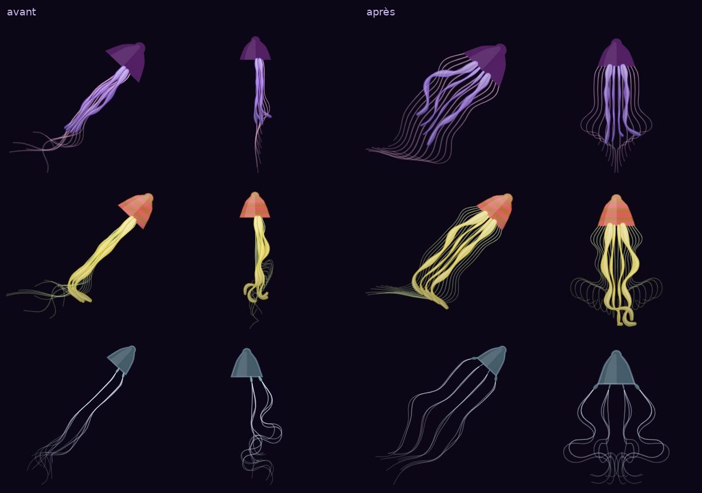
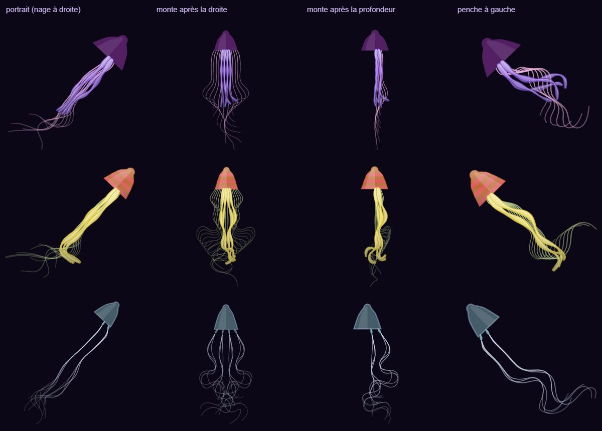
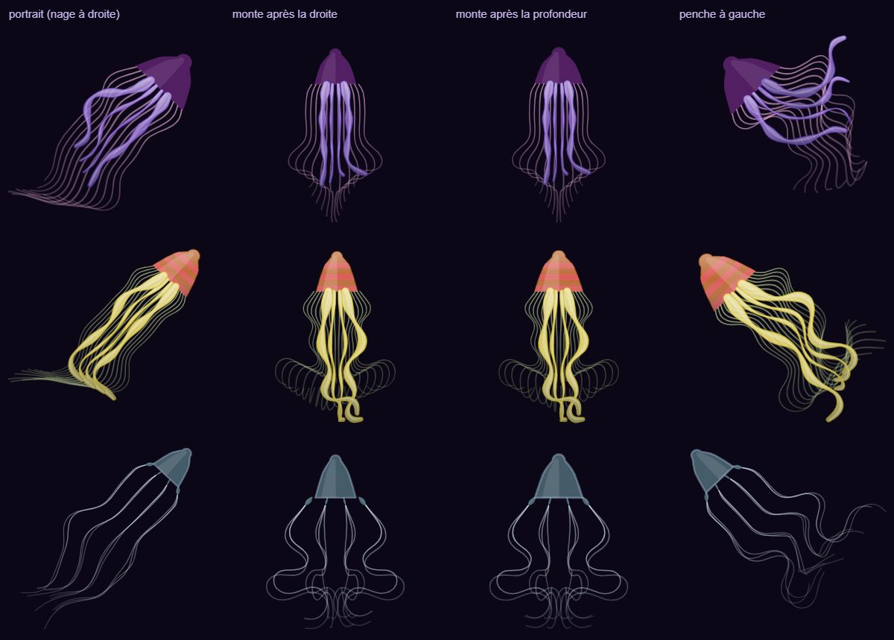
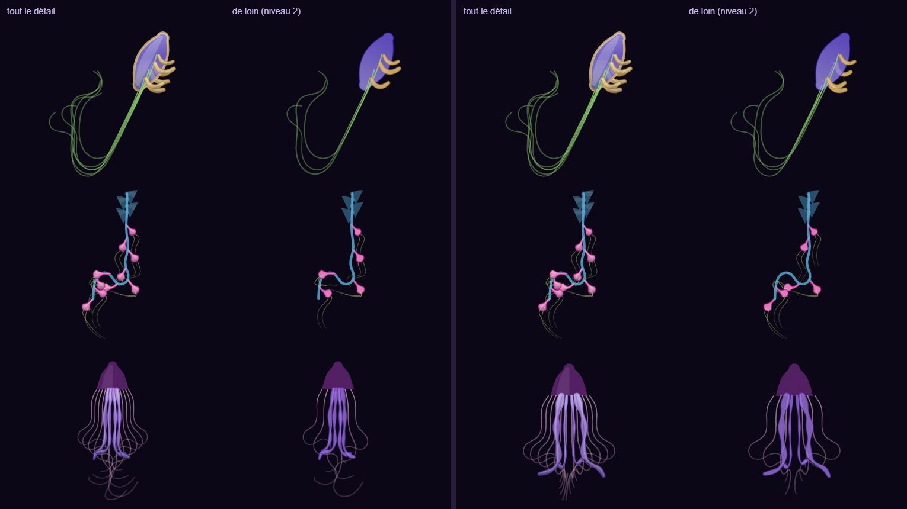

# Tentacules et filaments des méduses

## Livré

Les filaments d'une méduse pendent maintenant **tout autour du bord de la cloche**, symétriques, quelle que soit la façon dont elle penche ou dont elle a nagé. Avant, ils partaient d'un seul côté, ou se superposaient en une seule mèche, d'où l'impression qu'il en manquait.

**La cause.** Un éventail de copies (motif `fan`) se monte en 3D dans le plan « flanc / ventre » de sa partie mère : les copies s'écartent le long du flanc et basculent vers le ventre (`rollOf`, 0,5 rad pour un filament). Le ventre d'une cloche presque verticale n'a pas de sens propre : il vient de la dernière direction de nage horizontale (`creature.side`), et dès que la cloche penche, de la verticale projetée. Selon ce que la méduse venait de faire, l'éventail se retrouvait donc dans la profondeur : vu de côté, toutes les bases se rangeaient du même côté de l'axe, et les copies se superposaient deux à deux. Mesuré dans la simulation, puis vu en jeu : après une nage à droite, les 12 bases de la méduse lune sont toutes à droite de l'axe ; après un écart en profondeur, elles tiennent en une seule mèche. Les portraits (`snapshot3`, arbre de la lignée, portée, cartes) faisaient nager l'animal vers la droite avant de le dessiner : ils montraient tous le défaut.

**Le correctif** :

- `src/engine/defs.ts`
  - `onRim(parent, a)` : un éventail centré (angle ≈ 0, sans miroir) accroché à une partie de forme `bell` pend autour du bord.
  - `rimOf(a, k)` : la copie k est posée sur le bord, là où elle apparaît dans l'éventail quand on voit la cloche de côté (`u`, de -1 à 1). Elle est devant ou derrière la cloche, par paires symétriques, et s'ouvre vers l'extérieur de la moitié de l'écart (`spread / 2`). Vu de côté, c'est l'éventail tel qu'on le dessine dans l'Atelier ; en volume, c'est un cône.
- `src/engine3/creature3.ts`
  - `rimMount` : le repère est l'axe de la cloche et la direction qui le traverse à l'écran (axe z de l'œil × axe), et non plus le ventre. Il ne dépend ni de la dernière nage ni de l'inclinaison.
  - `instantiate` et `update` s'en servent pour ces copies (champ `rim` de `Seg3`).
- **Niveau de détail le plus bas** (`thinned` de `render3.ts`, `thinnedGL` de `paint-gl.ts`) : il retirait les copies de rang impair. Il retirait ainsi le bord droit d'un éventail centré et **tout un côté** d'une rangée alternée (cormidies du siphonophore et leurs filaments, filaments pêcheurs et polypes de la galère portugaise). La règle partagée `thinnedOut` retire maintenant une copie sur deux **par paires symétriques**.
- **Variations** (`jitter`, surtout chez les espèces générées) : sur un éventail centré, elles allaient copie par copie, donc d'un côté seulement. Elles vont maintenant par paires (`pairOf`), comme sur un miroir.

Concerne la méduse lune (filaments et 4 bras oraux), la méduse ortie, la méduse-boîte (ses 4 pédalies, et donc leurs bouquets de filaments) et toutes les méduses générées ou hybrides dont la mère est une cloche. Les éventails des autres animaux (nageoires caudales, éventail des crevettes) restent plats, comme dessinés.

**Comment le voir** : au Jardin de méduses, joue la méduse lune (`monde.becomes(SPECIES.meduse())`), nage de côté puis remonte : les filaments restent des deux côtés. Ou regarde le portrait d'une méduse dans la portée ou l'arbre.

**Tests** :

- `src/engine/defs.test.ts` (nouveau) : un éventail centré varie par paires ; éclairci, il garde ses deux bouts et reste symétrique ; autour d'une cloche, il est symétrique, devant et derrière, même éclairci ; une rangée alternée éclaircie garde ses deux côtés.
- `src/engine3/creature3.test.ts` : la méduse lune et la méduse ortie nagent vers le haut, à droite, s'arrêtent, s'écartent en profondeur, remontent et partent à gauche. À chaque étape, les bases de leurs filaments, vues de côté, sont symétriques par rapport à l'axe, aussi larges que le bord, et aucune ne cache l'autre. Ce test échoue sans le correctif.

## Choix retenus

| Question | Choix retenu | Pourquoi |
|---|---|---|
| Comment rendre les filaments symétriques | Un cône autour du bord, réglé pour que, vu de côté, il redonne l'éventail dessiné ; repère pris sur l'axe de la cloche et l'écran | Symétrique dans tous les cas, garde l'allure voulue dans l'Atelier, et donne du volume : des filaments passent devant la cloche, d'autres derrière ; aucun ne se superpose |
| Quelles parties | Tout éventail centré accroché à une partie de forme `bell` | Couvre les filaments, les bras oraux et les pédalies, et toutes les méduses générées ou hybrides, sans toucher les espèces ni l'Atelier |
| Niveau de détail le plus bas | Retirer une copie sur deux par paires symétriques | Même économie qu'avant, sans perdre un côté |
| Variations aléatoires d'un éventail centré | Par paires, comme sur un miroir | La consigne « toujours symétrique » ; la variation reste, à l'identique des deux côtés |
| « Il manque des filaments » | Les rendre tous visibles (ils étaient superposés ou coupés), sans en ajouter | Le défaut venait de là ; en ajouter coûterait au Jardin, qui en a des milliers |

Aucune question posée par le tableau de bord : ces choix ne changent ni une règle du jeu ni un format de données.

## Options non retenues

- **Symétrie** :
  - un éventail plat toujours face à l'œil : simple et symétrique, mais plat ; aucun filament devant ni derrière la cloche, et rien de cohérent quand elle penche vers nous ;
  - un anneau régulier autour de l'axe : exact en volume, mais vu de côté, les copies de devant et de derrière tombent exactement l'une sur l'autre (12 filaments en montrent 7), justement le défaut à corriger ;
  - fixer le ventre des cloches vers l'œil : corrige la cloche droite, pas la cloche qui penche (le ventre redevient vertical et l'éventail bascule) ;
  - un nouveau motif « bord » dans l'Atelier : explicite, mais il faut reprendre les espèces et l'Atelier, et les méduses déjà sauvegardées ou générées n'en profiteraient pas.
- **Parties concernées** :
  - les seuls filaments (rôle `sting`) : les bras oraux et les pédalies resteraient d'un côté ;
  - tous les éventails centrés de tous les animaux : les nageoires caudales et l'éventail des crevettes, plats par nature, deviendraient des cônes.
- **Niveau de détail** :
  - ne plus éclaircir les filaments : plus fidèle de loin, mais plus de tracés pour les méduses du Jardin (chantier performance) ;
  - garder les rangs pairs : un côté perdu.
- **Variations** :
  - copie par copie : plus libre, mais asymétrique ;
  - aucune variation sur un éventail centré : plus régulier, plus artificiel.
- **Nombre de filaments** : en ajouter, la méduse lune réelle en a des centaines. C'est plus riche, mais le coût est réel au Jardin. À décider avec le chantier « performance sur téléphone ».

## Reste à faire / limites

- Les méduses lointaines du Jardin (atlas de `jardin.ts`) n'ont pas changé : elles avaient déjà 7 tentacules répartis des deux côtés.
- Le nombre de filaments des espèces n'a pas changé (12 pour la méduse lune, 16 pour la méduse ortie).
- Quand la méduse nage de côté, ses filaments traînent derrière elle, comme dans l'eau : c'est voulu, et ils se remettent en cône dès qu'elle ralentit.
- `make check` : un test échoue déjà sur `backlog`, sans rapport avec ce chantier. C'est `src/monde/nouveautes/plugin.test.ts` (« embeds the published versions only… », ligne 71) : une entrée de la v0.2.0 n'a plus d'image dans le budget des images embarquées. Il dépend du contenu de `changes/`.

## Risques de fusion

- `src/engine/defs.ts` : la branche `fan` de `expand` (variations par paires), et cinq fonctions ajoutées en fin de fichier (`fanMirrored`, `pairOf`, `thinnedOut`, `onRim`, `rimOf`).
- `src/engine3/creature3.ts`, le moteur partagé : import, champ `rim` de `Seg3`, méthode `rimMount`, `instantiate` réécrit pour ces copies, une ligne dans `update`. Effet visible sur toutes les méduses et sur les portraits ; vérifié sur la méduse lune, la méduse ortie, la méduse-boîte, la galère portugaise et le siphonophore. Les autres familles ne passent pas par ce chemin, sauf les variations des éventails centrés, désormais symétriques (queues des poissons générés).
- `src/engine3/render3.ts` et `src/engine3/paint-gl.ts` : une ligne chacun (`thinned`, `thinnedGL`) et un import.
- `docs/direction-artistique.md` : une puce dans « Ce qui existe déjà ».
