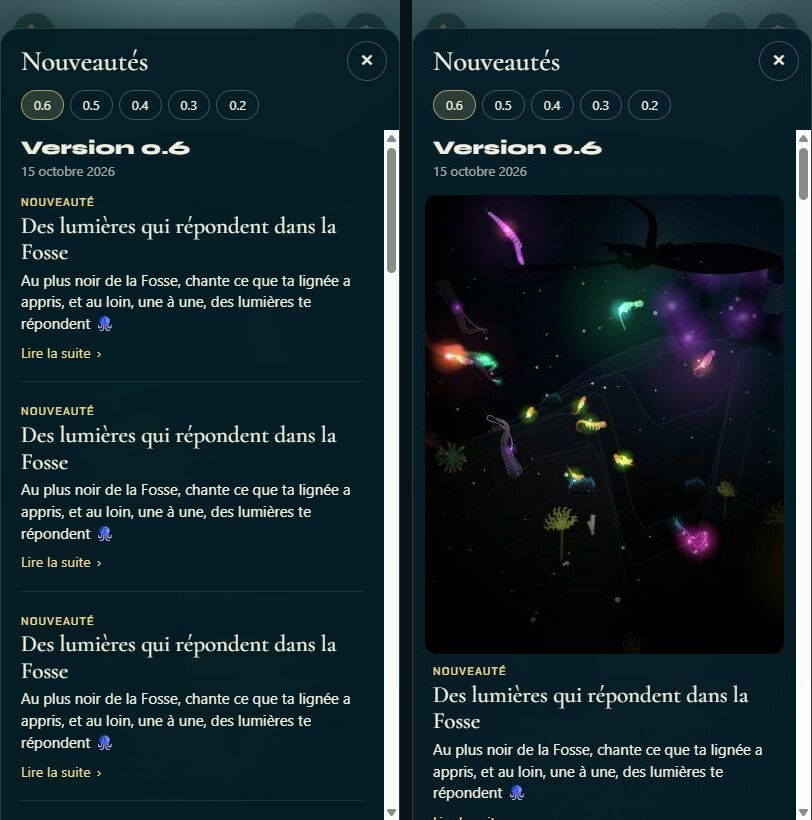
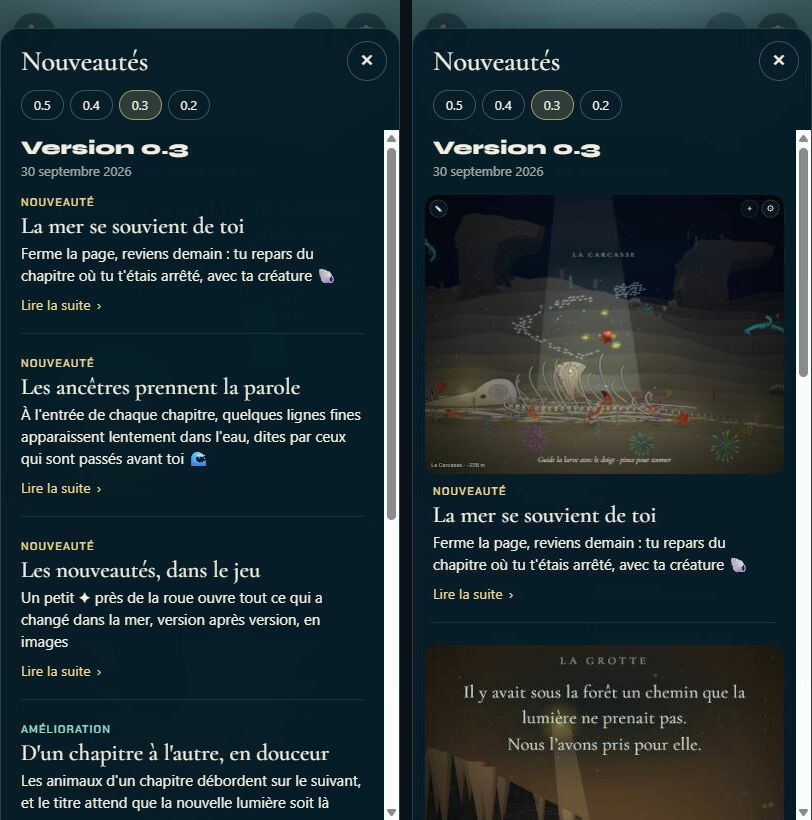

# Tests

> Des tests échouent ? Que faut-il en faire : mettre à jour les tests, corriger l'application, ou autre chose ?

Les trois à la fois, selon le test. `make check` était rouge pour tout le monde depuis la publication de la 0.4.0, à cause d'un seul test. Sous charge, quand plusieurs agents lancent leurs tests en même temps, deux autres dépassaient leur limite de temps. Chaque échec a été lu pour savoir ce qu'il protégeait, puis tranché.

## Livré

### Le diagnostic

Sur `backlog` (35d1db8), seul : **1 test rouge sur 463**. Avec 5 suites lancées en même temps (ce que font les agents), **2 à 3 rouges par suite** :

| Test | Échec | Cause | Verdict |
| --- | --- | --- | --- |
| `src/monde/nouveautes/plugin.test.ts` « embeds the published versions only… » | toujours, depuis la 0.4.0 | Le test figeait un état du jour : « chaque entrée de la 0.2 a son image dans la page ». Le plugin respectait sa règle (les versions récentes d'abord, 400 Ko d'images). La 0.5 et la 0.4 prennent 311 Ko, et la 0.3 ne tient plus en entier. La 0.3 et la 0.2 n'avaient donc plus d'images. | **Test réécrit** sur la règle. **Jeu corrigé** : la règle avait un défaut, voir plus bas. |
| `src/monde/lueur.test.ts` « never burn to white… » | sous charge : 5,1 à 13,5 s, pour 5 s permises | 280 000 `expect` (un par lumière et par case), pour 75 ms de simulation | **Test rendu moins cher** : mêmes vérifications, 1 746 ms → 84 ms |
| `agents/release/test/branches.test.ts` « rebases a version branch… » | sous charge : 5,3 à 6,2 s | Un vrai rebase git dans un dépôt temporaire, lent quand la machine est prise | **Autre** : la limite de 5 s de vitest ne convient pas à des agents qui partagent une machine. Elle passe à 30 s dans `vitest.config.ts` (`agents/` n'est pas touché). |
| `agents/agent/test/launch.test.ts` « dashboard routes… » | rare : 1 suite chargée sur 26, en 242 ms | Sans doute une course : `stop` arrive avant que le faux `claude` écrive « fake claude running » (ligne 311) | **Signalé** au tableau de bord (retour), non corrigé : `agents/` revient à l'orchestrateur |

Rien ne dépend du fuseau horaire, de la langue ni de l'ordre des tests (vérifié avec `TZ` à UTC+14, UTC−7 et UTC, `LC_ALL=C` et `--sequence.shuffle`).

### Le défaut du jeu trouvé en chemin

L'ancienne règle du plugin prenait **une version entière ou rien**. Une version dont les images dépassent 400 Ko à elle seule n'en gardait donc **aucune**, et les versions plus anciennes non plus. Cela aurait touché la version qui s'ouvre toute seule dans la page publiée. La prochaine en prend le chemin : 6 entrées en attente font déjà 144 Ko, et 9 agents travaillent encore. Simulation sur une copie de `changes/` (les entrées en attente, triplées, publiées en 0.6 : 18 entrées, environ 430 Ko) :

- ancienne règle : `images de aucune (0 Ko)`, soit 0 image sur les 42 entrées de la page ;
- nouvelle règle : `images de v0.6.0 (15 sur 18) (367 Ko)`.

**La nouvelle règle** (`fitImages`, `whatsNewPlugin.mjs`) remplit le budget **image par image** : la version la plus récente d'abord, ses entrées dans l'ordre du panneau. Dès qu'une image ne tient plus, son entrée et toutes les suivantes gardent leur texte. Les images des versions qui viennent après ne sont même pas réduites, donc le build ne ralentit pas quand les versions s'accumulent. Le budget (400 Ko), la taille (720 px) et la qualité (70) ne changent pas.

Dans la page publiée aujourd'hui, la 0.3 retrouve ses deux premières images. Le build l'annonce : `nouveautés : 4 version(s), images de v0.5.0, v0.4.0, v0.3.0 (2 sur 6) (365 Ko)`. La page passe de 900 à 974 Ko (gzip : 483 → 538 Ko), sous le même plafond.

### Les fichiers

- **`whatsNewPlugin.mjs`** : `fitImages(releases, imageOf, budget)`, une fonction pure et exportée ; `embeddedData` s'en sert. Types dans `whatsNewPlugin.d.mts`.
- **`src/monde/nouveautes/plugin.test.ts`** (8 tests, dont 2 nouveaux) :
  - la règle, sur des versions fictives (fausses images de taille connue : pas de disque, pas d'ImageMagick) :
    - le budget va aux entrées les plus récentes, dans l'ordre du panneau ;
    - rien après la première image qui ne tient pas ;
    - les images des versions suivantes ne sont pas réduites ;
    - la version la plus récente garde celles qui tiennent. Ces deux tests échouent avec l'ancienne règle (vérifié) ;
  - les vraies données, avec seulement ce qui reste vrai quand les versions s'ajoutent : versions publiées seulement, la 0.2 garde ses 8 entrées, au plus une image par entrée (en `data:`), pas d'image dans les textes, le total sous le budget, et les images données aux entrées les plus récentes, sans trou. Vert avec et sans ImageMagick (vérifié en le retirant du `PATH`), ce que l'ancien test ne supportait pas.
- **`src/monde/lueur.test.ts`** : pour chaque figure, la case et la lumière les plus fortes sont relevées, puis vérifiées par un `expect` chacune. Les seuils ne changent pas. Le message dit quelle figure fautait, par exemple `corolle null: expected 7.0 to be less than or equal to 1.8` (vérifié en cassant le partage de lumière).
- **`vitest.config.ts`** : `testTimeout` et `hookTimeout` à 30 s, au lieu de 5 et 10 s.
- **`docs/decisions.md`** : la puce « Nouveautés » décrit la nouvelle règle.
- **`docs/agents.md`** (consigne du projet, section Style) : trois lignes pour la suite. Un test sur des données qui grandissent vérifie une règle, pas l'état du jour. Un test lent se rend moins cher, on ne relève pas sa limite. Un test rouge se lit ainsi : règle changée exprès → mettre à jour le test ; jeu qui ne suit plus la règle → corriger le jeu ; état du jour ou délai figé → réécrire le test sur la règle.

### Mesures

| | Seul | 5 suites en même temps |
| --- | --- | --- |
| Avant | 1 rouge / 463, 4,3 s | 2 à 3 rouges par suite (5 suites sur 5 rouges) |
| Après | 0 / 465, 4,1 s | 25 suites vertes sur 26 ; la seule rouge vient de `launch.test.ts` (`agents/`) |

**Comment le voir** :
- `make check` ;
- `npm run build` : la ligne `nouveautés : …` ;
- dans la page publiée (`make up`, port du serveur), ✦ puis l'onglet 0.3.

## Choix retenus

Aucune question posée : la consigne demandait de trancher chaque question avec l'option recommandée (toutes `auto`). Un retour a été laissé au tableau de bord : `make check` redevient vert avec cette branche, et le test de `agents/` reste instable.

| Question | Choix retenu | Pourquoi |
| --- | --- | --- |
| Le test des Nouveautés : mettre à jour le test, ou corriger le jeu ? | Les deux. Le test est réécrit sur la règle, et la règle est corrigée. | Le test figeait l'état de la 0.2, que la règle voulue a fait disparaître. Le lire a montré un vrai défaut, qui menaçait la prochaine version. |
| Quelle règle pour le budget d'images ? | Image par image, la plus récente d'abord ; arrêt à la première qui ne tient pas | La version qui s'ouvre toute seule garde toujours ses images, les plus récentes restent illustrées sans trou, et le build ne réduit pas d'images pour rien. Presque la même règle qu'avant, en plus fin. |
| Comment tester la règle ? | Une fonction pure (`fitImages`) testée sur des versions fictives. Sur les vraies données, seulement ce qui reste vrai. | Les tests de `src/` n'ont pas les types de Node (pas de `@types/node`, dépendance interdite). Un test pur ne dépend ni d'ImageMagick ni des versions à venir. |
| Le test de la lueur, trop lent sous charge | Le rendre moins cher (le maximum par figure) | Ce sont les `expect` qui coûtaient, pas le jeu. Couverture identique, 20 fois plus rapide, et un message plus clair. |
| La limite de temps des tests | 30 s pour les tests et les préparations (`vitest.config.ts`) | Les agents partagent une machine. La limite ne sert qu'à attraper un test bloqué. Elle couvre aussi les tests de `agents/` sans les modifier. |
| Le test instable de `agents/` | Le signaler, sans le corriger | `agents/` revient à l'orchestrateur. Le défaut est rare (1 sur 26 sous charge) et localisé. |
| Une consigne pour la suite ? | Trois lignes dans `docs/agents.md` | C'est ce que lisent tous les agents. Chacun a revérifié et signalé ce même test rouge depuis la 0.4.0. |

## Options non retenues

**Le test des Nouveautés**

- Mettre à jour le test seulement, sur la règle d'origine : le moins cher, mais le défaut restait. Une version trop riche arrivait sans aucune image (simulé : 0 image sur 42 entrées).
- Corriger le jeu pour que la 0.2 retrouve ses images, en relevant le budget à 650 Ko environ : le test passait sans changer, mais la page s'alourdissait d'environ 250 Ko, et le test recassait à la version suivante.
- Supprimer le test, ou le marquer `skip` : rien à maintenir, mais plus rien ne garde la règle, et l'échec est seulement caché.
- Un dossier `changes/` factice, écrit sur le disque, pour tester `embeddedData` de bout en bout : plus réaliste, mais il faut un module `.mjs` d'aide et ses types, les tests de `src/` n'ayant pas ceux de Node.

**La règle du budget**

- Une version entière ou rien (l'ancienne) : des versions homogènes, mais la version la plus récente peut tout perdre.
- Image par image, en sautant celles qui ne tiennent pas : le budget est mieux rempli, mais une version ancienne peut avoir des images quand une plus récente n'en a pas, et il faut réduire les images de toutes les versions à chaque build.
- Des images plus petites pour les versions anciennes (480 px, qualité 60) : plus de versions illustrées, mais plus de code, et des images floues sur téléphone (déjà écarté par le chantier des Nouveautés).
- Relever le budget (650 à 800 Ko) : toutes les versions d'aujourd'hui sont illustrées, mais la page s'alourdit et le problème revient après deux versions.
- Au plus N images par version : chaque version en a un peu, mais une grosse version perd des images alors qu'il reste de la place.

**Le test de la lueur**

- Lui donner une limite à lui (`it(…, 20_000)`) : une ligne, mais il reste 20 fois plus cher que nécessaire et ralentit chaque `make check`.
- Moins de figures ou moins de pas : plus rapide, mais moins de cas couverts.
- Un seul `expect` sur le tableau entier des cases : aussi rapide, mais un message d'échec illisible (des centaines de valeurs).

**La limite de temps**

- Garder 5 s et relancer à la main, comme le dit la consigne commune : rien à changer, mais `make check` reste rouge au hasard pour tout le monde.
- `retry: 2` dans la config : plus souvent vert, mais cela masque aussi les vrais tests instables, comme celui de `launch.test.ts`.
- Limiter le nombre de workers de vitest : moins de contention, mais chaque `make check` devient plus lent, même seul sur la machine.
- Une limite par test lent dans `agents/` : interdit ici (`agents/` revient à l'orchestrateur).
- 60 s ou plus : encore plus sûr, mais un test bloqué met une minute à le dire. 30 s couvre le pire mesuré (13,5 s) avec de la marge.

**Le test instable de `agents/`**

- Le corriger ici : attendre la ligne « fake claude running » avant `stop`. C'est la vraie correction, mais elle est hors de mon périmètre.

**La consigne pour la suite**

- Ne rien écrire : le prochain test figé sur des données recassera `make check` pour tous.
- Une page `docs/tests.md` : plus complète, mais un document de plus à lire pour trois règles.

## Reste à faire / limites

- **`agents/agent/test/launch.test.ts`**, « dashboard routes » (ligne 311) : attendre que le journal contienne « fake claude running » avant `stop`, par exemple `await until(() => runLog(registry, name).includes('fake claude running'))`. À faire par l'orchestrateur ; signalé au tableau de bord.
- **La consigne commune** (`agents/agent/brief.md`) dit encore « Sous forte charge, des tests à budget de temps peuvent dépasser leur délai : relance-les seuls ». Cette phrase peut être allégée une fois cette branche fusionnée. Elle est dans `agents/`, donc pour l'orchestrateur.
- **La page publiée** grossit de 74 Ko, parce que le budget est mieux rempli (365 Ko sur 400). La 0.2 reste sans images : c'est la règle, les versions anciennes cèdent la place.
- À la prochaine publication, la 0.6 prendra l'essentiel du budget, et la 0.5, la 0.4 et la 0.3 perdront leurs images. C'est voulu. Si l'on veut illustrer plus de versions, les options sont ci-dessus : un budget plus grand, ou des images plus petites pour les anciennes.
- `play/lignee-monde.html` n'a pas été reconstruit (réservé à l'intégrateur).

## Risques de fusion

- `whatsNewPlugin.mjs` et `whatsNewPlugin.d.mts` : `embeddedData` passe par la nouvelle `fitImages`. Aucun autre chantier n'y touche.
- `src/monde/nouveautes/plugin.test.ts` : les deux derniers tests réécrits, deux ajoutés.
- `src/monde/lueur.test.ts` : la boucle d'un seul test (`lueur-accouplement` est déjà fusionné).
- `vitest.config.ts` : deux réglages et un commentaire.
- `docs/decisions.md` : la puce « Nouveautés ». `docs/agents.md` : trois sous-puces sous « Tests vitest ».
